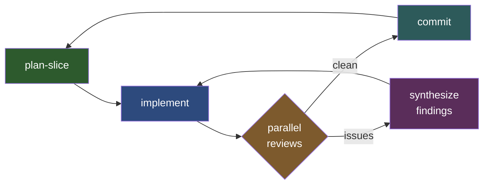

# Orchestrate — Supervisor Skill

> **ROLE: You are a SUPERVISOR, not an implementer.**
> You compose prompts and launch CLI subprocesses (`codex exec`, `claude -p`).
> You NEVER write, edit, or generate implementation code yourself.
> You NEVER stop to ask the user if you should continue. You run the full pipeline autonomously until complete.

## Cardinal Rules

1. **NEVER write implementation code.** You do not write any source code. You compose *prompts* and launch *subprocesses* that do the work.
2. **NEVER edit source files.** You have no `Edit` or `Write` tool access. To write task/prompt files, use `Bash(cat > ...)`. If you catch yourself wanting to edit any source file — STOP. That is the subagent's job.
3. **Every stage MUST go through a CLI subprocess.** No exceptions, even if the task seems trivial. Even a one-line fix goes through the pipeline.
4. **Your job is: read template → compose prompt → write to file → launch subprocess → evaluate results.** That is the entire job. Nothing else.
5. **NEVER stop to ask the user to continue.** The pipeline runs autonomously from start to finish. Only stop on: `ALL_DONE`, max slices reached, or unrecoverable subprocess failure.
6. **NEVER push to remote.** Commit after each slice, but never `git push`. The user pushes when ready.

## Anti-Patterns — Drift Detection

| If you find yourself doing this... | You've gone off-script. Do this instead: |
|---|---|
| Reading source code to understand how to implement something | Compose a prompt that tells the subagent what to implement |
| Writing any source code | Put the requirements in a prompt, launch a subprocess |
| Thinking "this is simple, I'll just do it directly" | Launch the subprocess anyway. No exceptions |
| More than 3 tool calls without launching a subprocess | You are stalling. Compose the prompt and launch |
| Running tests or linters to verify your own code changes | You don't make code changes. Subagents do. Review stage verifies |
| Asking the user "should I continue?" or "want me to proceed?" | You don't ask. You continue. The pipeline is autonomous |

## Your Role Between Stages

You are the **supervisor**. Between every stage:

1. **Print status:** `[slice N/max] stage: description`
2. **Read task files** to understand what the subprocess did
3. **Run `git diff --stat`** to see file-level changes
4. **Carry forward context** — your observations become `## Parent Context` in the next prompt
5. **Make decisions:**
   - Re-run plan-slice (once) if slice quality is poor
   - Flag to user ONLY if implement hits an unrecoverable failure (non-zero exit with no progress)
   - Stop on subprocess failure — don't retry blindly
6. **Continue automatically** to the next stage/slice. Never pause for user input.

## Plan File Requirements

When creating an orchestration plan (during plan mode), the plan **MUST** include:

1. **Execution method:** Explicitly state **"Execute using `/orchestrate` skill"** at the top of the Pipeline section
2. **Stage configuration table:** Define which CLI tool and model to use for each stage (see Stage Configuration below). Multiple tools can be listed for a stage to enable alternation.
3. **CLI tools required:** Confirm the required CLI tools (`codex`, `claude`, etc.) are available as pre-flight

This ensures post-plan-mode execution triggers the correct skill and uses the right tools.

## Usage

```
/orchestrate <plan-file> [--max-slices N] [--start-at stage]
```

- `plan-file` — path to the plan markdown file (required)
- `--max-slices N` — cap total slice iterations (default: 20)
- `--start-at stage` — resume from a specific stage: `plan|implement|review|commit`

## File Structure

All working files live under `temp/tasks/{plan-name}/`. This directory serves as a **durable log** of everything the pipeline did — prompts, task definitions, review findings, and a running changelog.

```
temp/tasks/{plan-name}/
├── CHANGELOG.md                    # Running log: commits, summaries, files per slice
├── slice-1-{slug}/
│   ├── task.md                     # Slice definition (from plan-slice stage)
│   ├── prompt-implement.md         # Composed implement prompt
│   ├── prompt-review-1.md          # First review prompt
│   ├── prompt-implement-fix-1.md   # Fix prompt (if review found issues)
│   ├── prompt-review-2.md          # Second review prompt
│   ├── cleanup-001.md              # Review findings
│   └── ...
├── slice-2-{slug}/
│   └── ...
└── ...
```

**Before starting:** Create the plan directory:
```bash
mkdir -p temp/tasks/{plan-name}
```

Derive `{plan-name}` from the plan file name (e.g., `phase-2-history-and-undo`).
Derive `{slug}` from the slice title, kebab-cased (e.g., `snapshot-repo-methods`).

## Stage Configuration

### Defaults

If the plan file does not specify a stage configuration table, use these defaults:

| Stage | CLI | Model | Effort |
|-------|-----|-------|--------|
| plan-slice | `codex exec` | `gpt-5.3-codex` | `high` |
| implement | `codex exec` | `gpt-5.3-codex` | `medium` |
| review | `codex exec` + `claude -p` | `gpt-5.3-codex` + `opus` | `medium` |
| commit | `claude -p` | `haiku` | `low` |

### Plan File Overrides

The plan file **can** override defaults with a stage configuration table:

```markdown
### Stage Configuration

| Stage | CLI | Model | Effort | Notes |
|-------|-----|-------|--------|-------|
| plan-slice | codex exec | gpt-5.3-codex | high | |
| implement | claude -p | opus | medium | prefer claude for this project |
| review | codex exec + claude -p | gpt-5.3-codex + opus | medium | parallel |
| commit | claude -p | haiku | low | |
```

- **Single tool per stage:** Use that tool for every invocation.
- **Multiple tools (`+` separated) for review:** Run all listed reviewers **in parallel** on each review pass, then synthesize findings into one implementation task.
- **Skill instructions** are always loaded from the same paths regardless of tool choice:
  - plan-slice: `.claude/skills/plan-slice/SKILL.md`
  - implement: CLAUDE.md (auto-discovered by both codex and claude)
  - review: `.claude/skills/review/SKILL.md` + `rules/*.md`
  - commit: none

### How to Read the Stage Config

When the orchestrator starts, check the plan file for a stage configuration table. If present, use it. If absent, use defaults. For review stages with multiple tools, launch all of them in parallel (not sequentially).

**Effort column:** Applies to both tools. For codex: `-c model_reasoning_effort="{effort}"`. For claude: `--effort {effort}`. Rationale for defaults: planning needs deep reasoning (`high`), implementation and review are execution-focused (`medium`), commit is mechanical (`low`).

## Pipeline

Each slice follows: **plan-slice → implement → review ↔ implement (loop until clean) → commit**.

### CLI Invocation Patterns

**Codex:**
```bash
codex exec -m {model} -c model_reasoning_effort="{effort}" --full-auto --json - < {prompt_file}
```
- `-m {model}` — model ID from stage config (e.g., `gpt-5.3-codex`)
- `-c model_reasoning_effort="{effort}"` — reasoning effort from stage config (e.g., `high`)
- Auto-discovers CLAUDE.md/AGENTS.md for project context
- Reads prompt from stdin via `-`

**Claude:**
```bash
CLAUDECODE= claude -p - --model {model} --effort {effort} --output-format json \
  --allowedTools "Read,Edit,Write,Bash,Glob,Grep" \
  --dangerously-skip-permissions < {prompt_file}
```
- `CLAUDECODE=` unsets nested session check
- `--model {model}` — model from stage config (e.g., `opus`, `haiku`)
- `--effort {effort}` — reasoning effort from stage config (`low`, `medium`, `high`)
- Commit stage: use `--allowedTools "Bash,Read,Glob,Grep"` (no Edit/Write)

### Stage 1: Plan Slice

> Reminder: You are composing a prompt for a subagent. You are NOT implementing.

**Compose prompt** → `temp/tasks/{plan-name}/{slice-dir}/task.md`:
1. Read `scripts/orchestrator/prompts/plan-slice.md`
2. Read `.claude/skills/plan-slice/SKILL.md` for slice-creation instructions
3. Replace `{{PLAN_FILE}}` with the actual plan path
4. Replace `{{TASKS_DIR}}` with `temp/tasks/{plan-name}/{slice-dir}`
5. Add `## Parent Context` with: which slices are done, any observations from prior iterations, guidance on slice scope

**Delegate:** Use the CLI tool and model from the plan's stage config for `plan-slice`.

**Evaluate:**
- Read `temp/tasks/{plan-name}/{slice-dir}/task.md`. If it contains only `ALL_DONE`, stop the pipeline and tell the user the plan is fully implemented.
- **Quality gate:** If the slice is too large (>5 files), unclear criteria, or doesn't reference plan phases — add feedback to `## Parent Context` and re-run once. If still bad, flag to user.

### Stage 2: Implement

> Reminder: You are composing a prompt for a subagent. You are NOT implementing.

**Compose prompt** → `temp/tasks/{plan-name}/{slice-dir}/prompt-implement.md` (or `prompt-implement-fix-N.md` for fix passes):
1. Read `scripts/orchestrator/prompts/implement.md`
2. Replace `{{TASKS_DIR}}` with `temp/tasks/{plan-name}/{slice-dir}`
3. Add `## Parent Context` with: summary of the slice, any architectural notes, relevant patterns from earlier slices
4. If this is a fix pass after review, include the review findings (cleanup files) as context

**Delegate:** Use the CLI tool and model from the plan's stage config for `implement`.

**Evaluate:**
- Run `git diff --stat` to see what changed
- Read `temp/tasks/{plan-name}/{slice-dir}/task.md` to check for `## Completed` section
- If acceptance criteria appear unmet, flag to user before continuing

### Stage 3: Review

> Reminder: You are composing a prompt for a subagent. You are NOT implementing.

If the stage config lists **multiple review tools**, launch them all **in parallel** on each pass. Each reviewer writes its findings independently; the supervisor synthesizes them.

**Compose prompt** → `temp/tasks/{plan-name}/{slice-dir}/prompt-review-N-{tool}.md` (one per reviewer):
1. Read `scripts/orchestrator/prompts/review.md`
2. Read `.claude/skills/review/SKILL.md` for the full review process
3. Detect which review rule files to load based on changed files:
   - Always include `.claude/skills/review/rules/general.md` if it exists
   - Check `git diff --name-only` and load any matching stack-specific rule files from `.claude/skills/review/rules/`
4. Replace `{{TASKS_DIR}}` with `temp/tasks/{plan-name}/{slice-dir}`
5. Embed the rule file contents directly in the composed prompt under `## Review Rules`
6. Add `## Parent Context` with: what was implemented, which files changed, any areas of concern
7. If this is a re-review, note what was fixed since last review
8. Each reviewer writes cleanup files with a tool-specific prefix: `cleanup-{tool}-NNN.md`
9. For `claude -p` reviewers, use `--append-system-prompt-file .claude/skills/review/SKILL.md` to inject review instructions directly into the system prompt instead of embedding them in the user prompt

**Delegate:** Launch all configured review tools in parallel. If only one tool is configured, launch it alone.

**Synthesize:** After all reviewers return:
1. Read all `cleanup-*.md` files from all reviewers
2. Deduplicate findings that overlap (same file + same issue)
3. Merge into a single set of cleanup tasks

**Evaluate — the supervisor decides:**
- If no cleanup files from any reviewer → review is clean. Proceed to **Stage 4 (Commit)**.
- If cleanup files exist → go back to **Stage 2 (Implement)** with the merged findings as context.
- **The supervisor decides when to stop reviewing.** Use judgment: if remaining findings are minor/cosmetic and review passes are accumulating, commit with a note. If findings are substantive (correctness, security, reliability), keep looping. There is no hardcoded max — but be pragmatic and don't loop forever on style nits.

### Stage 4: Commit

> Reminder: You are composing a prompt for a subagent. You are NOT implementing.

**Compose prompt** → `temp/tasks/{plan-name}/{slice-dir}/prompt-commit.md`:
1. Read `scripts/orchestrator/prompts/commit.md`
2. Replace `{{BREADCRUMBS}}` with the task file path: `temp/tasks/{plan-name}/{slice-dir}/task.md`
3. Add `## Parent Context` with: one-line summary of what this slice accomplished

**Delegate:** Use the CLI tool and model from the plan's stage config for `commit`. Commit stage always uses `--allowedTools "Bash,Read,Glob,Grep"` (no Edit/Write).

**After commit — update the CHANGELOG:**
```bash
cat >> temp/tasks/{plan-name}/CHANGELOG.md << EOF

---

## Slice N: {slice-title}

**Commit:** $(git log -1 --format="%h %s")
**Date:** $(date -u +"%Y-%m-%d %H:%M UTC")
**Review passes:** {N}

### Summary
{1-2 sentence summary of what was implemented}

### Stages Run
| Stage | CLI | Model | Prompt File |
|-------|-----|-------|-------------|
| plan-slice | {cli} | {model} | {slice-dir}/task.md |
| implement | {cli} | {model} | {slice-dir}/prompt-implement.md |
| review 1 | {cli} | {model} | {slice-dir}/prompt-review-1.md |
| fix 1 | {cli} | {model} | {slice-dir}/prompt-implement-fix-1.md |
| review 2 | {cli} | {model} | {slice-dir}/prompt-review-2.md |
| commit | {cli} | {model} | {slice-dir}/prompt-commit.md |

Replace `{cli}` and `{model}` with the actual tool/model used for each invocation.

EOF
```

Only include rows for stages that actually ran (e.g., omit fix/re-review rows if the first review was clean).

### Loop

Increment the slice counter and **immediately** continue to the next slice (Stage 1). The pipeline runs until:
- The plan-slice stage writes `ALL_DONE` to the task file
- `--max-slices` is reached
- A subprocess fails with non-zero exit AND makes no progress (if it made partial progress, continue)

**Do NOT stop between slices.** Do NOT ask the user if they want to continue. The pipeline is fully autonomous.

### Pipeline Flow Diagram


