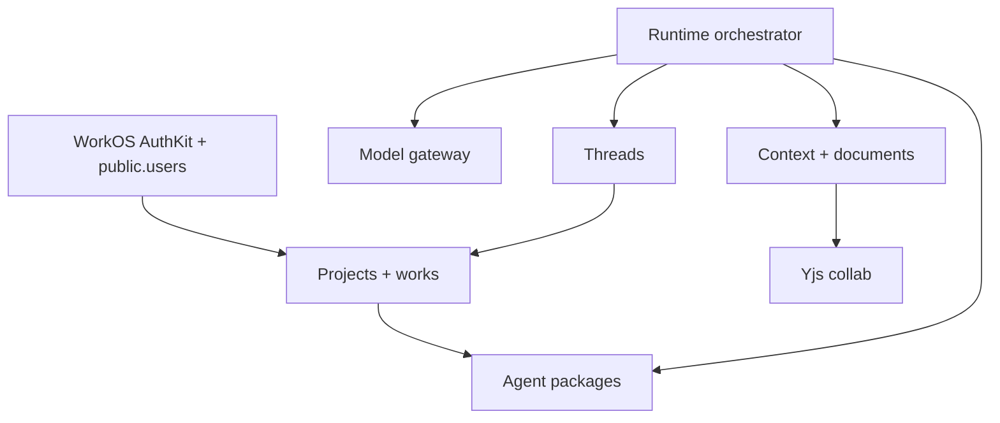

# Meridian Flow Repo — Architecture

This is the repo-local architecture overview for the v3 full-stack rebuild. It
tracks the code as shipped in this repository; cross-cutting rationale lives in
the Meridian KB.

## Module dependency graph



Acyclic at the domain level: threads reference project/work ownership, never
the reverse (the only projects↔threads imports are test fixtures).
`apps/server/server/lib/app.ts` is the composition root that wires the runtime,
thread repositories, gateway, event hub, package repository, preferences,
billing, projects, and collab services.

## Harness composition

"Harness" is a concept, not a package. The harness is the top-layer stack:

```
domains/runtime + domains/threads + domains/packages + domains/projects + domains/context + domains/collab
```

| Domain area | Role in harness |
|---|---|
| `domains/runtime/loop` | Control loop: receives user messages, drives turns, streams events |
| `domains/runtime/gateway` | LLM access: provider-neutral generation/streaming |
| `domains/runtime/tools` | Tool registry/executor for Meridian-owned tools; no external execution runtime |
| `domains/packages` | Agent/package catalog and future package install surface |
| `domains/projects` | Project/work ownership, default bootstrap, project CRUD, work lists, and owner gates for project-scoped routes |
| `domains/context` | ContextPort router/adapters for agent-readable writing context |
| `domains/collab` | Yjs document sync and markdown projection |

## DI wiring pattern

Infrastructure dependencies are explicit ports. JSON-natural shared DTOs live in
`@meridian/contracts`; server-local behavioral ports live in their owning domain.
Concrete adapters live under `apps/server/server/*`. Wiring happens at the
composition root (`apps/server/server/lib/app.ts`).

**Rules:**

- Domain code depends on ports, never concrete adapters internally.
- Adapter/provider choice is configuration-driven at composition time.
- Provider-specific types stay inside adapters.
- Postgres is the DB; WorkOS AuthKit is the auth boundary. Drizzle owns the app schema.
- No external package-execution provider/runtime is part of Meridian Flow v3.

## Support packages

| Package | Role | Constraints |
|---|---|---|
| `@meridian/contracts` | Shared JSON-natural types, IDs, protocol DTOs | Types only; no server logic |
| `@meridian/database` | Drizzle schema, migrations, Postgres functions | Persistence shape only; repos live in `apps/server` |
| `@meridian/design-tokens` | Ink & Jade design tokens (`ink-jade.css`) | CSS/token primitives only; semantic `@theme`, no raw hex outside package |
| `@meridian/prosemirror-schema` | Shared ProseMirror node/mark specs | Server and frontend schemas stay structurally identical |

## App layer

| App | Role | Key constraint |
|---|---|---|
| `apps/server` | Nitro HTTP + WebSocket server | One `AppServices` singleton; domains wired through ports |
| `apps/app` | TanStack Start authenticated project | Business logic lives in packages/server domains |
| `apps/www` | Public marketing site | Presentation shell for Meridian Flow |

## Documentation tier model

```
AGENTS.md            ← prescriptive rules and boundaries
.context/CONTEXT.md  ← architecture, contracts, invariants, conventions
KB                   ← cross-cutting decisions, vocabulary, durable product docs
```

Agents should read `.context/` before raw source files when entering an area.
