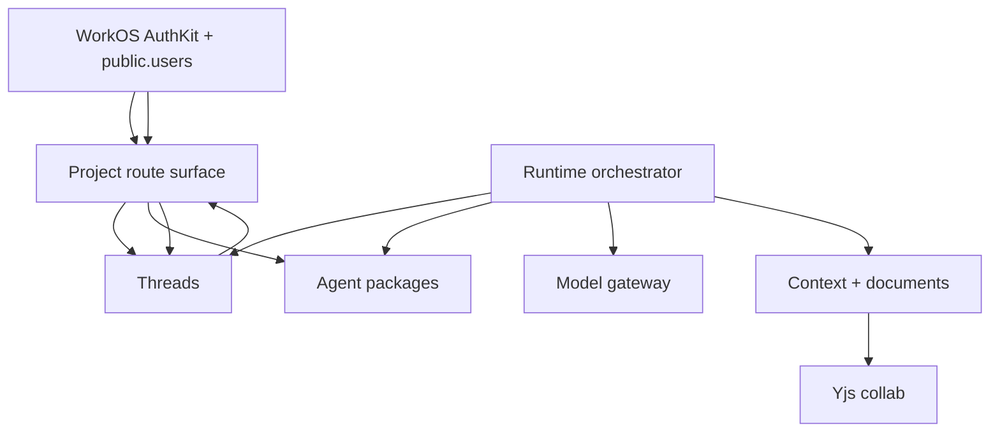

# Meridian Flow Repo — Architecture

This is the repo-local architecture overview for the v3 full-stack rebuild. It
tracks the code as shipped in this repository; cross-cutting rationale lives in
the Meridian KB.

## Module dependency graph



Acyclic at the domain level. `apps/server/server/lib/app.ts` is the composition
root that wires the runtime, thread repositories, gateway, event hub, package
repository, preferences, billing, projects/projects, and collab services.

## Harness composition

"Harness" is a concept, not a package. The harness is the top-layer stack:

```
domains/runtime + domains/threads + domains/packages + domains/projects + domains/context + domains/collab
```

| Domain area | Role in harness |
|---|---|
| `domains/runtime/loop` | Control loop: receives user messages, drives turns, streams events |
| `domains/runtime/gateway` | LLM access: provider-neutral generation/streaming |
| `domains/runtime/tools` | Tool registry/executor for Meridian-owned tools; no external execution runtime |
| `domains/packages` | Agent/package catalog and future package install surface |
| `domains/projects` | Project/work ownership and default bootstrap |
| `domains/projects` | upstream-parity project CRUD, work lists, and owner gates for project-scoped routes |
| `domains/context` | ContextPort router/adapters for agent-readable writing context |
| `domains/collab` | Yjs document sync and markdown projection |

## DI wiring pattern

Infrastructure dependencies are explicit ports. JSON-natural shared DTOs live in
`@meridian/contracts`; server-local behavioral ports live in their owning domain.
Concrete adapters live under `apps/server/server/*`. Wiring happens at the
composition root (`apps/server/server/lib/app.ts`).

**Rules:**

- Domain code depends on ports, never concrete adapters internally.
- Adapter/provider choice is configuration-driven at composition time.
- Provider-specific types stay inside adapters.
- Postgres is the DB; WorkOS AuthKit is the auth boundary. Drizzle owns the app schema.
- No external package-execution provider/runtime is part of Meridian Flow v3.

## Support packages

| Package | Role | Constraints |
|---|---|---|
| `@meridian/contracts` | Shared JSON-natural types, IDs, protocol DTOs | Types only; no server logic |
| `@meridian/database` | Drizzle schema, migrations, Postgres functions | Persistence shape only; repos live in `apps/server` |
| `@meridian/design-tokens` | Warm-paper design tokens | CSS/token primitives only |
| `@meridian/prosemirror-schema` | Shared ProseMirror node/mark specs | Server and frontend schemas stay structurally identical |

## App layer

| App | Role | Key constraint |
|---|---|---|
| `apps/server` | Nitro HTTP + WebSocket server | One `AppServices` singleton; domains wired through ports |
| `apps/app` | TanStack Start authenticated project | Business logic lives in packages/server domains |
| `apps/www` | Public marketing site | Presentation shell for Meridian Flow |

## Documentation tier model

```
AGENTS.md            ← prescriptive rules and boundaries
.context/CONTEXT.md  ← architecture, contracts, invariants, conventions
KB                   ← cross-cutting decisions, vocabulary, durable product docs
```

Agents should read `.context/` before raw source files when entering an area.

## Upstream parity mapping notes

- Upstream `apps/web` is intentionally represented as `apps/www` in this repo, so exact-path audits should classify those paths as ported under the Meridian marketing app name rather than missing.
- The upstream root/Python SDK and `uv` files are intentionally not ported into tracked source for v3. Meridian Flow's runtime and dev tooling are TypeScript/pnpm/Nx; reintroducing a separate Python SDK/toolchain would be a new product/API decision, not parity work.
- Files from the rejected external execution-provider subsystem remain excluded by policy. Runtime tools operate through Meridian-owned context/project surfaces instead.
- The upstream warm-organic token surface is represented by `@meridian/design-tokens/warm-paper.css`; the token values match, with only the Meridian theme name and `apps/www` wording changed.
- Current app e2e parity now lives under `apps/app/e2e`: auth, vertical slice, mobile shell, chat virtualization, and ProcessDisclosure verification all use WorkOS dev-login plus portless routes. Database-backed specs seed throwaway project/work/thread fixtures and clean them by project id.
- Remaining exact-path audit findings should classify old branded filenames as renamed, old auth adapter files as rejected, raw Python/toolchain files as superseded, and old provider runtime files as rejected unless a Meridian-owned TypeScript runtime equivalent is explicitly missing.

### Remaining exact-path parity categories (June 2026 pass)

- **Rejected provider/runtime leftovers:** `backend-policy`, `wired-core-tools`, old runtime loop/tool prompt-freeze and skill-tool tests, and old startup guard surfaces depended on the removed external execution-provider subsystem. Meridian uses in-process, no-external-execution runtime tools plus model-gateway/provider config instead.
- **Superseded auth/startup surfaces:** old startup plugin/auth guard paths are superseded by WorkOS AuthKit request auth, app/server env validation, `process-crash-policy`, and existing composition wiring.
- **Applicable but still TODO:** context read/factory/input/figure/promotion conformance, billing/package Drizzle conformance, websocket route handler tests, and server smoke harnesses should be ported in later passes against current Postgres and portless assumptions.
- **Route exact-path gaps:** thread upload POST remains implemented through the project-scoped upload route; adding the old non-project route needs an ownership decision rather than a blind copy.
