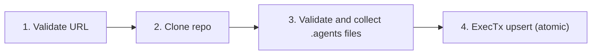
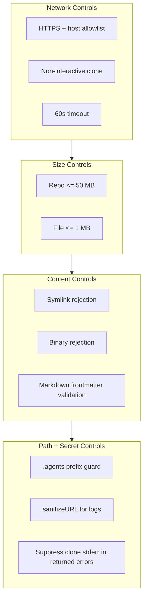
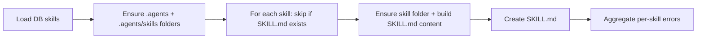

# Agent Import and Backfill

Git import installs `.agents/` bundles into the project document tree, and backfill creates file-backed SKILL.md copies for DB-stored skills.

## Import Pipeline

`AgentImportService.ImportFromGit` runs validate, clone, collect, then atomic write.

Refs: `backend/internal/service/agents/import_service.go:77`, `backend/internal/service/agents/import_service.go:117`.

## GitFetcher

`gitFetcher` is the low-level clone primitive used by import service.

### URL validation

| Check | Enforcement |
|---|---|
| URL parse | Reject unparseable URLs |
| Scheme | Require `https` |
| Host | Allowlist: `github.com`, `gitlab.com`, `bitbucket.org` |

Refs: `backend/internal/service/agents/git_fetcher.go:27`, `backend/internal/service/agents/git_fetcher.go:57`.

### Clone behavior

| Control | Enforcement |
|---|---|
| Shallow clone | `git clone --depth=1` |
| Timeout | 60s command context timeout |
| Non-interactive auth | `GIT_TERMINAL_PROMPT=0`, `GIT_ASKPASS=echo` |
| Error redaction | Returns sanitized clone error without stderr echo |
| Repo size cap | Reject clones larger than 50 MB |

Refs: `backend/internal/service/agents/git_fetcher.go:78`, `backend/internal/service/agents/git_fetcher.go:89`, `backend/internal/service/agents/git_fetcher.go:95`, `backend/internal/service/agents/git_fetcher.go:104`, `backend/internal/service/agents/git_fetcher.go:117`.

### URL sanitization

`sanitizeURL` strips userinfo before URLs are used in logs or error text.

Ref: `backend/internal/service/agents/git_fetcher.go:129`.

## ImportService File Validation

`collectFiles` validates every file under cloned `.agents/` before any write path executes.

| Validation | Why |
|---|---|
| Reject symlinks | Prevent path escape or masked content |
| Per-file 1 MB cap | Bound memory and content footprint |
| Null-byte binary detection | Enforce text-only bundle content |
| Markdown frontmatter parse | Keep imported markdown compatible with runtime loaders |
| Normalized separators | Keep path handling stable across OSes |

Refs: `backend/internal/service/agents/import_service.go:144`, `backend/internal/service/agents/import_service.go:152`, `backend/internal/service/agents/import_service.go:165`, `backend/internal/service/agents/import_service.go:178`, `backend/internal/service/agents/import_service.go:190`, `backend/internal/service/agents/import_service.go:202`.

## ImportService Write Semantics

| Semantic | Runtime behavior |
|---|---|
| Always-overwrite | Imported files overwrite matching existing files |
| Non-destructive for absent files | Existing files not in bundle are left untouched |
| Atomic transaction | Any write/validation failure rolls back all writes |
| `.agents` guard | Folder hierarchy creation requires `.agents` prefix |
| Folder visibility | `.agents` is system folder, descendants are hidden |

Refs: `backend/internal/service/agents/import_service.go:23`, `backend/internal/service/agents/import_service.go:117`, `backend/internal/service/agents/import_service.go:212`, `backend/internal/service/agents/import_service.go:290`, `backend/internal/service/agents/import_service.go:306`, `backend/internal/service/agents/import_service.go:328`.

## Security Layers

Refs: `backend/internal/service/agents/git_fetcher.go:57`, `backend/internal/service/agents/git_fetcher.go:95`, `backend/internal/service/agents/git_fetcher.go:117`, `backend/internal/service/agents/import_service.go:165`, `backend/internal/service/agents/import_service.go:152`, `backend/internal/service/agents/import_service.go:178`, `backend/internal/service/agents/import_service.go:190`, `backend/internal/service/agents/import_service.go:300`, `backend/internal/service/agents/git_fetcher.go:129`, `backend/internal/service/agents/git_fetcher.go:106`.

## Backfill Service

`BackfillService.BackfillSkills` creates `.agents/skills/<slug>/SKILL.md` for DB-stored skills that do not already have a file copy.

Refs: `backend/internal/service/agents/backfill.go:105`, `backend/internal/service/agents/backfill.go:119`, `backend/internal/service/agents/backfill.go:125`, `backend/internal/service/agents/backfill.go:137`, `backend/internal/service/agents/backfill.go:154`, `backend/internal/service/agents/backfill.go:163`, `backend/internal/service/agents/backfill.go:201`.

### Content generation

`buildSkillMDContent` emits SKILL.md frontmatter and body with compact default handling:

| Field | Emission rule |
|---|---|
| `user-invocable` | Emitted only when false |
| `disable-model-invocation` | Emitted only when true |
| `position` | Emitted only when > 0 |

Refs: `backend/internal/service/agents/backfill.go:34`, `backend/internal/service/agents/backfill.go:49`, `backend/internal/service/agents/backfill.go:55`, `backend/internal/service/agents/backfill.go:60`, `backend/internal/service/agents/backfill.go:71`.

### Idempotent design

Backfill is create-only for missing SKILL.md files and safe to rerun. Existing files are skipped unchanged; partial per-skill failures are aggregated and returned after the full loop.

Refs: `backend/internal/service/agents/backfill.go:102`, `backend/internal/service/agents/backfill.go:137`, `backend/internal/service/agents/backfill.go:201`.
