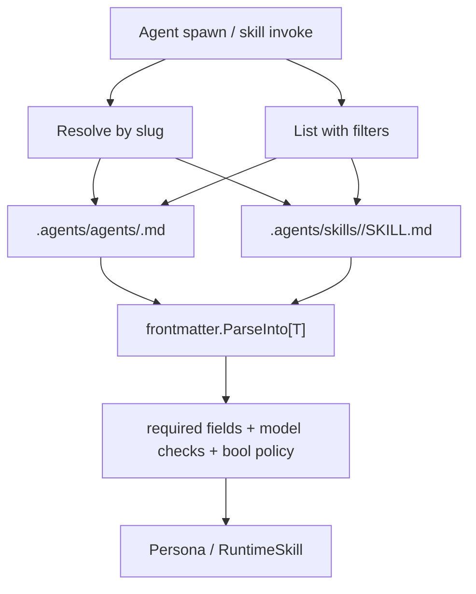
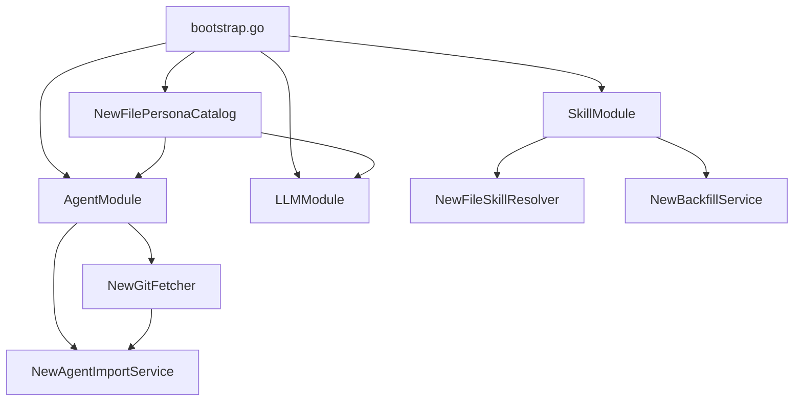

# Agent System Overview

File-backed persona and skill resolution for runtime agent behavior. Runtime resolution reads `.agents/` in the project document tree; domain interfaces keep resolution, import, and migration concerns separated.

## Package Layout

| Package | Role |
|---|---|
| `backend/internal/domain/agents/` | Domain types (`Persona`, `RuntimeSkill`, `ValidationIssue`) and interfaces (`SkillResolver`, `PersonaCatalog`, `AgentImportService`, `BackfillService`, `GitFetcher`) |
| `backend/internal/service/agents/` | File-backed implementations (`filePersonaCatalog`, `fileSkillResolver`, import and backfill services, git fetcher) |
| `backend/internal/pkg/frontmatter/` | Domain-agnostic YAML frontmatter parsing utility |
| `backend/internal/app/domains/agents.go` | HTTP module wiring for Git import and persona list routes |
| `backend/internal/app/domains/skill.go` | HTTP module wiring for skill resolver and backfill routes |
| `backend/internal/capabilities/` | Provider/model capability registry used by persona model validation |

Refs: `backend/internal/domain/agents/interfaces.go:9`, `backend/internal/service/agents/persona_catalog.go:26`, `backend/internal/service/agents/skill_resolver.go:37`, `backend/internal/pkg/frontmatter/parser.go:1`, `backend/internal/app/domains/agents.go:25`, `backend/internal/app/domains/skill.go:18`.

## Resolution Flow

Refs: `backend/internal/service/agents/persona_catalog.go:58`, `backend/internal/service/agents/persona_catalog.go:133`, `backend/internal/service/agents/skill_resolver.go:65`, `backend/internal/service/agents/skill_resolver.go:97`, `backend/internal/pkg/frontmatter/parser.go:47`.

## Persona Model

`Persona` maps to `.agents/agents/<slug>.md`, with identity derived from the filename slug.

| Field | Type | Runtime shape rationale |
|---|---|---|
| `Slug` | `string` | Derived from path for stable file identity |
| `Model`, `Provider` | `string` | Explicit routing override; empty model inherits caller context |
| `Tools`, `DisallowedTools` | `[]string` | Allowlist/denylist composition; `nil` tools inherits full toolset |
| `Skills` | `[]string` | Complete startup skill set for the persona context |
| `UserInvocable` | `*bool` | Nil distinguishes omission; default policy resolves to true |
| `DisableModelInvocation` | `bool` | Hard gate for agent-spawn eligibility |
| `SystemPrompt` | `string` | Markdown body after frontmatter |
| `SourcePath` | `string` | Source provenance path in document tree |

Refs: `backend/internal/domain/agents/types.go:9`, `backend/internal/service/agents/persona_catalog.go:253`.

### PersonaCatalog behavior

| Operation | Invalid frontmatter | Invalid model capability |
|---|---|---|
| `ResolvePersona` | Returns `PersonaInvalid` | Returns `PersonaInvalid` |
| `ListUserPersonas` | Excluded + validation issue | Kept + validation issue |
| `ListSpawnablePersonas` | Excluded + validation issue | Kept + validation issue |

Why this split: resolve is execution-time and must fail on unrunnable config; listing is discovery-time and keeps entries visible while surfacing issues.

Refs: `backend/internal/service/agents/persona_catalog.go:58`, `backend/internal/service/agents/persona_catalog.go:98`, `backend/internal/service/agents/persona_catalog.go:118`, `backend/internal/service/agents/persona_catalog.go:180`, `backend/internal/service/agents/persona_catalog.go:198`, `backend/internal/service/agents/persona_catalog.go:227`.

## Skill Model

`RuntimeSkill` maps to `.agents/skills/<slug>/SKILL.md`.

| Field | Type | Runtime shape rationale |
|---|---|---|
| `Slug`, `Name`, `Description` | scalar | Identity and display metadata |
| `Content` | `string` | Markdown body after frontmatter |
| `UserInvocable` | `*bool` | Nil distinguishes omission; default policy resolves to true |
| `DisableModelInvocation` | `bool` | Blocks model-side invocation surfaces when true |
| `Position`, `Version` | pointers | Optional ordering/version metadata |
| `Source`, `SourcePath` | scalar | Provenance metadata for downstream callers |

Refs: `backend/internal/domain/agents/types.go:71`, `backend/internal/service/agents/skill_resolver.go:176`.

### SkillResolver and frontmatter mapping

`fileSkillResolver` resolves by exact path, returns typed errors for not-found/invalid states, and lists child folders under `.agents/skills/` with hidden folders included.

`skillFrontmatter` is separate from `RuntimeSkill` so SKILL.md YAML keys (`user-invocable`, `disable-model-invocation`) map cleanly while runtime JSON tags remain underscore-based.

Refs: `backend/internal/service/agents/skill_resolver.go:20`, `backend/internal/service/agents/skill_resolver.go:65`, `backend/internal/service/agents/skill_resolver.go:97`, `backend/internal/service/agents/skill_resolver.go:111`.

## BoolDefaultTrue Policy

`BoolDefaultTrue(*bool)` is the policy helper for omission-sensitive default-true fields (`UserInvocable` on personas and runtime skills). Nil resolves to `true`; explicit pointer value is preserved.

Refs: `backend/internal/domain/agents/types.go:100`, `backend/internal/service/agents/persona_catalog.go:106`.

## Frontmatter Parser

`frontmatter.Parse` and `frontmatter.ParseInto[T]` share a single delimiter scanner:

| Rule | Behavior |
|---|---|
| Opening delimiter | Must start with exact first line `---` |
| Closing delimiter | Must be an exact delimiter line (`\n---\n` or EOF) |
| False positives | Tokens like `--- note` are skipped during scan |
| Newlines | CRLF normalized to LF |
| Unknown YAML fields | Ignored for forward compatibility |

Refs: `backend/internal/pkg/frontmatter/parser.go:30`, `backend/internal/pkg/frontmatter/parser.go:47`, `backend/internal/pkg/frontmatter/parser.go:65`, `backend/internal/pkg/frontmatter/parser.go:70`, `backend/internal/pkg/frontmatter/parser.go:84`.

## Module Wiring

`AgentModule` wires Git import and optional persona-list HTTP handlers. `SkillModule` wires skill CRUD plus file resolver and backfill endpoint. `bootstrap` creates one `PersonaCatalog` and injects it into both LLM and Agent modules.

Refs: `backend/internal/app/domains/agents.go:32`, `backend/internal/app/domains/agents.go:67`, `backend/internal/app/domains/skill.go:36`, `backend/internal/app/domains/skill.go:64`, `backend/internal/app/bootstrap.go:86`, `backend/internal/app/bootstrap.go:95`, `backend/internal/app/bootstrap.go:125`.

## Interface to Implementation Map

| Interface | Location | Implementation | Location |
|---|---|---|---|
| `SkillResolver` | `domain/agents/interfaces.go:17` | `fileSkillResolver` | `service/agents/skill_resolver.go:37` |
| `PersonaCatalog` | `domain/agents/interfaces.go:30` | `filePersonaCatalog` | `service/agents/persona_catalog.go:26` |
| `AgentImportService` | `domain/agents/interfaces.go:47` | `agentImportService` | `service/agents/import_service.go:31` |
| `BackfillService` | `domain/agents/interfaces.go:56` | `backfillService` | `service/agents/backfill.go:77` |
| `GitFetcher` | `domain/agents/interfaces.go:65` | `gitFetcher` | `service/agents/git_fetcher.go:41` |

All implementations include compile-time interface assertions.

## Design Decisions

| Decision | Why this shape |
|---|---|
| File-backed source of truth for runtime agents/skills | Keeps runtime behavior aligned with `.agents/` bundle content |
| Pointer bool only for default-true policy fields | Distinguishes omission from explicit `false` without broad pointer use |
| Strict resolve, permissive list | Execution safety on resolve; diagnosable catalogs on list |
| Separate SKILL.md frontmatter struct | Supports hyphenated YAML keys and runtime JSON tags without tag conflict |
| N+1 persona content load in list path | `ListByFolder` metadata is cheap and catalog size is small for spawn-time workflows |
| Shared parser utility package | Centralizes delimiter and YAML parsing behavior across persona/skill loaders |

Refs: `backend/internal/domain/agents/interfaces.go:9`, `backend/internal/domain/agents/types.go:100`, `backend/internal/service/agents/persona_catalog.go:22`, `backend/internal/service/agents/persona_catalog.go:194`, `backend/internal/service/agents/skill_resolver.go:20`, `backend/internal/pkg/frontmatter/parser.go:1`.
