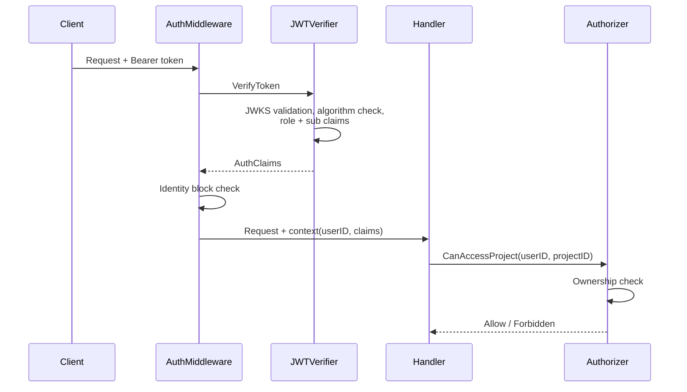

# Auth Overview

Authentication uses Supabase JWT verification plus owner-based authorization, and initialization binds first-login credit refresh to authenticated identity claims.

## Supabase JWT Flow

## Middleware

`AuthMiddleware` verifies Bearer tokens, injects user and auth claims into request context, and skips auth for `/health`, Stripe webhook POST, and collab websocket entrypoints.

## JWT Verification

`SupabaseJWTVerifier` loads JWKS with keyfunc caching and enforces algorithm allowlist (`RS256`, `ES256`), required `sub`, required `role=authenticated`, and required `exp`.

JWT parse failures are logged at debug level to avoid noisy error logs and accidental sensitive payload exposure.

## Authorization Model

`OwnerBasedAuthorizer` resolves resource ownership through project ancestry and rewrites project not-found to forbidden so existence and permission failures are indistinguishable.

Access checks for folders, documents, threads, and turns all converge through `CanAccessProject`.

## Auth Initialization

`POST /api/auth/initialize` calls `CreditGranter.InitializeSignupCredits` with verified auth claims and returns updated credit balances.

Credit initialization skips unverified emails and monthly grant idempotency is keyed by `monthly_refresh_YYYY_MM` with a unique `(user_id, grant_reason)` lot index.

## File References

| Area | File references |
| --- | --- |
| Auth middleware flow + exclusions | `backend/internal/middleware/auth.go:17`, `backend/internal/middleware/auth.go:25`, `backend/internal/middleware/auth.go:50`, `backend/internal/middleware/auth.go:64` |
| Global middleware attachment | `backend/internal/app/server.go:44` |
| JWT verifier + JWKS | `backend/internal/auth/jwt_verifier.go:17`, `backend/internal/auth/jwt_verifier.go:25`, `backend/internal/auth/jwt_verifier.go:33` |
| JWT security checks | `backend/internal/auth/jwt_verifier.go:64`, `backend/internal/auth/jwt_verifier.go:80`, `backend/internal/auth/jwt_verifier.go:87`, `backend/internal/auth/jwt_verifier.go:94` |
| JWT parse logging behavior | `backend/internal/auth/jwt_verifier.go:52`, `backend/internal/auth/jwt_verifier.go:54` |
| Owner-based authorizer and not-found rewrite | `backend/internal/service/auth/owner_authorizer.go:13`, `backend/internal/service/auth/owner_authorizer.go:46`, `backend/internal/service/auth/owner_authorizer.go:51`, `backend/internal/service/auth/owner_authorizer.go:53` |
| Auth route and handler | `backend/internal/app/domains/auth.go:63`, `backend/internal/handler/auth_handler.go:37`, `backend/internal/handler/auth_handler.go:52` |
| Credit grant initialization behavior | `backend/internal/service/billing/credit_granter.go:34`, `backend/internal/service/billing/credit_granter.go:40`, `backend/internal/service/billing/credit_granter.go:77` |
| Monthly grant idempotency index | `backend/migrations/00030_billing_credit_system.sql:40`, `backend/migrations/00030_billing_credit_system.sql:42` |
