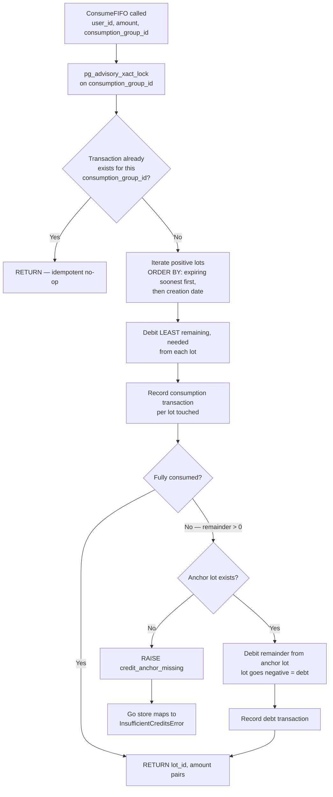

# Billing & Credits Overview

Billing uses integer millicredits end-to-end so credit math stays deterministic across lots, transactions, and settlement writes.

## Credit Accounting Model

`1 credit = $0.01 = 1,000 millicredits = 10,000 microusd`.

| Type | Key fields | Purpose |
| --- | --- | --- |
| `CreditBalance` | total, promotional, purchased, debt (millicredits) | User-visible balance buckets |
| `CreditLot` | source, original, remaining, expiry, grant/Stripe IDs | Source-of-truth spend buckets |
| `CreditTransaction` | type, amount, lot, consumption group, usage event | Immutable audit ledger |

Source types are `purchase` and `grant`, and transaction types are `purchase`, `grant`, `consumption`, `expiration`, and `refund`.

## Credit Packs

| Pack | Price | Credits | Bonus |
| --- | --- | --- | --- |
| Starter | `$10` | `1,000` | `0` |
| Writer | `$25` | `2,800` | `300` |
| Novelist | `$50` | `6,000` | `1,000` |

Monthly refresh grants `100,000` millicredits and expires in `60` days, while purchased packs expire in `365` days.

## Schema Invariants

The credit schema enforces mutually exclusive purchase/grant lot fields and unique idempotency keys for Stripe sessions and monthly grant reasons.

## FIFO Consumption

`consume_credit_lots_fifo` performs debit + ledger writes in one SQL function call so idempotency and atomicity remain database-local.

Advisory locking prevents same-group TOCTOU races, spend order prefers soonest-expiring lots, and overage is recorded as debt against an anchor lot.

## Credit Gate Middleware

`POST /api/turns` is wrapped by `CreditGate`, which checks admission before streaming setup and returns `402` with balance/required/shortfall extras.

## File References

| Area | File references |
| --- | --- |
| Core billing types | `backend/internal/domain/billing/types.go:37`, `backend/internal/domain/billing/types.go:54`, `backend/internal/domain/billing/types.go:67` |
| Units, packs, expirations | `backend/internal/domain/billing/pricing.go:12`, `backend/internal/domain/billing/pricing.go:16`, `backend/internal/domain/billing/pricing.go:27` |
| Schema checks + idempotency indexes | `backend/migrations/00030_billing_credit_system.sql:24`, `backend/migrations/00030_billing_credit_system.sql:36`, `backend/migrations/00030_billing_credit_system.sql:40` |
| FIFO SQL function | `backend/migrations/00030_billing_credit_system.sql:113`, `backend/migrations/00030_billing_credit_system.sql:129`, `backend/migrations/00030_billing_credit_system.sql:139` |
| Debt anchor behavior | `backend/migrations/00030_billing_credit_system.sql:200`, `backend/migrations/00030_billing_credit_system.sql:215` |
| SQL error to insufficient credits mapping | `backend/internal/repository/postgres/billing/credit_store.go:339`, `backend/internal/repository/postgres/billing/credit_store.go:354` |
| Credit gate middleware | `backend/internal/middleware/credit_gate.go:12`, `backend/internal/middleware/credit_gate.go:22`, `backend/internal/middleware/credit_gate.go:25` |
| Credit gate route attachment | `backend/internal/app/domains/llm.go:150` |
