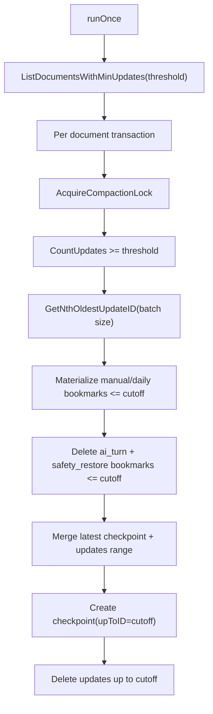
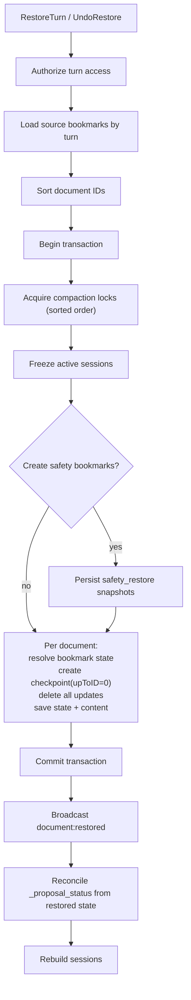

# Collaboration Checkpoints and Restore

Checkpointing keeps append-only Yjs update logs bounded while preserving restore fidelity for bookmarks and turn-level rollback.

## Compaction Policy

| Parameter | Value | Source |
|---|---|---|
| Run interval | 60s default | `defaultCompactionInterval` |
| Trigger threshold | 20,000 updates/document | `compactionThreshold` |
| Per-pass batch | 10,000 oldest updates | `compactionBatchSize` |

References: `backend/internal/service/collab/compaction_worker.go:16`, `backend/internal/service/collab/compaction_worker.go:63`, `backend/internal/service/collab/compaction_worker.go:104`, `backend/internal/service/collab/compaction_worker.go:131`.

## Compaction Flow

References: `backend/internal/service/collab/compaction_worker.go:117`, `backend/internal/service/collab/compaction_worker.go:119`, `backend/internal/service/collab/compaction_worker.go:123`, `backend/internal/service/collab/compaction_worker.go:131`, `backend/internal/service/collab/compaction_worker.go:147`, `backend/internal/service/collab/compaction_worker.go:153`, `backend/internal/service/collab/compaction_worker.go:164`, `backend/internal/service/collab/compaction_worker.go:169`, `backend/internal/service/collab/compaction_worker.go:172`.

## Bookmark Handling During Compaction

- `manual` and `daily`: state is materialized before update deletion so bookmarks remain restorable without referenced log rows.
- `ai_turn` and `safety_restore`: deleted when below cutoff.

References: `backend/internal/service/collab/compaction_worker.go:147`, `backend/internal/service/collab/compaction_worker.go:150`, `backend/internal/service/collab/compaction_worker.go:153`, `backend/internal/service/collab/compaction_worker.go:156`, `backend/internal/service/collab/compaction_worker.go:185`.

## Restore Flow

References: `backend/internal/service/collab/restore_service.go:76`, `backend/internal/service/collab/restore_service.go:84`, `backend/internal/service/collab/restore_service.go:125`, `backend/internal/service/collab/restore_service.go:130`, `backend/internal/service/collab/restore_service.go:132`, `backend/internal/service/collab/restore_service.go:138`, `backend/internal/service/collab/restore_service.go:144`, `backend/internal/service/collab/restore_service.go:170`, `backend/internal/service/collab/restore_service.go:173`, `backend/internal/service/collab/restore_service.go:185`, `backend/internal/service/collab/restore_service.go:202`, `backend/internal/service/collab/restore_service.go:215`, `backend/internal/service/collab/restore_service.go:244`.

## Session Management During Restore

- `Freeze` marks the document frozen, removes live session from cache, stops debounce timer, and flushes dirty state.
- While frozen, `Acquire` returns `errSessionFrozen`, preventing concurrent mutations during restore.
- `Rebuild` unfreezes and reloads a fresh session from persisted state.

References: `backend/internal/service/collab/session_manager.go:179`, `backend/internal/service/collab/session_manager.go:193`, `backend/internal/service/collab/session_manager.go:204`, `backend/internal/service/collab/session_manager.go:114`, `backend/internal/service/collab/session_manager.go:116`, `backend/internal/service/collab/session_manager.go:210`, `backend/internal/service/collab/session_manager.go:223`.

## Why Checkpoint + Append-Only Hybrid

- Checkpoints keep load/rebuild fast.
- Update log preserves replay/audit/restore granularity.
- Compaction merges history into periodic checkpoints without losing restorable bookmark state.

References: `backend/internal/service/collab/session_manager.go:545`, `backend/internal/service/collab/session_manager.go:630`, `backend/internal/service/collab/compaction_worker.go:164`.
