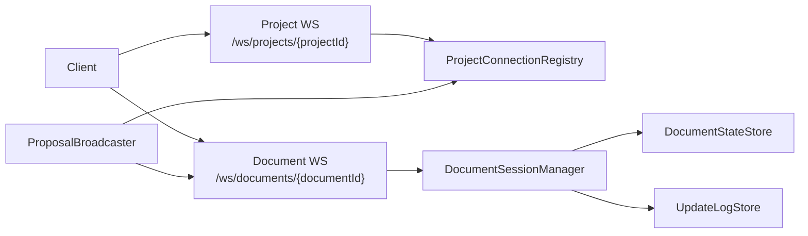

# Collaboration Architecture Overview

Collaboration runs two WebSocket lanes per editing session: a project-scoped JSON control lane and a document-scoped binary Yjs sync lane.

## Transport Topology

## WebSocket Lanes

| Lane | Endpoint | Library | Payloads | Why this lane/library |
|---|---|---|---|---|
| Project control lane | `GET /ws/projects/{projectId}` | `golang.org/x/net/websocket` | JSON (`project:connected`, `heartbeat`, `proposal:new`, `doc:error`) | Project-wide notifications fan out once per project, and the shared project loop/auth path is implemented on this connection type. |
| Document sync lane | `GET /ws/documents/{documentId}` | `github.com/coder/websocket` | Binary Yjs frames (`0x00` sync, `0x01` awareness) + JSON heartbeats | Document sync needs context-aware read/write deadlines, cancellation-aware loops, and explicit binary frame handling. |

References: `backend/internal/handler/collab_project.go:39`, `backend/internal/handler/collab_document_handler.go:77`, `backend/internal/handler/collab_project.go:10`, `backend/internal/handler/collab_document_handler.go:15`.

## Connection Lifecycle

1. Client connects to project/document endpoint.
2. First inbound message must be JWT text within 5s (`collabAuthMessageTimeout` / `docWSAuthTimeout`).
3. Server verifies JWT, applies optional identity block, and runs channel authorization:
   - project lane: `CanAccessProject`
   - document lane: ownership check via `DocumentResolver.VerifyOwnership`
4. Server sends connected event (`project:connected` or `connected` + sync step1 for document lane).
5. Heartbeat loops run at 30s with 5s ack timeout; inbound rate limit is 30 msgs/sec.
6. Document lane adds per-user connection cap (10 active) and app-activity idle timeout (5 minutes).
7. Unknown JSON types are ignored for forward compatibility.

References: `backend/internal/handler/collab_authenticator.go:53`, `backend/internal/handler/collab_authenticator.go:119`, `backend/internal/handler/collab_document_handler.go:150`, `backend/internal/handler/collab_document_handler.go:242`, `backend/internal/handler/collab.go:37`, `backend/internal/handler/collab_document_handler.go:42`, `backend/internal/handler/collab_project.go:144`, `backend/internal/handler/collab_document_handler.go:319`.

## Broadcasting Model

- Project broadcasts use `InMemoryProjectConnectionRegistry` (`connectionID -> {projectID, conn}`), snapshot targets under read lock, then send outside lock.
- Document broadcasts keep `documentID -> set(conn)` in `CollabDocumentHandler`; sync fanout skips sender, server-initiated fanout sends to all.
- Proposal routing splits by event type:
  - `proposal:new` -> project lane JSON.
  - accepted proposal update -> document lane binary Yjs frame.

References: `backend/internal/handler/project_connection_registry.go:41`, `backend/internal/handler/project_connection_registry.go:81`, `backend/internal/handler/collab_document_handler.go:545`, `backend/internal/handler/collab_document_handler.go:577`, `backend/internal/handler/collab_proposal_broadcaster.go:36`, `backend/internal/handler/collab_proposal_broadcaster.go:62`.

## File Reference

| File | Responsibility |
|---|---|
| `backend/internal/handler/collab.go` | Shared collab transport constants, heartbeat loop, rate tracking, project WS connection adapter. |
| `backend/internal/handler/collab_authenticator.go` | JWT-first handshake and channel authorization checks. |
| `backend/internal/handler/collab_project.go` | Project WS endpoint and JSON control handling. |
| `backend/internal/handler/collab_document_handler.go` | Document WS endpoint, binary Yjs protocol handling, idle/heartbeat loops, document fanout. |
| `backend/internal/handler/collab_message_loop.go` | Shared project-lane receive loop with JSON-first dispatch and rate limiting. |
| `backend/internal/handler/project_connection_registry.go` | Project connection registry and project-scoped broadcast implementation. |
| `backend/internal/handler/collab_proposal_broadcaster.go` | Split proposal event routing across project/document lanes. |
| `backend/internal/service/collab/session_manager.go` | In-memory Y.Doc session lifecycle and sync peer runtime. |
| `backend/internal/domain/collab/resolver.go` | `DocumentResolver` and `AutoapplyResolver` boundaries used across handlers/services. |
