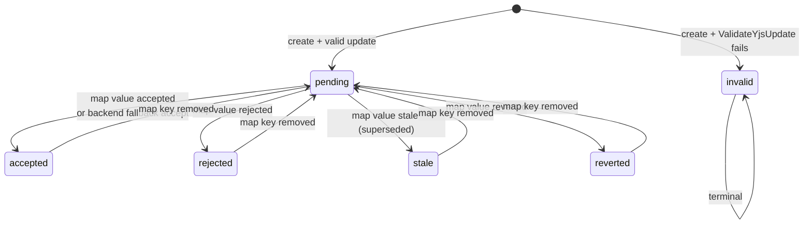
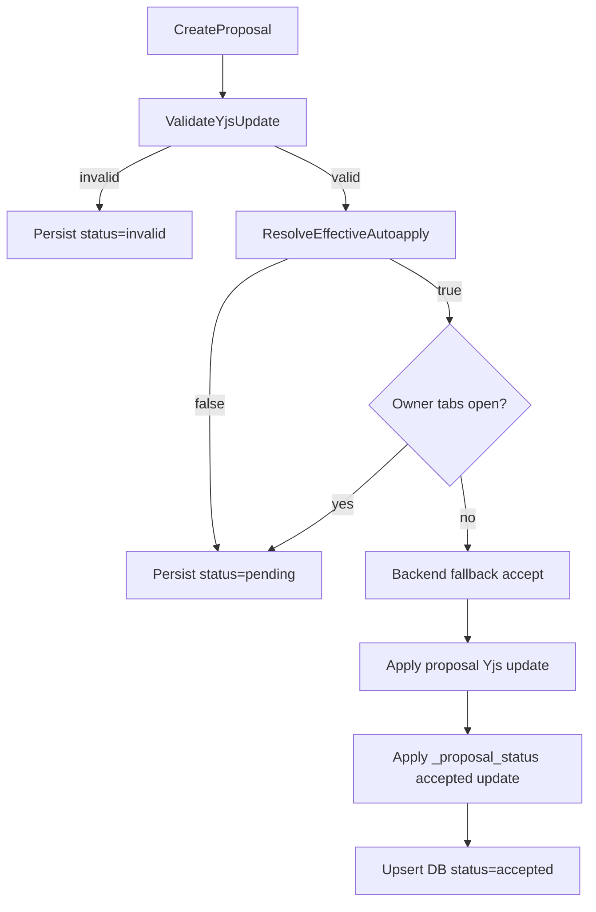
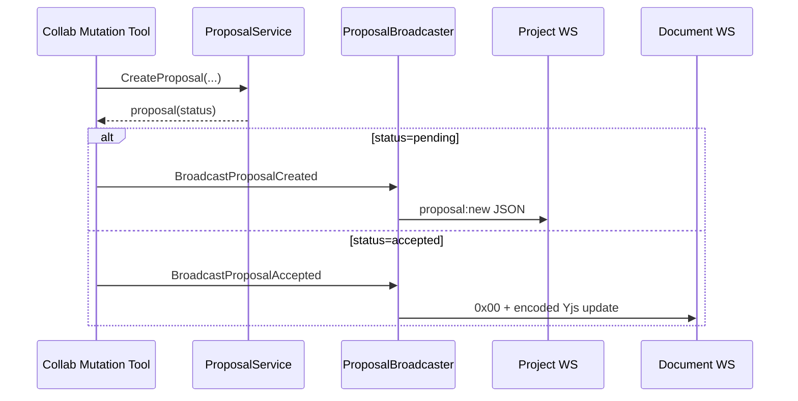

# Collaboration Proposal Lifecycle

Proposals are Yjs update payloads persisted as rows, then moved through status transitions driven by auto-apply rules and `_proposal_status` CRDT map updates.

## Lifecycle

References: `backend/internal/domain/collab/proposal.go:20`, `backend/internal/service/collab/proposal_service.go:52`, `backend/internal/service/collab/status_mirror.go:152`.

## Create Flow

`ProposalService.CreateProposal` flow:

1. Authorize document access (`CanAccessDocument`).
2. Validate `YjsUpdate` presence and max size (256KB).
3. Validate Yjs mutation against canonical state (`ValidateYjsUpdate`).
4. If validation fails, persist with `invalid` status and return.
5. Resolve effective auto-apply policy.
6. Read owner-tab presence.
7. For first AI proposal in a turn, create an `ai_turn` bookmark.
8. Persist proposal row.
9. If auto-apply is enabled and owner tabs are absent, execute backend fallback acceptance.

References: `backend/internal/service/collab/proposal_service.go:52`, `backend/internal/service/collab/proposal_service.go:63`, `backend/internal/service/collab/proposal_service.go:91`, `backend/internal/service/collab/proposal_service.go:104`, `backend/internal/service/collab/proposal_service.go:109`, `backend/internal/service/collab/proposal_service.go:112`, `backend/internal/service/collab/proposal_service.go:124`, `backend/internal/service/collab/proposal_service.go:212`.

## Auto-Apply Decision Tree

AI + owner-tab path adds per-document serialization and enforces the pending queue cap (`200`) before persistence.

References: `backend/internal/service/collab/proposal_service.go:13`, `backend/internal/service/collab/proposal_service.go:142`, `backend/internal/service/collab/proposal_document_gate.go:17`.

## Yjs Diff Integration

- `Proposal.YjsUpdate` stores the proposed delta buffer.
- Validation applies canonical state + proposed update and rejects updates that mutate shared types other than `content`.
- Backend fallback acceptance writes two Yjs updates through the runtime:
  - proposal content update
  - `_proposal_status[proposalID] = accepted` update
- Runtime `ApplyUpdate` applies to active in-memory session when present; otherwise it uses offline apply to mutate persisted state + append update log.

References: `backend/internal/domain/collab/proposal.go:42`, `backend/internal/service/collab/yjs_text_converter.go:154`, `backend/internal/service/collab/proposal_service_helpers.go:12`, `backend/internal/service/collab/proposal_service.go:216`, `backend/internal/service/collab/session_manager.go:306`, `backend/internal/service/collab/session_manager.go:338`.

## Status Authority

- `_proposal_status` Y.Map is canonical for mutable statuses.
- Session bootstrap ensures the map exists, then observes map deltas and calls `StatusMirror.OnStatusChange`.
- `ReconcileAll` repairs map/DB drift on load and restore.
- Missing map key means `pending`, except `invalid` which remains terminal.
- Supersede semantics are encoded as `stale` status values in the map and DB mirror.

References: `backend/internal/service/collab/session_manager.go:636`, `backend/internal/service/collab/session_manager.go:656`, `backend/internal/service/collab/session_manager.go:722`, `backend/internal/service/collab/status_mirror.go:88`, `backend/internal/service/collab/status_mirror.go:110`, `backend/internal/service/collab/status_mirror.go:162`.

## WebSocket Notification Flow

References: `backend/internal/service/llm/tools/mutation_strategy_collab.go:143`, `backend/internal/service/llm/tools/mutation_strategy_collab.go:162`, `backend/internal/handler/collab_proposal_broadcaster.go:38`, `backend/internal/handler/collab_proposal_broadcaster.go:64`.

## Proposal States

| Status | Meaning |
|---|---|
| `pending` | Awaiting explicit accept/reject/supersede/revert action via status map. |
| `accepted` | Applied proposal update and accepted status reflected in map/DB. |
| `rejected` | Explicit rejection in status map. |
| `stale` | Superseded by a newer change; retained for history and UI context. |
| `reverted` | Previously accepted or pending proposal explicitly reverted. |
| `invalid` | Validation failed at creation; terminal. |

Reference: `backend/internal/domain/collab/proposal.go:23`.
