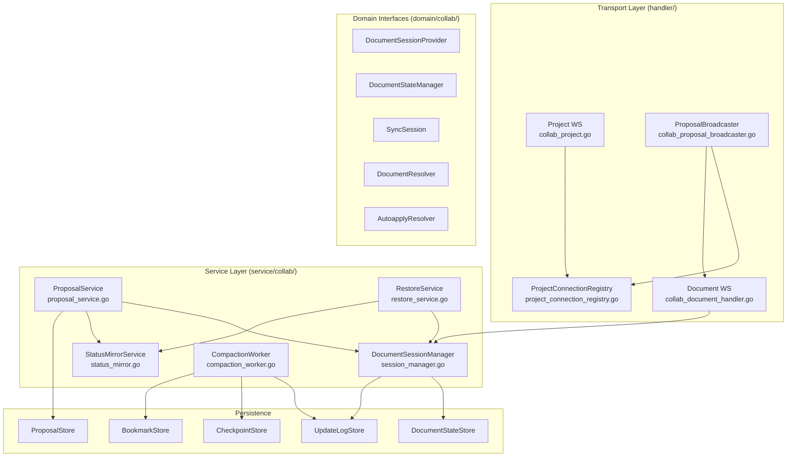
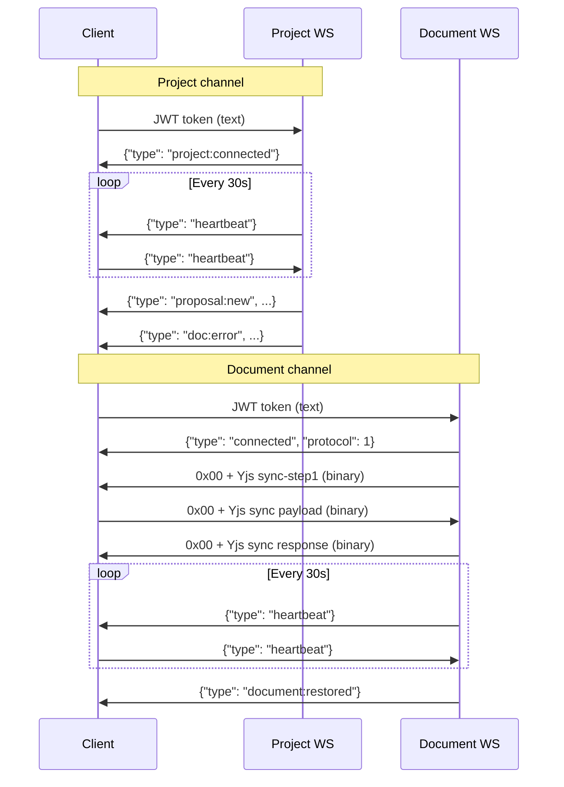
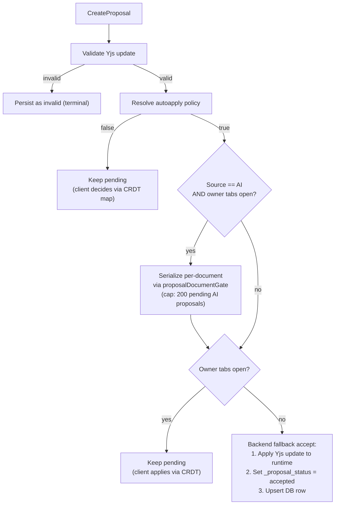
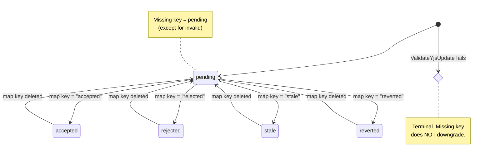
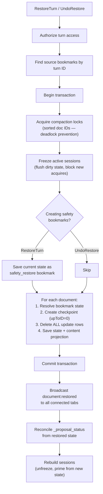

# Collaboration System

Real-time document editing via Yjs CRDT sync, AI proposal lifecycle, and append-only persistence with compaction.

## Architecture Overview



**Key dependency rule:** Collab never imports docsystem directly. All cross-domain access goes through `DocumentResolver` (DIP boundary at `domain/collab/resolver.go:6-9`).

## WebSocket Channels

Two separate WebSocket connections per editing session, each serving a distinct purpose.

### Project WS — JSON control lane

**Endpoint:** `GET /ws/projects/{projectId}`

Carries JSON control messages: heartbeats, proposal notifications, document-scoped errors. Uses `golang.org/x/net/websocket` (legacy library — not the same as the document WS library).

**Why a separate channel:** Proposal notifications are project-scoped (one project has many documents). A single project WS multiplexes events across all documents, avoiding per-document subscription management on the client.

### Document WS — binary Yjs sync lane

**Endpoint:** `GET /ws/documents/{documentId}`

Carries binary Yjs sync frames with a 1-byte prefix protocol, plus JSON heartbeats. Uses `github.com/coder/websocket` (modern, context-aware library).

**Why different WS libraries:** The project WS was implemented first with the standard library. The document WS needed context-aware read/write for idle timeout and cancellation, which `coder/websocket` provides natively.

### Message Protocol



| Direction | Channel | Type | Format | Purpose |
|-----------|---------|------|--------|---------|
| C->S | both | JWT token | text | Auth bootstrap (must be first message) |
| S->C | project | `project:connected` | JSON | Auth success |
| S<->C | both | `heartbeat` | JSON | Liveness (30s interval, 5s ack timeout) |
| S->C | project | `proposal:new` | JSON | New proposal notification |
| S->C | project | `doc:error` | JSON | Document-scoped error (non-fatal) |
| S->C | document | `connected` | JSON | Session metadata |
| S<->C | document | `0x00` + payload | binary | Yjs sync frames |
| C->S | document | `0x01` + payload | binary | Awareness (logged, no fanout yet) |
| S->C | document | `document:restored` | JSON | Force client rehydration |
| S->C | both | `error` | JSON | Fatal error (connection closes) |

### Auth and Connection Lifecycle

Both channels require JWT as the first message within 5s (`collabAuthMessageTimeout` / `docWSAuthTimeout`). Auth flow:

1. Verify JWT via `JWTVerifier`
2. Extract UUID subject
3. Optional production identity blocking (`cfg.IsProdIdentityBlocked`)
4. Channel-specific authorization: project access (project WS) or document ownership (document WS)

**Document WS connection limits:** Max 10 concurrent connections per user (`docWSMaxConnPerUser`). Enforced via in-memory counter (`connCounts map[string]int`). Per-user, not per-document — prevents tab-bombing.

**Idle timeout:** Document WS closes after 5min of no sync/awareness activity (`docWSIdleTimeout`). Activity resets the timer; heartbeats alone don't count.

**Rate limiting:** Project WS uses a sliding-window rate tracker (30 msg/s, 1s mute). Document WS uses `golang.org/x/time/rate.Limiter` (30 tokens/s burst).

**Forward compatibility:** Unknown JSON message types are silently ignored on both channels (`collab_project.go:147-149`, `collab_document_handler.go:319-323`).

## Proposal System

AI, template, and user-suggestion edits flow through a unified proposal pipeline that separates edit creation from edit acceptance.

### Proposal Model

```
domain/collab/proposal.go
```

| Field | Purpose |
|-------|---------|
| `YjsUpdate []byte` | The actual edit as a Yjs update buffer (max 256KB) |
| `Source` | `ai`, `template`, `user_suggestion` |
| `Status` | `pending`, `accepted`, `rejected`, `stale`, `reverted`, `invalid` |
| `ThreadID`, `TurnID`, `AgentRunID` | LLM conversation lineage |
| `ProposalGroupID` | Groups related proposals for batch operations |
| `ProposedAtOffset`, `AcceptedAtOffset` | Document character offsets for UI positioning |
| `OffsetVersion` | Monotonic version for offset conflict resolution |

### Creation Flow

`ProposalService.CreateProposal` at `service/collab/proposal_service.go:52`:

1. **Authorize** document access
2. **Validate** update presence and size (max 256KB)
3. **Validate Yjs mutation** against canonical state via `ValidateYjsUpdate` — if invalid, persist with terminal `invalid` status (not rejected as a request error — **why:** the proposal record serves as an audit trail even when the update is malformed)
4. **Resolve autoapply** policy via `AutoapplyResolver`
5. **Check owner-tab presence** via `OwnerTabPresenceTracker`
6. **Create AI-turn bookmark** on first AI proposal per turn (enables turn-level restore)
7. **Persist** proposal row
8. **Route** to acceptance path based on autoapply + owner-tab state

### Auto-apply Decision Tree



**Why backend fallback:** When no editor tab is open, there's no client to apply the update. The server applies it directly to persisted state so AI edits aren't lost. This is the `applyUpdateOffline` path in `session_manager.go:338-374`.

**Why the document gate:** AI proposals with open owner tabs need serialization to enforce the 200-pending cap atomically. The gate (`proposal_document_gate.go`) uses `sync.Map` of per-document mutexes — one mutex per document that's ever had a create operation. Acceptable for single-writer workloads.

### Status Synchronization

Proposal status is **CRDT-authoritative**: the `_proposal_status` Y.Map inside each document's Yjs state is the source of truth for mutable statuses. The DB `proposals.status` column is a mirror.



**How it works:**

1. Session bootstrap ensures `_proposal_status` map exists (`session_manager.go:636-644`)
2. Y.Map observer streams key deltas to `StatusMirror.OnStatusChange` (`session_manager.go:656-720`)
3. On session load/restore, `ReconcileAll` repairs drift between map state and DB rows (`status_mirror.go:88-150`)

**Why CRDT-authoritative:** The client (editor UI) needs to apply/reject proposals locally and have that decision propagate to other tabs via Yjs sync. Making the CRDT map authoritative means the sync protocol handles distribution automatically — no separate REST endpoints for accept/reject.

**Invalid terminal invariant:** `invalid` status is set at creation time when `ValidateYjsUpdate` fails. A missing map key does NOT downgrade `invalid` back to `pending` (`status_mirror.go:110-114`). This prevents reconciliation from resurrecting known-bad proposals.

## Yjs CRDT Sync

Not classic server-side OT. The server runs a Go port of Yjs (`github.com/haowjy/y-crdt`) and participates as a sync peer.

### Session Manager

`DocumentSessionManager` at `service/collab/session_manager.go` manages in-memory `Y.Doc` instances with reference counting.

| Concept | Implementation |
|---------|---------------|
| Session cache | `sessions map[string]*DocumentSession` guarded by `sync.Mutex` |
| Ref counting | `Acquire` increments, `Release`/`releaseSessionRef` decrements; last release flushes and evicts |
| Dedup loading | `singleflight.Group` ensures one concurrent load per document |
| Freeze/Rebuild | Used by restore — freeze blocks new acquires, flushes dirty state, tears down session |

### Sync Protocol

1. **Session load:** Load persisted state -> apply to Y.Doc -> bootstrap `_proposal_status` map -> observe map -> reconcile status -> snapshot state vector
2. **Client connects:** `BuildSyncStep1Payload` -> send sync-step1 binary frame
3. **Client sends sync payload:** `HandleSyncPayload` -> Yjs protocol dispatch -> if update/step2, extract update, mark dirty, return for fanout
4. **Fanout:** Binary frame broadcast to all document connections except sender (`broadcastDocumentBinary` with sender-skipping)

### Persistence Model

Two persisted forms maintained in parallel:

| Store | Purpose | Key behavior |
|-------|---------|-------------|
| `DocumentStateStore` | Full Yjs state + derived text content | Snapshot for fast session load |
| `UpdateLogStore` | Append-only delta log | Enables restore, compaction, audit trail |

**Debounced persistence:** Dirty sessions persist every 2s (`defaultPersistDebounce`). The debounce timer resets on each mutation. On last-client disconnect, immediate flush (`flushOnDisconnect`).

**Delta encoding:** Persisted update is computed from state vector diff (`computeStateDeltaLocked` at `session_manager.go:863-868`), not full state. Keeps update log entries small.

**Panic safety:** All y-crdt library calls are wrapped in `defer/recover` helpers (`safeApplyUpdate`, `safeReadSyncMessage`, `safeEncodeStateAsUpdate`, etc. at `session_manager.go:899-968`). Malformed payloads map to `RESET_REQUIRED` errors instead of process crashes.

### Offline Apply Path

`ApplyUpdate` at `session_manager.go:306-333`: if an active session exists, apply to live doc. Otherwise, `applyUpdateOffline` loads persisted state, applies update, appends delta, saves state + derived content. This enables auto-accepted proposals when no editor tab is open.

### Bootstrap

Session load (`loadState` at `session_manager.go:545-634`):

1. Try loading persisted Yjs state from `DocumentStateStore`
2. If no state exists, load raw markdown content via `DocumentContentLoader` (ISP — only bootstrap needs this)
3. Insert content into `Y.Text("content")` via transaction
4. Bootstrap `_proposal_status` Y.Map if missing
5. Persist initial state + append as first update log row
6. Set up map observer and run status reconciliation

## Checkpoints and Compaction

The `CompactionWorker` (`service/collab/compaction_worker.go`) bounds update log growth.

| Parameter | Value | Why |
|-----------|-------|-----|
| Interval | 60s | Balance between log size and compaction overhead |
| Threshold | 20,000 updates | Trigger compaction when a document has this many rows |
| Batch size | 10,000 rows | Compact oldest N rows per pass, not all at once |

### Compaction Flow

1. List documents exceeding threshold (`ListDocumentsWithMinUpdates`)
2. Per document, within a transaction:
   a. Acquire per-document compaction lock (`AcquireCompactionLock`)
   b. Verify count still exceeds threshold (double-check after lock)
   c. Find cutoff update ID (Nth oldest row)
   d. **Materialize bookmarks** below cutoff: manual and daily bookmarks get their state snapshot baked in so they survive update deletion
   e. **Delete non-restorable bookmarks** below cutoff: `ai_turn` and `safety_restore` bookmarks are deleted (they reference update IDs that won't exist post-compaction)
   f. Merge latest checkpoint + updates in range -> new checkpoint
   g. Delete updates up to cutoff

**Why materialize bookmarks:** Bookmarks reference update log rows by ID. Once rows are deleted, a bookmark's `update_id` becomes dangling. Manual/daily bookmarks get their full Yjs state materialized before the referenced rows disappear. AI-turn bookmarks are ephemeral and simply deleted.

## Restore System

`RestoreService` at `service/collab/restore_service.go` provides turn-level undo via bookmarks.

### Restore Flow



**Why freeze before restore:** Active sessions hold in-memory Y.Docs that would conflict with the state replacement. Freezing ensures no concurrent mutations during the atomic swap.

**Why sorted doc IDs:** Multiple documents may be restored in one turn. Acquiring compaction locks in sorted order prevents deadlocks.

**Safety bookmarks:** `RestoreTurn` creates `safety_restore` bookmarks capturing current state before overwriting. `UndoRestore` consumes those bookmarks to reverse the restore. This gives users a two-level undo.

## Autoapply Resolution

`AutoapplyResolver` at `service/docsystem/autoapply_resolver.go` walks the document tree to determine whether proposals should be auto-applied.

**Resolution order:** system folder (authoritative) -> document -> folder ancestry (innermost wins) -> project default.

**System folder precedence:** If any ancestor folder is a system folder (`.meridian`, `.session`, `.agents`), its autoapply setting overrides everything below it. If the system folder has no explicit setting, fall through to project default — non-system ancestors outside the namespace boundary are never consulted.

**Why this hierarchy:** System folders represent internal namespaces where the platform controls behavior. User-created folder overrides shouldn't leak into system spaces.

## Broadcasting and Connection Registries

### Project Registry

`InMemoryProjectConnectionRegistry` at `handler/project_connection_registry.go`:
- `connectionID -> {projectID, conn}` map
- `BroadcastToProject` sends to all connections matching a project ID
- Snapshot-then-send pattern: copy targets under read lock, send outside lock

### Document Fanout

`CollabDocumentHandler` maintains `documentID -> set(conn)` at `handler/collab_document_handler.go:37-39`:
- `broadcastDocumentBinary`: sends to all connections except sender (echo suppression)
- `BroadcastToDocument`: server-initiated fanout (no sender exclusion) — used by proposal acceptance
- `BroadcastDocumentRestored`: JSON event to all document connections

### Proposal Broadcasting Split

`ProposalBroadcasterImpl` at `handler/collab_proposal_broadcaster.go` routes events to different channels:

| Event | Channel | Format | Why |
|-------|---------|--------|-----|
| `proposal:new` | Project WS | JSON | UI needs to show notification across all documents |
| Proposal accepted | Document WS | Binary Yjs frame | Update must merge into the specific document's CRDT state |

The broadcaster resolves `documentID -> projectID` via `DocumentResolver` for project-level routing.

## Key Invariants

1. **Auth-first WS:** Both channels require JWT as first message before any protocol traffic
2. **CRDT-authoritative status:** `_proposal_status` Y.Map is canonical; DB mirrors it
3. **Invalid is terminal:** Missing map key never downgrades `invalid` to `pending`
4. **Append-only + checkpoint hybrid:** Runtime persists both deltas (for restore/audit) and snapshots (for fast load)
5. **Restore atomicity:** lock -> freeze -> rewrite state/checkpoint/log -> reconcile -> rebuild -> notify
6. **System namespace precedence:** System folder autoapply overrides all nested non-system settings
7. **Panic isolation:** All y-crdt calls wrapped in recover — malformed payloads close one connection, not the process

## File Reference

### Handler Layer (`backend/internal/handler/`)

| File | Responsibility |
|------|---------------|
| `collab.go` | `CollabHandler` struct, heartbeat loop, shared utilities |
| `collab_project.go` | Project WS endpoint and message handling |
| `collab_document_handler.go` | Document WS endpoint, binary sync, idle/heartbeat loops |
| `collab_authenticator.go` | JWT bootstrap for both WS channels |
| `collab_message_loop.go` | Shared inbound message dispatch with rate limiting |
| `collab_proposal.go` | REST proposal creation endpoint |
| `collab_proposal_offset.go` | `PATCH /api/proposals/{id}/offset` |
| `collab_proposal_broadcaster.go` | Routes proposal events to project/document channels |
| `collab_restore.go` | REST restore/undo endpoints |
| `project_connection_registry.go` | In-memory project WS connection tracking + broadcast |

### Service Layer (`backend/internal/service/collab/`)

| File | Responsibility |
|------|---------------|
| `session_manager.go` | In-memory Y.Doc lifecycle, sync protocol, persistence, status observation |
| `proposal_service.go` | Proposal creation, validation, autoapply routing |
| `proposal_service_helpers.go` | Yjs validation, status update building |
| `proposal_document_gate.go` | Per-document mutex for AI proposal serialization |
| `status_mirror.go` | CRDT map -> DB row synchronization |
| `compaction_worker.go` | Periodic update log compaction with bookmark materialization |
| `restore_service.go` | Turn-level restore via bookmarks with freeze/rebuild |

### Domain Layer (`backend/internal/domain/collab/`)

| File | Responsibility |
|------|---------------|
| `proposal.go` | Proposal model, store interface, request types |
| `session.go` | `SyncSession`, `DocumentSessionProvider`, `DocumentContentLoader` interfaces |
| `state.go` | `DocumentStateStore`, `CheckpointStore` interfaces |
| `state_manager.go` | `DocumentStateManager` interface |
| `update_log.go` | `UpdateLogEntry`, `UpdateLogStore` interface |
| `resolver.go` | `DocumentResolver`, `AutoapplyResolver` interfaces (DIP boundary) |
| `presence.go` | `OwnerTabPresenceTracker`, `StatusMirror` interfaces |
| `bookmark.go` | `Bookmark` model and `BookmarkStore` interface |
| `restore.go` | `RestoreService` interface |

### Cross-Domain

| File | Responsibility |
|------|---------------|
| `service/docsystem/autoapply_resolver.go` | Walks doc -> folder -> project tree to resolve autoapply policy |
