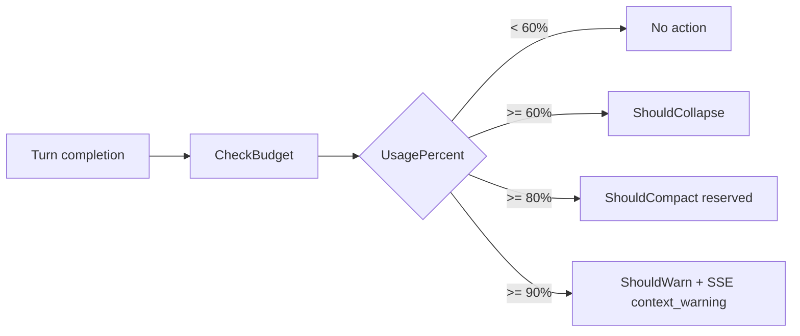

# Context Window Management

Context management combines token-threshold signaling, collapsed tool-result storage, and optional LLM compaction, then applies those bookmarks during message build (`backend/internal/service/llm/streaming/token_monitor.go:3-12`, `backend/internal/service/llm/thread_history/message_builder.go:34-185`, `backend/internal/service/llm/streaming/compaction_service.go:3-333`).

## Core Anchors

| Area | Location |
|------|----------|
| Token monitor + executor hooks | `backend/internal/service/llm/streaming/token_monitor.go:29-331` |
| Collapsed content generation | `backend/internal/service/llm/streaming/tool_executor.go:131-157`, `backend/internal/service/llm/streaming/tool_executor.go:544-555` |
| Collapsed content schema | `backend/migrations/00036_add_collapsed_content.sql:3-11` |
| Compaction service | `backend/internal/service/llm/streaming/compaction_service.go:28-333` |
| Message builder bookmark handling | `backend/internal/service/llm/thread_history/message_builder.go:38-185` |

## Token Monitor Thresholds

| Threshold | Value | Effect | Status |
|-----------|-------|--------|--------|
| Collapse | `0.60` | Persist async `collapse_marker` turn/block | Active |
| Compact | `0.80` | Signal only (no compaction trigger here) | Reserved |
| Warn | `0.90` | Emit `context_warning` SSE | Active |

Threshold constants and additive flags are defined in `BudgetCheck` logic (`backend/internal/service/llm/streaming/token_monitor.go:29-56`, `backend/internal/service/llm/streaming/token_monitor.go:101-107`).

## Runtime Behavior

`checkBudgetAndAct` is synchronous for estimation + event emission, then returns quickly (`backend/internal/service/llm/streaming/token_monitor.go:221-265`).

`createCollapseMarkerAsync` performs DB writes in a goroutine with background timeout, so turn completion is not blocked (`backend/internal/service/llm/streaming/token_monitor.go:267-331`).

## Collapsed Content

Successful tool results get optional `collapsed_content` at persistence time (`backend/internal/service/llm/streaming/tool_executor.go:148-157`).

Current producers:
- `str_replace_based_edit_tool` -> `ComputeTextEditorCollapsedContent`
- `doc_search` -> `ComputeSearchCollapsedContent`

Dispatcher: `backend/internal/service/llm/streaming/tool_executor.go:547-555`.

Storage is `turn_blocks.collapsed_content TEXT` (`backend/migrations/00036_add_collapsed_content.sql:7-11`).

## Compaction Service

Compaction is delta-based LLM summarization with a fast model default and output cap:
- model: `claude-haiku-4-5-20251001`
- max summary tokens: `1024`

Defined at `backend/internal/service/llm/streaming/compaction_service.go:31-44`.

Flow (`backend/internal/service/llm/streaming/compaction_service.go:94-179`):
1. Load root->current turn path.
2. Find latest prior compaction bookmark.
3. Summarize only turns after that bookmark.
4. Persist a `role=system`, `turn_type=compaction` turn linked by `prev_turn_id`.

Transcript builder prefers `collapsed_content`; otherwise short inline results or `<large output omitted>` (`backend/internal/service/llm/streaming/compaction_service.go:265-333`).

## Message Builder Integration

Bookmark rules in `BuildMessages` (`backend/internal/service/llm/thread_history/message_builder.go:38-156`):
- Latest compaction turn is a hard cutoff.
- Compaction summary is injected as leading `[Previous conversation summary]` user message.
- Latest collapse marker applies only to turns before marker and after compaction cutoff.

Collapse substitution deep-copies content maps before replacing tool-result `result` with `collapsed_content` (`backend/internal/service/llm/thread_history/message_builder.go:158-185`).

## Bookmark Precedence

When both bookmark types exist, compaction wins for earlier history and collapse applies only to the remaining post-compaction slice (`backend/internal/service/llm/thread_history/message_builder.go:53-60`, `backend/internal/service/llm/thread_history/message_builder.go:88-130`).

| Condition | Result |
|-----------|--------|
| No compaction, no collapse marker | Full turn path is emitted |
| Collapse marker only | Pre-marker tool results are substituted with `collapsed_content` |
| Compaction only | Turns up to compaction turn are skipped and replaced by summary |
| Both present | Compaction cutoff applies first; collapse applies only after that cutoff |
