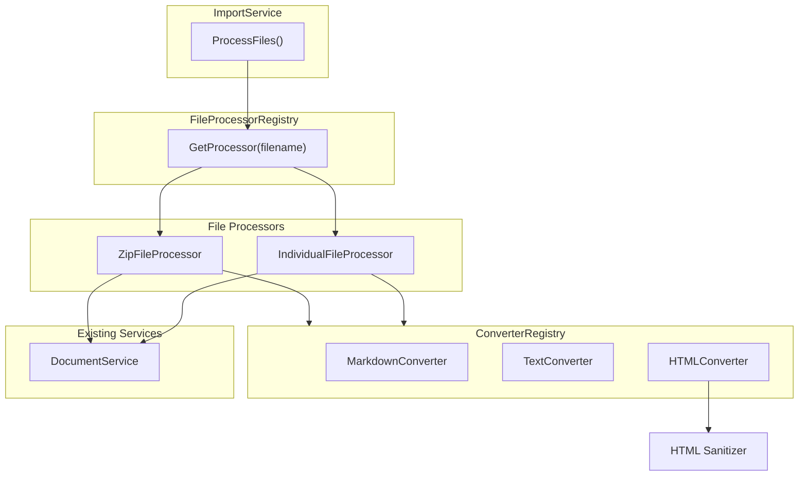

# Import Pipeline

Bulk document import from uploaded files (zip archives or individual files). Strategy pattern routes each file to the appropriate processor; converter registry handles format conversion to markdown.

## Architecture



## ImportService

Thin orchestrator — iterates uploaded files, finds the right processor, aggregates results. Authorization checked once at entry.

**Location:** `service/docsystem/import.go`

**Partial failure tolerance:** A single file failure does NOT halt the batch. Each file is processed independently; errors are collected in `ImportResult.Errors` for the frontend to display. This allows "8 of 10 files imported" scenarios.

Two entry points from handlers:
- **Merge** (`POST /api/import`) — upsert: create new, optionally update existing
- **Replace** (`POST /api/import/replace`) — `DeleteAllDocuments()` first, then import

`DeleteAllDocuments()` calls `DocumentStore.DeleteAllByProject()` with `skipSystemFolders=true` to preserve `.meridian/` and `.agents/`.

## FileProcessorRegistry

Strategy pattern with first-match routing. Thread-safe (RWMutex).

**Location:** `service/docsystem/file_processor_registry.go`

Registration order matters — `ZipFileProcessor` registered before `IndividualFileProcessor` so `.zip` files match first. OCP-compliant: new file types added by implementing `FileProcessor` and calling `Register()`.

```go
// Registration order (from app bootstrap):
registry.Register(NewZipFileProcessor(...))
registry.Register(NewIndividualFileProcessor(...))
```

`GetProcessor(filename)` iterates processors, returns first where `CanProcess(filename)` is true. Returns `nil` for unsupported files (counted as skipped).

## ZipFileProcessor

Extracts zip contents, preserving folder structure.

**Location:** `service/docsystem/zip_file_processor.go`

### Processing Flow

1. Read entire zip into memory
2. Build dedup map: fetch all existing docs, compute `path|filename` lookup keys
3. For each zip entry:
   - Skip directories
   - Skip ignored paths (see filter list below)
   - Skip unsupported extensions
   - Convert content via `ConverterRegistry`
   - Check dedup map → create, update, or skip
4. Create/update via `DocumentService` (reuses path notation, word count, etc.)

### Ignored Path Filter

Defense-in-depth — frontend filters these too, but the backend re-filters for direct zip uploads (`service/docsystem/zip_file_processor.go:20-44`):

| Category | Patterns |
|----------|----------|
| System namespaces | `.meridian`, `.agents` |
| Version control | `.git`, `.svn`, `.hg` |
| macOS artifacts | `__MACOSX`, `.DS_Store`, `.AppleDouble` |
| Windows artifacts | `Thumbs.db`, `desktop.ini` |
| Dependencies | `node_modules`, `.venv`, `venv`, `__pycache__` |
| IDE | `.vscode`, `.idea` |
| Security | `.env*` (prefix match) |

Matching is per-segment — any path segment matching a pattern triggers skip.

### Dedup Strategy

Pre-fetches all project documents once (O(1) lookup per file vs O(n) query). Lookup key format: `"path|filename"` using pipe separator (safe because doc names can't contain pipes).

When a match exists: `overwrite=true` updates content, `overwrite=false` skips.

## IndividualFileProcessor

Handles single file uploads (non-zip). Same create/update/skip logic as ZipFileProcessor.

**Location:** `service/docsystem/individual_file_processor.go`

**Performance note:** `findExistingDocument()` scans ALL project documents per file (O(n)). Acceptable for single-file uploads but not ideal for batch individual imports. The zip processor avoids this by pre-fetching once.

`CanProcess()` delegates to `ConverterRegistry.GetConverter(ext)` — if a converter exists for the extension, the file can be processed.

## ConverterRegistry

Maps file extensions to `ContentConverter` implementations. Thread-safe (RWMutex).

**Location:** `service/docsystem/converter/registry.go`

Pre-registered converters:

| Converter | Extensions | Behavior |
|-----------|-----------|----------|
| `MarkdownConverter` | `.md`, `.markdown` | Pass-through (already markdown) |
| `TextConverter` | `.txt` | Wrap in code fence or pass as-is |
| `HTMLConverter` | `.html`, `.htm` | Convert HTML to markdown + sanitize |

Extension lookup is case-insensitive. The registry also provides `Convert(ctx, filename, content)` which auto-selects the converter by extension.

### HTML Sanitizer

HTML imports pass through a sanitizer (`service/docsystem/converter/sanitizer/`) that strips XSS vectors before conversion. Defense-in-depth since content is stored as markdown, but protects against re-rendering raw HTML in the editor.

## Path Utilities

Shared helpers in `service/docsystem/pathutils.go`:

| Function | Purpose |
|----------|---------|
| `BuildFullPath(folderPath, docName)` | Construct display path: `"chapters" + "intro"` → `"chapters/intro"` |
| `BuildLookupKey(path, name)` | Dedup key: `"chapters/intro\|intro"` (pipe separator) |
| `SanitizeDocName(name)` | Replace `/` with `-` in document names during import |

## Import Result Model

Every processor returns `ImportResult` with:

| Field | Type | Purpose |
|-------|------|---------|
| `Summary.Created` | int | New documents created |
| `Summary.Updated` | int | Existing documents updated (overwrite mode) |
| `Summary.Skipped` | int | Duplicates skipped or unsupported files |
| `Summary.Failed` | int | Files that errored during processing |
| `Summary.TotalFiles` | int | Total files attempted |
| `Errors` | `[]ImportError` | Per-file error details |
| `Documents` | `[]ImportDocument` | Per-file results with action taken |

Results aggregate across processors when multiple files are uploaded in one request.
