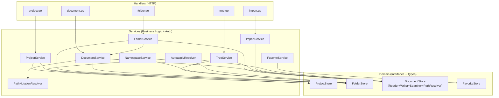
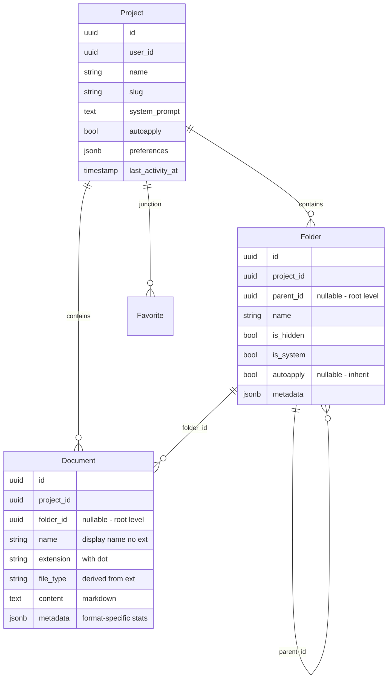
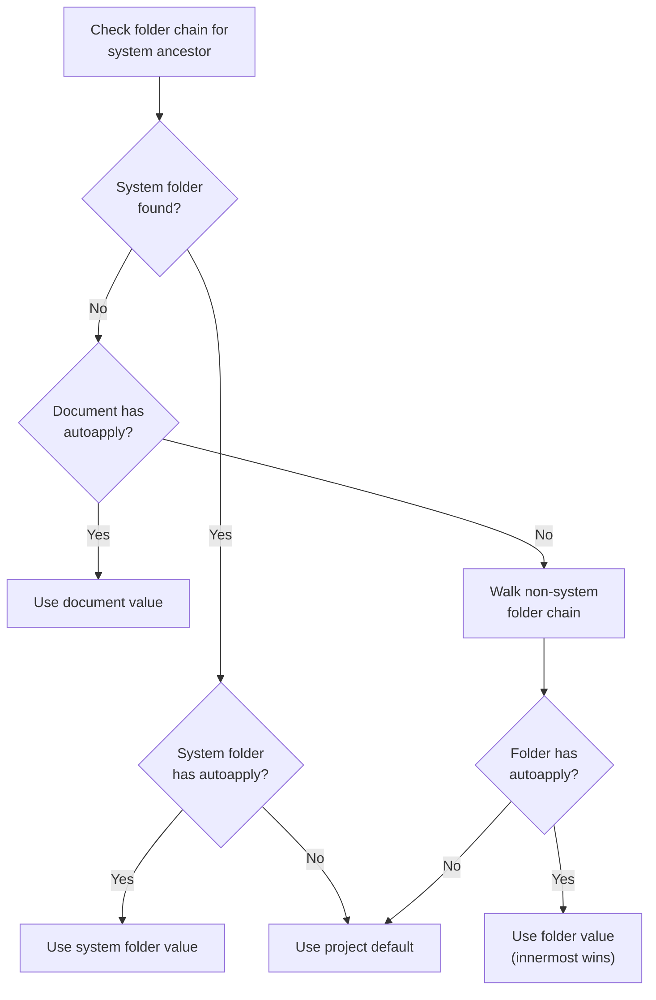

# Docsystem Overview

Document management foundation — projects, folders, documents with hierarchical tree structure. Provides the file-system metaphor that writers interact with.

## Architecture

**Key design decisions:**

- **Authorization lives in the service layer**, not handlers. Every service method that takes `userID` calls `ResourceAuthorizer` before operating. This keeps handlers thin (parse request, call service, format response) and ensures authorization can't be bypassed by adding a new handler.
- **Paths are computed on-the-fly**, not stored. Documents and folders have no `path` column — `GetPath()` walks the folder hierarchy at read time. Avoids cascade updates when folders are renamed/moved. Tradeoff: extra DB reads per request, acceptable at current scale.
- **Soft delete for projects only**. Projects set `deleted_at`; folders and documents are hard-deleted. No restore API yet.

## Domain Model

| Field | Why it's shaped this way |
|-------|-------------------------|
| `Document.Name` + `Extension` | Allows same name with different extensions in one folder. Uniqueness: `(project_id, folder_id, name, extension)`. |
| `Document.FileType` | Derived from extension via `FileTypeFromExtension()` but stored explicitly for query filtering. |
| `Document.Metadata` | JSONB map with namespaced stats: `{"markdown": {"wordCount": 1500}}`. Only markdown-family files get word count. |
| `Document.Path` | **Not stored.** Computed field populated by `GetPath()` at read time. |
| `Project.Slug` | URL-friendly identifier, unique per user. Regenerated when name changes (mutable slugs). |
| `Project.Autoapply` | Default `true` on creation. Controls whether AI suggestions auto-apply to documents. |
| `Folder.IsSystem` | Immutable root-level folders (`.meridian`, `.agents`). Cannot be renamed, moved, or deleted. |
| `Folder.IsHidden` | Excluded from default tree views. System folders are also hidden. |

## ISP Interface Splits

DocumentStore is split into four narrow interfaces — consumers depend on the narrowest one they need.

| Interface | Methods | File |
|-----------|---------|------|
| `DocumentReader` | `GetByID`, `GetByIDOnly`, `GetByPath`, `ListByFolder`, `GetAllMetadataByProject` | `domain/docsystem/document_reader.go` |
| `DocumentWriter` | `Create`, `Update`, `Delete`, `DeleteAllByProject` | `domain/docsystem/document_writer.go` |
| `DocumentSearcher` | `SearchDocuments` | `domain/docsystem/document_searcher.go` |
| `DocumentPathResolver` | `GetPath` | `domain/docsystem/path_resolver.go` |
| `DocumentStore` | Composite embedding all four | `domain/docsystem/document_store.go` |

**Convention:** `GetByID(id, projectID)` requires project scoping for ownership verification. `GetByIDOnly(id)` skips it — used internally when authorization is already handled by `ResourceAuthorizer`.

## File Types

Extension-based type system. Map in `domain/docsystem/file_type.go:26-33`.

| FileType | Extensions | Text-based | Word count |
|----------|-----------|------------|------------|
| `markdown` | `.md`, `.markdown`, `.txt` | Yes | Yes |
| `excalidraw` | `.excalidraw` | No | No |
| `mermaid` | `.mmd`, `.mermaid` | Yes | No |
| `skill` | (no ext mapping) | Yes | No |
| `agent` | (no ext mapping) | Yes | No |
| `tool` | (no ext mapping) | Yes | No |
| `image` | (no ext mapping) | No | No |
| `pdf` | (no ext mapping) | No | No |

Unknown extensions default to `markdown`. Only markdown-family extensions get word count in metadata.

`IsTextBasedFileType()` controls whether content is stored in the DB TEXT column vs future S3 storage.

## Service Layer

| Service | Responsibilities | Key dependencies |
|---------|-----------------|------------------|
| `DocumentService` | CRUD + search + path notation + word count | `DocumentStore`, `FolderStore`, `PathNotationResolver`, `ContentAnalyzer`, `ResourceAuthorizer` |
| `FolderService` | CRUD + recursive delete + duplicate checking | `FolderStore`, `DocumentService` (for SRP delegation), `PathNotationResolver`, `ResourceAuthorizer` |
| `ProjectService` | CRUD + slug generation + system folder creation | `ProjectStore`, `FolderStore`, `TransactionManager` |
| `TreeService` | Build nested hierarchy from flat DB data | `FolderStore`, `DocumentStore`, `ResourceAuthorizer` |
| `ImportService` | Bulk file processing with partial failure tolerance | `DocumentStore`, `FileProcessorRegistry`, `ResourceAuthorizer` |
| `NamespaceService` | Path normalization + namespace routing | `FolderStore` |
| `FavoriteService` | User-project favorites (idempotent add/remove) | `FavoriteStore`, `ProjectStore` |

**Cross-service dependency:** `FolderService` depends on `DocumentService` for recursive folder deletion. When a folder is deleted, `deleteDescendants()` calls `DocumentService.DeleteDocument()` for each document — this delegates deletion responsibility to the service that owns document lifecycle (SRP).

## Tree Building

4-pass algorithm in `service/docsystem/tree.go`:

1. **Index** — Create `TreeFolder` nodes, build `folderMap[id]*TreeFolder`
2. **Paths** — Compute folder paths by walking parent chains (bottom-up)
3. **Nest** — Connect children to parents via `folderMap` lookups
4. **Documents** — Place documents in their parent folders, compute document paths

Default behavior excludes hidden/system folders and their documents. `TreeOptions.IncludeHidden` overrides for internal use (e.g., agent tools that need `.agents/` visibility).

The tree returns `ProjectTree` — a service-layer model with no JSON tags. Handler layer maps it to transport DTOs.

## System Folders

Created automatically in a transaction when a project is created (`service/docsystem/project.go:70-83`):

| Folder | Namespace | System | Autoapply |
|--------|-----------|--------|-----------|
| `.meridian` | `NamespaceMeridian` | Yes | `nil` (inherit project) |
| `.agents` | `NamespaceAgents` | Yes | `false` (review-gated) |

System folders (`is_system=true`) are immutable — `FolderService.UpdateFolder()` and `DeleteFolder()` reject operations on them. Root-level creation of reserved names (`.meridian`, `.session`, `.agents`) is blocked in `CreateFolder()`.

## Autoapply Resolution

Determines whether AI suggestions auto-apply to a document. Walks an inheritance chain with system folder override semantics (`service/docsystem/autoapply_resolver.go`):

**Why system folders override everything:** `.agents/` is `autoapply=false` so agent profile edits always go through review, regardless of nested folder or document overrides. This prevents accidental auto-application of changes to agent configurations.

## Search

PostgreSQL full-text search via `websearch_to_tsquery`. Currently only `SearchStrategyFullText` implemented; vector and hybrid are defined but return errors.

| Config | Default | Notes |
|--------|---------|-------|
| Strategy | `fulltext` | Only implemented strategy |
| Fields | `[name, content]` | Name weighted 2.0x in ranking |
| Language | `english` | 17 languages supported via PG FTS configs |
| Limit | 20 | Max 100 |
| Scope | Per-project (required) | Cross-project search not yet supported |

Search happens at the store layer; the service adds authorization check and path computation for results.

## Content Storage

All text-based file types store content in a `TEXT` column. Markdown content is the single source of truth — the frontend handles markdown-to-editor conversion. Word count is computed server-side by `ContentAnalyzer` (strips markdown syntax, counts whitespace-delimited tokens) and stored in `metadata.markdown.wordCount`. Recomputed on every create/update.

## Sub-topics

- [Path Resolution](path-resolution.md) — PathNotationResolver, NamespaceService, folder path parsing
- [Import Pipeline](import-pipeline.md) — FileProcessorRegistry, zip/individual processors, content converters
