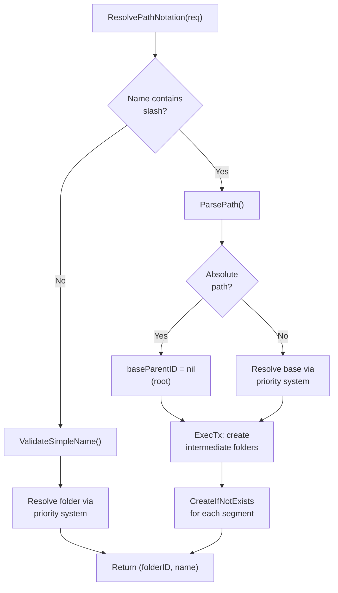

# Path Resolution

Two complementary systems: **PathNotationResolver** parses Unix-style path notation in API requests, **NamespaceService** normalizes paths and routes them to namespace-specific storage.

## PathNotationResolver

Handles folder resolution when creating/updating documents and folders. Unified entry point that replaces what would otherwise be scattered path-handling logic in each service method.

**Location:** Interface at `domain/docsystem/path_resolver.go`, implementation at `service/docsystem/path_resolver.go`.

### Priority-based Folder Resolution

Every create/update request can specify a target folder three ways. The resolver applies a strict priority:

| Priority | Input | Behavior |
|----------|-------|----------|
| 1 | `folder_id` | Use directly (no resolution needed) |
| 2 | `folder_path` | Resolve path to folder ID, creating intermediates |
| 3 | Neither | Root level (`nil`) |

### Path Notation in Names

Document/folder names can contain Unix-style paths. When the name contains `/`, path notation parsing activates:

| Input | Absolute? | Parent folders created | Final name | Base folder |
|-------|-----------|----------------------|------------|-------------|
| `"Chapter 1"` | No | None | `Chapter 1` | From priority system |
| `"Characters/Aria"` | No | `Characters` | `Aria` | Relative to priority-resolved folder |
| `"/Books/Vol1/Ch1"` | Yes | `Books`, `Vol1` | `Ch1` | Root (ignores folder_id/folder_path) |

**Implementation flow** (`service/docsystem/path_resolver.go:120-221`):



### Path Parsing

`ParsePath()` in `service/docsystem/path_parser.go` performs strict validation:

- No consecutive slashes (`a//b` → error)
- No trailing slash (`a/` → error)
- Each segment: alphanumeric, spaces, hyphens, underscores only
- Each segment within max length
- Returns `PathParseResult{Segments, IsAbsolute, FinalName, ParentPath}`

Intermediate folders are created via `FolderStore.CreateIfNotExists()` inside a transaction — idempotent, won't fail if folder already exists.

### ResolveFolderPath

Simpler variant used when only a folder path string needs resolution (no name parsing). Splits on `/`, creates each segment with `CreateIfNotExists()` in a transaction. Used by `UpdateDocument` when `folder_path` is provided for moving documents.

**Location:** `service/docsystem/path_resolver.go:31-76`

## NamespaceService

Handles path normalization and namespace detection. Not directly called during CRUD — used by tools/agents that work with paths.

**Location:** Interface at `domain/docsystem/namespace_service.go`, implementation at `service/docsystem/namespace.go`.

### Namespaces

| Namespace | Prefix | Folder type | Purpose |
|-----------|--------|-------------|---------|
| `NamespaceWorkspace` | (none) | Regular | User's documents |
| `NamespaceMeridian` | `.meridian` | System | Internal config/skills |
| `NamespaceSession` | `.session` | Virtual | Ephemeral storage |
| `NamespaceAgents` | `.agents` | System | Agent profiles (review-gated) |

### NormalizePath Rules

Applied in order (`service/docsystem/namespace.go:49-77`):

1. Trim whitespace
2. Reject null bytes
3. Remove leading `/`
4. Reject `..` segments (path traversal prevention)
5. Collapse multiple `/` to single
6. Trim trailing `/`

Empty string after normalization = root. Valid.

### ParsePath

Extracts namespace by checking the first path segment against known namespace prefixes. Only root-level matches count — `foo/.meridian/bar` is **not** in the `.meridian` namespace.

```
".meridian/skills/foo/SKILL.md" → (NamespaceMeridian, "skills/foo/SKILL.md")
"Characters/Aria.md"           → (NamespaceWorkspace, "Characters/Aria.md")
```

### Folder Materialization

`EnsureMeridianFolder()` and `EnsureMeridianSubfolder()` create the physical folders for the `.meridian` namespace. Both are marked **deprecated** — retained until skills migrate off `.meridian`. System folder creation now happens in `ProjectService.CreateProject()` via `CreateSystemIfNotExists()`.

## DocumentPathResolver

Separate from PathNotationResolver — this resolves the *display path* for an existing document by walking its folder hierarchy.

**Location:** Interface at `domain/docsystem/path_resolver.go:14-16`, implemented by the repository layer (not the service).

Called after every create/update/get to populate the computed `Document.Path` field. Falls back to `doc.Filename()` if path computation fails (non-fatal).

## Folder Path Validation

`ValidateFolderPath()` in `service/docsystem/path_resolver.go:79-117` validates folder path strings from API input:

| Rule | Example violation |
|------|-------------------|
| Max length `config.MaxDocumentPathLength` | Very long path |
| No leading/trailing `/` | `/foo/` |
| No consecutive `/` | `foo//bar` |
| Alphanumeric + space/hyphen/underscore/dot/slash only | `foo@bar` |
| No `.` or `..` as complete segment names | `foo/../bar` |

## Reserved Root Folder Names

User-created folders at root level cannot use namespace names. Enforced in `FolderService.CreateFolder()` (`service/docsystem/folder.go:22,108`):

- `.meridian`
- `.session`
- `.agents`

This prevents collisions with system-managed namespace folders.
