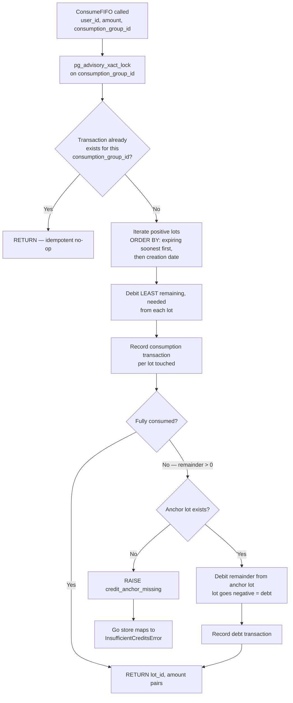
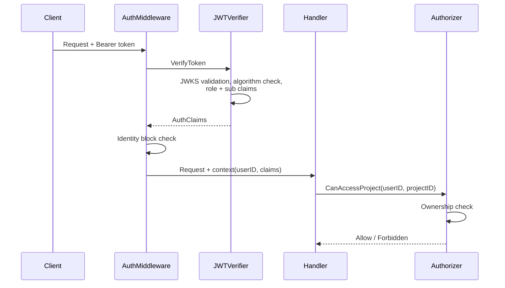

# Foundation Systems

Backend infrastructure layer: error handling, billing/credits, Stripe integration, tool execution, and authentication.

---

## Error System

Two error systems coexist — a deliberate transitional state, not tech debt.

### New: `DomainError` (v1 API conditions)

`backend/internal/domain/errors/errors.go:18` — struct with `{Code, Status, Message, Detail}`.

**Design decision:** Constructor functions own the HTTP status so callers never choose it. This eliminates status-mapping bugs across handlers — a `SpawnDepthExceeded` is always 429, not whatever the handler author thinks is right.

Codes live in `codes.go` grouped by domain area:

| Group | Codes | HTTP Status |
|-------|-------|-------------|
| Work item lifecycle | `WORK_ITEM_DONE`, `WORK_ITEM_DELETED`, `WORK_ITEM_HAS_ACTIVE_STREAMS` | 409 |
| Persona/Skill | `PERSONA_NOT_FOUND`, `PERSONA_INVALID`, `SKILL_NOT_FOUND`, `SKILL_INVALID` | 422 (404 for skill) |
| Spawn/Concurrency | `SPAWN_DEPTH_EXCEEDED`, `SPAWN_LIMIT_EXCEEDED` | 429 |
| Access control | `NAMESPACE_ACCESS_DENIED`, `PATH_TRAVERSAL_DENIED` | 403 |
| Payload | `CONTEXT_BUDGET_EXCEEDED` | 413 |
| Import | `IMPORT_VALIDATION_FAILED` | 422 |

**Why 422 for `PersonaNotFound` instead of 404?** The slug is syntactically valid but references a non-existent persona. 404 is reserved for missing HTTP resources (routes), not missing domain references within a valid request.

### Legacy: typed sentinel errors

`backend/internal/domain/errors.go` — `*NotFoundError`, `*ValidationError`, `*InsufficientCreditsError`, etc. Used by most repository/service flows. Produces RFC 7807 Problem Details (`application/problem+json`).

### Response envelope difference

Handlers detect `*DomainError` via `errors.As` first (`backend/internal/handler/helpers.go:97`):
- **New path:** `{code, message, detail}` via `RespondJSON`
- **Legacy path:** RFC 7807 `{type, title, status, detail}` via `RespondError`

Clients must handle both shapes until the legacy path is fully migrated.

### Error flow: repo → service → handler → HTTP

1. **Repository** emits typed domain error or wraps infra error
2. **Service** validates, translates (e.g., `OwnerBasedAuthorizer` rewrites not-found → forbidden to prevent existence leaks — `owner_authorizer.go:52`)
3. **Handler** calls `handleError` which maps to HTTP status/shape

---

## Billing & Credits

### Accounting model

Unit is **millicredits** (`int64`) everywhere — balances, transactions, lots. Why millicredits? `1 credit = $0.01 = 1,000 millicredits = 10,000 microusd`. Sub-cent precision for token-based billing without floating point.

`backend/internal/domain/billing/types.go`

| Type | Fields | Purpose |
|------|--------|---------|
| `CreditBalance` | total, promotional, purchased, debt (all millicredits) | Per-user balance view |
| `CreditLot` | original/remaining millicredits, source type, expiry | Source-of-truth balance row |
| `CreditTransaction` | type, amount, lot_id, consumption_group_id | Audit ledger row |

**Source types:** `purchase` (Stripe) vs `grant` (monthly refresh).

**Transaction types:** `purchase`, `grant`, `consumption`, `expiration`, `refund`.

### Credit packs (SKU catalog)

`backend/internal/domain/billing/pricing.go:27` — backend-authoritative, not client-defined:

| Pack | Price | Credits | Bonus |
|------|-------|---------|-------|
| Starter | $10 | 1,000 | 0 |
| Writer | $25 | 2,800 | 300 |
| Novelist | $50 | 6,000 | 1,000 |

Monthly grant: 100 credits (100,000 millicredits), expires in 60 days. Purchased credits expire in 365 days.

### Schema invariants

`backend/migrations/00030_billing_credit_system.sql` enforces:
- **Mutually exclusive** purchase/grant fields on `credit_lots` (CHECK constraint)
- **Idempotency:** unique `stripe_session_id` (purchases), unique `(user_id, grant_reason)` (monthly grants)

### FIFO credit consumption

SQL function `consume_credit_lots_fifo()` at `00030_billing_credit_system.sql:113`.

**Why SQL instead of Go?** The entire consume-debit-record cycle must be atomic. Doing it in application code would require explicit serializable transactions and retry loops. The SQL function gets atomicity for free within a single function call.

**Key design decisions:**
- **Advisory lock** on `consumption_group_id` prevents TOCTOU races — two concurrent calls both passing the idempotency check before either inserts
- **Spend order:** expiring lots first (use-it-or-lose-it), then non-expiring by creation date
- **Overspend into debt** rather than hard-reject — the generation already happened, refusing to record it would create phantom usage. Anchor lot goes negative.
- **Idempotency:** if a transaction already exists for the `consumption_group_id`, function returns silently — safe to retry

### Credit gate middleware

`backend/internal/middleware/credit_gate.go` — early admission check on `POST /api/turns`. Calls `CreditAdmissionChecker.CheckAdmission` before the request reaches the handler. Returns 402 with `balance_millicredits`, `required_millicredits`, `shortfall_millicredits` so the client can show a meaningful error.

**Why a separate middleware instead of checking in the handler?** Fail fast before allocating streaming resources. The handler sets up SSE connections, goroutines, and LLM provider calls — all wasted if the user can't pay.

---

## Stripe Integration

### Webhook flow

`POST /api/billing/webhooks/stripe` — `backend/internal/handler/billing.go:121`

Auth middleware explicitly bypasses this path (`middleware/auth.go:26`) because Stripe authenticates via webhook signature, not JWT.

**Events handled** (`backend/internal/domain/billing/stripe.go:9`):

| Event | Action |
|-------|--------|
| `checkout.session.completed` | Create purchase lot + transaction |
| `charge.refunded` | Expire lot, record refund transaction |
| `charge.dispute.created` | Same as refund (treat disputes as refunds) |

### Checkout completion flow

`backend/internal/service/billing/credit_service.go:168`

1. Retrieve **authoritative** session from Stripe API (never trust webhook payload alone)
2. Validate: payment mode is `paid`, metadata contains `user_id` + `pack_id`, amount matches backend pack catalog exactly
3. Persist purchase lot with expiration + purchase transaction

**Why re-fetch from Stripe?** Webhook payloads can be replayed or tampered in transit. The Stripe API call is the source of truth for payment status.

### Idempotency (multi-layer)

| Layer | Mechanism | Location |
|-------|-----------|----------|
| Purchase insert | `ON CONFLICT DO NOTHING` on unique `stripe_session_id` | `credit_store.go:152` |
| Refund | Check existing `refund` transaction before insert | `credit_store.go:285` |
| FIFO consumption | Advisory lock + `consumption_group_id` existence check | SQL function |
| Settlement | Deterministic `consumption_group_id` = SHA1(namespace, usage_event_id) | `credit_settler.go:63` |

---

## Generation Billing & Settlement

`backend/internal/service/billing/credit_settler.go`

### Cost computation

`backend/internal/domain/billing/pricing.go:114` — `CalculateCreditCost` uses **integer-only math** with ceiling division. No floating point anywhere in the billing path.

Formula: `raw_microusd = ceil(tokens * microusd_per_1k / 1000)` per token type, then `marked = ceil(raw * (10000 + markup_bps) / 10000)`, then `millicredits = ceil(marked / 10)`. Minimum 1 millicredit.

**Pricing resolution:** `ModelPricingResolver` looks up per-provider/model pricing from config. Falls back to conservative premium-tier `FallbackModelPricing` on resolution failure — intentionally over-charges rather than under-charges.

### Deterministic IDs

- `usageEventID = "<turnID>:<requestIndex>"` — unique per LLM request within a turn
- `consumptionGroupID = UUID v5(BillingNamespace, usageEventID)` — deterministic, idempotent

`BillingNamespace` (`pricing.go:24`) is a fixed UUID that **must never change** — changing it would break idempotency for in-flight pending settlements by generating different consumption group IDs for the same usage event.

### Write-ahead settlement

`SettleAuthoritativeRequest` (`credit_settler.go:49`):

1. **Write-ahead:** Persist deterministic billing fields (user, amount, IDs) to generation metadata
2. **Consume:** Run FIFO consumption against credit lots
3. **Mark status:** `settled` on success, `pending` on failure

**Why write-ahead?** If the process crashes between computing the cost and consuming credits, the pending settlement can be retried using the persisted fields — no need to re-resolve pricing or re-compute costs.

### Settlement modes

| Mode | When | Path |
|------|------|------|
| `inline_authoritative` | Token counts known at stream end | Settler called immediately |
| `deferred_to_enrichment` | Counts unavailable at stream end | Marked pending, settled by enrichment job |

### Retry & reconciliation

`RetryPendingSettlement` (`credit_settler.go:142`): reloads persisted billing fields, retries FIFO consume. Increments retry count; marks `failed` at `maxSettlementRetries` (5). The enrichment job (`enrich_generation.go:399`) calls `settleIfDeferred` after generation stats finalize.

**Pending query safety:** `generation_billing_store.go:259` intentionally skips placeholder rows without complete write-ahead data — prevents retrying settlements that never finished their write-ahead phase.

---

## Tool System

### Registry

`backend/internal/service/llm/tools/registry.go` — thread-safe `map[string]ToolWithMetadata` behind `sync.RWMutex`.

Each tool bundles an `Executor` and `Metadata` (description + guideline for system prompt generation). Tools self-describe via metadata (OCP — adding a tool doesn't modify the registry).

**Execution:** Single-call via `Execute`, parallel via `ExecuteParallel` (goroutines, pre-allocated results slice preserves call order by index, context cancellation support).

`Prune` removes tools post-registration — used by persona policy to enforce least-privilege tool sets.

### Builder pattern

`backend/internal/service/llm/tools/builder.go` — `ToolRegistryBuilder` composes per-request tool sets via fluent API.

**Why per-request composition?** Different threads have different capabilities. A thread with a work item gets `spawn_agent`; one without doesn't. A persona may deny `web_search`. The builder assembles exactly the right tool set for each context.

Composition stages (order matters for `WithPersonaToolFilter`):

| Stage | Method | Gate condition |
|-------|--------|----------------|
| Namespace routing | `WithNamespaceService` | Always |
| Mutation strategy | `WithMutationStrategy` | Always (panics if nil) |
| Work item isolation | `WithWorkItemSlug` | Thread linked to work item |
| Document tools | `WithEnabledDocumentTools` | Frontend-controlled enable list |
| Web search | `WithWebSearch` | Valid `SearchClient` provided |
| Spawn | `WithSpawnTool` | `spawnInvoker != nil` AND `workItemID != ""` |
| Skills | `WithEnabledSkillTools` | `skillResolver != nil` |
| Persona filter | `WithPersonaToolFilter` | Allow/deny lists from persona config |

**Architectural boundary:** Tools package depends on service interfaces, not repositories (`builder.go:10` comment). ISP interfaces like `ProposalCreator` and `ProposalBroadcaster` (`mutation_strategy_collab.go:15-24`) keep the dependency graph clean.

### Text editor — mutation strategies

`backend/internal/service/llm/tools/text_editor.go` — unified `str_replace_based_edit_tool` supporting `view`, `str_replace`, `insert`, `create`.

The tool delegates persistence to a `DocumentMutationStrategy`:

| Strategy | Behavior |
|----------|----------|
| `CollabProposalStrategy` | Converts text diff → Yjs update, creates proposal, broadcasts accepted/pending WS events |
| (Direct — future) | Direct document write without proposal |

**Why strategy pattern?** Collab mode requires Yjs CRDT integration and real-time broadcasting. Non-collab contexts (batch processing, imports) shouldn't pay that complexity cost. The strategy boundary keeps the text editor tool itself simple.

### Namespace isolation (write path)

`text_editor.go:518` — `checkEditNamespaceAccess` enforces write boundaries:

| Path pattern | Rule | Why |
|-------------|------|-----|
| `.meridian/work/<slug>/` | Only current `workItemSlug` | Prevent cross-work-item data leaks |
| `.meridian/fs/` | Any thread allowed | Shared filesystem namespace |
| `.agents/` | Allowed | Review-gated via folder autoapply |
| `.meridian/<other>` | Denied | System internals |
| `.session/` | Denied | Ephemeral, no persistence |
| Everything else | Allowed | User workspace |

**Canonicalization order is critical:** `filepath.Clean` runs before prefix matching, then raw `..` segments are rejected on the original path. This prevents `.meridian/work/slug/../../other/secret` from bypassing namespace detection after canonicalization.

Errors become structured `DomainError` tool results with codes (`PATH_TRAVERSAL_DENIED`, `NAMESPACE_ACCESS_DENIED`).

### Skill invoke tool

`backend/internal/service/llm/tools/skill_invoke.go`

**Source of truth:** `.agents/skills/<slug>/SKILL.md` — file-only, no DB fallback (`backend/internal/domain/agents/interfaces.go:13`).

Resolution: `fileSkillResolver` (`backend/internal/service/agents/skill_resolver.go:66`) reads the document, parses YAML frontmatter. Returns `SKILL_NOT_FOUND` (missing file) or `SKILL_INVALID` (bad frontmatter) — no silent fallback.

**Invocability gate:** `skill_invoke` checks `DisableModelInvocation` unless the invocation is an explicit user slash command (`skill_invoke.go:125`). Skills with `disable-model-invocation: true` in their frontmatter can only be triggered by the user via `/skill-name`, not by the LLM.

Execution: parses `skill_name` + optional `arguments`, resolves skill, substitutes `$ARGUMENTS` placeholder in skill content.

### Web search and thread context

`web_search` tool (`web_search.go:50`) — provider-agnostic via `SearchClient` interface. Tavily implementation (`external/tavily_client.go:50`). Supports `topic` filter: `general`, `news`, `finance`.

**Thread context propagation:** Streaming executor injects `threadID/turnID/userID` into Go context before parallel tool execution (`streaming/tool_executor.go:118`). Tools extract this for provenance tracking (`tools/thread_context.go:18`).

`doc_search` denies `.meridian/` and `.session/` namespaces (`search.go:80`) — same isolation principle as the write path, but for reads.

---

## Authentication

### Supabase JWT flow

### Middleware

`backend/internal/middleware/auth.go` — global `AuthMiddleware` extracts Bearer token, verifies JWT, injects user ID + claims into request context.

**Excluded paths:** `/health`, Stripe webhook, WebSocket entrypoints (collab WS uses JWT-in-first-message instead of Authorization header).

### JWT verification

`backend/internal/auth/jwt_verifier.go` — `SupabaseJWTVerifier` using JWKS (`keyfunc` library with automatic cache refresh).

**Security measures:**
- Algorithm allowlist: only `RS256` and `ES256` (prevents algorithm confusion attacks — `jwt_verifier.go:65`)
- Requires `sub` claim (user ID)
- Requires `role = "authenticated"` (rejects anonymous Supabase tokens)
- Requires `exp` claim
- Failed parse logged at DEBUG (not ERROR) to avoid noisy logs and accidental PII exposure

### Authorization model

`backend/internal/service/auth/owner_authorizer.go` — ownership-based, not role-based.

Resource access is derived by walking up to the project: document → project → owner check, thread → project → owner check, turn → thread → project → owner check.

**Security:** `CanAccessProject` rewrites not-found → forbidden (`owner_authorizer.go:52`) to prevent project existence leaks. If a project doesn't exist OR the user doesn't own it, the response is identical (403).

**Extensibility points** noted in code comments (`owner_authorizer.go:17`): `RoleBasedAuthorizer`, `PermissionBasedAuthorizer`, `SharingAuthorizer` — not implemented, but the interface boundary is ready.

### Auth initialization

`POST /api/auth/initialize` — called on login. Triggers monthly credit grant via `CreditGranter` (`credit_granter.go:40`). Skips grant if email unverified. Monthly grant idempotency keyed by `monthly_refresh_YYYY_MM` (`credit_granter.go:77`).

---

## File Reference Index

| Area | Key files |
|------|-----------|
| Domain errors | `internal/domain/errors/{errors,codes}.go` |
| Legacy errors | `internal/domain/errors.go` |
| Error rendering | `internal/handler/helpers.go` |
| Billing types | `internal/domain/billing/types.go` |
| Pricing/cost | `internal/domain/billing/pricing.go` |
| FIFO SQL | `migrations/00030_billing_credit_system.sql` |
| Credit store | `internal/repository/postgres/billing/credit_store.go` |
| Settlement | `internal/service/billing/credit_settler.go` |
| Stripe service | `internal/service/billing/credit_service.go` |
| Credit gate | `internal/middleware/credit_gate.go` |
| Tool registry | `internal/service/llm/tools/registry.go` |
| Tool builder | `internal/service/llm/tools/builder.go` |
| Text editor | `internal/service/llm/tools/text_editor.go` |
| Mutation strategy | `internal/service/llm/tools/mutation_strategy_collab.go` |
| Skill invoke | `internal/service/llm/tools/skill_invoke.go` |
| Skill resolver | `internal/service/agents/skill_resolver.go` |
| JWT verifier | `internal/auth/jwt_verifier.go` |
| Auth middleware | `internal/middleware/auth.go` |
| Authorizer | `internal/service/auth/owner_authorizer.go` |

All paths relative to `backend/`.
