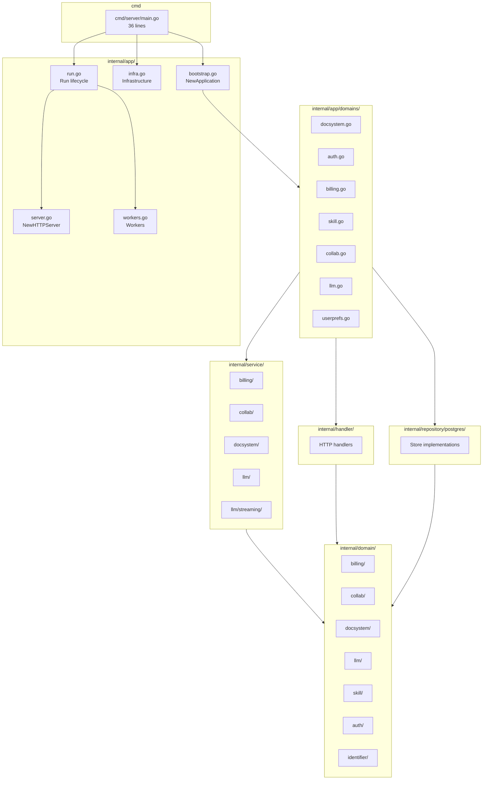
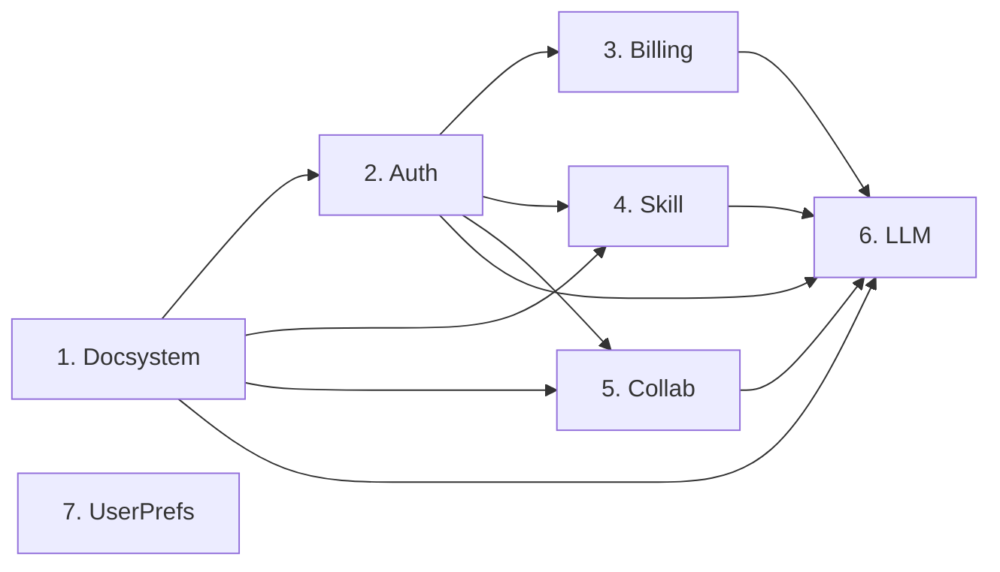
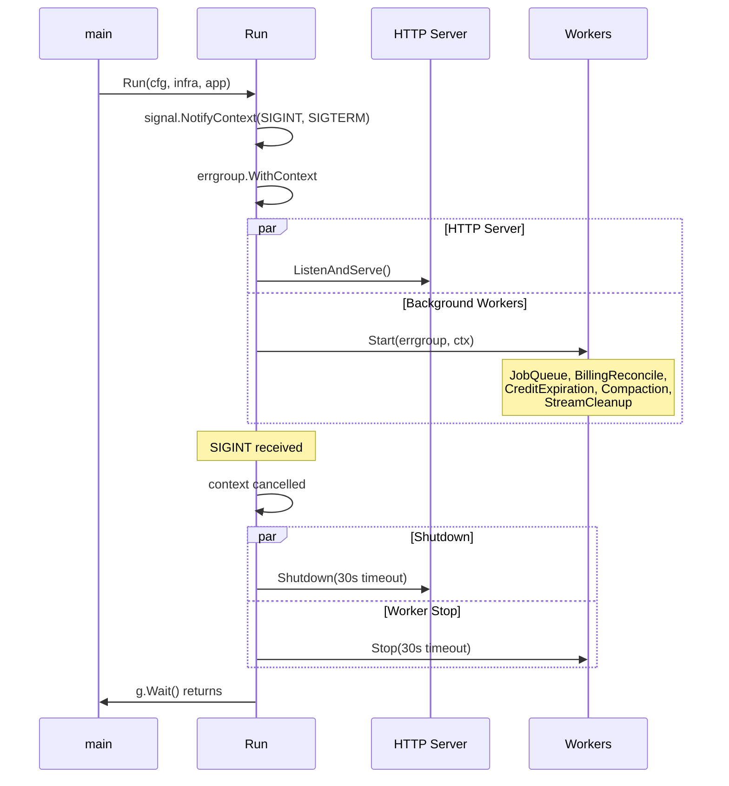

# Backend Architecture

Domain-oriented modules, 36-line `main.go`, lifecycle management via `signal.NotifyContext` + `errgroup`.

## Reference Docs

| Area | Path | Covers |
|------|------|--------|
| Errors | `errors/` | DomainError, sentinel errors, response envelope |
| Auth | `auth/` | JWT verification, owner-based authorization |
| Billing | `billing/` | Credit system, Stripe webhooks, settlement |
| Streaming | `streaming/` | 4-stage pipeline, prompt composition, executor, cancellation |
| Tools | `tools/` | Registry, builder, text editor, namespace isolation |
| Collaboration | `collab/` | WebSocket protocol, proposals, Yjs checkpoints |
| Agents | `agents/` | Persona/skill resolution, git import, backfill |
| Work Items | `work-items/` | Lifecycle, spawning, namespace isolation |
| Docsystem | `docsystem/` | Projects, folders, documents, tree, import, path resolution |
| Context | `context/` | Token monitor, compaction, collapsed content |
| Threads | `threads/` | Thread/turn model, branching, message building, provider abstraction |

## Package Dependency Graph



## Layer Rules

| Layer | May import | Must not import |
|-------|-----------|-----------------|
| `cmd/server/` | `internal/app`, `internal/config` | anything else |
| `internal/app/` | `internal/app/domains`, `internal/config`, all implementation packages | -- |
| `internal/app/domains/` | handler, service, repository, domain | other domain modules (use cross-deps structs) |
| `internal/handler/` | domain, httputil | service, repository |
| `internal/service/` | domain, repository interfaces (via DIP) | handler, other services (except via interfaces) |
| `internal/repository/` | domain | handler, service |
| `internal/domain/` | standard library only | any internal package |

## Bootstrap Module Pattern

Each domain module in `internal/app/domains/` follows this pattern:

```go
type XxxModule struct {
    // Exported fields: interfaces needed by other modules or routes
    Service    domain.SomeService
    Handler    *handler.SomeHandler
    // ...
}

func NewXxxModule(infra InfrastructureDeps, cfg *config.Config, deps XxxDeps) (*XxxModule, error) {
    // 1. Create repositories
    // 2. Create services (inject repos + deps)
    // 3. Create handlers (inject services)
    // 4. Return module struct
}

func (m *XxxModule) RegisterRoutes(mux *http.ServeMux) {
    // Register HTTP routes
}
```

Cross-domain dependencies pass as narrow interface structs, not whole module pointers:

```go
type LLMCrossDeps struct {
    AdmissionChecker billing.CreditAdmissionChecker  // not *BillingModule
    CreditSettler    billing.CreditSettler
    MutationStrategy tools.DocumentMutationStrategy
    // ...
}
```

## Module Initialization Order

Determined by dependency edges. Defined in `internal/app/bootstrap.go`:



Two-phase initialization for circular deps:
- `DocsystemModule` created first without authorizer, then `AttachAuthorizer()` called after `AuthModule` creation.
- `AuthModule` created without credit granter, then `AttachCreditGranter()` called after `BillingModule` creation.

## Config Sub-Structs

`internal/config/config.go` -- top-level `Config` with sub-structs:

| Sub-struct | Key fields |
|------------|-----------|
| `ServerConfig` | Port, Environment, CORSOrigins, Debug |
| `DatabaseConfig` | URL, TablePrefix, MaxConns, MinConns |
| `AuthConfig` | SupabaseURL, SupabaseKey, SupabaseJWKSURL, BlockedProdIdentities |
| `LLMConfig` | AnthropicAPIKey, OpenRouterAPIKey, MaxToolRounds, IdleTimeoutSeconds, MaxConcurrentStreams |
| `BillingConfig` | StripeSecretKey, StripeWebhookSecret |
| `LoggingConfig` | Level, ToFile, Dir, MaxFiles |

Pipeline: `Load()` reads env vars -> applies defaults -> validates (panics on invalid).

## Lifecycle Management

`internal/app/run.go` -- structured shutdown via `signal.NotifyContext` + `errgroup`:



Shutdown contract:
- Signal -> root context cancels -> all goroutines receive cancellation
- HTTP server stops accepting, drains in-flight (30s timeout)
- Workers exit their loops, job queue drains
- `http.ErrServerClosed` is non-fatal (expected during shutdown)
- Worker failure -> cancels errgroup -> triggers HTTP shutdown

## Background Workers

`internal/app/workers.go` -- 5 workers registered in errgroup:

| Worker | Interval | Purpose |
|--------|----------|---------|
| Job queue | Continuous | 5-worker pool, 1000-item capacity |
| Billing reconciliation | 15 min | Reconcile deferred settlements via generation stats API |
| Credit expiration | 1 hour | Expire lots past their expiration date |
| Collab compaction | 60s | Merge Yjs update log entries into checkpoints |
| Stream registry cleanup | Continuous | Clean up stale SSE stream entries |

All workers use `select` on context for responsive shutdown -- no `time.Sleep`.

## Infrastructure

`internal/app/infra.go` -- `Infrastructure` struct owns process-level resources:

| Resource | Type | Purpose |
|----------|------|---------|
| `Pool` | `*pgxpool.Pool` | Database connection pool |
| `Tables` | `*postgres.TableNames` | Dynamically prefixed table names |
| `RepoConfig` | `*postgres.RepositoryConfig` | Pool + Tables + Logger bundle |
| `JWTVerifier` | `auth.JWTVerifier` | Supabase JWT validation (JWKS) |
| `Logger` | `*slog.Logger` | Structured JSON logging |

## HTTP Server

`internal/app/server.go` -- middleware chain: CORS -> Recovery -> Auth -> routes.

Timeouts: ReadTimeout 15s, WriteTimeout 0 (SSE), IdleTimeout 60s.

Routes registered per-module via `RegisterRoutes(mux)`. Debug routes (dev only) registered conditionally.
