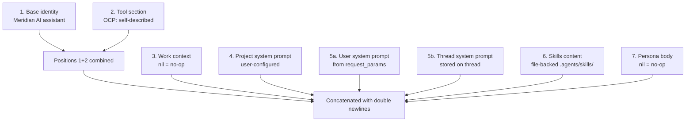
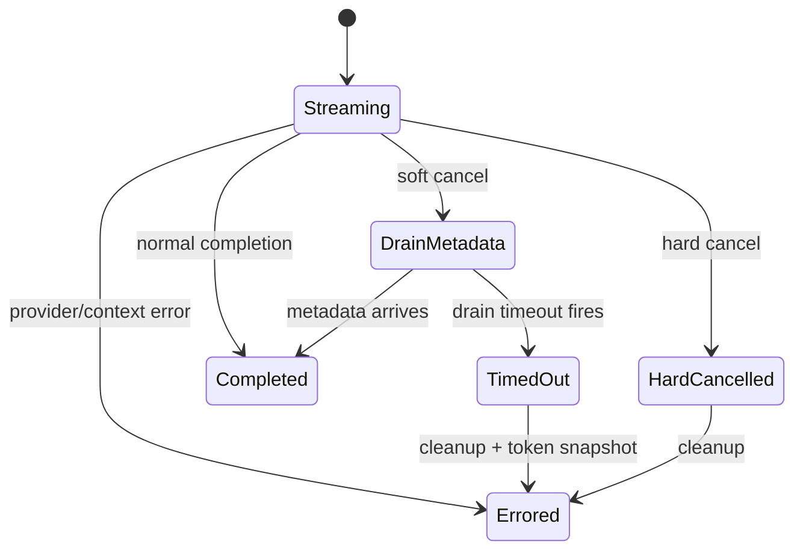

# Streaming Pipeline & Prompt System

LLM turn creation — from HTTP request to background streaming execution. Covers the 4-stage pipeline, system prompt composition, executor state machine, and cancellation model.

## Pipeline Overview

`Service.CreateTurn` orchestrates a strict 4-stage pipeline. Each stage is a method on `turnPipeline`, the per-request mutable state carrier. Stages read/write fields on this struct, making them independently testable.

```mermaid
flowchart LR
    subgraph S1["Stage 1: gatherContext"]
        direction TB
        s1a["Resolve thread<br/>cold/warm start"]
        s1b["Resolve persona"]
        s1c["Model + provider"]
        s1d["Stream slot acquire"]
    end

    subgraph S2["Stage 2: assemblePrompt"]
        direction TB
        s2a["Build temp tool registry"]
        s2b["Generate tool section"]
        s2c["7-position prompt resolve"]
    end

    subgraph S3["Stage 3: persistTurns"]
        direction TB
        s3a["User turn + blocks"]
        s3b["Assistant turn<br/>status=streaming"]
    end

    subgraph S4["Stage 4: launchStream"]
        direction TB
        s4a["Build production registry"]
        s4b["Create StreamExecutor"]
        s4c["Register + start async"]
    end

    S1 --> S2 --> S3 --> S4
```



**File:** `backend/internal/service/llm/streaming/turn_creation.go`

### Why a pipeline?

SRP and testability. Each stage has one concern and one file. Failure at any stage aborts downstream stages immediately. The `turnPipeline` struct carries state explicitly rather than through function arguments, keeping signatures clean while preserving data flow visibility.

### Key invariant: `ctx` is never stored on `turnPipeline`

Go best practice — each stage receives `ctx` as its first parameter. This prevents stale context references when deferred cleanup runs with `context.Background()`.

## Stage 1: gatherContext

**File:** `gather_context.go`

Resolves everything the prompt and executor need: thread identity, persona, project, model/provider, request params, and a stream slot.

### Cold-start vs warm-start

| Path | Trigger | Thread creation |
|------|---------|-----------------|
| Cold start | `project_id` only, no resolvable thread | Created in stage 1 **before** prompt resolution |
| Warm start (thread) | `thread_id` provided | Loaded from DB |
| Warm start (prev turn) | `prev_turn_id` provided | Looked up from turn's `thread_id` |

**Why cold-start creates the thread in stage 1, not stage 3:** The original design created threads inside the persist transaction (stage 3). This meant `assemblePrompt` received `threadID=""` on cold start, breaking the system prompt resolver which requires a valid thread ID to load project/thread prompts. The fix (documented as "R1") moved thread creation earlier. The resolver contract at `system_prompt_resolver.go:60` now guarantees a non-empty `threadID`.

### Persona resolution

When `req.PersonaSlug` is non-nil, stage 1 additionally:

1. Resolves persona via `PersonaCatalog` (422 if not found)
2. Ensures thread has a work item via `EnsureThreadWorkItem`
3. Gates on work item lifecycle (409 if done/deleted)
4. Resolves `WorkContext` for system prompt position 3
5. Applies model/temperature/max_tokens overrides **after** basic resolution, **before** capability filtering

Slug priority: explicit request slug > thread's stored persona slug (warm-start fallback).

### Non-persona turns are completely unaffected

All persona logic is gated on `req.PersonaSlug != nil`. Existing non-persona turns skip the work-item gate, context resolution, and overrides entirely.

### Stream slot ownership

Acquired in stage 1, released by deferred guard on failure. On successful launch, ownership transfers to the executor's cleanup callback (`launch_stream.go:132` sets `p.streamAcquired = false`).

### Capability filtering

`applyModelCapabilities` is intentionally **fail-open** when the model is missing from the capability registry. This preserves availability but risks tool-policy drift if registry coverage lags new models.

## Stage 2: assemblePrompt

**File:** `assemble_prompt.go`

Builds a temporary tool registry, generates the tool section string, and resolves the 7-position system prompt into `params.System`.

### Two tool registries per request

| Registry | Purpose | Lifetime |
|----------|---------|----------|
| Temp (stage 2) | Generate tool section for system prompt | Discarded after prompt build |
| Production (stage 4) | Execute tools at runtime | Lives with executor |

Both apply identical persona filters and work-item slug so prompt-advertised capabilities match runtime-enforced capabilities. The temp registry exists because the tool section must be known before the prompt is assembled, but the production registry needs the executor (which doesn't exist yet).

### Tool section injection path

Tools self-describe via `ToolRegistry.BuildSystemPromptSection()` (OCP compliance). The resolver receives the pre-built string and appends it to base identity at position 1+2. This means tool descriptions are **naturally absent** when a model doesn't support tools.

### Persona skill override

When a persona declares an explicit `Skills` list, it **replaces** (not merges with) the client-provided `selected_skills`. The persona's frontmatter is the complete set.

## System Prompt: 7-Position Composition

**Domain contract:** `backend/internal/domain/llm/system_prompt.go`
**Implementation:** `backend/internal/service/llm/streaming/system_prompt_resolver.go`



| Position | Source | Nil behavior | Error behavior |
|----------|--------|-------------|----------------|
| 1+2 | `baseIdentityPrompt` + `ToolSection` | Always present | -- |
| 3 | `WorkContext` | Empty (no-op) | -- |
| 4 | `project.SystemPrompt` | Skipped | Fatal |
| 5 | `request_params.system` + `thread.system_prompt` | Skipped | Fatal (thread load) |
| 6 | `SkillResolver.Resolve` per skill | Skipped if all fail | Individual: warn-and-continue |
| 7 | `PersonaBody` (`*string`) | Empty (no-op) | -- |

### Design decisions

- **`PersonaBody` is `*string`, not `*agents.Persona`:** Keeps `domain/llm` decoupled from `domain/agents`. Callers pre-render the body.
- **Resolver loads thread as authoritative source** for project ID, even though `projectID` is in context. Thread is the canonical owner.
- **Skill header only emitted when ≥1 skill loads** — prevents the LLM from seeing "you have skills" with no content.
- **Invalid project UUID for skills is non-fatal** — logs error, returns empty skills section.
- **Thread/project load failures are fatal** — prompt resolution cannot proceed without them.

## Stage 3: persistTurns

**File:** `persist_turns.go`

Single transaction: user turn + content blocks + assistant turn (status=`streaming`). Thread creation has already happened in stage 1.

### Orphan thread cleanup

Deferred guard in `CreateTurn`: if a cold-start thread was created but `userTurn` is still nil (persist failed), delete the orphaned thread using `context.Background()` (request context may be cancelled).

### Non-critical metadata

`TouchLastActivityAt` is warn-and-continue — project metadata updates must never fail turn creation.

## Stage 4: launchStream

**File:** `launch_stream.go`

Builds the production tool registry, resolves the LLM provider, creates the `StreamExecutor`, registers everything, and starts background execution.

### Registration ordering (race prevention)

1. Create `StreamExecutor` synchronously (SSE clients may connect immediately)
2. Register stream in mstream registry **before returning response**
3. Set cleanup callback **before** registering executor (prevents lifecycle leak)
4. Register executor for interrupt lookups
5. Start background goroutine with `context.Background()` (outlives HTTP request)

### Background execution sequence

`startStreamingExecution` (background goroutine):

1. Load conversation history via `TurnNavigator.GetTurnPath`
2. Load content blocks for all turns in path
3. Build messages via `MessageBuilder.BuildMessages`
4. Transform @-references into synthetic tool_use/tool_result pairs
5. Call `executor.Start(generateReq)`

### Tool registry capabilities

Production registry includes: document tools, skill tools, spawn tool, and optionally web search (Tavily). Persona tool filter prunes **after** all tools are registered, including web search.

### Billing settlement mode

Provider-dependent: OpenRouter uses deferred enrichment (token stats API query later), Anthropic uses inline authoritative (provider metadata is final).

## StreamExecutor: State Machine

**File:** `stream_executor.go`, `executor_state.go`

The executor is the runtime state machine for one assistant turn. It owns the provider stream loop, tool continuation, cancellation, metadata persistence, billing settlement, and AG-UI event emission.



### Actor pattern

Only the streaming goroutine transitions state. External cancel requests arrive via a buffered `ctrlCh` channel (size 1). This eliminates concurrent state mutation — the streaming goroutine is the sole state owner.

### Event processing loop

`processProviderStream` multiplexes five channels: keepalive ticker (5s), drain timeout, control commands, context cancellation, and provider events.

Provider events dispatch to:
- **AG-UI events** → forwarded to SSE (self-contained, protocol-compliant)
- **Complete blocks** → persisted to DB, sequence remapped for continuations
- **Generation ID discovered** → captured for token finalization (best-effort)
- **Metadata** → triggers `handleCompletion` (terminal)

### Tool continuation

On completion with `stop_reason=tool_use`:
1. Check tool round limit (hard cap, default 5)
2. Credit admission gate per continuation round
3. Execute collected tool calls via `ToolRegistry`
4. Persist tool_result blocks
5. Rebuild messages with tool results
6. Start new provider stream → re-enter `processProviderStream`

### Provider start retry

Retryable startup errors get up to `providerStartMaxAttempts` with `providerStartRetryDelay` between attempts. Non-retryable errors fail immediately.

## Cancellation Model

**Files:** `cancel_handler.go`, `persistence_guard.go`, `interruption.go`

### Hard vs soft cancel selection

`InterruptTurn` checks `supports_streaming_cancel` capability:
- **Anthropic (supports cancel):** Hard cancel — stops provider stream immediately
- **Other providers:** Soft cancel — provider continues for accurate final token metadata

### PersistenceGuard: the race fix

```
Without guard:                    With guard:
1. Cancel queued                  1. Disarm() — atomic store
2. Streaming goroutine in         2. Cancel queued
   PersistAndClear callback       3. PersistAndClear checks
3. State check passes               IsArmed() — atomic load
   (command not processed yet)    4. Returns false, skip persist
4. Block persisted despite cancel
```

The guard uses `atomic.Bool` — `Disarm()` is called **before** queuing the control command, making cancellation visible immediately across goroutines. No mutex contention, no race window.

### Soft cancel flow

1. `RequestSoftCancel()` → disarm guard → queue `CmdSoftCancel`
2. Streaming goroutine transitions to `DrainMetadata`
3. Persist partial text blocks (what user already saw)
4. Emit AG-UI `RUN_ERROR` with `isCancelled=true`
5. Disconnect SSE clients via `stream.SoftCancel()`
6. Provider stream continues in background for metadata
7. Start drain timeout (configurable, default 5min)
8. If metadata arrives → `handleCompletion` saves tokens → `Completed`
9. If timeout fires → count tokens from cancel snapshot → `Errored`

### Hard cancel flow (Anthropic)

1. `RequestHardCancel()` → disarm guard → queue `CmdHardCancel`
2. Attempt upstream cancel API (OpenRouter: best-effort, non-blocking goroutine)
3. `handleError` persists partial state
4. `stream.Cancel()` kills provider connection

### Timeout cleanup

All cleanup paths use `context.Background()` with `dbWriteDeadline` (30s) to ensure database writes complete even when the request context is already cancelled.

## Cross-Cutting Concerns

### Server-side tool policy is authoritative

Client-supplied `request_params.tools` is ignored/rewritten. The tool registry and policy enforcement are entirely server-side (`tool_policy.go`).

### Token finalization

`TokenFinalizer` abstracts the token source hierarchy: provider metadata → OpenRouter generation API → token counter fallback. The executor doesn't choose the strategy — it passes all available data and the finalizer picks the best source.

### AG-UI protocol

Dual-protocol streaming: AG-UI events are the primary protocol for frontend display. Legacy SSE block events have been removed. The `aguiEmitter` is initialized inside `workFunc` when the `send` function becomes available.

### Interjection support

Users can inject messages during streaming via `InterjectionBuffer`. When triggered, `StreamSwitchFn` creates new user+assistant turns and starts a new stream, enabling mid-conversation course correction.

## File Index

| File | Concern |
|------|---------|
| `turn_creation.go` | Pipeline orchestrator, `turnPipeline` struct, `CreateTurn` |
| `gather_context.go` | Stage 1: thread, persona, model, provider, params, stream slot |
| `assemble_prompt.go` | Stage 2: temp registry, tool section, prompt resolution |
| `persist_turns.go` | Stage 3: transaction for user + assistant turns |
| `launch_stream.go` | Stage 4: production registry, executor, async start |
| `system_prompt_resolver.go` | 7-position prompt composition |
| `stream_executor.go` | Executor: workFunc, provider loop, tool continuation |
| `executor_state.go` | State enum, control commands |
| `cancel_handler.go` | Soft/hard cancel, timeout handling |
| `persistence_guard.go` | Atomic guard for cancel-vs-persist race |
| `completion_handler.go` | Token finalization, billing settlement, tool continuation |
| `interruption.go` | `InterruptTurn`: capability-based cancel selection |

All files under `backend/internal/service/llm/streaming/`.
Domain contracts in `backend/internal/domain/llm/system_prompt.go`.
