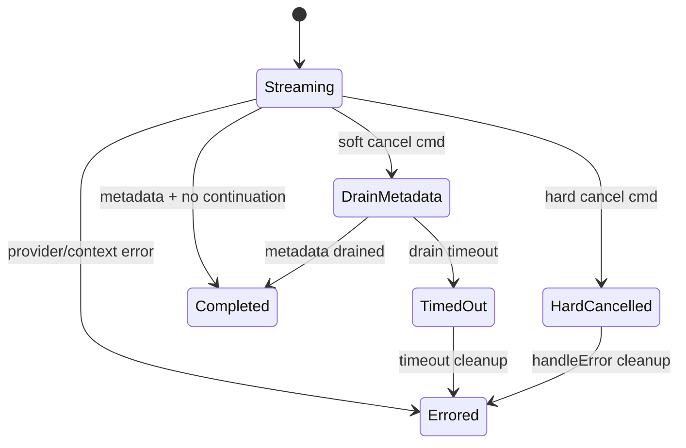

# Stream Executor Runtime

`StreamExecutor` is the per-turn runtime engine: provider stream loop, block persistence, tool continuation, cancellation handling, token/billing finalization, and AG-UI event emission.

Refs: `backend/internal/service/llm/streaming/stream_executor.go:26`, `backend/internal/service/llm/streaming/completion_handler.go:16`

## State Machine

Refs: `backend/internal/service/llm/streaming/executor_state.go:10`, `backend/internal/service/llm/streaming/stream_executor.go:398`, `backend/internal/service/llm/streaming/cancel_handler.go:67`, `backend/internal/service/llm/streaming/completion_handler.go:99`

## Actor Pattern

Only the streaming goroutine mutates executor state. External callers request state changes by sending control messages over `ctrlCh`.

- State is protected for readers via `stateMu`.
- Cancel requests are queued as `CmdSoftCancel` or `CmdHardCancel`.
- State transitions are centralized in `transitionTo`.

Refs: `backend/internal/service/llm/streaming/stream_executor.go:60`, `backend/internal/service/llm/streaming/stream_executor.go:223`, `backend/internal/service/llm/streaming/executor_state.go:65`

## Event Processing Loop

`processProviderStream` multiplexes five event sources:

| Source | Purpose |
|---|---|
| Keepalive ticker (5s) | Keeps SSE connection alive while waiting for provider output |
| Drain timer | Enforces soft-cancel metadata deadline |
| `ctrlCh` | Applies soft/hard cancel commands |
| `ctx.Done()` | Handles lifecycle cancellation/errors |
| Provider stream channel | Processes AG-UI events, complete blocks, generation IDs, metadata |

Refs: `backend/internal/service/llm/streaming/stream_executor.go:376`, `backend/internal/service/llm/streaming/stream_executor.go:381`, `backend/internal/service/llm/streaming/stream_executor.go:482`

### Block Persistence and Sequence Remap

Provider block indices restart at `0` for each provider request. Executor remaps each stream to turn-global block sequence space using `streamStartSequence = maxBlockSequence + 1`.

Refs: `backend/internal/service/llm/streaming/stream_executor.go:355`, `backend/internal/service/llm/streaming/block_processor.go:163`, `backend/internal/service/llm/streaming/block_processor.go:250`

## Tool Continuation Loop

On completion with pending local tool calls:

1. Enforce tool round limits and admission checks.
2. Execute collected tools in parallel.
3. Persist `tool_result` blocks.
4. Rebuild messages from full turn path (including tool results).
5. Start next provider stream and re-enter `processProviderStream`.

Refs: `backend/internal/service/llm/streaming/completion_handler.go:115`, `backend/internal/service/llm/streaming/tool_executor.go:122`, `backend/internal/service/llm/streaming/tool_executor.go:291`, `backend/internal/service/llm/streaming/tool_executor.go:379`

## Provider Start Retry

Initial provider stream start retries once (2 max attempts total) for retryable startup errors, with `750ms` backoff.

Refs: `backend/internal/service/llm/streaming/provider_errors.go:14`, `backend/internal/service/llm/streaming/stream_executor.go:314`, `backend/internal/service/llm/streaming/provider_errors.go:55`

## AG-UI Streaming Protocol

AG-UI is the streaming protocol for turn execution events; events are serialized to SSE as `event: <AGUI_TYPE>` with JSON payloads.

- `workFunc` initializes AG-UI emitter and emits `RUN_STARTED` + `STEP_STARTED`.
- Provider AG-UI events are forwarded to SSE in real time.
- Terminal lifecycle events (`RUN_FINISHED` / `RUN_ERROR`) are emitted from completion/error handlers.

Refs: `backend/internal/service/llm/streaming/stream_executor.go:261`, `backend/internal/service/llm/streaming/block_processor.go:22`, `backend/internal/service/llm/streaming/agui/emitter.go:40`, `backend/internal/service/llm/streaming/completion_handler.go:363`, `backend/internal/service/llm/streaming/completion_handler.go:322`

## Interjection Handling

Interjection injection happens at two boundaries:

- After tool results are persisted (`tool_boundary`).
- At normal completion when no further tools run (`no_tools_completion`).

Both paths create a follow-up user+assistant turn pair via `streamSwitchFn` and emit `STREAM_SWITCH` so the frontend reconnects to the new stream.

Refs: `backend/internal/service/llm/streaming/tool_executor.go:209`, `backend/internal/service/llm/streaming/completion_handler.go:161`, `backend/internal/service/llm/streaming/interjection.go:147`, `backend/internal/service/llm/streaming/agui/events.go:94`
