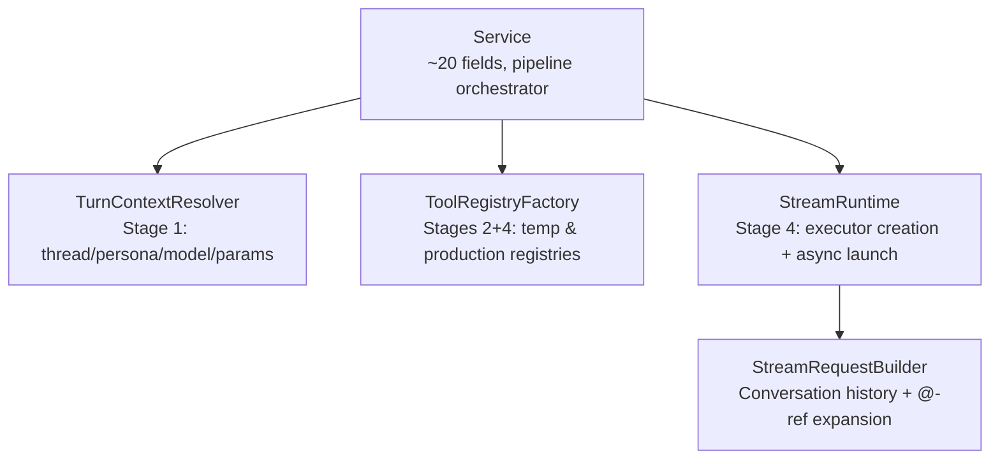
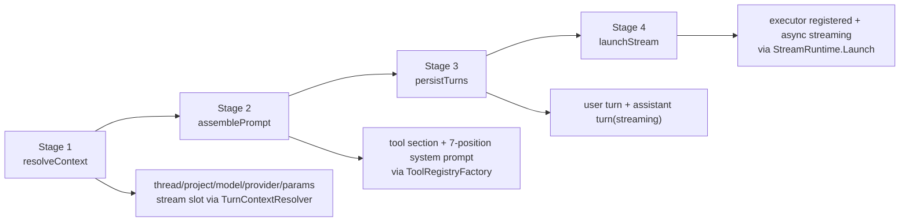

# Streaming Pipeline Overview

`CreateTurn` runs a strict 4-stage pipeline: resolve context, assemble prompt, persist turns, then launch background streaming. The Service god object was decomposed into 4 collaborators that own their dependency sets and pipeline responsibilities.

Refs: `backend/internal/service/llm/streaming/turn_creation.go:63`, `backend/internal/service/llm/streaming/service.go:21`

## Collaborator Decomposition

Service holds ~20 fields and delegates to 4 collaborators. Each collaborator owns its own deps struct, constructed outside the Service and injected via `ServiceDeps`.

| Collaborator | File | Dependencies | Why extracted |
|---|---|---|---|
| `TurnContextResolver` | `turn_context_resolver.go` | PersonaCatalog, WorkItemSvc, CreditAdmissionChecker, UserStreamTracker, CapabilityRegistry | Replaces `gather_context.go`; owns all stage-1 resolution + stream slot |
| `ToolRegistryFactory` | `tool_registry_factory.go` | NamespaceSvc, DocumentSvc, FolderSvc, MutationStrategy, SkillResolver | Builds both temp (prompt) and production (execution) registries |
| `StreamRequestBuilder` | `stream_request_builder.go` | TurnNavigator, TurnReader, MessageBuilder, DocumentSvc, FolderSvc, FormatterRegistry | Loads history + transforms @-references; used by StreamRuntime and debug |
| `StreamRuntime` | `stream_runtime.go` | ProviderGetter, StreamRegistry, ExecutorRegistry, ToolLimitResolver, ExecutorDeps | Creates executors, registers streams, wires cleanup, starts async execution |

Refs: `backend/internal/service/llm/streaming/turn_context_resolver.go:27`, `backend/internal/service/llm/streaming/tool_registry_factory.go:21`, `backend/internal/service/llm/streaming/stream_request_builder.go:16`, `backend/internal/service/llm/streaming/stream_runtime.go:21`

## 4 Stages

Refs: `backend/internal/service/llm/streaming/turn_context_resolver.go:100`, `backend/internal/service/llm/streaming/assemble_prompt.go:17`, `backend/internal/service/llm/streaming/persist_turns.go:21`, `backend/internal/service/llm/streaming/launch_stream.go:14`

## Cold Start vs Warm Start

| Path | Trigger | Thread source | Why this shape |
|---|---|---|---|
| Cold start | `project_id` only | `TurnContextResolver` creates thread | Stage 2 prompt resolution needs a valid `threadID` to load thread/project prompt layers |
| Warm start (thread) | `thread_id` provided | `TurnContextResolver` loads thread | Reuses existing thread prompt/system context |
| Warm start (prev turn) | `prev_turn_id` provided | `TurnContextResolver` resolves thread via prior turn | Keeps turn chaining authoritative from persisted turn graph |

Refs: `backend/internal/service/llm/streaming/turn_context_resolver.go:183`

## Key Invariant

`ctx` is never stored on `turnPipeline`; each stage takes `ctx` as a method parameter.

This avoids stale/cancelled request context leaks when deferred cleanup intentionally switches to `context.Background()`.

Refs: `backend/internal/service/llm/streaming/turn_creation.go:31`

## Stage Summaries

| Stage | Owner | Main responsibility | Key outputs |
|---|---|---|---|
| 1 `resolveContext` | `TurnContextResolver.Resolve` | Resolve thread/persona/project/model/provider/params, apply capabilities, acquire stream slot | `TurnContext` (threadCtx, params, model, provider, persona, work item) |
| 2 `assemblePrompt` | `turnPipeline` + `ToolRegistryFactory` | Build temp registry, generate tool section, resolve final system prompt | `params.System`, `availableSkills` |
| 3 `persistTurns` | `turnPipeline` | Transactionally persist user turn/blocks and assistant turn (`streaming`) | `userTurn`, `assistantTurn` |
| 4 `launchStream` | `turnPipeline` + `StreamRuntime` | Build production registry via `ToolRegistryFactory`, delegate executor launch to `StreamRuntime.Launch` | Stream URL + running executor |

## Stream Slot Ownership

Stage 1 (`TurnContextResolver.Resolve`) acquires the user stream slot. Stage 4 (`launchStream`) transfers release ownership to `StreamRuntime`'s executor cleanup callback after executor registration.

Refs: `backend/internal/service/llm/streaming/turn_context_resolver.go:169`, `backend/internal/service/llm/streaming/turn_creation.go:90`, `backend/internal/service/llm/streaming/launch_stream.go:83`

## File Index

### Split docs

- `overview.md` (this file)
- `prompt-system.md`
- `executor.md`
- `cancellation.md`

### Core implementation files

| File | Concern |
|---|---|
| `turn_creation.go` | Pipeline orchestrator and `turnPipeline` lifecycle |
| `turn_context_resolver.go` | Stage 1: context resolution, cold-start thread creation, persona/model/provider |
| `assemble_prompt.go` | Stage 2: prompt/tool assembly via `ToolRegistryFactory` |
| `persist_turns.go` | Stage 3: transactional persistence |
| `launch_stream.go` | Stage 4: production registry + `StreamRuntime.Launch` delegation |
| `tool_registry_factory.go` | Builds temp (prompt) and production (execution) tool registries |
| `stream_request_builder.go` | Conversation history loading + @-reference transformation |
| `stream_runtime.go` | Executor creation, stream registration, cleanup wiring, async start |
| `deps.go` | `StreamingDeps` sub-structs, `ExecutorRegistry`, `ThreadValidator` |
| `service.go` | `Service` struct (~20 fields) and `NewStreamingOrchestrator` constructor |
