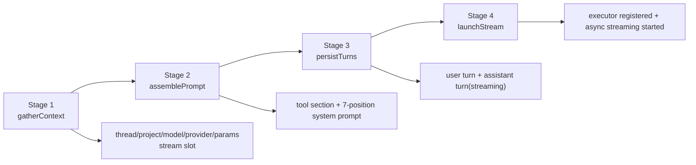

# Streaming Pipeline Overview

`CreateTurn` runs a strict 4-stage pipeline: gather context, assemble prompt, persist turns, then launch background streaming.

Refs: `backend/internal/service/llm/streaming/turn_creation.go:5`, `backend/internal/service/llm/streaming/turn_creation.go:124`, `backend/internal/service/llm/streaming/turn_creation.go:140`

## 4 Stages

Refs: `backend/internal/service/llm/streaming/gather_context.go:44`, `backend/internal/service/llm/streaming/assemble_prompt.go:20`, `backend/internal/service/llm/streaming/persist_turns.go:21`, `backend/internal/service/llm/streaming/launch_stream.go:23`

## Cold Start vs Warm Start

| Path | Trigger | Thread source | Why this shape |
|---|---|---|---|
| Cold start | `project_id` only | Stage 1 creates thread immediately | Stage 2 prompt resolution needs a valid `threadID` to load thread/project prompt layers |
| Warm start (thread) | `thread_id` provided | Stage 1 loads thread | Reuses existing thread prompt/system context |
| Warm start (prev turn) | `prev_turn_id` provided | Stage 1 resolves thread via prior turn | Keeps turn chaining authoritative from persisted turn graph |

Refs: `backend/internal/service/llm/streaming/gather_context.go:61`, `backend/internal/service/llm/streaming/gather_context.go:485`, `backend/internal/service/llm/streaming/assemble_prompt.go:94`, `backend/internal/service/llm/streaming/system_prompt_resolver.go:86`

## Key Invariant

`ctx` is never stored on `turnPipeline`; each stage takes `ctx` as a method parameter.

This avoids stale/cancelled request context leaks when deferred cleanup intentionally switches to `context.Background()`.

Refs: `backend/internal/service/llm/streaming/turn_creation.go:32`, `backend/internal/service/llm/streaming/turn_creation.go:113`

## Stage Summaries

| Stage | Main responsibility | Key outputs |
|---|---|---|
| 1 `gatherContext` | Resolve thread/persona/project/model/provider/params, apply capabilities, acquire stream slot | `threadCtx`, `params`, `model`, `provider`, `resolvedPersona`, `resolvedWorkItem` |
| 2 `assemblePrompt` | Build temp registry, generate tool section, resolve final system prompt | `params.System`, `enabledTools`, `availableSkills` |
| 3 `persistTurns` | Transactionally persist user turn/blocks and assistant turn (`streaming`) | `userTurn`, `assistantTurn` |
| 4 `launchStream` | Build production registry, create/register executor, start background streaming | Stream URL + running executor |

Refs: `backend/internal/service/llm/streaming/gather_context.go:41`, `backend/internal/service/llm/streaming/assemble_prompt.go:16`, `backend/internal/service/llm/streaming/persist_turns.go:17`, `backend/internal/service/llm/streaming/launch_stream.go:17`

## Stream Slot Ownership

Stage 1 acquires the user stream slot. Stage 4 transfers release ownership to executor cleanup callback after executor registration.

Refs: `backend/internal/service/llm/streaming/gather_context.go:131`, `backend/internal/service/llm/streaming/turn_creation.go:103`, `backend/internal/service/llm/streaming/launch_stream.go:127`, `backend/internal/service/llm/streaming/launch_stream.go:132`

## File Index

### Split docs

- `overview.md` (this file)
- `prompt-system.md`
- `executor.md`
- `cancellation.md`

### Core implementation files

| File | Concern |
|---|---|
| `backend/internal/service/llm/streaming/turn_creation.go` | Orchestrator and `turnPipeline` lifecycle |
| `backend/internal/service/llm/streaming/gather_context.go` | Stage 1 context resolution and cold-start thread creation |
| `backend/internal/service/llm/streaming/assemble_prompt.go` | Stage 2 prompt/tool assembly |
| `backend/internal/service/llm/streaming/persist_turns.go` | Stage 3 transactional persistence |
| `backend/internal/service/llm/streaming/launch_stream.go` | Stage 4 executor launch and async start |
