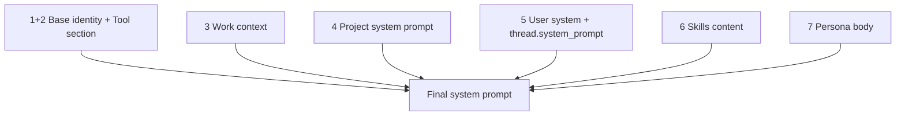

# Prompt System Composition

Stage 2 assembles the final system prompt from a 7-position contract, with tool metadata generated from a temporary registry and runtime tool execution handled by a separate production registry.

Refs: `backend/internal/service/llm/streaming/assemble_prompt.go:20`, `backend/internal/domain/llm/system_prompt.go:43`, `backend/internal/service/llm/streaming/system_prompt_resolver.go:48`

## Two Tool Registries Per Turn

| Registry | Built in | Purpose | Lifetime |
|---|---|---|---|
| Temporary | Stage 2 | Generate `ToolSection` for prompt position 1+2 | Discarded after prompt assembly |
| Production | Stage 4 | Execute tools during streaming/tool continuation | Lives with `StreamExecutor` |

Both registries apply the same work-item slug and persona tool filtering so prompt-advertised tools match runtime-enforced tools.

Refs: `backend/internal/service/llm/streaming/assemble_prompt.go:49`, `backend/internal/service/llm/streaming/assemble_prompt.go:62`, `backend/internal/service/llm/streaming/launch_stream.go:161`, `backend/internal/service/llm/streaming/launch_stream.go:222`

## 7-Position System Prompt

Resolver concatenates non-empty sections with double newlines.

Refs: `backend/internal/service/llm/streaming/system_prompt_resolver.go:74`, `backend/internal/service/llm/streaming/system_prompt_resolver.go:126`

### Position Contract

| Position | Source | Nil/empty behavior | Error behavior |
|---|---|---|---|
| 1+2 | `baseIdentityPrompt` + `ToolSection` | Base identity is always present; tool section appended only when non-empty | None |
| 3 | `PromptContext.WorkContext` | Nil => no section | None |
| 4 | `project.SystemPrompt` | Empty => skipped | Project load failure is fatal |
| 5 | `request_params.system` + `thread.system_prompt` | Empty => skipped | Thread load failure is fatal |
| 6 | `SkillResolver.Resolve` over `SelectedSkills` | All failed/invalid => omit section entirely | Per-skill failures are warn-and-continue |
| 7 | `PromptContext.PersonaBody` | Nil/empty => no section | None |

Refs: `backend/internal/service/llm/streaming/system_prompt_resolver.go:16`, `backend/internal/service/llm/streaming/system_prompt_resolver.go:86`, `backend/internal/service/llm/streaming/system_prompt_resolver.go:92`, `backend/internal/service/llm/streaming/system_prompt_resolver.go:114`, `backend/internal/service/llm/streaming/system_prompt_resolver.go:188`

## Persona Skill Override

When persona frontmatter provides `Skills`, that list replaces request `selected_skills` for prompt resolution.

Refs: `backend/internal/service/llm/streaming/assemble_prompt.go:80`, `backend/internal/service/llm/streaming/assemble_prompt.go:84`, `backend/internal/service/llm/streaming/assemble_prompt.go:94`

## Design Decisions

- `PromptContext.PersonaBody` is `*string` (not `*agents.Persona`) to keep `domain/llm` independent from `domain/agents`.
- Resolver loads thread first and uses thread-owned `project_id` as authoritative when loading project prompts.
- Skills header is emitted only when at least one skill resolves, avoiding empty “skills available” sections.
- Invalid project UUID for skill loading yields an empty skills section (non-fatal).
- Thread/project load failures remain fatal because the resolver cannot safely build prompt layers without those records.

Refs: `backend/internal/domain/llm/system_prompt.go:22`, `backend/internal/service/llm/streaming/system_prompt_resolver.go:85`, `backend/internal/service/llm/streaming/system_prompt_resolver.go:194`, `backend/internal/service/llm/streaming/system_prompt_resolver.go:148`, `backend/internal/service/llm/streaming/system_prompt_resolver.go:94`
