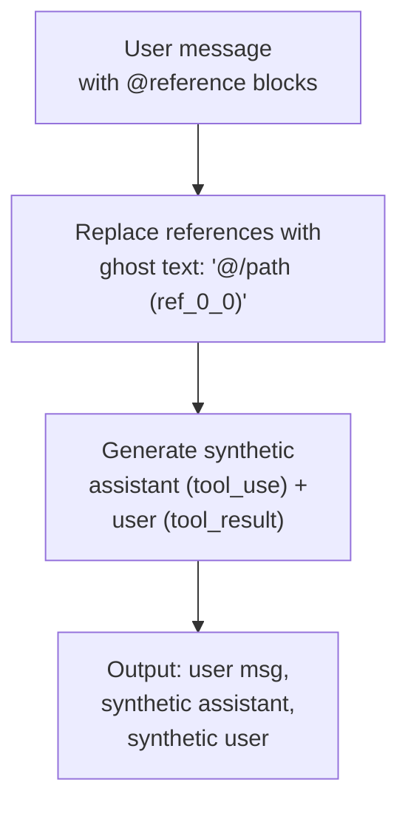

# Message Building

Converts persisted turn history into provider-ready `[]Message`. Handles compaction, collapse, reference expansion, dangling tool sanitization, and token limit warnings.

## Pipeline

```mermaid
flowchart LR
    Path["Turn path<br/>(root→leaf)"] --> MB["MessageBuilder<br/>BuildMessages()"]
    MB --> Compact["Compaction<br/>cutoff + summary"]
    Compact --> Collapse["Collapse<br/>substitution"]
    Collapse --> Sanitize["Sanitize<br/>dangling tool_use"]
    Sanitize --> Format["Format<br/>tool results"]
    Format --> Warn["Token limit<br/>warning inject"]
    Warn --> Msgs["[]Message<br/>for provider"]
    Msgs --> RT["ReferenceTransformer<br/>TransformMessages()"]
    RT --> Final["Final []Message"]
```

## MessageBuilder

Interface at `domain/llm/message_builder.go:9-22`. Implementation: `MessageBuilderService` at `service/llm/thread_history/message_builder.go`.

**Input**: Turn path with blocks already loaded (caller loads via `TurnNavigator.GetTurnPath` + `TurnReader.GetTurnBlocksForTurns`).

**Output**: `[]Message` — each has `Role` (user/assistant) and `Content []*TurnBlock`.

### Bookmark Processing

When no bookmark turns exist, output is identical to pre-bookmark behavior (regression-safe).

**Compaction** (hard cutoff):
1. `FindLastCompactionTurn(path)` scans from end — most recent wins (`message_builder.go:39-46`).
2. All turns at or before the compaction index are skipped.
3. Summary text is extracted and prepended as `[Previous conversation summary]\n...` in a synthetic user message.

**Collapse marker** (soft substitution):
1. `FindLastCollapseMarker(path)` scans from end (`message_builder.go:50-57`).
2. Collapse markers earlier than the compaction cutoff are ignored (superseded).
3. For turns before the marker, `tool_result` blocks with non-nil `CollapsedContent` get their content replaced — deep-copies the content map to avoid mutating caller data.

### Dangling Tool Sanitization

`sanitizeTurnBlocks()` at `message_builder.go:282-336` — handles interrupted streams where a `tool_use` block has no matching `tool_result`.

Injects a synthetic error `tool_result` with `"Tool execution was interrupted"` to satisfy the provider API requirement that every `tool_use` must have a corresponding `tool_result`.

### Tool Result Formatting

`formatToolResultBlock()` applies the `FormatterRegistry` pipeline to `tool_result` blocks. Formatting happens at message-build time (not at storage time) — DB keeps raw data, formatting is a read-path concern.

### Token Limit Warning

`injectTokenLimitWarningIfNeeded()` at `message_builder.go:196-276` — checks the last assistant turn's token usage against model context window (via `capabilities.Registry`). If >75%, appends a warning user message.

## Reference Transformation

`ReferenceMessageTransformer` at `service/llm/thread_history/reference_transformer.go` — runs after `BuildMessages`, expanding `reference` blocks into synthetic tool call pairs.

**Why**: @-mentions (reference blocks) need to be compiled into a format LLMs recognize as "data I already fetched" to prevent redundant tool calls.

**Mechanism**: For each user message with references:

1. Reference blocks replaced in-place with ghost text (e.g., `@/Stories/storm-magic-ideas.md (ref_0_0)`)
2. Each reference becomes a synthetic `tool_use` block (assistant message) + `tool_result` block (user message)
3. Result format matches real `str_replace_based_edit_tool` view output — line-numbered content for documents, child listing for folders
4. Same `FormatterRegistry` pipeline applied to synthetic results
5. Resolution failures produce error `tool_result` pairs (same pattern as real tool errors)

**Entity caching**: `resolveRefMetadata()` fetches the document/folder during ghost text generation and caches it in `refWithID.resolvedDoc/resolvedFolder` to avoid double-fetching during tool pair generation.

## Thread History Service

`Service` at `service/llm/thread_history/service.go` — read-only operations over thread history. Depends only on `TurnReader` and `TurnNavigator` (ISP compliance).

| Method | Purpose |
|--------|---------|
| `GetTurnPath` | Load path root→leaf with batch block loading (eliminates N+1) |
| `GetTurnSiblings` | Sibling turns for branch navigation UI |
| `GetThreadTree` | Lightweight tree structure (IDs + parent relationships) for frontend cache validation — <100ms for 1000+ turns |
| `GetPaginatedTurns` | Path-based pagination with `has_more_before`/`has_more_after` flags |
| `GetTurnWithBlocks` | Single turn + blocks for SSE reconnection |
| `GetTurnTokenUsage` | Token stats + context window percentage + warning message for UI |

All methods check authorization via injected `ResourceAuthorizer` before accessing data.
