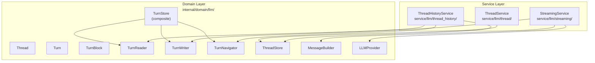

# Threads & Conversations

LLM conversation management — threads hold turns, turns form a tree, blocks carry multimodal content.

## Architecture

Three services partition thread operations by concern:

| Service | Responsibility | Depends on |
|---------|---------------|------------|
| `ThreadService` | CRUD: create, list, update, delete threads | `ThreadStore`, `ProjectStore` |
| `ThreadHistoryService` | Read-only: path traversal, pagination, token stats | `TurnReader`, `TurnNavigator`, `ThreadStore` |
| `StreamingService` | Write: turn creation, streaming orchestration, interruption | `TurnWriter`, `MessageBuilder`, `LLMProvider` |

## Thread Model

`Thread` (`domain/llm/thread.go`) — a conversation session within a project.

| Field | Purpose |
|-------|---------|
| `ProjectID`, `UserID` | Ownership scoping |
| `Title` | User-visible name (auto-generated on cold start from first text block) |
| `SystemPrompt` | Thread-level system prompt override (position 5 in 7-position composition) |
| `LastViewedTurnID` | Cursor for pagination — frontend resumes from this point |
| `WorkItemID` | Links to work item; auto-provisioned ephemeral work item when nil |
| `Persona` | Persona slug when thread uses a persona agent |
| `ParentThreadID` | Non-null for spawn child threads — FK to `threads(id)` |
| `SpawnStatus` | Lifecycle of spawned child: `running` → `succeeded`/`failed`/`cancelled`/`timed_out` |
| `SpawnResultJSON` | Structured outcome JSONB (populated on completion) |
| `SpawnDepth` | Denormalized `parent.SpawnDepth + 1` — O(1) depth limit checks |
| `DeletedAt` | Soft-delete timestamp |

Cold start: `CreateTurnRequest` with `ProjectID` but no `ThreadID` creates thread + first turn atomically.

## ISP Splits (Turn Access)

`TurnStore` is a composite interface of three narrower interfaces, allowing consumers to depend only on what they need:

| Interface | Methods | Consumers |
|-----------|---------|-----------|
| `TurnReader` | `GetTurn`, `GetRootTurns`, `GetTurnBlocks`, `GetTurnBlocksForTurns`, `GetLastBlockSequence` | `ThreadHistoryService` |
| `TurnWriter` | `CreateTurn`, `CreateTurnBlock(s)`, `UpdateTurnStatus`, `UpdateTurnError`, `AccumulateTokensAndUpdateMetadata`, `UpsertPartialBlock`, `AppendGenerationRecord` | `StreamingService` |
| `TurnNavigator` | `GetTurnPath`, `GetTurnSiblings`, `GetSiblingsForTurns`, `GetPaginatedTurns` | `ThreadHistoryService`, pagination |

Defined in `domain/llm/turn_reader.go`, `turn_writer.go`, `turn_navigator.go`. Composite in `domain/llm/turn.go:74-78`.

## Provider Abstraction

See [`providers.md`](providers.md) for the full provider routing and capability system.

## Sub-Docs

| Doc | Covers |
|-----|--------|
| [`turns.md`](turns.md) | Turn model, status lifecycle, branching tree, block types, streaming deltas |
| [`message-building.md`](message-building.md) | MessageBuilder, compaction/collapse bookmarks, reference transformation, sanitization |
| [`providers.md`](providers.md) | LLMProvider interface, capability interfaces, registry, factory, model routing |
