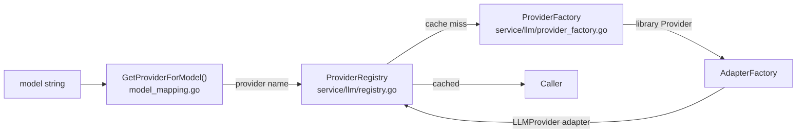

# Provider Abstraction

Multi-provider LLM access via a unified interface, capability-based extension, and cached registry routing.

## LLMProvider Interface

`LLMProvider` (`domain/llm/provider.go:11-37`) — the contract all providers implement:

| Method | Purpose |
|--------|---------|
| `GenerateResponse(req)` | Blocking generation — returns complete `[]*TurnBlock` |
| `StreamResponse(req)` | Non-blocking — returns `<-chan StreamEvent` |
| `Name()` | Provider identifier (e.g., `"anthropic"`) |
| `SupportsModel(model)` | Routing check |

### GenerateRequest / Message

`GenerateRequest` carries `[]Message` (conversation history), `Model` string, and `*RequestParams` (all LLM parameters). `Message` has `Role` (user/assistant) and `Content []*TurnBlock`.

`RequestParams` (`domain/llm/request_params.go:25-129`) is a unified struct covering all providers. Provider adapters extract what they support. Key groups:
- **Core**: `Model`, `MaxTokens`, `Temperature`, `TopP`, `TopK`, `Stop`
- **Anthropic-specific**: `ThinkingEnabled`, `ThinkingLevel` (ratio-based: low=20%, medium=50%, high=80%, xhigh=95% of max_tokens)
- **Tool control**: `Tools []ToolDefinition`, `ToolChoice`, `ParallelToolCalls`
- **Provider routing**: `Provider` (explicit), `ProviderOrder`, `ProviderOnly` (OpenRouter-specific)

### StreamEvent Union

`StreamEvent` (`domain/llm/provider.go:94-121`) is a tagged union — exactly one field is non-nil:

| Field | When |
|-------|------|
| `Delta *TurnBlockDelta` | Incremental content (legacy path, being replaced by AG-UI) |
| `Block *TurnBlock` | Complete block when block finishes streaming |
| `Metadata *StreamMetadata` | Final event — tokens, stop_reason, generation ID |
| `GenerationIDDiscovered` | Early metadata event when generation ID first appears |
| `AGUIEvent any` | AG-UI protocol event (new preferred path) |
| `Error error` | Streaming error |

## Capability Interfaces

Optional interfaces providers implement when they support specific features. Consumers probe via type assertion (DIP compliance):

```go
if querier, ok := provider.(GenerationStatsQuerier); ok {
    stats, _ := querier.QueryGenerationStats(ctx, generationID)
}
```

| Interface | Purpose | Implementors |
|-----------|---------|--------------|
| `GenerationStatsQuerier` | Query generation metadata (native tokens, cost, latency) | OpenRouter |
| `GenerationCanceller` | Cancel active generation via provider API (best-effort) | OpenRouter |

`GenerationStats` (`provider.go:218-264`) captures native tokenizer counts, cost, finish reason, latency, upstream provider name, and cancellation status.

## Provider Registry & Factory



**Model → Provider routing** (`domain/llm/model_mapping.go`):
- `claude-*` → `"anthropic"`
- `gpt-*`, `o1-*` → `"openai"`
- `gemini-*` → `"google"`
- `lorem-*` → `"lorem"` (testing)
- Anything else → `"openrouter"` (default fallback)
- Explicit `RequestParams.Provider` overrides inference

**ProviderRegistry** (`service/llm/registry.go`) — double-checked locking cache. Each provider name maps to a single cached `LLMProvider` instance.

**ProviderFactory** (`service/llm/provider_factory.go`) — creates library-level provider instances:

| Provider | Library | Notes |
|----------|---------|-------|
| `anthropic` | `meridian-llm-go/providers/anthropic` | HTTP timeout disabled; idle timeout from config |
| `openrouter` | `meridian-llm-go/providers/openrouter` | HTTP timeout disabled; supports generation stats/cancel APIs |
| `lorem` | `meridian-llm-go/providers/lorem` | Mock for testing, no API key required |

**AdapterFactory** — wraps library providers in domain-level adapters (`LLMProvider` interface). Adapter pattern allows the same library provider type to produce different domain adapters (OCP compliance).

## OpenRouter Metadata

`GenerationRecord` (`domain/llm/openrouter_models.go`) — per-request generation data stored in `turns.response_metadata.openrouter.generations[]` JSONB array.

Multiple records per turn when tool continuations occur (`RequestIndex` 0=initial, 1+=continuation). Each record carries native token counts, cost, provider name, and billing settlement fields.

`AppendGenerationRecord` (`TurnWriter`) uses JSONB upsert-by-id: if a record with the same generation ID exists it's replaced, otherwise appended — supports both sync enrichment (complete record) and async enrichment (partial→full).
