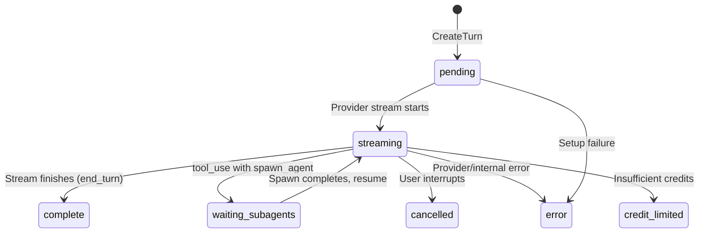
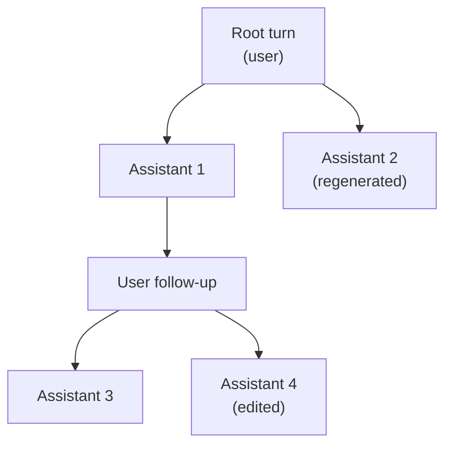

# Turns, Blocks & Branching

Turns form a tree. Each turn holds multimodal content blocks. Streaming deltas accumulate into blocks.

## Turn Model

`Turn` (`domain/llm/turn.go:23-44`) — a single conversational exchange (user message or assistant response).

| Field | Type | Purpose |
|-------|------|---------|
| `PrevTurnID` | `*string` | Parent pointer — null for root turns, forms the conversation tree |
| `Role` | `string` | `"user"`, `"assistant"`, or `"system"` (bookmark turns only) |
| `Status` | `TurnStatus` | Lifecycle state (see below) |
| `Model` | `*string` | LLM model used (assistant turns only) |
| `InputTokens`, `OutputTokens` | `*int` | Accumulated across tool continuations via `AccumulateTokensAndUpdateMetadata` |
| `RequestParams` | `map[string]any` | All request parameters as JSONB — temperature, max_tokens, thinking, etc. |
| `StopReason` | `*string` | Why generation stopped: `"end_turn"`, `"max_tokens"`, `"tool_use"` |
| `ResponseMetadata` | `map[string]any` | Provider-specific data (cache tokens, OpenRouter generation records) |
| `Blocks` | `[]TurnBlock` | Computed — content blocks loaded separately, attached in service layer |
| `SiblingIDs` | `[]string` | Computed — other turns sharing the same `PrevTurnID` |

## Turn Status Lifecycle

Constants at `domain/llm/turn.go:62-70`: `TurnStatusPending`, `TurnStatusStreaming`, `TurnStatusWaitingSubagents`, `TurnStatusComplete`, `TurnStatusCancelled`, `TurnStatusError`, `TurnStatusCreditLimited`.

## Branching (Conversation Tree)

Turns form a tree via `PrevTurnID`. Multiple children of the same parent = alternative branches (edit, regenerate).

**Navigation** (`TurnNavigator` — `domain/llm/turn_navigator.go`):

- `GetTurnPath(turnID)` — recursive CTE from leaf to root, returns root→leaf order. Used to build LLM context.
- `GetTurnSiblings(turnID)` — all turns sharing the same `PrevTurnID`, with blocks. Powers "1 of 3" UI navigation.
- `GetSiblingsForTurns(turnIDs)` — batch sibling lookup (eliminates N+1 for paginated views).
- `GetPaginatedTurns(threadID, fromTurnID, limit, direction)` — path-based pagination. When multiple children exist, follows most recent child (`latest created_at`).

**Pagination** uses `Thread.LastViewedTurnID` as cursor. Direction `"before"` walks ancestors, `"after"` walks descendants, `"both"` splits the limit.

## Bookmark Turns

System-role turns that influence message building but are never sent to the LLM directly.

| Bookmark | `turn_type` | Effect |
|----------|-------------|--------|
| **Compaction** | `"compaction"` | LLM-generated summary of prior turns. MessageBuilder skips all turns before it and injects the summary as a leading user context message. |
| **Collapse marker** | `"collapse_marker"` | Signals that `tool_result` blocks before this point should substitute `collapsed_content` for full content when building messages. |

Helper methods at `domain/llm/turn.go:84-113`: `IsCompactionTurn()`, `IsCollapseMarker()`, `IsBookmarkTurn()`.

## TurnBlock Model

`TurnBlock` (`domain/llm/turn_block.go:38-52`) — a multimodal content block within a turn.

| Field | Purpose |
|-------|---------|
| `BlockType` | Block kind — see table below |
| `Sequence` | 0-indexed ordering within the turn |
| `TextContent` | Text/thinking content (separate column for full-text indexing) |
| `Content` | JSONB for type-specific structured data |
| `ProviderData` | Opaque provider-specific bytes (e.g., thinking signatures) |
| `ExecutionSide` | `"provider"`, `"local"`, or `"client"` for tool_use blocks |
| `Status` | `"complete"` or `"partial"` (interrupted streams) |
| `CollapsedContent` | Human-readable summary (e.g., `"[Read /path: 1234 chars]"`) for collapse marker substitution |

### Block Types

| Type | Role | `Content` JSONB |
|------|------|-----------------|
| `text` | user/assistant | null (text in `TextContent`) |
| `thinking` | assistant | null or `{signature}` (text in `TextContent`, signature in `ProviderData`) |
| `tool_use` | assistant | `{tool_use_id, tool_name, input: {...}}` |
| `tool_result` | user | `{tool_use_id, is_error}` (result text in `TextContent` or `Content.result`) |
| `image` | user | `{url, mime_type, alt_text}` |
| `reference` | user | `{ref_id, ref_type, selection_start, selection_end}` |
| `partial_reference` | user | Same as reference (incomplete @-mention) |
| `web_search_use` | assistant | `{tool_use_id, tool_name, input}` (provider-side) |
| `web_search_result` | assistant | `{tool_use_id, results: [{title, url, page_age}]}` |
| `collapse_marker` | system | Marks context collapse boundary |

Constants at `domain/llm/turn_block.go:10-21`.

### Execution Side

Tool blocks carry an `ExecutionSide` distinguishing where execution happens:
- **provider** — provider handles it (e.g., Anthropic web search). No stop/execute/resume cycle.
- **local** — backend executes (default for nil). Triggers tool continuation loop.
- **client** — frontend executes (e.g., apply-edit proposals).

Methods: `IsProviderSideTool()`, `IsLocalTool()`, `IsClientSideTool()` at `turn_block.go:81-94`.

### Partial Blocks

Blocks with `Status == "partial"` were interrupted during streaming. `UpsertPartialBlock` (`TurnWriter`) persists accumulated content on interruption using `ON CONFLICT` upsert. `IsPartial()` / `IsComplete()` at `turn_block.go:97-104`.

### Whitespace Filtering

Thinking blocks with nil/whitespace-only content (some providers emit `"\n"` placeholder reasoning) are filtered on load via `FilterWhitespaceOnlyThinkingBlocks` (`turn_block.go:122-135`).

## Streaming Deltas

`TurnBlockDelta` (`domain/llm/turn_block_delta.go:31-100`) — ephemeral incremental updates during streaming.

Flow: Provider streams → `TurnBlockDelta` → `BlockAccumulator` in memory → complete `TurnBlock` to DB.

| Delta Type | Purpose |
|------------|---------|
| `text_delta` | Incremental text content |
| `thinking_delta` | Incremental thinking/reasoning text |
| `signature_delta` | Cryptographic signature (Extended Thinking) |
| `tool_call_start` | Tool call initiated (name, id) |
| `json_delta` | Incremental JSON (tool input, tool results) |
| `usage_delta` | Token count updates (accumulated at turn level) |

`BlockType` is set only on the first delta of a block (acts as block-start signal). Nil on subsequent deltas. Consumer detects new blocks via `IsBlockStart()` (`turn_block_delta.go:119-121`).
