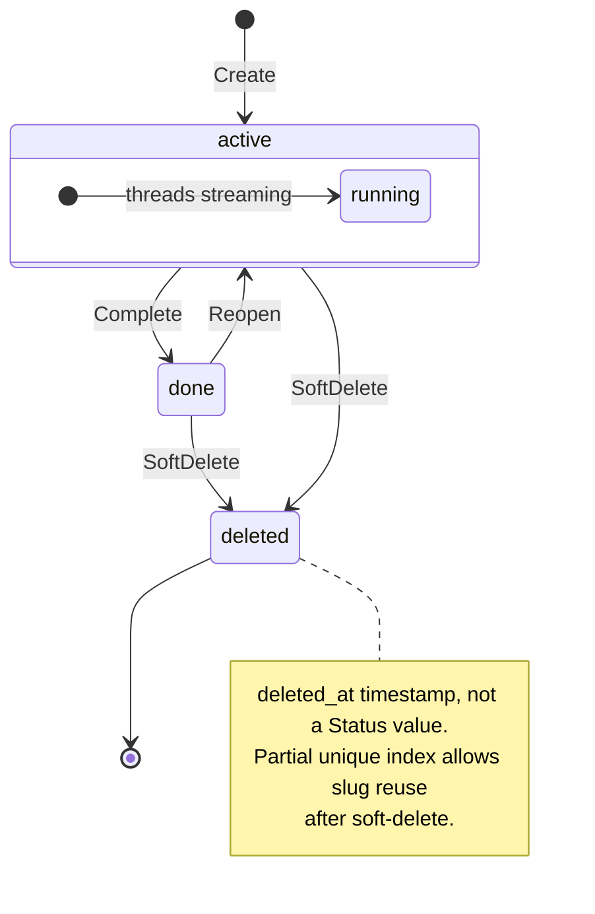
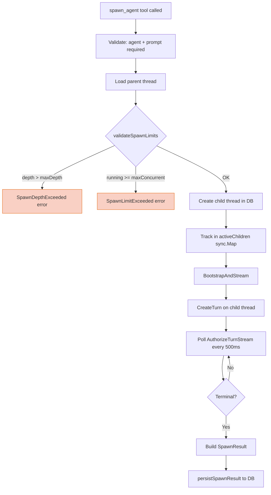
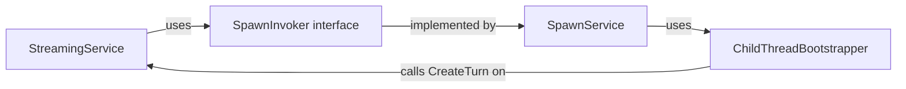
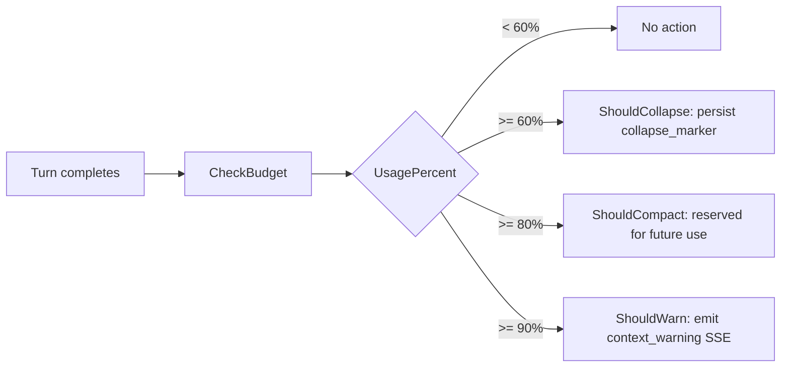

# Work Items, Spawning, and Context Management

Backend subsystems for work item lifecycle, foreground agent spawning, namespace isolation, and context window management (token monitor, compaction, collapsed content).

## File Map

| Area | Key Files |
|------|-----------|
| Work item domain | `backend/internal/domain/workitem/types.go` |
| Work item service | `backend/internal/service/workitem/service.go` |
| Work item store | `backend/internal/repository/postgres/workitem/store.go` |
| Work item handler | `backend/internal/handler/work_item.go` |
| Work item migration | `backend/migrations/00034_create_work_items.sql` |
| Spawn domain | `backend/internal/domain/llm/spawn.go` |
| Spawn service | `backend/internal/service/llm/streaming/spawn_service.go` |
| Spawn tool | `backend/internal/service/llm/tools/spawn_agent.go` |
| Spawn migration | `backend/migrations/00039_add_thread_spawn_fields.sql` |
| Service wiring | `backend/internal/service/llm/setup.go` |
| Context resolver | `backend/internal/service/llm/streaming/context_resolver.go` |
| Namespace isolation | `backend/internal/service/llm/tools/text_editor.go` (~L504-582) |
| Token monitor | `backend/internal/service/llm/streaming/token_monitor.go` |
| Compaction service | `backend/internal/service/llm/streaming/compaction_service.go` |
| Message builder | `backend/internal/service/llm/thread_history/message_builder.go` |
| Tool executor | `backend/internal/service/llm/streaming/tool_executor.go` |
| Collapsed content migration | `backend/migrations/00036_add_collapsed_content.sql` |

---

## Work Item Lifecycle

### State Machine



**Why only two statuses?** Delete is orthogonal to workflow state. A soft-deleted work item preserves its last status (`active` or `done`) in the `status` column; visibility is controlled entirely by `deleted_at IS NULL` predicates on every query. This keeps the status enum minimal and avoids coupling deletion semantics with workflow transitions.

### Domain Model

`WorkItem` (`domain/workitem/types.go`): core aggregate grouping threads under `.meridian/work/<slug>/`.

| Field | Purpose |
|-------|---------|
| `Status` | `active` or `done` only; DB CHECK constraint enforces |
| `IsEphemeral` | First-class flag for auto-created items (cap-managed) |
| `DeletedAt` | Soft-delete marker; `nil` = visible |
| `Metadata` | Arbitrary JSONB; full-replace on update (no deep-merge) |
| `Slug` | Service-generated; callers must not supply |

`ThreadSummary`: work-item-local DTO that avoids importing `domain/llm.Thread` to prevent cross-domain coupling.

### CAS Status Transitions

`Complete` and `Reopen` use compare-and-set at the store level:

```sql
UPDATE work_items SET status = $new
WHERE id = $id AND status = $expected AND deleted_at IS NULL
```

On `RowsAffected == 0`, the store checks existence to distinguish not-found from wrong-state. The service maps CAS failures to semantic domain errors (`WorkItemDone`, reopen conflict).

**Complete guard:** `HasStreamingThreads` blocks completion while any thread has an in-flight streaming turn. This prevents orphaned streams that reference a "done" work item.

### Slug Generation with Collision Retry

```
identifier.GenerateSlug(name) → baseSlug
  ↓
for attempt := 0..maxSlugRetries(5):
  EnsureUniqueSlug(baseSlug, probeStore) → candidate
  store.Create(candidate)
    ├─ success → return
    └─ ConflictError → retry (TOCTOU: slug inserted between probe and INSERT)
```

**Why retry instead of DB-level uniqueness alone?** The partial unique index on `(project_id, slug) WHERE deleted_at IS NULL` catches conflicts, but the probe-then-insert pattern lets us generate incrementally suffixed slugs (`my-task`, `my-task-2`, etc.) without relying on DB error parsing for the happy path. The retry loop handles the TOCTOU race when concurrent creates produce the same slug.

### Ephemeral Cap Enforcement

Per-project cap: `maxActiveEphemerals = 100`. Enforced in `EnsureThreadWorkItem`:

```
Thread needs work item?
  ├─ existing valid workItemID → return it (idempotent no-op)
  ├─ count < 100 → create new ephemeral
  ├─ count >= 100 → reuse GetMostRecentActiveEphemeral
  └─ reuse target not found (race) → create fallback ephemeral anyway
```

**Why create-on-race instead of strict cap?** Forward progress over strict enforcement. If all ephemerals were concurrently deleted between the count check and the reuse lookup, blocking the caller would be worse than briefly exceeding the cap. The cap is advisory under contention — by design.

Backed by dedicated index: `idx_work_items_project_ephemeral ON (project_id, is_ephemeral, status) WHERE deleted_at IS NULL`.

### REST API

All routes project-scoped, item operations slug-addressed:

| Method | Path | Operation |
|--------|------|-----------|
| `POST` | `/api/projects/{id}/work-items` | Create |
| `GET` | `/api/projects/{id}/work-items` | List (paginated) |
| `GET` | `/api/projects/{id}/work-items/{slug}` | Get by slug |
| `PUT` | `/api/projects/{id}/work-items/{slug}` | Update (partial patch) |
| `POST` | `/api/projects/{id}/work-items/{slug}/complete` | Complete |
| `POST` | `/api/projects/{id}/work-items/{slug}/reopen` | Reopen |
| `DELETE` | `/api/projects/{id}/work-items/{slug}` | Soft delete |

Handler resolves `slug → ID` first, then calls service by ID. DTO mapping formats timestamps as strings.

**Authorization:** Service enforces project membership via `projectRepo.GetByID(ctx, projectID, userID)` on every mutating operation. For item-level operations (update, complete, delete), the item is fetched first to resolve its `ProjectID`, then membership is verified.

---

## Foreground Spawning

### Spawn Lifecycle



### Depth and Concurrency Limits

| Limit | Default | Config Key | Scope |
|-------|---------|------------|-------|
| Max spawn depth | 3 | `LLM.MaxSpawnDepth` | Per-thread chain |
| Max concurrent spawns | 5 | `LLM.MaxConcurrentSpawns` | Per-work-item |

**Why denormalized `spawn_depth`?** O(1) depth checks instead of O(n) ancestor walks. The child's depth is `parent.SpawnDepth + 1`, stored on the thread row at creation time. No recursive queries needed.

**Concurrent spawn race window:** `validateSpawnLimits` count check and `CreateThread` are separate operations (no locking/atomic guard). Under contention, concurrent spawns can overshoot the limit. Accepted tradeoff — occasional oversubscription is preferable to serializing all spawn creation.

### Child Thread Context Inheritance

Child thread inherits from parent:
- `work_item_id` — same work item scope
- `spawn_depth` — `parent.SpawnDepth + 1`
- `persona` — set to `req.AgentSlug`
- Title — `[spawn] <truncated prompt>`

### SpawnInvoker Pattern (Circular Dependency Resolution)



**The problem:** `StreamingService` needs to invoke spawns (from `spawn_agent` tool), but `SpawnService` needs `StreamingService` to create child turns. Direct dependency = import cycle.

**The solution:** `SpawnInvoker` is a narrow domain interface (`CreateSpawn`, `GetSpawnStatus`, `CancelSpawn`) in `domain/llm/spawn.go`. Wiring in `setup.go`:

1. Build `StreamingService`
2. Build `ChildThreadBootstrapper` with reference to `StreamingService`
3. Build `SpawnService` with bootstrapper + `ExecutorRegistry`
4. Call `StreamingService.SetSpawnInvoker(spawnSvc)` — late injection breaks the cycle

### Completion Detection (v1)

Polling-based: `ChildThreadBootstrapper.waitForCompletion` calls `AuthorizeTurnStream` every 500ms. When the assistant turn leaves the executor registry, it's considered complete.

**Why polling?** Pragmatic v1 approach. A cleaner solution would wire the executor's cleanup callback to send on the completion channel directly, but that requires executor lifecycle changes deferred to SP2. Timeout via `context.WithTimeout` (configurable, default 5 minutes).

### Cancellation

`CancelSpawn` path:
1. Find child in `ListChildThreads`
2. If `spawn_status == running` and `ExecutorRegistry` is available, call `executor.RequestHardCancel()`
3. Update DB `spawn_status` to `cancelled`
4. Already-terminal spawns are a no-op

### Spawn Tool Registration

`WithSpawnTool` in `tools/builder.go` only registers `spawn_agent` when both conditions hold:
- `spawnInvoker != nil`
- Work item context is present (thread has an attached work item)

The tool converts domain spawn-limit/depth errors into recoverable tool results; infrastructure errors bubble as fatal.

### DB Schema (migration 00039)

```sql
-- Columns added to threads:
parent_thread_id UUID  -- FK to parent, ON DELETE SET NULL
spawn_status     TEXT  -- running|succeeded|failed|cancelled|timed_out (NULL for non-spawns)
spawn_result     JSONB -- SpawnResult struct
spawn_depth      INT   -- denormalized, default 0

-- Constraints:
CHECK (parent_thread_id IS NULL OR parent_thread_id != id)  -- no self-parent
CHECK (spawn_depth >= 0)

-- Index:
idx_threads_parent ON (parent_thread_id, created_at DESC) WHERE deleted_at IS NULL
```

---

## Namespace Isolation

Enforced in `TextEditorTool.checkEditNamespaceAccess` (not in `ContextResolver`).

**Mandatory order:** canonicalize (`filepath.Clean`) → detect namespace → check isolation. Clean runs before any prefix matching so `../` traversal can't bypass namespace detection.

| Path Pattern | Rule |
|-------------|------|
| `.meridian/work/<slug>/` | Only current `workItemSlug` may write |
| `.meridian/fs/` | Any thread may write (shared) |
| `.agents/` | Allowed; review-gated via folder autoapply |
| `.meridian/<other>` | Denied (`NamespaceAccessDenied`) |
| `.session/<anything>` | Denied |
| Everything else | Allowed (user workspace) |

Raw `..` segments in the original path return `PathTraversalDenied` (checked before canonicalization resolves them silently).

### Context Resolution

`ContextResolver.ResolveWorkContext` maps `work_item_id → slug` and emits:
- `WorkDir = .meridian/work/<slug>/`
- `FSDir = .meridian/fs`
- `ThreadID`, `WorkItem` (slug)

Strict caller contract: must attach work item first or receive validation error.

---

## Context Window Management

### Token Monitor Thresholds



| Threshold | Value | Action | Status |
|-----------|-------|--------|--------|
| Collapse | 60% | Persist `collapse_marker` system turn | Active |
| Compact | 80% | Reserved for aggressive compaction | Reserved (CM2) |
| Warn | 90% | Emit `context_warning` SSE event | Active |

Flags are additive: `ShouldWarn` implies `ShouldCompact` implies `ShouldCollapse`.

**Design invariant:** `CheckBudget` is synchronous and fast (~1ms tiktoken in-memory). DB side-effects (collapse marker creation) run asynchronously in a goroutine with background context + deadline. The monitor must never block turn completion.

Estimation accuracy is ~5% (tiktoken cl100k_base), absorbed by the conservative 60/80/90 thresholds.

### Collapsed Content

Pre-computed at tool-result persistence time in `StreamExecutor`. Currently generated for:
- `str_replace_based_edit_tool` → `tools.ComputeTextEditorCollapsedContent`
- `doc_search` → `tools.ComputeSearchCollapsedContent`

Stored as `collapsed_content TEXT` on `turn_blocks` (migration 00036).

**Why pre-compute?** The collapsed content is a compression substrate for the collapse marker system. When `MessageBuilder` encounters turns before a collapse marker, it substitutes `collapsed_content` into the `result` field of `tool_result` blocks — avoiding expensive recomputation at message-build time. This keeps context window usage low for old tool results that no longer need verbatim representation.

`applyCollapseToBlocks` deep-copies the content map before mutation to avoid corrupting callers' references.

### Compaction Service

LLM-based delta summarization using a fast model (default: `claude-haiku-4-5-20251001`, max 1024 output tokens).

**Compaction flow:**
1. Load full turn path from root to `currentTurnID`
2. Find most recent compaction bookmark (if any) — only turns after it are summarized (delta compaction, no double-summarizing)
3. Build plain-text transcript (user/assistant turns only; bookmark turns skipped)
4. Call fast model with fixed summarizer system prompt
5. Persist as `role=system, turn_type=compaction` turn linked via `prev_turn_id`

**Message builder integration:** On `BuildMessages`, the compaction summary is injected as a leading `[Previous conversation summary]` user message. All turns up to and including the bookmark are skipped. The collapse marker index is adjusted: markers at or before the compaction cutoff are ignored.

**Transcript building:** Tool results prefer `collapsed_content` for brevity; large results (>200 chars) without collapsed content get `<large output omitted>` placeholder.

---

## Known Gaps and Risks

1. **Spawn tool policy gap:** `spawn_agent` is wired in the runtime tool registry but excluded from `serverDefaultToolOrder` in `tool_policy.go`. If the provider's tool exposure is governed solely by request params tools, spawn may be unreachable despite registry wiring.

2. **ShutdownCoordinator integration:** `ShutdownCoordinator` exists with full graceful-shutdown phases (stop admitting → grace period → force-cancel) but no `Register/Deregister` calls found in the stream launch path. Current production path uses `ExecutorRegistry`. The coordinator may be dead code or wired outside the explored slice.

3. **Concurrent spawn overshoot:** `validateSpawnLimits` and `CreateThread` are non-atomic. Accepted tradeoff — occasional oversubscription under contention.

4. **Ephemeral cap advisory under races:** By design (see Ephemeral Cap Enforcement above).
