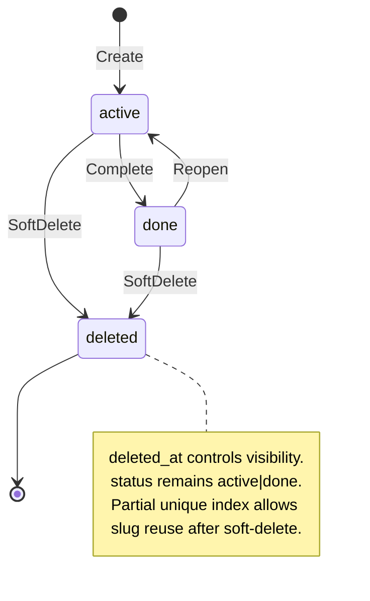
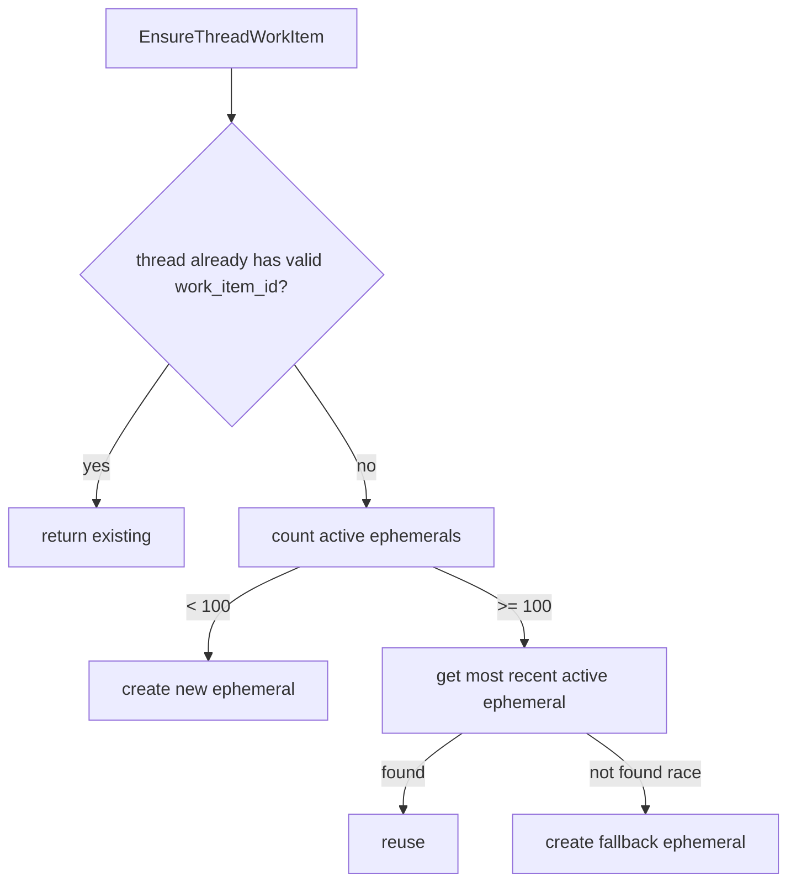

# Work Item Lifecycle

Work items are project-scoped workflow containers for thread groups and `.meridian/work/<slug>/` artifacts (`backend/internal/domain/workitem/types.go:17-32`, `backend/migrations/00034_create_work_items.sql:3-46`).

## Core Anchors

| Area | Location |
|------|----------|
| Domain model | `backend/internal/domain/workitem/types.go:11-56` |
| Service lifecycle and guards | `backend/internal/service/workitem/service.go:21-444` |
| Store CAS + soft-delete semantics | `backend/internal/repository/postgres/workitem/store.go:227-476` |
| REST handler routes | `backend/internal/handler/work_item.go:102-309` |
| Schema + indexes | `backend/migrations/00034_create_work_items.sql:7-51` |

## State Machine



`status` is constrained to `active|done`; deletion is orthogonal and implemented by `deleted_at` predicates plus soft-delete update (`backend/migrations/00034_create_work_items.sql:19-35`, `backend/internal/repository/postgres/workitem/store.go:260-279`).

## Domain Model

| Field | Role |
|------|------|
| `Status` | Two-state workflow (`active`, `done`) (`backend/internal/domain/workitem/types.go:11-13`) |
| `IsEphemeral` | Marks auto-created cap-managed items (`backend/internal/domain/workitem/types.go:25`, `backend/internal/service/workitem/service.go:361-429`) |
| `DeletedAt` | Visibility gate for all read paths (`backend/internal/domain/workitem/types.go:31`, `backend/internal/repository/postgres/workitem/store.go:103-168`) |
| `Metadata` | JSONB object replaced on update (no deep-merge) (`backend/migrations/00034_create_work_items.sql:16-29`, `backend/internal/service/workitem/service.go:198-205`) |
| `Slug` | Service-generated identifier from name (`backend/internal/service/workitem/service.go:68-90`) |

`ThreadSummary` is a work-item-local DTO to avoid importing full thread domain types (`backend/internal/domain/workitem/types.go:34-45`).

## CAS Status Transitions

Store-level status transitions are compare-and-set:

```sql
UPDATE work_items
SET status = $to
WHERE id = $id AND status = $from AND deleted_at IS NULL
```

On `RowsAffected() == 0`, the store checks row existence to separate not-found vs wrong-state conflict (`backend/internal/repository/postgres/workitem/store.go:230-255`, `backend/internal/repository/postgres/workitem/store.go:460-476`).

`Complete` adds a streaming guard: it fails if any thread under the work item has an in-flight turn (`backend/internal/service/workitem/service.go:232-249`, `backend/internal/repository/postgres/workitem/store.go:371-393`).

## Slug Generation

```mermaid
flowchart TD
    A[GenerateSlug(name)] --> B[EnsureUniqueSlug probe]
    B --> C[Create item]
    C -->|success| D[return]
    C -->|conflict| E[retry <= 5]
    E --> B
```

The service probes for suffix candidates, then retries on insert conflicts to handle TOCTOU races (`backend/internal/service/workitem/service.go:26-29`, `backend/internal/service/workitem/service.go:74-119`, `backend/internal/repository/postgres/workitem/store.go:59-93`).

## Ephemeral Cap

Per-project cap: `100` active ephemerals (`backend/internal/service/workitem/service.go:21-24`).



The fallback create-on-race path prioritizes forward progress when concurrent deletes invalidate reuse candidates (`backend/internal/service/workitem/service.go:392-429`, `backend/internal/repository/postgres/workitem/store.go:412-458`).

## REST Surface

All routes are project-scoped; item operations are slug-addressed.

| Method | Path | Handler |
|--------|------|---------|
| `POST` | `/api/projects/{id}/work-items` | `CreateWorkItem` (`backend/internal/handler/work_item.go:102-133`) |
| `GET` | `/api/projects/{id}/work-items` | `ListWorkItems` (`backend/internal/handler/work_item.go:135-164`) |
| `GET` | `/api/projects/{id}/work-items/{slug}` | `GetWorkItem` (`backend/internal/handler/work_item.go:166-186`) |
| `PUT` | `/api/projects/{id}/work-items/{slug}` | `UpdateWorkItem` (`backend/internal/handler/work_item.go:188-226`) |
| `POST` | `/api/projects/{id}/work-items/{slug}/complete` | `CompleteWorkItem` (`backend/internal/handler/work_item.go:228-254`) |
| `POST` | `/api/projects/{id}/work-items/{slug}/reopen` | `ReopenWorkItem` (`backend/internal/handler/work_item.go:256-282`) |
| `DELETE` | `/api/projects/{id}/work-items/{slug}` | `DeleteWorkItem` (`backend/internal/handler/work_item.go:284-309`) |

## Authorization and Membership

Every mutating service path verifies project membership through `projectRepo.GetByID`. Item-level paths load the item first to resolve `ProjectID`, then authorize (`backend/internal/service/workitem/service.go:42-47`, `backend/internal/service/workitem/service.go:181-184`, `backend/internal/service/workitem/service.go:227-230`, `backend/internal/service/workitem/service.go:270-273`, `backend/internal/service/workitem/service.go:305-308`).

## Namespace Isolation and Context Resolution

Namespace writes are enforced in `TextEditorTool.checkEditNamespaceAccess`, not in context resolution (`backend/internal/service/llm/tools/text_editor.go:504-582`).

Mandatory order is fixed: canonicalize (`filepath.Clean`) -> reject raw `..` -> detect namespace -> enforce rule (`backend/internal/service/llm/tools/text_editor.go:507-537`).

| Path Pattern | Rule |
|-------------|------|
| `.meridian/work/<slug>/` | Only current work item slug may write (`backend/internal/service/llm/tools/text_editor.go:539-555`) |
| `.meridian/fs/` | Shared writable FS namespace (`backend/internal/service/llm/tools/text_editor.go:557-560`) |
| `.agents/` | Writable; review-gated elsewhere (`backend/internal/service/llm/tools/text_editor.go:562-566`) |
| `.meridian/<other>` | Denied (`NamespaceAccessDenied`) (`backend/internal/service/llm/tools/text_editor.go:568-572`) |
| `.session/<anything>` | Denied (`NamespaceAccessDenied`) (`backend/internal/service/llm/tools/text_editor.go:574-578`) |
| Other workspace paths | Allowed (`backend/internal/service/llm/tools/text_editor.go:580-581`) |

Work context resolution maps work item IDs to canonical paths:
- `WorkDir = .meridian/work/<slug>/`
- `FSDir = .meridian/fs`

Resolver requires an attached work item; missing `workItemID` is a validation error (`backend/internal/service/llm/streaming/context_resolver.go:33-57`).
