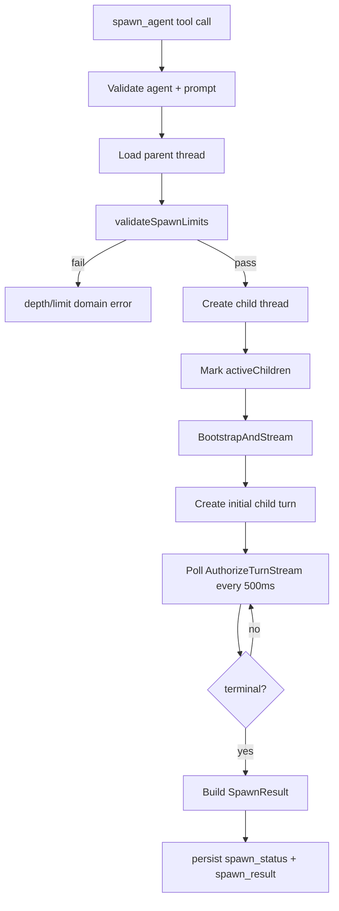
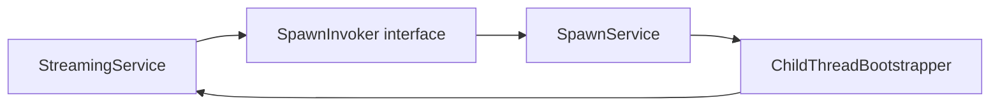

# Foreground Spawning

Foreground spawning creates a child thread, starts its first turn, then blocks until terminal status or timeout (`backend/internal/service/llm/streaming/spawn_service.go:62-177`).

## Core Anchors

| Area | Location |
|------|----------|
| Spawn domain contract | `backend/internal/domain/llm/spawn.go:5-52` |
| Spawn orchestration | `backend/internal/service/llm/streaming/spawn_service.go:28-452` |
| Tool registration + adapter | `backend/internal/service/llm/tools/builder.go:97-117`, `backend/internal/service/llm/tools/spawn_agent.go:23-145` |
| Runtime wiring | `backend/internal/service/llm/setup.go:198-217`, `backend/internal/service/llm/streaming/service.go:61-81` |
| Config defaults | `backend/internal/config/config.go:47-49`, `backend/internal/config/config.go:111-113` |
| Thread schema | `backend/migrations/00039_add_thread_spawn_fields.sql:7-31` |

## Spawn Lifecycle

`CreateSpawn` enforces validation, creates child thread metadata, and waits on completion or timeout (`backend/internal/service/llm/streaming/spawn_service.go:71-176`).

## Limits

| Limit | Default | Config | Enforcement |
|------|---------|--------|-------------|
| Max depth | `3` | `MAX_SPAWN_DEPTH` -> `LLM.MaxSpawnDepth` | `parent.SpawnDepth + 1 > maxDepth` (`backend/internal/service/llm/streaming/spawn_service.go:245-253`) |
| Max concurrent running spawns per work item | `5` | `MAX_CONCURRENT_SPAWNS` -> `LLM.MaxConcurrentSpawns` | `CountRunningSpawnsByWorkItem >= maxConcurrent` (`backend/internal/service/llm/streaming/spawn_service.go:255-269`) |
| Foreground timeout | `300s` | `SPAWN_TIMEOUT_SECONDS` -> `LLM.SpawnTimeoutSeconds` | `context.WithTimeout` around bootstrap/wait (`backend/internal/service/llm/streaming/spawn_service.go:134-176`) |

`spawn_depth` is denormalized on the thread row for O(1) checks (`backend/internal/service/llm/streaming/spawn_service.go:97-109`, `backend/migrations/00039_add_thread_spawn_fields.sql:5-11`).

The limit check and child insert are separate operations, so concurrent callers can overshoot under contention by design (`backend/internal/service/llm/streaming/spawn_service.go:92-123`, `backend/internal/service/llm/streaming/spawn_service.go:262-269`).

## Child Thread Inheritance

Child thread fields are derived from parent/request at spawn create time (`backend/internal/service/llm/streaming/spawn_service.go:96-116`):

| Field | Source |
|------|--------|
| `work_item_id` | inherited from parent thread |
| `spawn_depth` | `parent.SpawnDepth + 1` |
| `persona` | `req.AgentSlug` |
| `title` | `[spawn]` + truncated prompt |
| `spawn_status` | initialized `running` |

## SpawnInvoker Pattern

The cycle is broken by late wiring: build `StreamingService`, build `SpawnService` with `ChildThreadBootstrapper`, then inject with `SetSpawnInvoker` (`backend/internal/service/llm/setup.go:198-217`, `backend/internal/service/llm/streaming/service.go:70-81`).

## Completion Detection

`ChildThreadBootstrapper.waitForCompletion` polls every 500ms and treats `AuthorizeTurnStream` miss as terminal (`backend/internal/service/llm/streaming/spawn_service.go:407-452`). Timeout/cancel is bounded by spawn context timeout (`backend/internal/service/llm/streaming/spawn_service.go:139-176`).

## Cancellation

`CancelSpawn` behavior (`backend/internal/service/llm/streaming/spawn_service.go:210-240`):
1. List children for the parent.
2. If target is `running`, hard-cancel active executor when present.
3. Persist `spawn_status = cancelled`.
4. If already terminal, return no-op.

## Spawn Tool Registration

`WithSpawnTool` registers `spawn_agent` only when both conditions hold (`backend/internal/service/llm/tools/builder.go:97-117`):
- `spawnInvoker != nil`
- `workItemID != ""`

`spawn_agent` maps depth/limit domain errors to tool-level recoverable results and bubbles unexpected infra errors (`backend/internal/service/llm/tools/spawn_agent.go:109-126`).

## DB Schema

Migration `00039` extends `threads` (`backend/migrations/00039_add_thread_spawn_fields.sql:7-31`):

| Kind | Definition |
|------|------------|
| Columns | `parent_thread_id`, `spawn_status`, `spawn_result`, `spawn_depth` |
| Constraints | no self-parent, enum-like spawn status check, non-negative depth |
| Index | parent-child listing index on `(parent_thread_id, created_at DESC)` with `deleted_at IS NULL` |
