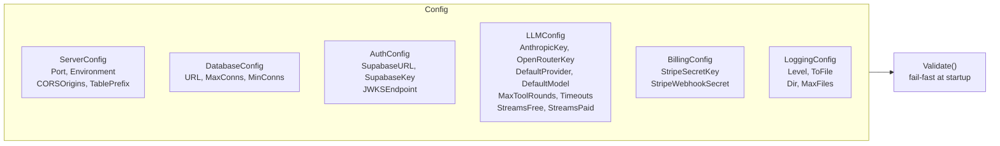
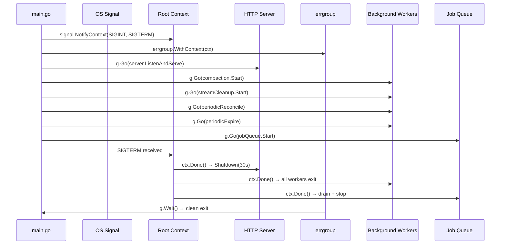
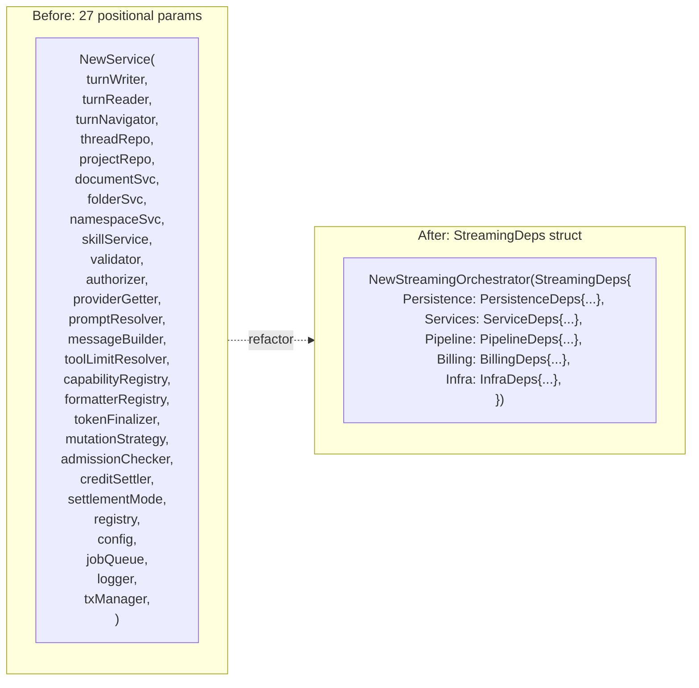
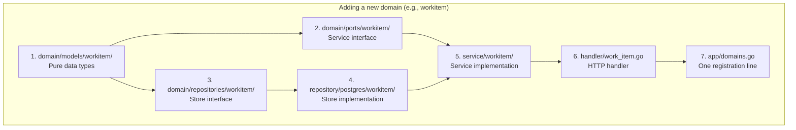

# Backend Architecture — Proposed Structure

## Package Dependency Graph

Shows the full layered architecture after refactor, including upcoming domains (work items, agents, tools).

```mermaid
flowchart TD
    subgraph CMD["cmd/server/"]
        Main["main.go<br/>(~30 lines)"]
    end

    subgraph BOOT["internal/app/"]
        Bootstrap["bootstrap.go<br/>(composition root)"]
        AppConfig["config.go<br/>(load + validate)"]
        AppInfra["infra.go<br/>(pool, logger, JWT)"]
        AppDomains["domains.go<br/>(wire all domains)"]
        AppHTTP["http.go<br/>(router + middleware)"]
        AppWorkers["workers.go<br/>(errgroup lifecycle)"]
    end

    subgraph HANDLER["internal/handler/"]
        DocHandler["docsystem handlers"]
        CollabHandler["collab handlers"]
        LLMHandler["sse + thread handlers"]
        BillingHandler["billing handler"]
        AuthHandler["auth handler"]
        WorkItemHandler["work item handler"]
        AgentHandler["agent/skill handler"]
    end

    subgraph MW["internal/middleware/"]
        AuthMW["auth middleware"]
        CreditGate["credit gate"]
        CORS["CORS"]
    end

    subgraph SERVICE["internal/service/ (implementations)"]
        subgraph SvcDoc["docsystem/"]
            ProjectSvc["ProjectService"]
            DocumentSvc["DocumentService"]
            FolderSvc["FolderService"]
            ImportSvc["ImportService"]
        end
        subgraph SvcCollab["collab/"]
            SessionMgr["SessionManager"]
            ProposalSvc["ProposalService"]
            RestoreSvc["RestoreService"]
            StatusMirror["StatusMirror"]
            StateBuilder["ProjectedStateBuilder"]
            CompactionW["CompactionWorker"]
        end
        subgraph SvcLLM["llm/"]
            StreamingSvc["StreamingOrchestrator"]
            ThreadSvc["ThreadService"]
            ProviderRes["ProviderResolver"]
            StreamExec["StreamExecutor"]
            ToolExec["ToolExecutor"]
        end
        subgraph SvcBilling["billing/"]
            CreditSvc["CreditService"]
            CreditSettler["CreditSettler"]
            AdmissionChk["AdmissionChecker"]
            CreditGranter["CreditGranter"]
            PricingRes["PricingResolver"]
            StripeClient["StripeClient"]
        end
        subgraph SvcWork["workitem/ (new)"]
            WorkItemSvc["WorkItemService"]
        end
        subgraph SvcAgent["agents/ (new)"]
            SkillResolver["SkillResolver"]
            AgentCatalog["AgentCatalogService"]
        end
        subgraph SvcTools["tools/ (new)"]
            WriteRouter["WriteRouter"]
            ToolRunner["ToolRunner"]
        end
    end

    subgraph JOBS["internal/jobs/"]
        EnrichJob["EnrichGenerationJob"]
        ReconcileJob["ReconcileBillingJob"]
        ExpireJob["ExpireCreditsJob"]
    end

    subgraph DOMAIN["internal/domain/"]
        subgraph PORTS["ports/ (interfaces, was domain/services/)"]
            PortDoc["docsystem/"]
            PortCollab["collab/<br/>session.go | state.go<br/>proposal.go | presence.go<br/>bookmark.go | restore.go"]
            PortLLM["llm/"]
            PortBilling["billing/<br/>admission.go | settler.go<br/>granter.go | service.go"]
            PortWork["workitem/ (new)"]
            PortAgent["agents/ (new)"]
        end
        subgraph REPOS["repositories/ (store interfaces)"]
            RepoDoc["docsystem/<br/>DocumentReader | DocumentWriter<br/>DocumentSearcher | DocumentTraverser<br/>FolderRepository"]
            RepoCollab["collab/ (new location)<br/>DocumentStateStore | UpdateLogStore<br/>CheckpointStore | BookmarkStore<br/>ProposalStore"]
            RepoLLM["llm/<br/>TurnReader | TurnWriter<br/>TurnNavigator | ThreadRepository"]
            RepoBilling["billing/<br/>CreditStore<br/>GenerationBillingStore"]
            RepoWork["workitem/ (new)<br/>WorkItemStore"]
        end
        subgraph MODELS["models/ (pure data types)"]
            ModelDoc["docsystem/"]
            ModelCollab["collab/"]
            ModelLLM["llm/<br/>+ TurnStatus constants"]
            ModelBilling["billing/<br/>pricing.go | types.go"]
            ModelWork["workitem/ (new)"]
            ModelAgent["agents/ (new)"]
        end
    end

    subgraph POSTGRES["internal/repository/postgres/"]
        PgDoc["docsystem/"]
        PgCollab["collab/"]
        PgLLM["llm/"]
        PgBilling["billing/"]
        PgWork["workitem/ (new)"]
    end

    subgraph CONFIG["internal/config/"]
        CfgStruct["Config<br/>Server | Database | Auth<br/>LLM | Billing | Logging"]
    end

    Main --> Bootstrap
    Bootstrap --> AppConfig
    Bootstrap --> AppInfra
    Bootstrap --> AppDomains
    Bootstrap --> AppHTTP
    Bootstrap --> AppWorkers

    AppHTTP --> HANDLER
    AppHTTP --> MW
    AppDomains --> SERVICE
    AppWorkers --> JOBS
    AppWorkers --> CompactionW

    HANDLER --> SERVICE
    SERVICE --> PORTS
    SERVICE --> REPOS
    SERVICE --> MODELS
    POSTGRES --> REPOS
    POSTGRES --> MODELS

    StreamingSvc --> StreamExec
    StreamExec --> ToolExec
    StreamExec --> CreditSettler
    StreamExec --> AdmissionChk

    WorkItemSvc --> PortDoc
    SkillResolver --> RepoDoc
    WriteRouter --> SessionMgr
    ThreadSvc --> WorkItemSvc
    StreamingSvc --> WorkItemSvc
    ImportSvc --> WorkItemSvc
```

## Config Structure

## Lifecycle Management

## Constructor Pattern (Before/After)

## Domain Module Registration (New Domain Pattern)

