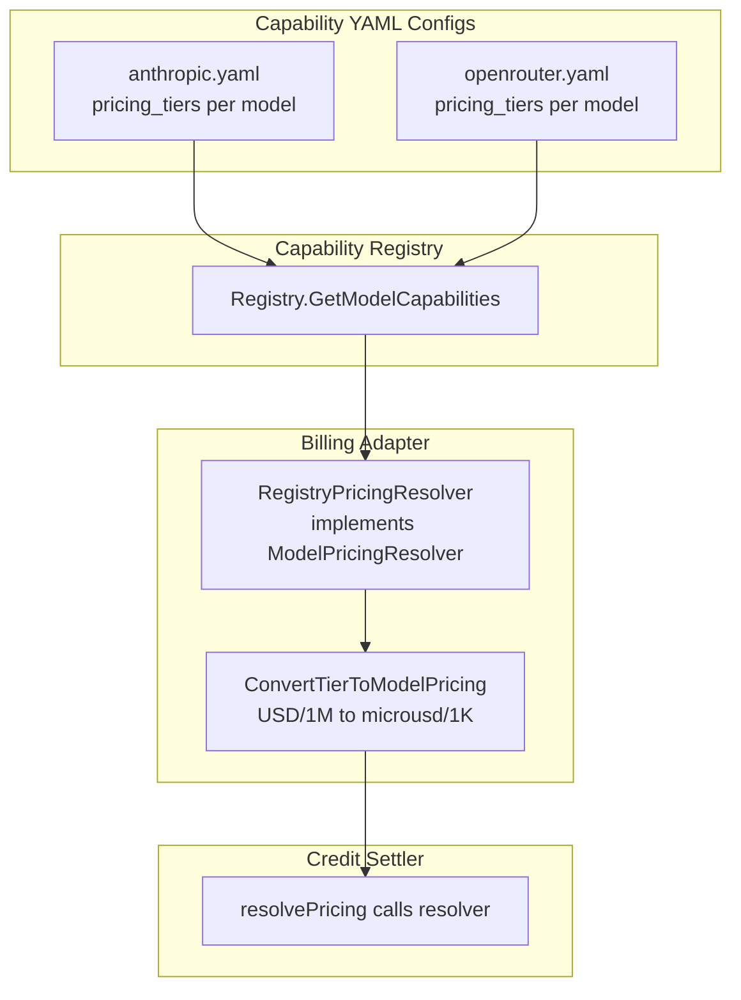
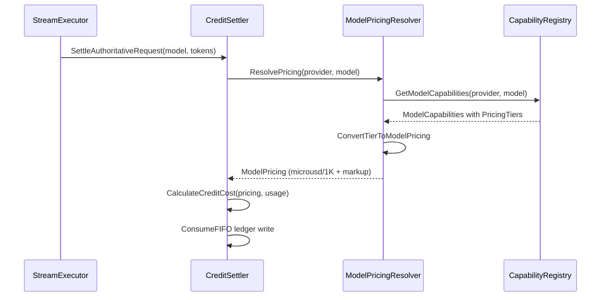
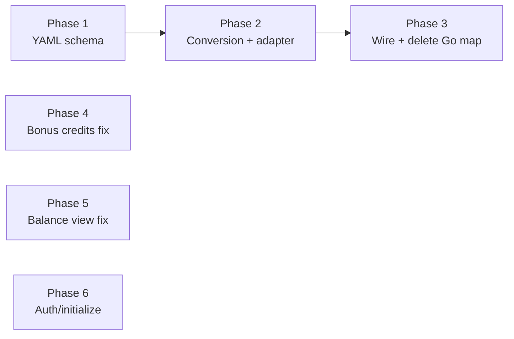

# Plan: Migrate Model Pricing from Go Map to Capability YAML

## Problem

Model pricing lives in two places:

1. **Capability YAML configs** (`capabilities/config/*.yaml`) -- `pricing_tiers` with `input_price`/`output_price` per model, in USD per 1M tokens
2. **Go hardcoded map** (`domain/models/billing/pricing.go`) -- `DefaultModelPricing` with 5 models, in microusd per 1K tokens, plus reasoning/cached/markup fields

The Go map is incomplete (only 5 models, none of the OpenRouter models), stale (uses versioned model IDs like `claude-sonnet-4-20250514` that don't match the YAML IDs), and diverges from the YAML pricing. We need ONE source of truth: **the YAML configs**.

This plan also fixes three bugs found in the p280 review:
- Bonus credits not granted during webhook fulfillment
- Balance view broken for paid credits with `expires_at`
- `auth/initialize` endpoint not wired

## Decision Record

### D1: Extend `pricing_tiers` vs. separate billing fields?

**Decision: Extend `pricing_tiers` with optional billing-specific fields.**

The existing `pricing_tiers` already has `input_price` and `output_price` per modality. Adding `reasoning_price`, `cached_price`, and `markup_basis_points` alongside them keeps pricing co-located per model. A separate `billing_pricing` section would duplicate the input/output prices and create a sync hazard.

Tradeoffs:
- Pro: Single place to update when provider pricing changes.
- Pro: Frontend model selector can show cost estimates from the same data.
- Con: `pricing_tiers` is exposed via the `/api/models/capabilities` endpoint, so billing internals (markup) become visible. Mitigation: the handler already selects which fields to serialize; `markup_basis_points` can be omitted from the API response via `json:"-"` on the Go struct.

### D2: Unit conversion location

**Decision: Conversion happens in a pure function in `domain/models/billing`, called by an adapter.**

- YAML stores USD per 1M tokens (human-readable, matches provider pricing pages).
- Billing uses microusd per 1K tokens (integer math, no floats in cost calculation).
- Conversion: `microusd_per_1K = USD_per_1M * 1000` (e.g., $3.00/1M = 3000 microusd/1K).
- This is a simple multiply, but it must live in one place with tests.

### D3: Registry exposure -- direct dependency or adapter?

**Decision: Adapter interface (`ModelPricingResolver`) that the settler depends on.**

The settler should not depend on the full capability `Registry` (ISP). Instead:

```go
// In domain/services/billing
type ModelPricingResolver interface {
    ResolvePricing(provider, model string) (billingmodel.ModelPricing, error)
}
```

An adapter in `service/billing` implements this by calling `Registry.GetModelCapabilities()` and converting the `PricingTier` to `ModelPricing`. This keeps the settler testable with a mock resolver.

### D4: Fallback behavior for unknown models

**Decision: Conservative fallback pricing with a warning log, same as today.**

If a model has no `pricing_tiers` in YAML (e.g., a model just added to a provider but not yet priced):
1. Log a warning with the model ID.
2. Use `FallbackModelPricing` (premium-tier conservative values).
3. This is the existing behavior and is correct -- under-billing is worse than over-billing.

The `FallbackModelPricing` constant stays in `pricing.go` as the safety net.

### D5: Markup -- global default with per-model override

**Decision: Global default (1500 basis points = 15%) with per-model override in YAML.**

Most models will use the same markup. Encoding it on every model is noise. The adapter applies the global default when the YAML field is absent.

```yaml
# In YAML -- only set when overriding
claude-haiku-4-5:
  pricing_tiers:
    - threshold: null
      input_price:
        text: 1.00
      output_price:
        text: 5.00
      markup_basis_points: 1000  # override: 10% instead of default 15%
```

The global default lives in `pricing.go` as a named constant.

## Architecture



## Data Flow: Settlement Pricing Resolution



## YAML Schema Changes

Add three optional fields to `PricingTier`:

```yaml
pricing_tiers:
  - threshold: null
    input_price:
      text: 3.00           # existing: USD per 1M input tokens
    output_price:
      text: 15.00          # existing: USD per 1M output tokens
    reasoning_price:        # NEW: USD per 1M reasoning tokens (defaults to output_price.text)
      text: 15.00
    cached_price:           # NEW: USD per 1M cached input tokens (defaults to input_price.text * 0.5)
      text: 1.50
    markup_basis_points: 1500  # NEW: override global default (optional)
```

Reasoning defaults to output price because most providers charge output rates for reasoning tokens. Cached defaults to 50% of input because that's the standard Anthropic ratio and a reasonable conservative default for other providers.

## Implementation Phases

### Phase 1: YAML schema extension and struct changes

**Files:**
- `internal/capabilities/types.go` -- add `ReasoningPrice`, `CachedPrice`, `MarkupBasisPoints` to `PricingTier`
- `internal/capabilities/config/anthropic.yaml` -- add `reasoning_price`, `cached_price` for models that have distinct reasoning pricing
- `internal/capabilities/config/openrouter.yaml` -- same

**Details:**

```go
// PricingTier - add fields
type PricingTier struct {
    Threshold         *int               `yaml:"threshold" json:"threshold"`
    InputPrice        map[string]float64 `yaml:"input_price" json:"input_price"`
    OutputPrice       map[string]float64 `yaml:"output_price" json:"output_price"`
    ReasoningPrice    map[string]float64 `yaml:"reasoning_price" json:"reasoning_price,omitempty"`
    CachedPrice       map[string]float64 `yaml:"cached_price" json:"cached_price,omitempty"`
    MarkupBasisPoints *int64             `yaml:"markup_basis_points" json:"-"` // json:"-" to hide from API
}
```

Note: `MarkupBasisPoints` uses `*int64` (pointer) so we can distinguish "not set" (nil = use global default) from "explicitly set to 0" (no markup).

For the YAML configs, most models only need `input_price` and `output_price` -- the defaults are sensible. Only add explicit `reasoning_price`/`cached_price` where the model's pricing diverges from the defaults.

**No behavioral change yet.** The settler still uses the Go map. This phase is purely additive.

### Phase 2: Conversion function and adapter

**Files:**
- `internal/domain/models/billing/pricing.go` -- add `ConvertTierToModelPricing()` pure function, add `DefaultMarkupBasisPoints` constant
- `internal/domain/services/billing/settler.go` -- add `ModelPricingResolver` interface
- `internal/service/billing/pricing_resolver.go` -- new file, `RegistryPricingResolver` adapter
- `internal/service/billing/pricing_resolver_test.go` -- unit tests

**Conversion function:**

```go
const DefaultMarkupBasisPoints int64 = 1500

// ConvertTierToModelPricing converts a PricingTier (USD/1M) to ModelPricing (microusd/1K).
// Conversion: microusd_per_1K = USD_per_1M * 1000
func ConvertTierToModelPricing(tier PricingTier) ModelPricing {
    input := int64(tier.InputPrice["text"] * 1000)
    output := int64(tier.OutputPrice["text"] * 1000)

    reasoning := output // default: same as output
    if v, ok := tier.ReasoningPrice["text"]; ok {
        reasoning = int64(v * 1000)
    }

    cached := input / 2 // default: 50% of input
    if v, ok := tier.CachedPrice["text"]; ok {
        cached = int64(v * 1000)
    }

    markup := DefaultMarkupBasisPoints
    if tier.MarkupBasisPoints != nil {
        markup = *tier.MarkupBasisPoints
    }

    return ModelPricing{
        InputMicrousdPer1K:     input,
        OutputMicrousdPer1K:    output,
        ReasoningMicrousdPer1K: reasoning,
        CachedMicrousdPer1K:    cached,
        MarkupBasisPoints:      markup,
    }
}
```

**Adapter:**

```go
type RegistryPricingResolver struct {
    registry *capabilities.Registry
    logger   *slog.Logger
}

func (r *RegistryPricingResolver) ResolvePricing(provider, model string) (billingmodel.ModelPricing, error) {
    caps, err := r.registry.GetModelCapabilities(provider, model)
    if err != nil {
        return billingmodel.FallbackModelPricing, err
    }
    if len(caps.PricingTiers) == 0 {
        return billingmodel.FallbackModelPricing, fmt.Errorf("model %s has no pricing tiers", model)
    }
    // Use first tier (threshold: null = base pricing)
    return billingmodel.ConvertTierToModelPricing(caps.PricingTiers[0]), nil
}
```

**Note on tiered pricing:** Grok 4.1 Fast has two tiers (threshold: null and threshold: 128000). For billing, we use the base tier (threshold: null). Per-request tiered billing based on context window usage is a future enhancement -- the complexity isn't justified at launch. The YAML already captures the tiers for the frontend to display cost estimates.

**Test coverage:**
- `ConvertTierToModelPricing` with all fields set
- `ConvertTierToModelPricing` with defaults (missing reasoning/cached/markup)
- `RegistryPricingResolver` with known model
- `RegistryPricingResolver` with unknown model (fallback)
- Conversion math: verify `$3.00/1M` = `3000 microusd/1K`

### Phase 3: Wire resolver into settler, remove Go map

**Files:**
- `internal/service/billing/credit_settler.go` -- accept `ModelPricingResolver` in constructor, replace `resolvePricing`
- `internal/domain/models/billing/pricing.go` -- delete `DefaultModelPricing` map
- `internal/cmd/server/main.go` -- construct `RegistryPricingResolver`, pass to settler

**Settler changes:**

```go
type creditSettler struct {
    store           billingrepo.CreditStore
    generationStore billingrepo.GenerationBillingStore
    pricingResolver billingdomain.ModelPricingResolver
    logger          *slog.Logger
}

func (s *creditSettler) resolvePricing(model string, turnID string, requestIndex int) billingmodel.ModelPricing {
    // The settler receives model as "provider/model" for OpenRouter or bare model for Anthropic.
    // The resolver handles provider extraction.
    pricing, err := s.pricingResolver.ResolvePricing("", model)
    if err != nil {
        s.logger.Warn("billing model missing from capability registry; using fallback pricing",
            "model", model,
            "turn_id", turnID,
            "request_index", requestIndex,
            "error", err,
        )
        return billingmodel.FallbackModelPricing
    }
    return pricing
}
```

**Provider resolution challenge:** The settler currently receives just `model` (e.g., `"claude-haiku-4-5"` or `"google/gemini-2.5-flash"`). The capability registry needs `(provider, model)`. The resolver must infer the provider:

1. Try the model ID as-is against all providers (most OpenRouter models already include the provider prefix like `google/gemini-2.5-flash`).
2. The `RegistryPricingResolver` iterates providers and uses `ModelIDCandidates` normalization.

This is safe because model IDs are unique across providers in our YAML configs. If a collision ever occurs, we'd need to thread the provider through the settlement path, but that's not the case today.

**main.go wiring:**

```go
pricingResolver := serviceBilling.NewRegistryPricingResolver(capabilityRegistry, logger)
creditSettler := serviceBilling.NewCreditSettler(creditStore, generationBillingStore, pricingResolver, logger)
```

### Phase 4: Fix bug -- bonus credits not granted in webhook fulfillment

**File:** `internal/service/billing/credit_service.go`

**Problem:** Line 205 creates the purchase lot with `pack.Credits * 1000` but ignores `pack.BonusCredits`. The bonus is advertised in the pack catalog (writer: 300 bonus, novelist: 1000 bonus) but never minted.

**Fix:** Grant `(pack.Credits + pack.BonusCredits) * 1000` as the lot amount. The total is what the user purchased -- the "bonus" is a marketing concept, not a separate lot.

```go
// Before:
AmountMillicredits: pack.Credits * 1000,

// After:
AmountMillicredits: (pack.Credits + pack.BonusCredits) * 1000,
```

This is the simplest correct fix. An alternative (separate bonus lot as a grant) was considered but rejected because:
- It adds unnecessary complexity for a launch-day catalog.
- The "bonus" is part of the purchase price, not a promotional grant.
- Refund handling should reverse the full amount including bonus, which happens naturally when it's one lot.

### Phase 5: Fix bug -- balance view broken for paid credits with `expires_at`

**File:** New migration `backend/migrations/00031_fix_billing_balance_view.sql`

**Problem:** The `credit_balances` view classifies lots as:
- `promotional_balance`: `expires_at IS NOT NULL AND expires_at > NOW()`
- `purchased_balance`: `expires_at IS NULL`

But purchased lots now have `expires_at` (12-month expiry from Phase 5 of the original billing implementation). So paid credits fall into `promotional_balance` instead of `purchased_balance`. This breaks `HasPurchasedCredits()` in the admission checker and causes the stream-limit split to treat paying users as free-tier.

**Fix:** Use `source_type` to distinguish purchased vs. promotional:

```sql
CREATE OR REPLACE VIEW ${TABLE_PREFIX}credit_balances AS
SELECT
  user_id,
  COALESCE(SUM(remaining_millicredits), 0) AS total_balance_millicredits,
  COALESCE(SUM(remaining_millicredits) FILTER (
    WHERE source_type = 'grant'
      AND remaining_millicredits > 0
      AND (expires_at IS NULL OR expires_at > NOW())
  ), 0) AS promotional_balance_millicredits,
  COALESCE(SUM(remaining_millicredits) FILTER (
    WHERE source_type = 'purchase'
      AND remaining_millicredits > 0
      AND (expires_at IS NULL OR expires_at > NOW())
  ), 0) AS purchased_balance_millicredits,
  COALESCE(SUM(-remaining_millicredits) FILTER (
    WHERE remaining_millicredits < 0
  ), 0) AS debt_balance_millicredits
FROM ${TABLE_PREFIX}credit_lots
WHERE (expires_at IS NULL OR expires_at > NOW())
   OR remaining_millicredits < 0
GROUP BY user_id;
```

Key change: Filter on `source_type` instead of `expires_at IS NULL` for the purchased/promotional split. This is semantically correct regardless of whether purchased lots have an expiry.

### Phase 6: Fix bug -- `auth/initialize` endpoint not wired

**Files:**
- `internal/handler/auth_handler.go` -- new handler for `POST /api/auth/initialize`
- `internal/cmd/server/main.go` -- wire creditGranter to the handler, register route

**Problem:** `creditGranter` is constructed in `main.go` (line 156) but immediately discarded with `_ = creditGranter` and a TODO comment. Free users have no way to receive their monthly credit refresh.

**Fix:** Create a minimal auth handler that calls `creditGranter.InitializeSignupCredits()`:

```go
type AuthHandler struct {
    granter billingdomain.CreditGranter
    logger  *slog.Logger
    cfg     *config.Config
}

func (h *AuthHandler) Initialize(w http.ResponseWriter, r *http.Request) {
    userID := middleware.GetUserID(r)
    claims := middleware.GetClaims(r)

    result, err := h.granter.InitializeSignupCredits(r.Context(),
        billingdomain.InitializeSignupCreditsRequest{
            UserID:        userID,
            Email:         claims.Email,
            AuthProvider:  claims.Provider,
            EmailVerified: claims.EmailVerified,
        },
    )
    // ... respond with result
}
```

Route registration:
```go
mux.HandleFunc("POST /api/auth/initialize", authHandler.Initialize)
```

The frontend calls this on app mount (after login). It's idempotent -- the grant deduplicates by `grant_reason` per calendar month.

## Dependency Order



Phases 1-3 are sequential (each builds on the prior). Phases 4, 5, 6 are independent of each other and can be done in parallel with any phase (they touch different files).

## Files Changed Summary

| Phase | File | Action |
|-------|------|--------|
| 1 | `capabilities/types.go` | Add fields to PricingTier |
| 1 | `capabilities/config/anthropic.yaml` | Add reasoning/cached prices where needed |
| 1 | `capabilities/config/openrouter.yaml` | Add reasoning/cached prices where needed |
| 2 | `domain/models/billing/pricing.go` | Add `ConvertTierToModelPricing`, `DefaultMarkupBasisPoints` |
| 2 | `domain/services/billing/settler.go` | Add `ModelPricingResolver` interface |
| 2 | `service/billing/pricing_resolver.go` | New: adapter implementation |
| 2 | `service/billing/pricing_resolver_test.go` | New: unit tests |
| 3 | `service/billing/credit_settler.go` | Accept resolver, replace `resolvePricing` |
| 3 | `domain/models/billing/pricing.go` | Delete `DefaultModelPricing` map |
| 3 | `cmd/server/main.go` | Wire resolver |
| 4 | `service/billing/credit_service.go` | Fix bonus credits in webhook |
| 5 | `migrations/00031_fix_billing_balance_view.sql` | New: fix balance view |
| 6 | `handler/auth_handler.go` | New: auth initialize handler |
| 6 | `cmd/server/main.go` | Wire auth handler + route |

## Risk Assessment

**Low risk:**
- Phase 1 (additive YAML fields, no behavior change)
- Phase 4 (one-line fix, clear bug)
- Phase 5 (view replacement, no data migration)
- Phase 6 (new endpoint, idempotent)

**Medium risk:**
- Phase 2 (conversion math must be exact -- covered by unit tests)
- Phase 3 (removing the Go map changes billing for every model -- verify with the existing `CalculateCreditCost` tests using converted values)

**Verification approach:** Before deleting `DefaultModelPricing`, write a test that converts each YAML model's pricing tier and asserts it matches the expected microusd values. This catches any conversion bugs before they reach production.

## Out of Scope

These are known issues from the p280 review that are NOT addressed in this plan:

1. **Refund/dispute partial-refund handling** -- The refund logic always claws back the full original lot. Fixing this properly requires Stripe's `amount_refunded` from the event payload and proportional lot adjustment. This is a separate work item because it touches the store layer, the Stripe client interface, and needs its own test suite.

2. **Per-request tiered pricing** (using context window thresholds) -- The YAML supports tiered pricing (e.g., Grok 4.1 Fast: base rate up to 128K tokens, higher rate above). Implementing per-request tier selection requires knowing the context window size at billing time. Deferred to a future enhancement.
