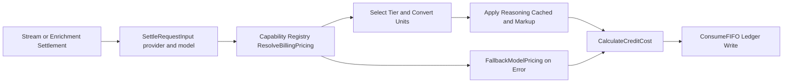

# Pricing Migration Plan: Move Billing Pricing to Capability YAML

## Goal
Move billing settlement pricing from `DefaultModelPricing` in Go to capability YAML so model definition + billing policy live together as one source of truth.

## Scope
- In scope:
  - Pricing migration into capability YAML (including markup, reasoning, cached token pricing)
  - Registry and settler integration
  - Fallback behavior for missing billing config
  - Three confirmed billing fixes:
    - bonus credits grant amount
    - purchased balance view logic
    - `/api/auth/initialize` wiring
- Out of scope:
  - Stripe partial refund redesign (separate fix track)
  - New provider additions

## Design Decisions
1. **Pricing source of truth**: Keep base token pricing in `pricing_tiers` (already in YAML); add a `billing` block for settlement-specific knobs (markup + reasoning/cached multipliers).
2. **Tier selection**: Use model metadata to deterministically select one tier for settlement.
3. **Integer settlement math**: Continue charging in integer millicredits via microusd-per-1K conversion.
4. **Fail-closed fallback**: Keep conservative Go fallback for unknown/malformed pricing so billing never undercharges.

## 1) YAML Schema Changes
### Model-level additions
Add `billing` to each model in capability YAML.

```yaml
models:
  moonshotai/kimi-k2-thinking:
    display_name: "Kimi K2 Thinking"
    pricing_tiers:
      - threshold: null
        input_price:
          text: 0.50
        output_price:
          text: 2.50
    billing:
      markup_basis_points: 1500
      reasoning_price_basis_points: 10000
      cached_input_price_basis_points: 5000
```

Field semantics:
- `markup_basis_points`:
  - settlement markup applied after raw token cost
  - `1500` => +15%
- `reasoning_price_basis_points`:
  - multiplier applied to selected tier `output_price.text`
  - `10000` => reasoning tokens priced equal to output tokens
- `cached_input_price_basis_points`:
  - multiplier applied to selected tier `input_price.text`
  - `5000` => cached tokens priced at 50% of input

### Provider-level defaults (optional but recommended)
Add optional defaults to avoid repeating the same billing block on every model.

```yaml
provider: openrouter
billing_defaults:
  markup_basis_points: 1500
  reasoning_price_basis_points: 10000
  cached_input_price_basis_points: 5000
```

Merge rule:
- Effective model billing config = `billing_defaults` overlaid by `model.billing` (model overrides provider defaults).

## 2) Go Struct Changes (Capability Registry Types)
### `backend/internal/capabilities/types.go`
Add:

```go
type BillingConfig struct {
    MarkupBasisPoints         int64 `yaml:"markup_basis_points" json:"markup_basis_points"`
    ReasoningPriceBasisPoints int64 `yaml:"reasoning_price_basis_points" json:"reasoning_price_basis_points"`
    CachedInputPriceBasisPoints int64 `yaml:"cached_input_price_basis_points" json:"cached_input_price_basis_points"`
}

type ModelCapabilities struct {
    // existing fields...
    Billing *BillingConfig `yaml:"billing" json:"billing,omitempty"`
}

type ProviderCapabilities struct {
    Provider       string               `yaml:"provider" json:"provider"`
    BillingDefaults *BillingConfig      `yaml:"billing_defaults" json:"billing_defaults,omitempty"`
    Models         []ModelCapabilities  `yaml:"-" json:"models"`
}
```

Also add a registry-facing resolved pricing DTO in capabilities package (no billing-domain import):

```go
type BillingPricing struct {
    InputMicrousdPer1K     int64
    OutputMicrousdPer1K    int64
    ReasoningMicrousdPer1K int64
    CachedMicrousdPer1K    int64
    MarkupBasisPoints      int64
}
```

## 3) Registry API for Billing Settler
### New method signature
Add to `backend/internal/capabilities/registry.go`:

```go
func (r *Registry) ResolveBillingPricing(provider, model string) (BillingPricing, error)
```

Behavior:
1. Resolve model via existing candidate matching (`ModelIDCandidates`).
2. Merge provider defaults + model billing overrides.
3. Select the pricing tier from `pricing_tiers`.
4. Convert selected tier `text` prices into microusd-per-1K.
5. Derive reasoning/cached rates using billing basis-point multipliers.
6. Return error if required data is missing/invalid (settler applies fallback).

### Settler integration
- Add `Provider string` to `billingdomain.SettleRequestInput`.
- Pass provider from streaming and enrichment paths.
- Update `NewCreditSettler(...)` to receive `*capabilities.Registry`.
- In `credit_settler.go`, replace Go-map lookup with `capabilityRegistry.ResolveBillingPricing(req.Provider, req.Model)`.

## 4) What Happens to `DefaultModelPricing` and `CalculateCreditCost`
### `DefaultModelPricing`
- Remove after migration.
- Replace tests that depended on the map with:
  - capability-registry pricing resolution tests
  - settlement tests with explicit mock/fixture pricing

### `CalculateCreditCost`
- Keep function and math unchanged.
- It remains the core integer billing function; only pricing source changes.

## 5) `FallbackModelPricing`
Keep `FallbackModelPricing` as conservative guardrail for:
- unknown provider/model
- missing `pricing_tiers`
- missing `text` modality price
- malformed billing config

Fallback behavior:
- Settler logs warning with `provider`, `model`, `turn_id`, `request_index`, `error`.
- Settlement proceeds with fallback to avoid failed billing writes.

## 6) Bridging `pricing_tiers` (USD/1M) to Billing Units (microusd/1K)
### Conversion rules
Given `priceUSDPer1M` from YAML:
- `microusd_per_1k = round(priceUSDPer1M * 1000)`

Then:
- `input = convert(selectedTier.input_price.text)`
- `output = convert(selectedTier.output_price.text)`
- `reasoning = ceilDiv(output * reasoning_price_basis_points, 10000)`
- `cached = ceilDiv(input * cached_input_price_basis_points, 10000)`
- final settlement still uses existing `CalculateCreditCost` (includes markup + min 1 millicredit)

### Tier selection algorithm
For `pricing_tiers`:
1. Candidate baseline: tier with `threshold: null` (if present).
2. Override baseline with highest non-null threshold `<= model.context_window`.
3. If neither exists, return resolution error (settler fallback).

This supports multi-tier models (e.g. Grok) deterministically without request-time ambiguity.

## Pricing Flow


## 7) Step-by-Step Implementation Order

### Step 1: Capability schema + loader changes
Files:
- `backend/internal/capabilities/types.go`
- `backend/internal/capabilities/registry.go`
- `backend/internal/capabilities/registry_test.go`
- `backend/internal/capabilities/config/anthropic.yaml`
- `backend/internal/capabilities/config/openrouter.yaml`

Work:
- Add `billing_defaults` + `model.billing` schema.
- Populate YAML for currently billable models.
- Implement `ResolveBillingPricing(provider, model)` + unit conversion + tier selection.
- Add tests for:
  - provider default + model override merge
  - variant model ID matching
  - missing text pricing returns error

### Step 2: Billing domain + settler wiring
Files:
- `backend/internal/domain/services/billing/settler.go`
- `backend/internal/service/billing/credit_settler.go`
- `backend/internal/service/billing/credit_settler_test.go`
- `backend/internal/service/billing/noop.go`
- `backend/cmd/server/main.go`
- `backend/internal/service/llm/streaming/billing_handler.go`
- `backend/internal/jobs/enrich_generation.go`

Work:
- Add `Provider` to `SettleRequestInput`.
- Pass provider from stream path (`se.provider.Name()`) and enrichment path (`openrouter`).
- Inject capability registry into `NewCreditSettler`.
- Remove `resolvePricing` map lookup; call registry resolver with fallback.
- Update tests for provider-aware settlement and fallback path.

### Step 3: Remove hardcoded pricing map dependencies
Files:
- `backend/internal/domain/models/billing/pricing.go`
- `backend/internal/domain/models/billing/pricing_test.go`
- any tests referencing `DefaultModelPricing`

Work:
- Delete `DefaultModelPricing`.
- Keep `FallbackModelPricing` and `CalculateCreditCost`.
- Rewrite tests to use explicit fixture `ModelPricing` values instead of global map.

### Step 4: Fix bonus credits not granted
Files:
- `backend/internal/service/billing/credit_service.go`
- `backend/internal/service/billing/credit_service_test.go`

Work:
- In checkout fulfillment, change amount to:
  - `(pack.Credits + pack.BonusCredits) * 1000`
- Keep metadata fields but ensure `credits` and `bonus_credits` match granted total semantics.
- Add regression test for `writer` and `novelist` bonus grant amounts.

### Step 5: Fix purchased balance view classification
Files:
- `backend/migrations/<new migration>.sql` (do not edit historical migration in place)
- optionally: repository tests that assert balance split

Work:
- Update `credit_balances` purchased filter from `expires_at IS NULL` to `source_type = 'purchase'`.
- Keep view-level active-lot predicate (`expires_at IS NULL OR expires_at > NOW() OR remaining_millicredits < 0`) so expired lots remain excluded from active balances.
- Add migration-safe `CREATE OR REPLACE VIEW` patch migration.

### Step 6: Wire `/api/auth/initialize` to credit granter
Files:
- `backend/internal/handler/auth_initialize.go` (new)
- `backend/cmd/server/main.go`
- `backend/internal/middleware/auth.go` (only if claim context expansion is needed)
- `backend/internal/httputil/context.go` (only if storing more auth claims)
- `backend/internal/service/billing/credit_granter_test.go` (existing unit coverage)
- new handler tests under `backend/internal/handler/`

Work:
- Add `POST /api/auth/initialize` handler.
- Parse authenticated user context + request metadata (email/provider/verification/ip/user-agent) and call `creditGranter.InitializeSignupCredits`.
- Register route in `main.go` and inject `creditGranter` into new handler.
- Return `InitializeSignupCreditsResult` payload directly.

### Step 7: End-to-end verification
Commands:
- `cd backend && go test ./internal/capabilities/...`
- `cd backend && go test ./internal/service/billing/...`
- `cd backend && go test ./internal/jobs/...`
- `cd backend && go test ./internal/handler/...`
- run migration on local Supabase and smoke:
  - purchase flow grants bonuses
  - balance endpoint purchased split correct for expiring purchase lots
  - auth initialize grants monthly credits idempotently

## Risk Notes and Mitigations
- Risk: tier interpretation mismatch for future models.
  - Mitigation: document selection algorithm and add registry tests per tier shape.
- Risk: provider not passed in settlement path.
  - Mitigation: make `Provider` required in `SettleRequestInput` validation.
- Risk: YAML float precision drift.
  - Mitigation: centralize conversion helper + deterministic rounding tests.

