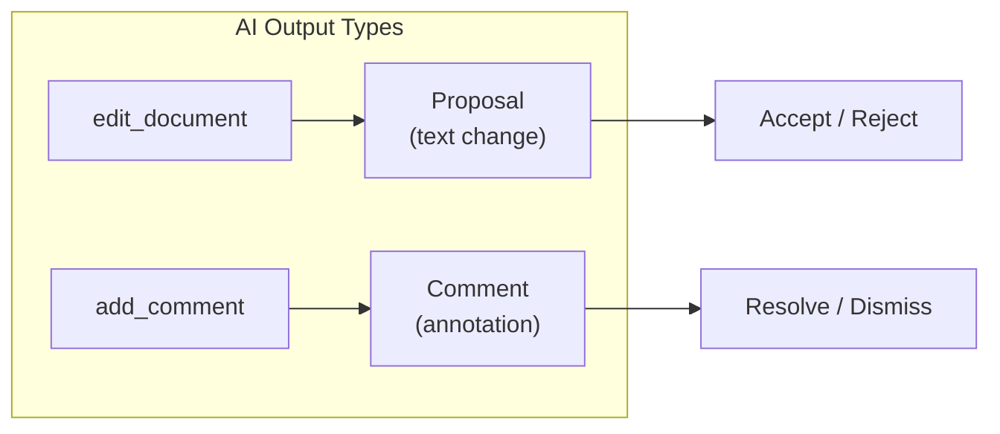
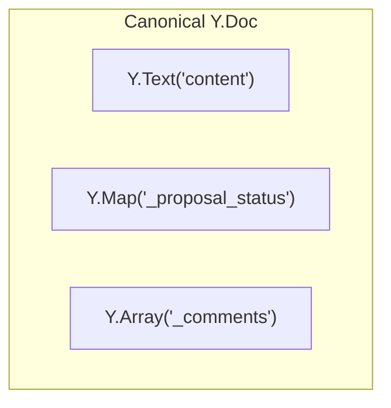
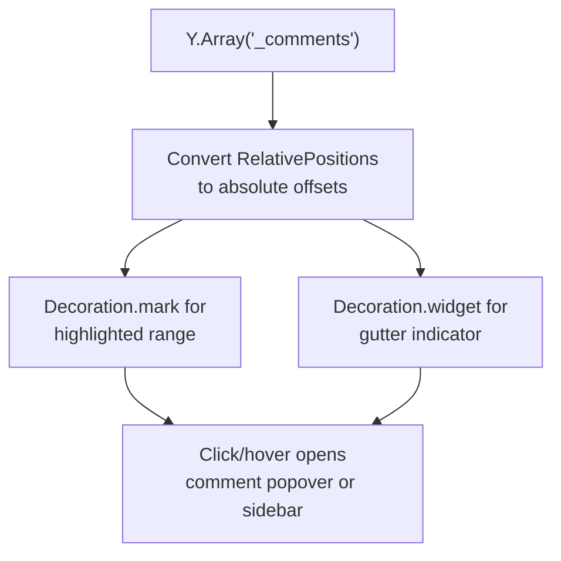
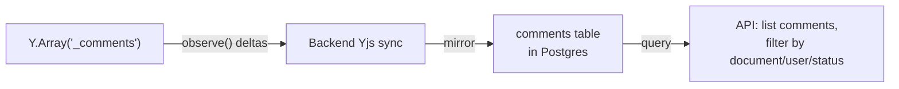

# Review Comments

## Overview

Review comments are **annotations on text ranges** -- distinct from proposals, which are text mutations. A comment says "this section is inconsistent with chapter 3" without modifying the document. Both humans and AI can create comments.



## Data Model

Comments are stored in a `Y.Array('_comments')` on the canonical Y.Doc, alongside the existing `Y.Text('content')` and `Y.Map('_proposal_status')`.



### Comment Structure

Each comment is a `Y.Map` within the `Y.Array`:

| Field | Type | Purpose |
|-------|------|---------|
| `id` | `string` | Unique identifier |
| `anchorStart` | `Y.RelativePosition` | Start of commented range -- survives concurrent edits |
| `anchorEnd` | `Y.RelativePosition` | End of commented range |
| `body` | `string` | Comment text |
| `author` | `string` | User ID or `"ai"` |
| `authorName` | `string` | Display name |
| `createdAt` | `string` | ISO timestamp |
| `resolved` | `boolean` | Whether the comment has been resolved |
| `parentId` | `string \| null` | Parent comment ID for threaded replies |

### Why Y.RelativePosition

Yjs relative positions reference CRDT item IDs, not absolute offsets. When other users insert or delete text around a comment, the anchors move correctly without any remapping logic. This is the same mechanism `y-codemirror.next` uses for remote cursors.

```
Document: "The cat sat on the mat."
Comment anchors: RelPos(item_7) to RelPos(item_10)  -- "cat"

User inserts "black " before "cat":
Document: "The black cat sat on the mat."
Comment anchors: still RelPos(item_7) to RelPos(item_10) -- still "cat"
```

The relative positions resolve to different absolute offsets but always point to the same logical text.

## Undo Interaction

Comments are **excluded** from the session undo stack.

```typescript
// UndoManager tracks text + proposal status, NOT comments
const undoManager = new Y.UndoManager(
  [doc.getText('content'), doc.getMap('_proposal_status')],
  { trackedOrigins: new Set([ORIGIN_HUMAN, ORIGIN_ACCEPT, ORIGIN_REJECT, ORIGIN_THREAD]) }
);

// Y.Array('_comments') is NOT in the UndoManager scope
```

- Adding a comment: not undone by Ctrl-Z (comments are metadata, not content)
- Resolving a comment: reversed by a "Reopen" button, not Ctrl-Z
- Deleting a comment: reversed by a "Restore" action if needed, not Ctrl-Z

This prevents comment operations from interleaving with text editing in the undo stack.

## CM6 Rendering

Same decoration pattern as proposals:



| Element | Decoration type | Behavior |
|---------|----------------|----------|
| Commented text range | `Decoration.mark()` | Subtle highlight (distinct from proposal diff colors) |
| Gutter indicator | `Decoration.widget()` | Comment icon in gutter, click to focus |
| Comment thread | Popover or sidebar panel | Shows comment body, replies, resolve button |

### Re-derive Triggers

Comment decorations rebuild when:
- `Y.Array('_comments')` changes (add, resolve, delete, reply)
- Document text changes that affect absolute positions (re-resolve `RelativePosition` to new offsets)

This is lightweight -- just resolving positions and rebuilding decorations, no diff computation.

## Backend Persistence

Mirror pattern, same as `_proposal_status`:



The Yjs array is the real-time authority. The database table enables queries (e.g., "show all unresolved comments across project") without loading every Y.Doc.

## AI Comments

AI creates comments through an `add_comment` tool, parallel to `edit_document`:

| Tool | Creates | User action |
|------|---------|-------------|
| `edit_document` | Proposal (text change) | Accept / Reject |
| `add_comment` | Comment (annotation) | Resolve / Dismiss / Reply |

An AI can use both in one turn: propose edits for fixable issues, leave comments for things requiring human judgment. This mirrors what a human editor does with track changes + margin comments.

### AI Comment Use Cases

- "This section contradicts the events in chapter 12"
- "Consider strengthening this character's motivation here"
- "The timeline doesn't add up -- day 3 events happen before day 2"
- "This dialogue feels out of character for this speaker"

These are observations, not actionable text changes -- comments, not proposals.

## Scope

**Now / immediate:**
- Data model design (this spec)
- `add_comment` tool definition

**Near-term:**
- CM6 rendering (decorations, popover/sidebar)
- Backend persistence mirror
- Human comment creation UI

**Future:**
- Comment threading (replies)
- Cross-document comment queries
- Comment notifications
- AI-initiated comment resolution suggestions

## Cross-References

- [Architecture](../spec/architecture.md) -- canonical Y.Doc structure
- [Undo Design](../spec/undo.md) -- why comments are excluded from UndoManager
- [Editor Strategy](editor-strategy.md) -- CM6 decoration architecture (same folder)
- `_docs/plans/collab-ai/spec/cm6-library-model.md` -- package boundary
