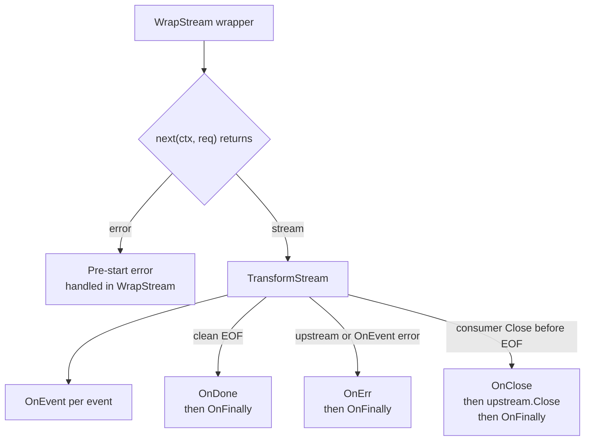

# Generic Middleware Design After Billing Removal

## Context

`meridian-llm-go` is a public Go module. Billing is moving out of the library and into Meridian's backend `StreamExecutor`, so the library loses its only built-in middleware (`UsageMeteringMiddleware`).

The library keeps these primitives:

- `ProviderMiddleware`
- `WrapProvider`
- `TransformStream`
- `StreamInterceptor`

Current stream hook coverage:

- `OnEvent` for per-event observation/transformation
- `OnDone` for clean upstream exhaustion
- `OnErr(error)` for upstream failure
- `OnClose` when the consumer closes early

The open design questions are:

1. Should the library ship any built-in generic middleware on top of those primitives?
2. Do the stream hooks need extra lifecycle coverage for cancellation/failure paths?

## Problem Framing

Billing is a bad fit for library middleware because settlement depends on executor-owned lifecycle state. That does not mean the middleware layer is pointless. It still needs to serve public, generic use cases:

- observability
- policy enforcement
- stream event transformation
- request-scoped wrapping around provider calls

The design should optimize for a small public API that is still pleasant to use for common middleware, especially logging and metrics.

## Recommendation

The library should ship:

- no built-in generic middleware in the core module
- documented examples/recipes for logging, metrics, filtering, and timeout patterns
- one small lifecycle ergonomics addition to `StreamInterceptor`: `OnFinally`

The library should not add:

- a built-in logging middleware
- a built-in metrics middleware
- a built-in timeout middleware
- a built-in content filter middleware
- extra cancellation/failure hooks beyond `OnFinally`

## Why No Built-In Middleware

The core primitives are already the correct abstraction boundary. Built-in middleware only earns its place if it is both:

- broadly useful across consumers of a public Go module
- meaningfully more than a thin, policy-heavy wrapper around `WrapStream` + `TransformStream`

None of the candidate middleware clears that bar today.

## Candidate Evaluation

| Candidate | Generic enough for public module? | Value beyond primitives | Recommendation | Rationale |
|---|---|---|---|---|
| `LoggingMiddleware` | Medium | Low | Do not ship built-in | It is easy to write, but the useful log fields, log level choices, and whether event payloads are safe to log are application-specific. A built-in version would either be too noisy or too configurable to justify its existence. |
| `MetricsMiddleware` | Medium | Medium | Do not ship built-in yet | Metrics are a real cross-cutting need, but the sink, metric names, labels, cardinality rules, and start-error handling all depend on the consumer's telemetry stack. Without a real shared abstraction, the built-in middleware becomes a callback shell that is barely better than user code. |
| `TimeoutMiddleware` | Low | Low | Do not ship built-in | Total request timeout is already handled by `context.WithTimeout` around `StreamResponse` or `GenerateResponse`. A stream-layer timeout middleware would be opinionated about who owns cancellation and whether the timeout is total duration vs idle duration. Those semantics belong to the caller. |
| `ContentFilterMiddleware` | Low | Medium | Do not ship built-in | Event inspection is generic, but filtering policy is not. Different consumers want block, redact, replace, or audit behavior. The library should provide the hook (`OnEvent`), not a policy layer. |
| No built-ins, ship examples | High | High | Ship this | Keeps the public API small while still showing consumers how to compose the primitives correctly, including start-error handling in `WrapStream` and terminal handling in `TransformStream`. |

## What The Library Should Ship Instead

The library should ship a small cookbook instead of production middleware types:

- logging example using `slog`
- metrics example showing TTFB, event count, total duration, and terminal reason
- content filter example using `OnEvent`
- timeout guidance that uses `context.WithTimeout` at the call site

Those examples should cover both:

- `WrapStream`, to show pre-start error handling
- `TransformStream`, to show per-event and terminal-path handling

That gives external consumers useful primitives without freezing premature abstractions into the public API.

## Cancellation And Failure Path Review

### Decision Summary

Only one gap is worth fixing in the stream hook API:

- add `OnFinally` for one-shot terminal observation

The other identified gaps do not justify new hooks.

### Gap Evaluation

| Gap | Real problem? | Recommendation | Rationale |
|---|---|---|---|
| No pre-start failure hook when `StreamResponse()` returns error | No | No API change | This is already covered at the `ProviderMiddleware.WrapStream` level. A middleware can observe `next(ctx, req)` errors before a stream exists. That is the correct layer because there is no stream lifecycle yet. |
| No single hook that runs on every terminal path | Yes | Add `OnFinally` | Logging and metrics are the main generic middleware use cases after billing removal. Today they must duplicate logic across `OnDone`, `OnErr`, and `OnClose`. That is real friction in the exact place the library wants middleware to be easy. |
| `OnClose` has no reason | No | No API change | The library does not know why the consumer chose to close. User action, timeout, quota exhaustion, and application shutdown are all caller-owned reasons. Encoding guessed reasons into the stream API would be misleading. |
| `OnErr` does not classify `context.Canceled` vs `context.DeadlineExceeded` vs provider errors | No | No API change | Middleware can already do `errors.Is(err, context.Canceled)` and `errors.Is(err, context.DeadlineExceeded)`. Any richer taxonomy would be speculative and provider-specific. |

## Concrete API Recommendation

Add one exported terminal-reason type and one new observer hook:

```go
type StreamTerminalReason uint8

const (
    StreamTerminalDone StreamTerminalReason = iota
    StreamTerminalFailed
    StreamTerminalClosed
)

type StreamTerminalInfo struct {
    Reason StreamTerminalReason

    // Err matches the value that stream.Err() will expose.
    // It is nil for Done and Closed terminal states.
    Err error
}

type StreamInterceptor struct {
    // OnEvent runs for each upstream event before the caller sees it.
    // If OnEvent returns a non-nil error, the returned StreamEvent is ignored,
    // upstream is closed, and the error becomes stream.Err().
    OnEvent func(StreamEvent) (StreamEvent, error)

    // OnDone runs exactly once after clean upstream exhaustion.
    // If it returns a non-nil error, that error becomes stream.Err()
    // even though upstream completed cleanly.
    OnDone func() error

    // OnErr runs exactly once after upstream failure.
    // The return value, if non-nil, replaces the upstream error.
    // Return nil to pass through unchanged.
    OnErr func(error) error

    // OnClose runs exactly once when Close() wins before clean exhaustion.
    // It never runs after OnDone.
    OnClose func() error

    // OnFinally runs exactly once after the terminal state is fixed.
    // It is observation-only and does not affect stream.Err() or Close().
    //
    // Done path: runs after OnDone resolves.
    // Error path: runs after OnErr resolves.
    // Close path: runs after OnClose and upstream.Close return.
    OnFinally func(StreamTerminalInfo)
}
```

## TransformStream Behavior Changes

`TransformStream` keeps the existing semantics, plus one final observer callback:



Detailed behavior:

1. `StreamResponse()` start errors remain outside `TransformStream`.
   The middleware handles them in `WrapStream` before returning a stream.

2. If `OnEvent` returns an error:
   - upstream is closed as today
   - terminal state becomes `StreamTerminalFailed`
   - `OnFinally` runs with that failure

3. If upstream ends cleanly:
   - `OnDone` runs as today
   - if `OnDone` returns `nil`, terminal state is `StreamTerminalDone`
   - if `OnDone` returns an error, terminal state is `StreamTerminalFailed`
   - `OnFinally` runs with the final state

4. If upstream ends with an error:
   - `OnErr` runs as today
   - any replacement error becomes the final error
   - `OnFinally` runs with `StreamTerminalFailed`

5. If `Close()` wins before exhaustion:
   - `OnClose` runs as today
   - `upstream.Close()` runs as today
   - the stream terminal state remains `StreamTerminalClosed`
   - `OnFinally` runs once after close cleanup completes

6. Close errors do not become `stream.Err()`.
   They remain `Close()` return values. `OnFinally.Err` therefore stays `nil` on the close path.

## Why `OnFinally` Is The Minimal Fix

`OnFinally` solves the only common ergonomic problem without expanding the stream model:

- metrics can record total duration in one place
- logging can emit one terminal record in one place
- middleware can inspect the final state without duplicating code

It does not introduce:

- retry semantics
- cancellation reasons the library cannot know
- provider-specific error taxonomies
- extra start hooks when `WrapStream` already covers that case

## Example Middleware Shape After This Change

The intended observability pattern becomes:

```go
func LoggingMiddleware(logger *slog.Logger) ProviderMiddleware {
    return providerMiddlewareFunc{
        wrapStream: func(info ProviderCallInfo, next StreamFunc) StreamFunc {
            return func(ctx context.Context, req *GenerateRequest) (*Stream, error) {
                started := time.Now()

                stream, err := next(ctx, req)
                if err != nil {
                    logger.Error("stream start failed", "provider", info.Provider, "error", err)
                    return nil, err
                }

                return TransformStream(stream, StreamInterceptor{
                    OnFinally: func(term StreamTerminalInfo) {
                        logger.Info("stream finished",
                            "provider", info.Provider,
                            "reason", term.Reason,
                            "duration", time.Since(started),
                            "error", term.Err,
                        )
                    },
                }), nil
            }
        },
    }
}
```

That is a good example to publish, but still not strong enough justification to freeze a built-in logging middleware into the library.

## Final Recommendation

After removing billing middleware, `meridian-llm-go` should become a primitives-first library:

- keep `ProviderMiddleware`, `WrapProvider`, `TransformStream`, and `StreamInterceptor`
- remove `UsageMeteringMiddleware` and the `Usage*` types
- ship examples instead of built-in generic middleware
- add `OnFinally` as the only new lifecycle hook

This keeps the public surface small, makes observability middleware noticeably easier, and avoids speculative hooks for problems the library either already covers or cannot know.
