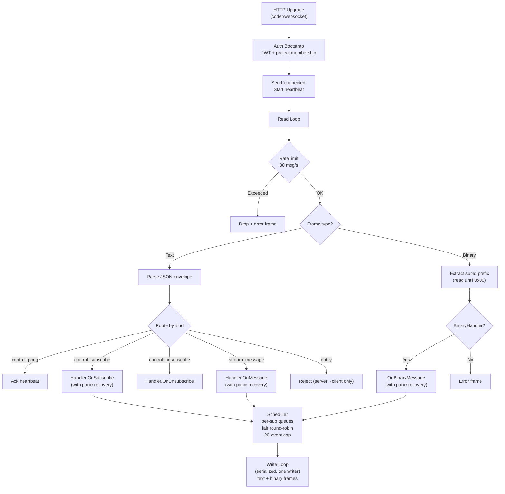

# WS Framework — `backend/internal/wsutil/`

Generic Go framework implementing the [wire protocol](protocol.md). Both [thread WS](thread-ws.md) and [doc WS](doc-ws.md) instantiate this framework with different handlers. The framework is fully generic — not tied to any specific resource type.

## Design Principles

- **Handlers never hold raw connection access.** Framework controls all writes (SRP, write serialization).
- **Per-subscription send queues with fair scheduling.** No hot-stream starvation.
- **Panic recovery per handler.** One handler panic doesn't kill the connection.
- **OCP-compliant.** New real-time features register handlers, don't modify the framework.

## Package Structure

```
backend/internal/wsutil/
  ws.go         — server + conn + lifecycle + scheduler + embedded rate-limit counter
  protocol.go   — envelope types + marshal/unmarshal + validation + router
  auth.go       — JWT bootstrap + heartbeat re-auth
```

## Core Types

### Server

```go
// Server handles WS upgrades and manages connections for a specific endpoint.
// One Server per endpoint (e.g., one for /ws/projects/{id}/threads, one for /ws/projects/{id}/docs).
type Server struct {
    authenticator   Authenticator
    heartbeatCfg    HeartbeatConfig
    rateLimitPerSec int
    readLimit       int64
    originPatterns  []string
    handlers        map[string]Handler  // resource type → handler
    projectConns    *ProjectConnMap
    logger          *slog.Logger
}

func NewServer(opts ...Option) *Server
func (s *Server) RegisterHandler(resourceType string, h Handler)
func (s *Server) Serve(w http.ResponseWriter, r *http.Request)
```

Options pattern for configuration:

```go
WithAuth(auth Authenticator)
WithHeartbeat(interval, timeout time.Duration)
WithRateLimit(msgsPerSec int)
WithReadLimit(bytes int64)
WithOriginPatterns(patterns ...string)
```

### Handler Interface

Handlers are registered per resource type. The framework routes messages to the appropriate handler based on `resource.type` in the envelope.

```go
// Handler processes messages for a specific resource type.
// Implementations: thread streaming handler, doc notification handler.
type Handler interface {
    // OnConnect is called when a new authenticated connection is established.
    // Returns handler-specific state to associate with this connection.
    OnConnect(session Session) (State, error)

    // OnSubscribe handles a subscribe request for a resource.
    // Must be atomic with catchup delivery — see protocol.md subscribe flow.
    OnSubscribe(state State, sub SubscribeRequest) error

    // OnUnsubscribe handles an unsubscribe request.
    OnUnsubscribe(state State, subId string) error

    // OnMessage handles a client→server stream message (e.g., interjection).
    OnMessage(state State, msg Envelope) error

    // OnDisconnect is called when the connection closes. Clean up state.
    OnDisconnect(state State)
}

// State is opaque per-handler state held by the framework.
type State interface{}

// SubscribeRequest contains the parsed subscribe control message.
type SubscribeRequest struct {
    SubId    string
    Resource Resource
    LastSeq  *int64   // nil if first subscribe
    Epoch    *string  // nil if first subscribe
}
```

**Why this shape**: The handler interface separates control-plane operations (`OnSubscribe`, `OnUnsubscribe`) from data-plane messages (`OnMessage`). This lets the framework enforce subscribe/unsubscribe lifecycle semantics while handlers focus on business logic.

### BinaryHandler Interface

Handlers that accept binary frames implement `BinaryHandler` in addition to `Handler`. The framework checks for this interface on binary frame receipt — binary frames to handlers that don't implement it are rejected with an error envelope.

```go
// BinaryHandler is optionally implemented by handlers that accept binary WebSocket frames.
type BinaryHandler interface {
    Handler

    // OnBinaryMessage handles a client→server binary frame.
    // subId is extracted from the binary frame routing prefix (bytes before the 0x00 delimiter).
    // data is the raw payload bytes after the delimiter.
    OnBinaryMessage(state State, subId string, data []byte) error
}
```

This follows ISP — thread handlers that only use JSON text frames don't implement `OnBinaryMessage`. The doc handler implements `BinaryHandler` for Yjs CRDT data.

**Subscription ownership**: The **framework** is the single source of truth for subscription state. It tracks active `subId`s per connection, enforces the 10-subscription limit, and manages per-subscription send queues. Handlers do NOT maintain their own subscription maps — they receive callbacks on subscribe/unsubscribe and manage the business-logic side (registering mstream clients, starting goroutines) without tracking counts or IDs. On disconnect, the framework iterates active subscriptions and calls `EndSub(subId)` for each one; `EndSub` removes tracking, frees the slot, and triggers `OnUnsubscribe` cleanup.

For handlers that don't support subscriptions (e.g., doc notify handler), implement `OnSubscribe`/`OnUnsubscribe`/`OnMessage` as returning `ErrNotSupported`. The framework translates this to an error envelope to the client. Handler/StreamHandler ISP split is deferred (see [backlog.md](../backlog.md)).

### Session

Framework-owned egress API given to handlers. Handlers write messages through this; framework manages scheduling and serialization.

```go
// Session is the framework-owned egress API.
// Handlers send messages through this; framework manages scheduling.
type Session interface {
    // Send queues a message for delivery to this connection.
    // The framework manages per-subscription queues, fair scheduling, and backpressure.
    Send(msg Envelope) error

    // SendToSub queues a stream event for a specific subscription.
    // Routes through the per-subscription queue with count-based backpressure.
    // Uses select with connection context so it never blocks indefinitely.
    // Returns error if the connection is dead.
    SendToSub(subId string, msg Envelope) error

    // SendBinaryToSub queues a binary frame for a specific subscription.
    // The framework prepends the subId routing prefix (subId + 0x00) and writes
    // a binary WebSocket frame. Routes through the same per-subscription queue
    // as SendToSub for fair scheduling and backpressure.
    SendBinaryToSub(subId string, data []byte) error

    // EndSub terminates a subscription from the server side.
    // Called by live-event goroutines when the stream ends.
    // Framework removes subId from tracking, frees the slot,
    // and triggers OnUnsubscribe for cleanup.
    // Idempotent — second call for the same subId is a no-op.
    EndSub(subId string)

    // Notify sends a notify-lane message (bypasses subscription queues).
    Notify(msg Envelope) error

    // Close terminates the connection and triggers OnDisconnect.
    Close(reason string)

    // UserID returns the authenticated user.
    UserID() string

    // ProjectID returns the project this connection is scoped to.
    ProjectID() string

    // ConnectionID returns a unique identifier for this connection.
    ConnectionID() string
}
```

Handlers use `SendToSub` for JSON stream events and `SendBinaryToSub` for binary stream data — both route through per-subscription queues with fair scheduling and backpressure. Use `Notify` for notify-lane events (separate queue, not subject to stream backpressure). Use `Send` for control/error messages. Live-event goroutines call `EndSub` when a stream ends or when a fatal stream-side error/panic requires termination.

### Broadcaster

For project-wide notifications (emit to ALL connections for a project, not just the current one), use the `Broadcaster` interface. This is separate from `Session` (which is per-connection).

```go
// Broadcaster sends notify events to all connections for a project on this server.
// Handlers receive this on construction, not per-connection.
type Broadcaster interface {
    // BroadcastNotify sends a notify-lane message to all connections for the given project.
    BroadcastNotify(projectID string, msg Envelope)
}
```

The `Server` itself implements `Broadcaster`. Service-layer code (proposal service, streaming service) receives a `Broadcaster` to emit project-wide notifications. The `DocNotifier` interface in [doc-ws.md](doc-ws.md) is a typed wrapper around `Broadcaster`.

`Session.Notify()` sends a notify event to the **current connection only**. `Broadcaster.BroadcastNotify()` sends to **all connections for a project**. The typical pattern: service-layer code calls `Broadcaster.BroadcastNotify()`, which internally iterates all sessions and calls each `Session.Notify()`.

`BroadcastNotify` snapshots the project connection list under lock, releases the lock, then calls `Notify()` outside the lock. This prevents deadlock when a write failure during notify triggers connection removal.

### Envelope Types

```go
// Envelope is the generic wire message.
type Envelope struct {
    Kind     string          `json:"kind"`               // control|notify|stream|error
    Op       string          `json:"op"`                 // operation
    Resource *Resource       `json:"resource,omitempty"`  // target resource
    SubId    string          `json:"subId,omitempty"`     // subscription id
    Seq      int64           `json:"seq,omitempty"`       // stream sequence
    Epoch    string          `json:"epoch,omitempty"`     // stream epoch
    Payload  json.RawMessage `json:"payload,omitempty"`   // lane-specific data
}

// Resource identifies a target resource.
type Resource struct {
    Type string `json:"type"` // turn, thread, document, proposal
    Id   string `json:"id"`
}
```

`Payload` is `json.RawMessage` so handlers marshal/unmarshal their own payload types without the framework needing to know the shape.

## Framework Responsibilities



| Concern | Owner |
|---|---|
| WS upgrade (TLS, origin enforcement) | Framework (`coder/websocket`) |
| Pre-auth auth timeout (5s) | Framework |
| JWT-first-message auth + project membership | Framework |
| Heartbeat (ping/pong) + JWT expiry + project re-auth | Framework |
| Inbound rate limiting (30 msg/s) | Framework |
| Envelope parsing and `kind`/`op` routing | Framework |
| Binary frame subId extraction and routing | Framework |
| Per-subscription outbound queues + fair scheduling | Framework |
| Write serialization (one writer at a time) | Framework |
| Per-project connection map for broadcast | Framework |
| Panic recovery per handler call | Framework |
| Resource-type-specific business logic | Handler |
| Resource-type-specific state (subscriptions, sync state) | Handler |

## Backpressure

Per-subscription bounded queues with fair scheduling and count-based backpressure.
v1 uses mstream's existing 20-event count-based buffer per subscription. Byte-budget backpressure is deferred (see [backlog.md](../backlog.md)).

- Each subscription has its own send buffer (capacity: 20 events, matching mstream)
- Fair round-robin across active subscriptions per connection (prevents hot stream starvation)
- Notify lane has its own queue — not subject to stream backpressure
- `SendToSub` is non-blocking relative to connection lifetime (`select` on queue + connection context). If the connection is dead, it returns an error.
- Buffer full (count cap) → subscription enters **gapped** state:
  1. All queued events for that subscription are discarded
  2. A `gap` message is sent to the client
  3. The subscription is **terminated** — framework calls `EndSub(subId)` internally
  4. `EndSub` triggers the handler's `OnUnsubscribe` for cleanup
  5. The client must re-subscribe (or fall back to REST) to resume delivery
  This is intentionally terminal — partial delivery after a gap creates confused client state. The client gets a clean gap signal and decides how to recover.
- Write failures (broken pipe) → mark connection dead, trigger disconnect cleanup

## Connection Lifecycle

1. Client opens WS to endpoint
2. Server validates origin, waits up to 5s for auth
3. Client sends `{ "kind": "control", "op": "auth", "payload": { "token": "jwt..." } }` (5s deadline)
4. Server verifies JWT + project membership
5. Server calls `Handler.OnConnect()` for all registered handlers
6. Server sends `{ "kind": "control", "op": "connected", "payload": { "connectionId": "..." } }`
7. Server starts heartbeat loop (20s interval, re-checks project membership)
8. Client sends messages; framework parses envelope and routes to handlers
9. On disconnect: framework calls `EndSub(subId)` for all active subscriptions, then calls `Handler.OnDisconnect()` for all handlers

## Connection Map (v1)

v1 uses a simple per-project connection map for broadcast. Per-user limits and connection-lookup features are deferred (see [backlog.md](../backlog.md)).

## Security

| Concern | Mechanism |
|---|---|
| Auth | JWT-first-message, 5s timeout |
| Project authorization | `authorizer.CanAccessProject()` on connect |
| Re-authorization | Project membership re-checked on each heartbeat (20s) |
| Origin enforcement | `coder/websocket` origin patterns |
| Frame size | 64KB `ReadLimit` |
| Frame type | Text (JSON) + binary (stream lane, subId-prefixed via `BinaryHandler`) |
| Pre-auth DoS protection | Deferred (see [backlog.md](../backlog.md)); v1 relies on 5s auth timeout |
| Inbound rate limiting | 30 msg/s per connection |
| Panic isolation | Handler calls wrapped in `recover()` |
| Resource-level auth | Handlers re-check authorization on subscribe (e.g., `CanAccessTurn`) |

## Failure Containment

- **Handler panic**: Framework wraps `OnSubscribe`, `OnUnsubscribe`, `OnMessage`, `OnDisconnect` in `recover()`. Panicking handler is disabled for that connection; other handlers continue. Connection stays alive. Panic logged with stack trace. If `OnUnsubscribe` panics during disconnect cleanup, framework continues to the next subscription and still calls `OnDisconnect`.
- **Write failure**: If writing to the WS fails (broken pipe), framework marks connection dead and triggers disconnect cleanup for all handlers.
- **mstream unavailable**: Subscribe returns error to client. Existing subscriptions continue from their live channels.
- **Slow operations**: Subscribe and message handling have per-operation timeouts. On timeout, return error to client.

## Framework Limits

| Concern | Limit | Mechanism |
|---|---|---|
| Inbound rate limit | 30 msg/s | Framework-level rate tracker |
| Inbound frame size | 64KB | `ReadLimit` on accept |
| Notify payload size | 1KB | Framework enforcement |
| Max subscriptions/connection | 10 | Framework counter, reject subscribe |
