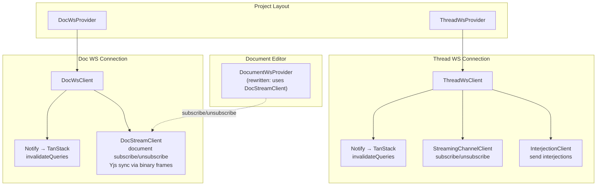

# Frontend Integration

Frontend WebSocket architecture for the [generic protocol](protocol.md). Two provider components manage the two WS connections per project. TanStack Query invalidation pattern connects notify events to cache coherence.

Related: [protocol.md](protocol.md) for wire format, [thread-ws.md](thread-ws.md) and [doc-ws.md](doc-ws.md) for server-side specifics.

## Architecture



## Two Provider Components

Each provider owns a single WS connection, handles auth, heartbeat, reconnect, and dispatches protocol messages.

### ThreadWsProvider

Manages the thread WS connection at `/ws/projects/{projectId}/threads`.

```tsx
<ThreadWsProvider projectId={projectId}>
  <ThreadView />       {/* uses useThreadStreaming() */}
  <SpawnPanel />       {/* reacts to spawn notify events */}
</ThreadWsProvider>
```

**Responsibilities**:
- WS connection lifecycle (connect, auth, reconnect)
- Heartbeat response (pong on ping)
- Route `notify` events to TanStack Query invalidation
- Expose `StreamingChannelClient` for stream subscribe/unsubscribe
- Expose `InterjectionClient` for sending interjections
- Reconnection with exponential backoff + jitter

### DocWsProvider

Manages the doc WS connection at `/ws/projects/{projectId}/docs`.

```tsx
<DocWsProvider projectId={projectId}>
  <DocumentEditor />   {/* subscribes to documents for Yjs sync */}
  <ProposalPanel />    {/* reacts to proposal notify events */}
</DocWsProvider>
```

**Responsibilities**:
- WS connection lifecycle (connect, auth, reconnect)
- Heartbeat response
- Route `notify` events to TanStack Query invalidation
- Expose `DocStreamClient` for document stream subscriptions (Yjs sync)
- Manage document subscribe/unsubscribe lifecycle

### Shared WS Client Base

Both providers share a common WS client base that handles:

- WebSocket connection management (open, close, send)
- Auth bootstrap (send JWT on connect)
- Heartbeat (respond to ping with pong)
- Reconnection (exponential backoff with jitter, epoch validation on reconnect)
- Protocol envelope parsing (dispatch by `kind`)
- Connection state tracking (`disconnected` → `connecting` → `connected` → `reconnecting`)

Pattern follows the existing `DocumentWsProviderImpl` in `frontend-v2/src/editor/collab/document-ws-provider.ts` — same state machine, same reconnection strategy, adapted for the generic protocol envelope format.

## TanStack Query Invalidation

The notify lane is the cache invalidation bus. When a notify event arrives, the client maps it to TanStack Query keys and calls `invalidateQueries`.

```typescript
// Notify event handler (shared pattern for both providers)
function handleNotify(msg: Envelope): void {
  const { resource, payload } = msg
  const event = payload.event as string

  // Map resource + event to query keys
  const keys = getInvalidationKeys(resource.type, resource.id, event)
  
  for (const key of keys) {
    queryClient.invalidateQueries({ queryKey: key })
  }
}

// Key mapping examples
function getInvalidationKeys(
  resourceType: string,
  resourceId: string,
  event: string,
): QueryKey[] {
  switch (resourceType) {
    case "turn":
      return [
        ["turns", resourceId],           // individual turn
        ["turns", resourceId, "blocks"],  // turn blocks
      ]
    case "thread":
      return [
        ["threads", resourceId],          // individual thread
        ["threads", resourceId, "turns"], // thread turns list
      ]
    case "proposal":
      return [
        ["proposals", resourceId],        // individual proposal
        ["proposals"],                    // proposals list
      ]
    case "document":
      return [
        ["documents", resourceId],        // individual document
      ]
    default:
      return []
  }
}
```

### Spawn Discovery via Notify

When `spawn_started` arrives on the thread WS notify lane:

```typescript
function handleSpawnStarted(msg: Envelope): void {
  const { spawnThreadId, spawnTurnId } = msg.payload
  
  // 1. Invalidate spawn list
  queryClient.invalidateQueries({ queryKey: ["threads", parentThreadId, "spawns"] })
  
  // 2. Optionally auto-subscribe for streaming
  if (isActiveThreadView(msg.resource.id)) {
    streamingClient.subscribe(spawnTurnId)
  }
}
```

## StreamingChannelClient

Manages stream subscriptions for turn streaming. Exposed via `useThreadStreaming()` hook.

```typescript
interface StreamingChannelClient {
  // Subscribe to a turn's stream. Returns cleanup function.
  subscribe(turnId: string, options?: {
    lastSeq?: number
    epoch?: string
    onEvent?: (event: AGUIEvent) => void
    onEnded?: (reason: string, metadata: Record<string, unknown>) => void
    onGap?: (fromSeq: number, toSeq: number, cause: string) => void
  }): () => void

  // Unsubscribe from a turn's stream.
  unsubscribe(turnId: string): void

  // Send interjection to a turn.
  sendInterjection(turnId: string, text: string, mode: "append" | "replace"): void

  // Active subscriptions
  readonly activeSubscriptions: Map<string, SubscriptionState>
}
```

### Subscribe Lifecycle

```
1. Client generates subId (e.g., "s-" + uuid)
2. Client sends: { kind: "control", op: "subscribe", resource: { type: "turn", id: turnId }, subId, payload: { lastSeq, epoch } }
3. Server responds: { kind: "control", op: "subscribed", subId, epoch, payload: { headSeq, recovered, catchupCount } }
4. Server sends catchup events: { kind: "stream", op: "event", subId, seq, ... }
5. Server sends live events: { kind: "stream", op: "event", subId, seq, ... }
6. Stream ends: { kind: "stream", op: "ended", subId, payload: { reason, finalSeq, ... } }
```

### Auto-subscribe Behaviors

- **Spawn discovery**: On `spawn_started` notify, auto-subscribe to the spawn's assistant turn
- **Stream switch**: On `ended{reason: "stream_switch"}`, auto-subscribe to `newAssistantTurnId` from payload
- **Reconnect**: On WS reconnect, re-subscribe to all active subscriptions with `{lastSeq, epoch}` from last received event

### Gap Recovery

On receiving a `gap` message for a subscription:
- Track `gapAttempts` per **turnId** on `StreamingChannelClient` (NOT per-subId on `SubscriptionState`). This is critical because re-subscribing creates a new subId — per-subId counters reset on every attempt and never reach the threshold.
- Reset `gapAttempts` to `0` for a turnId when a stream event is received for that turn.
- Two consecutive gap attempts for the same turnId → stop retrying and fall back to REST state.

```typescript
// Per-turnId gap tracking — lives on StreamingChannelClient, not SubscriptionState
private gapAttempts: Map<string, number> = new Map()

async function handleGap(subId: string, turnId: string): Promise<void> {
  const attempts = (this.gapAttempts.get(turnId) ?? 0) + 1
  this.gapAttempts.set(turnId, attempts)

  // 1. Fetch persisted state via REST
  const turn = await fetchTurnWithBlocks(turnId)
  
  // 2. Reconstruct turn state from blocks
  reconstructTurnFromBlocks(turnId, turn.blocks)
  
  // 3. Check for stream switch — discover successor if we missed the WS event
  if (turn.status === "complete" && turn.stop_reason === "stream_switch") {
    const successorId = turn.response_metadata?.successor_turn_id
    if (successorId) {
      // Follow the stream switch chain
      this.gapAttempts.delete(turnId)
      subscribe(successorId, { onEvent, onEnded, onGap: handleGap })
      return
    }
  }
  
  // 4. Decide next action based on turn status
  if (isTerminal(turn.status)) {
    this.gapAttempts.delete(turnId)
    return
  }
  
  if (turn.status === "streaming" && attempts < 2) {
    // First gap — try re-subscribe with fresh catchup (no lastSeq/epoch)
    subscribe(turnId, { onEvent, onEnded, onGap: handleGap })
    return
  }
  
  if (turn.status === "streaming" && attempts >= 2) {
    // Second consecutive gap for this turnId — server has lost the in-memory stream.
    // Stop retrying. Render persisted blocks and wait for notify.
    // This prevents the gap→subscribe→gap livelock.
    this.gapAttempts.delete(turnId)
    return
  }
  
  // If pending, wait for notify event
}

function handleStreamEvent(subId: string, turnId: string, event: AGUIEvent): void {
  // Reset gap counter on successful event delivery
  this.gapAttempts.delete(turnId)
  
  const sub = activeSubscriptions.get(subId)
  if (!sub) return
  sub.onEvent?.(event)
}
```

## DocStreamClient

Manages document stream subscriptions for Yjs sync on the doc WS. Exposed via `useDocStream()` hook. Analogous to `StreamingChannelClient` for threads.

```typescript
interface DocStreamClient {
  // Subscribe to a document for Yjs sync. Returns cleanup function.
  // On subscribe: server sends sync step 1, client processes and responds.
  subscribe(documentId: string, options: {
    ydoc: Y.Doc
    awareness: Awareness
    onSyncEvent?: (data: Uint8Array) => void
    onAwarenessEvent?: (data: Uint8Array) => void
    onEnded?: (reason: string) => void
  }): () => void

  // Unsubscribe from a document.
  unsubscribe(documentId: string): void

  // Send Yjs sync data to the server for a document.
  sendSyncMessage(documentId: string, data: Uint8Array): void

  // Send awareness update to the server for a document.
  sendAwarenessMessage(documentId: string, data: Uint8Array): void

  // Active document subscriptions
  readonly activeDocSubscriptions: Map<string, DocSubscriptionState>
}

interface DocSubscriptionState {
  documentId: string
  subId: string
  connectionState: "subscribing" | "syncing" | "synced"
}
```

### Stream Event Routing

The `DocWsProvider` routes incoming binary frames to `DocStreamClient` by subId (extracted from the binary frame's routing prefix). The client reads the Yjs prefix byte from the raw payload and dispatches:

- `0x00` (sync) → apply via `y-protocols/sync` to the document's Yjs doc
- `0x01` (awareness) → apply via `y-protocols/awareness`

### Client → Server Messages

Yjs doc updates and sync responses are sent as binary frames with the subId routing prefix:

```typescript
// Send Yjs sync data
docStreamClient.sendSyncMessage(documentId, syncData)
// → WsClient.sendBinary(subId, syncData)
//   The WsClient prepends the subId + 0x00 delimiter and sends a binary WebSocket frame.
//   The Yjs prefix byte (0x00 for sync, 0x01 for awareness) is part of the payload.
```

### Reconnect Behavior

On doc WS reconnect, `DocStreamClient` re-subscribes to all active document subscriptions with no `lastSeq`/`epoch` (fresh sync). CRDTs converge naturally — the client and server exchange sync step 1/2 and reach consistent state regardless of what was missed during disconnection.

## DocumentWsProvider Rewrite

The current `DocumentWsProviderImpl` (`frontend-v2/src/editor/collab/document-ws-provider.ts`) manages a per-document WS connection with its own auth, heartbeat, and reconnection. This is replaced by a thin adapter over `DocStreamClient`.

### Current vs New

| Concern | Current (`DocumentWsProviderImpl`) | New |
|---|---|---|
| WS connection | Own per-document WS | Uses project doc WS via `DocStreamClient` |
| Auth | Per-connection JWT auth | Handled by `DocWsProvider` at project level |
| Heartbeat | Own heartbeat loop | Handled by `WsClient` |
| Reconnect | Own exponential backoff | `WsClient` reconnects, `DocStreamClient` re-subscribes |
| Binary sync frames | Direct `socket.send(binary)` | Binary frame with subId routing prefix via `WsClient.sendBinary()` |
| Connection state | Own state machine | Derived from doc WS connection + subscription state |

### New Implementation

```typescript
class DocumentWsProviderImpl implements DocumentWsProvider {
  private readonly documentId: string
  private readonly ydoc: Y.Doc
  private readonly awareness: Awareness
  private readonly docStreamClient: DocStreamClient

  private unsubscribe: (() => void) | null = null
  private readonly syncOrigin = Symbol("doc-ws-provider")

  constructor(args: {
    documentId: string
    ydoc: Y.Doc
    awareness: Awareness
    docStreamClient: DocStreamClient
  }) {
    this.documentId = args.documentId
    this.ydoc = args.ydoc
    this.awareness = args.awareness
    this.docStreamClient = args.docStreamClient

    // Listen for local Yjs doc updates → send to server
    this.ydoc.on("update", this.handleDocUpdate)
  }

  connect(): void {
    this.unsubscribe = this.docStreamClient.subscribe(this.documentId, {
      ydoc: this.ydoc,
      awareness: this.awareness,
      onSyncEvent: (data) => this.handleSyncPayload(data),
      onAwarenessEvent: (data) => this.handleAwarenessPayload(data),
      onEnded: (reason) => this.handleEnded(reason),
    })
  }

  disconnect(): void {
    this.unsubscribe?.()
    this.unsubscribe = null
  }

  sendAwarenessUpdate(update: Uint8Array): void {
    this.docStreamClient.sendAwarenessMessage(this.documentId, update)
  }

  // ... onConnectionState, onControlEvent, destroy delegate to DocStreamClient

  private handleDocUpdate = (update: Uint8Array, origin: unknown): void => {
    if (origin === this.syncOrigin) return
    const encoder = encoding.createEncoder()
    syncProtocol.writeUpdate(encoder, update)
    this.docStreamClient.sendSyncMessage(
      this.documentId,
      encoding.toUint8Array(encoder),
    )
  }

  private handleSyncPayload(data: Uint8Array): void {
    const decoder = decoding.createDecoder(data)
    const encoder = encoding.createEncoder()
    syncProtocol.readSyncMessage(decoder, encoder, this.ydoc, this.syncOrigin)
    const response = encoding.toUint8Array(encoder)
    if (response.length > 0) {
      this.docStreamClient.sendSyncMessage(this.documentId, response)
    }
  }

  private handleAwarenessPayload(data: Uint8Array): void {
    awarenessProtocol.applyAwarenessUpdate(this.awareness, data, this)
  }

  private handleEnded(reason: string): void {
    if (reason === "document_restored") {
      // Emit control event — do NOT auto-reconnect.
      // The restore flow broadcasts before the session is rebuilt,
      // so immediate re-subscribe would hit a frozen session.
      // The editor handles the control event (e.g., shows reload prompt).
      this.emitControl({ type: "document-restored" })
      return
    }
    // Other ended reasons: clean up subscription state
  }
}
```

### Factory Change

The `DocumentWsProviderFactory` signature changes — no longer needs `getAccessToken` (auth handled at connection level), now needs `docStreamClient`:

```typescript
type DocumentWsProviderFactory = (args: {
  documentId: string
  ydoc: Y.Doc
  awareness: Awareness
  docStreamClient: DocStreamClient  // replaces getAccessToken
}) => DocumentWsProvider
```

### DocStreamClient Injection Path

`SessionPool` and `DocSession` construct `DocumentWsProvider` instances outside React context. They need a `DocStreamClient` reference. The injection path:

1. `DocWsProvider` creates `WsClient` + `DocStreamClient` at the project level.
2. `DocWsProvider` exposes `DocStreamClient` via React context alongside `WsClient`.
3. At the project layout level, a `useDocStream()` hook extracts the `DocStreamClient`.
4. `SessionPool` receives the `DocStreamClient` as a constructor parameter (or via a setter called from a React effect when the context value changes).
5. `SessionPool` passes the `DocStreamClient` to the `DocumentWsProviderFactory` when creating providers.

```tsx
// Project layout — inject DocStreamClient into SessionPool
function ProjectLayout({ projectId }: { projectId: string }) {
  const { client: docStreamClient } = useDocStream()
  const sessionPool = useSessionPool()

  useEffect(() => {
    sessionPool.setDocStreamClient(docStreamClient)
  }, [sessionPool, docStreamClient])

  return <DocumentEditor ... />
}
```

This bridges the React context (where `DocStreamClient` lives) with the imperative `SessionPool` (which constructs providers). The `setDocStreamClient` method is a simple property setter — `SessionPool` passes it to the factory on each `getOrCreateSession` call.

## React Integration

### Hooks

```typescript
// Thread streaming hook — manages subscriptions for active thread
function useThreadStreaming(threadId: string): {
  subscribe: (turnId: string) => void
  unsubscribe: (turnId: string) => void
  sendInterjection: (turnId: string, text: string, mode: string) => void
  activeSubscriptions: Map<string, SubscriptionState>
  connectionState: ConnectionState
}

// Document streaming hook — manages Yjs sync subscriptions
function useDocStream(): {
  client: DocStreamClient
}

// Thread WS connection state
function useThreadWsConnection(): {
  state: ConnectionState  // disconnected | connecting | connected | reconnecting
}

// Doc WS connection state
function useDocWsConnection(): {
  state: ConnectionState
}
```

### Component Tree

```tsx
// Project layout (both providers at project level)
<ThreadWsProvider projectId={projectId}>
  <DocWsProvider projectId={projectId}>
    {/* Thread features use thread WS */}
    <ThreadView threadId={threadId} />

    {/* Doc features use doc WS for notifications + Yjs sync */}
    <DocumentEditor documentId={documentId} />  {/* subscribes to doc stream */}
    <ProposalPanel projectId={projectId} />
  </DocWsProvider>
</ThreadWsProvider>
```

## Reconnection Strategy

Both providers use the same reconnection strategy:

```
Base delay: 250ms
Max delay: 5000ms
Min delay: 100ms
Jitter: ±15%
Formula: min(maxDelay, baseDelay * 2^attempt) ± jitter
```

Matches the existing `DocumentWsProviderImpl` reconnection parameters.

On reconnect:
1. Open new WS connection
2. Send auth (JWT)
3. Wait for `connected` response
4. **Thread WS**: Re-subscribe to all active turn subscriptions with `{lastSeq, epoch}` from last received event per subscription. Gap → fall back to REST for that turn.
5. **Doc WS**: Re-subscribe to all active document subscriptions with no `lastSeq`/`epoch` (fresh sync). CRDTs converge naturally — gap recovery is just a full re-sync.

## State Management

Thread streaming state lives in the `StreamingChannelClient`, not in a Zustand/React Query store. The client tracks:

- Active subscriptions (subId → turnId, lastSeq, epoch, callbacks)
- Connection state
- Pending subscribes (queued during reconnect)
- Per-turnId gap attempt counters

React hooks (`useThreadStreaming`, `useThreadWsConnection`) expose reactive snapshots of this state via `useSyncExternalStore`. The `StreamingChannelClient` implements the `subscribe`/`getSnapshot` contract — internal mutations bump a version counter and notify subscribers. This avoids the mutable-Map-without-reactivity trap (mutations to a plain `Map` don't trigger re-renders).

Turn data (blocks, content) continues to live in TanStack Query caches, invalidated by notify events and populated by REST fetches. The streaming channel provides the real-time event pipe; the cache provides the source of truth.

## What Gets Removed

- `ThreadStoreInterface.connectStream()` / `disconnectStream()` (SSE-based)
- SSE `EventSource` usage in thread store
- Any SSE transport types and connection management
- `StreamURL` references in frontend code
- `STREAM_SWITCH` SSE event handling (replaced by `ended{reason: stream_switch}`)
- `DocumentWsProviderImpl` per-document WS connection class (replaced by `DocStreamClient` adapter)
- `buildDocumentWsUrl()` helper (no more per-document WS URLs)
- Direct binary frame handling in document provider (replaced by `DocStreamClient` binary frame routing via subId prefix)

## Key Files

| Area | File | Status |
|---|---|---|
| Thread store (SSE transport) | `frontend-v2/src/features/threads/transport-types.ts` | — |
| Doc WS provider | `frontend-v2/src/features/docs/DocWsProvider.tsx` | Add `DocStreamClient` |
| WS client base | `frontend-v2/src/lib/ws/ws-client.ts` | No changes |
| Protocol types | `frontend-v2/src/lib/ws/protocol.ts` | No changes |
| Notify handler | `frontend-v2/src/lib/ws/notify-handler.ts` | No changes |
| Document WS provider (to rewrite) | `frontend-v2/src/editor/collab/document-ws-provider.ts` | Rewrite to use `DocStreamClient` |
| Session types | `frontend-v2/src/editor/session/types.ts` | Update factory signature |
| Session pool (injection point) | `frontend-v2/src/editor/session/session-pool.ts` | Add `setDocStreamClient()`, update factory calls |
| Doc session | `frontend-v2/src/editor/session/doc-session.ts` | Update provider construction |
