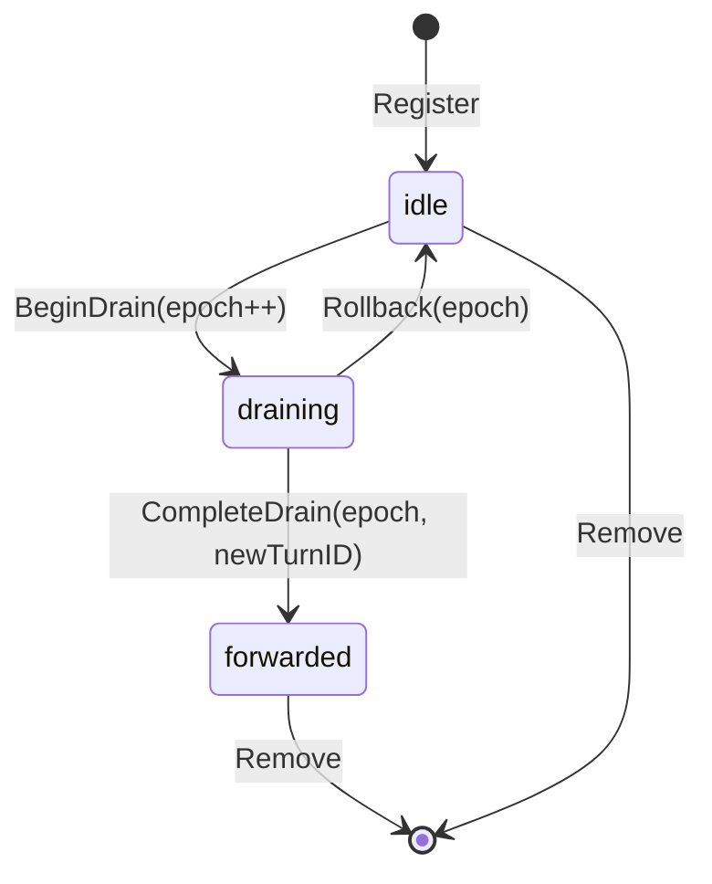

# Interjection Forwarder — Drain Race Fix

Transport-independent fix for the interjection drain race. This lives in the streaming service layer, not the transport layer.

Related: [thread-ws.md](thread-ws.md) for how interjections arrive via WS, [overview.md](overview.md) for context.

## The Race

Two interjection drain points exist in the codebase:

**Point A** — `tool_executor.go:210-272`: After tool results are persisted, checks interjection buffer. If content exists, calls `DrainAndClear()` then `SwitchStream()`.

**Point B** — `completion_handler.go:98-165`: When stream completes without tools, checks interjection buffer. Same drain + switch pattern.

The race:

```
1. DrainAndClear() at tool_executor.go:214 — clears buffer, returns content
2. SwitchStream() at tool_executor.go:230 — DB transactions, turn creation, new stream launch
3. Terminate(ReasonStreamSwitch) at tool_executor.go:270 — triggers cleanup callback
4. Cleanup (stream_runtime.go): executorRegistry.Remove(turnID), interjectionRegistry.Remove(turnID)

Between steps 1 and 4, executor is still registered.
New interjection → UpsertInterjection sees executor exists → writes to fresh buffer → step 4 removes buffer → lost.
```

Confirmed at both interjection points by 6 independent review agents.

## Fix: InterjectionForwarder with Epoch Fencing

### State Machine

Per-turn state transitions:



Three phases per turn:

| Phase | Meaning | Route behavior |
|---|---|---|
| `idle` | Normal operation | Writes to active buffer |
| `draining` | Drain in progress, switch not yet committed | Writes to pending buffer (held) |
| `forwarded` | Switch committed, successor known | Routes internally through successor chain (max 10 hops) |

### Data Structure

```go
type phase uint8
const (
    phaseIdle phase = iota
    phaseDraining
    phaseForwarded
)

type turnEntry struct {
    mu      sync.Mutex
    phase   phase
    epoch   uint64                               // monotonic, prevents stale completions
    target  string                               // newTurnID (forwarded phase only)
    active  *mstream.InMemoryInterjectionBuffer  // normal writes go here
    pending *mstream.InMemoryInterjectionBuffer  // held during drain window
}
```

### API

```go
type InterjectionForwarder struct {
    entries sync.Map // map[turnID]*turnEntry
}

// Register creates a new entry for a turn. Called when a stream executor is created.
func (f *InterjectionForwarder) Register(turnID string) *mstream.InMemoryInterjectionBuffer

// BeginDrain starts the drain window. Called by tool_executor/completion_handler
// before SwitchStream.
// Returns (epoch, drainedContent, ok).
// - epoch: use this to CompleteDrain or Rollback (prevents stale operations)
// - drainedContent: content from the active buffer (what was in the buffer when drain started)
// - ok: false if turnID not found or not in idle phase
func (f *InterjectionForwarder) BeginDrain(turnID string) (epoch uint64, drained string, ok bool)

// CompleteDrain finalizes the drain. Called after SwitchStream succeeds.
// Returns (lateContent, ok).
// - lateContent: content from the pending buffer (arrived during drain window)
//   Caller should forward this to the successor turn.
// - ok: false if epoch doesn't match (stale) or not in draining phase
func (f *InterjectionForwarder) CompleteDrain(turnID string, epoch uint64, newTurnID string) (late string, ok bool)

// Rollback cancels the drain. Called when SwitchStream fails.
// Merges pending buffer back into active buffer. Returns to idle phase.
// Returns false if epoch doesn't match or not in draining phase.
func (f *InterjectionForwarder) Rollback(turnID string, epoch uint64) bool

// Route sends content to the appropriate destination based on turn phase.
// - idle: writes to active buffer
// - draining: writes to pending buffer (held until CompleteDrain or Rollback)
// - forwarded: follows the forwarding chain internally (max 10 hops) and routes
//   to the final destination turn (no caller loop).
// Returns (targetTurnID, held, err)
// - targetTurnID: final routed destination after forwarding resolution
// - held: true if content was buffered in pending (draining phase)
// Returns error if forwarding chain exceeds 10 hops or if a forwarding
// target has been Remove()'d (entry not found). Caller should log the error;
// the interjection is lost in this case (extremely narrow race window).
func (f *InterjectionForwarder) Route(turnID, content, mode string) (targetTurnID string, held bool, err error)

// Remove deletes the entry. Called during executor cleanup.
func (f *InterjectionForwarder) Remove(turnID string)
```

### Epoch Fencing

The `epoch` counter prevents stale completions:

```
Thread 1: BeginDrain(T1) → epoch=1, starts SwitchStream
Thread 2: Some failure causes retry → BeginDrain(T1) again
Thread 1: CompleteDrain(T1, epoch=1) → fails (epoch is now 2, not 1)
```

Each `BeginDrain` increments the epoch. `CompleteDrain` and `Rollback` require the exact epoch from the matching `BeginDrain`. This prevents a slow SwitchStream from corrupting state after a concurrent retry.

### Usage at Drain Points

Replace the current `interjectionBuffer.DrainAndClear()` pattern:

**Before** (current code at tool_executor.go:214):
```go
if interjection, ok := se.interjectionBuffer.DrainAndClear(); ok {
    result, err := se.streamRuntime.SwitchStream(ctx, &SwitchStreamInput{
        InterjectionText: interjection,
        ...
    })
    // ... emit STREAM_SWITCH, terminate
}
```

**After**:
```go
epoch, drained, ok := se.interjectionRouter.BeginDrain(se.turnID)
if !ok {
    // not registered or not idle — skip
    continue
}
if drained == "" {
    // nothing to drain — rollback immediately
    se.interjectionRouter.Rollback(se.turnID, epoch)
    continue
}

result, err := se.streamRuntime.SwitchStream(ctx, &SwitchStreamInput{
    InterjectionText: drained,
    ...
})
if err != nil {
    se.interjectionRouter.Rollback(se.turnID, epoch)
    // handle error
    return err
}

// CRITICAL ORDERING: Register the successor turn in the forwarder BEFORE
// completing the drain. This ensures late-arriving interjections that route
// to the successor via the forwarded phase will find a valid target entry.
// SwitchStream's Launch() already registers the successor's executor (and thus
// its interjection buffer) before returning — so the successor is ready to
// receive routed interjections by the time CompleteDrain sets the forwarded target.

// Drain succeeded — capture any late arrivals
late, _ := se.interjectionRouter.CompleteDrain(se.turnID, epoch, result.AssistantTurn.ID)
if late != "" {
    // Forward late interjection content to the successor turn.
    // Route() will find the successor in idle phase and write to its active buffer.
    // If Route() fails (successor already removed — extremely unlikely race),
    // log the loss. This is a best-effort forward for content that arrived
    // during a ~millisecond window.
    if _, _, err := se.interjectionRouter.Route(result.AssistantTurn.ID, late, "append"); err != nil {
        se.logger.Warn("failed to forward late interjection to successor",
            "old_turn_id", se.turnID,
            "new_turn_id", result.AssistantTurn.ID,
            "late_content_len", len(late),
            "error", err,
        )
    }
}

// Emit ended{reason: stream_switch}, terminate
```

**Ordering guarantee**: `SwitchStream` calls `Launch()` which registers the successor's executor and interjection buffer. `Launch()` returns only after the successor is fully registered. Therefore when `CompleteDrain` sets the forwarded target, the target turn already exists in the forwarder. Any subsequent `Route()` call with the old turn ID will resolve forwarded links internally (max 10 hops) and deliver to a registered destination.

Same pattern at completion_handler.go point B.

## SwitchStream Atomicity Fix

Put old-turn completion + successor-turn creation in one DB transaction. Ordering inside the transaction is:
1. `persistSwitchTurns` first (creates successor turns)
2. update old turn status with `response_metadata.successor_turn_id`

```go
// CURRENT (separate operations — failure window):
err := r.executorDeps.TurnWriter.UpdateTurnStatus(ctx, input.CurrentTurnID, ...)  // step 1
userTurn, assistantTurn, err := r.persistSwitchTurns(ctx, input)                  // step 2

// FIXED (single transaction, successor first):
err := r.executorDeps.TxManager.WithTx(ctx, func(txCtx context.Context) error {
    userTurn, assistantTurn, err = r.persistSwitchTurns(txCtx, input)
    if err != nil {
        return err
    }
    return r.executorDeps.TurnWriter.UpdateTurnStatus(txCtx, input.CurrentTurnID, ..., map[string]any{
        "successor_turn_id": assistantTurn.ID,
    })
})
```

## InterjectionRouter Interface

The `InterjectionRouter` interface wraps the forwarder for use by handlers and service code:

```go
// InterjectionRouter abstracts interjection routing for both HTTP and WS paths.
type InterjectionRouter interface {
    // Route follows forwarding chains internally and returns the final target.
    // Returns error if forwarding depth exceeds 10 hops.
    Route(turnID, content, mode string) (targetTurnID string, held bool, err error)
    BeginDrain(turnID string) (epoch uint64, drained string, ok bool)
    CompleteDrain(turnID string, epoch uint64, newTurnID string) (late string, ok bool)
    Rollback(turnID string, epoch uint64) bool
}
```

The `InterjectionForwarder` implements this interface. Both the HTTP interjection handler and the WS interjection message handler call `Route()` — same service-layer path, different transports.

## Key Files (current codebase)

| Area | File |
|---|---|
| Drain point A | `backend/internal/service/llm/streaming/tool_executor.go:210-272` |
| Drain point B | `backend/internal/service/llm/streaming/completion_handler.go:98-165` |
| Stream runtime (SwitchStream) | `backend/internal/service/llm/streaming/stream_runtime.go:270+` |
| Current interjection buffer | `meridian-stream-go/interjection.go` |
| Current interjection registry | `meridian-stream-go/interjection.go` (`InterjectionRegistry`) |
| Interjection service | `backend/internal/service/llm/streaming/interjection.go` |
