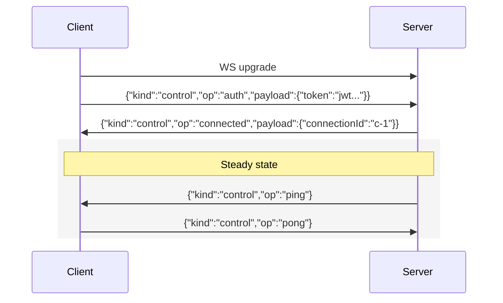
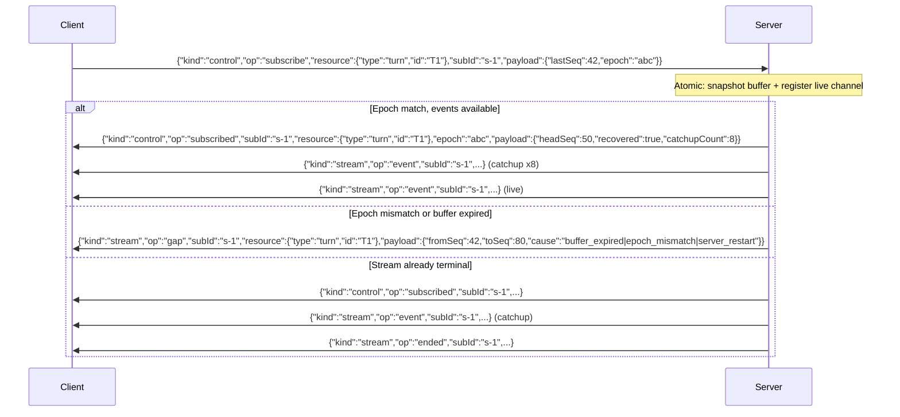

# Generic Wire Protocol

The wire protocol is the reusable foundation for all project-scoped WebSocket connections. Both thread WS and doc WS use this identical format. The protocol and its Go implementation (`wsutil` package) are fully generic — not tied to any specific resource type.

Related: [framework.md](framework.md) for the Go implementation, [thread-ws.md](thread-ws.md) and [doc-ws.md](doc-ws.md) for how each connection instantiates the protocol.

## Envelope Format

Every message uses a single JSON envelope with a `kind` discriminator:

```json
{
  "kind": "control|notify|stream|error",
  "op": "string",
  "resource": { "type": "string", "id": "string" },
  "subId": "string",
  "seq": 0,
  "epoch": "string",
  "payload": {}
}
```

| Field | Required | Description |
|---|---|---|
| `kind` | Always | Lane discriminator: `control`, `notify`, `stream`, `error` |
| `op` | Always | Operation within the lane (see per-lane tables below) |
| `resource` | When applicable | Resource target: `{ "type": "turn", "id": "uuid" }` |
| `subId` | Stream lane | Subscription identifier (client-generated on subscribe) |
| `seq` | Stream events | Monotonic sequence number within a subscription |
| `epoch` | Stream subscribe/events | Ephemeral stream instance identifier |
| `payload` | When applicable | Lane-specific data |

**Text frames** carry JSON envelopes (control, notify, stream events with JSON payloads, errors). **Binary frames** carry raw binary data for stream lane subscriptions that opt into binary transport (e.g., Yjs CRDT sync). See [Binary Frames](#binary-frames) below.

## Binary Frames

Binary frames carry raw binary data for stream lane subscriptions. Only handlers that opt into binary transport use binary frames — all other communication uses JSON text frames.

### Frame Format

`<subId UTF-8 bytes> 0x00 <raw binary payload>`

The subId routing prefix is the UTF-8-encoded subscription ID, terminated by a single null byte (`0x00`). Everything after the null byte is the raw binary payload delivered to the handler. The framework reads bytes until the first `0x00` to extract the subId, looks up the subscription, and delivers the remaining bytes — no JSON parsing on the binary path.

Both directions (client → server and server → client) use the same framing. The client includes the subId prefix when sending binary data; the server includes it when broadcasting binary data to subscribers.

### Seq/Epoch

Binary frames do not carry `seq` or `epoch` fields. The framework tracks per-subscription event counts internally for backpressure. Gap and ended signals are always JSON text frames with full envelope metadata.

### Scope

| Lane | Frame Type | Notes |
|---|---|---|
| Control | Text (JSON) | Auth, subscribe, unsubscribe, heartbeat |
| Notify | Text (JSON) | Invalidation hints |
| Stream — JSON events | Text (JSON) | `event`, `ended`, `gap` with JSON payloads (e.g., AG-UI) |
| Stream — binary data | Binary | Raw binary with subId prefix (e.g., Yjs CRDT) |
| Error | Text (JSON) | Error responses |

Binary frames without a valid subId prefix (no null byte found) or with an unrecognized subId are rejected with a JSON error text frame.

## Control Lane

Connection lifecycle and subscription management. All control messages have `"kind": "control"`.

### Connection Lifecycle



**Auth**: Client sends JWT as first message within 5 seconds. Server verifies token + project membership via `bootstrapProjectAuth()`. Failure → error frame + close.

**Heartbeat**: Server sends `ping`, expects `pong`. 20s interval, 20s timeout. On each heartbeat cycle, server re-checks JWT expiry AND project membership. Failure → close connection.

### Client → Server Control Messages

| Op | Fields | Description |
|---|---|---|
| `auth` | `payload.token` | JWT authentication (first message) |
| `pong` | — | Heartbeat response |
| `subscribe` | `resource`, `subId`, `payload.lastSeq?`, `payload.epoch?` | Subscribe to stream lane for a resource |
| `unsubscribe` | `subId` | Unsubscribe from a stream |

### Server → Client Control Messages

| Op | Fields | Description |
|---|---|---|
| `connected` | `payload.connectionId` | Auth succeeded, connection ready |
| `ping` | — | Heartbeat probe |
| `subscribed` | `subId`, `resource`, `epoch`, `payload.headSeq`, `payload.recovered`, `payload.catchupCount` | Subscription confirmed with replay state |
| `unsubscribed` | `subId` | Subscription removed |

### Subscribe Flow



Subscribe MUST be atomic with catchup replay. The framework delegates to the handler's subscribe implementation, which uses `SubscribeWithCatchup` from mstream (atomically: snapshot buffer → register live channel → return catchup events + live channel).

## Notify Lane

Always-on, lightweight invalidation hints. Server → client only. No subscription required — all notify events for the connection's resource scope are delivered automatically.

```json
{
  "kind": "notify",
  "op": "invalidate",
  "resource": { "type": "turn", "id": "T1" },
  "payload": {
    "event": "completed",
    "version": 42
  }
}
```

### Constraints

- **Small payloads only.** No full state, no CRDT ops, no block content. Maximum 1KB per notify message.
- **No subscription required.** Client receives all notify events for resources within the connection's project scope.
- **Idempotent consumption.** Client uses notify to invalidate cache keys (TanStack Query `invalidateQueries`). Duplicate or out-of-order notifies are harmless — they just trigger a refetch.

### Notify Fields

| Field | Description |
|---|---|
| `resource.type` | Resource kind: `turn`, `thread`, `document`, `proposal` |
| `resource.id` | Resource identifier |
| `payload.event` | What happened: `completed`, `error`, `cancelled`, `spawn_started`, `updated`, `created` |
| `payload.version` | Optional monotonic version for de-duplication |
| `payload.*` | Event-specific metadata (e.g., `parentTurnId` for spawn_started) |

## Stream Lane

Opt-in heavy data delivery. Client must `subscribe` via the control lane before receiving stream events. Supports seq/epoch for replay, gap detection, and backpressure.

### Server → Client Stream Messages

| Op | Fields | Description |
|---|---|---|
| `event` | `subId`, `resource`, `seq`, `epoch`, `payload` | Stream data event (AG-UI event, etc.) |
| `ended` | `subId`, `resource`, `seq`, `payload.reason`, `payload.finalSeq`, `payload.*` | Stream terminated |
| `gap` | `subId`, `resource`, `payload.fromSeq`, `payload.toSeq`, `payload.cause` | Replay unavailable, client must fallback to REST |

### Client → Server Stream Messages

| Op | Fields | Description |
|---|---|---|
| `message` | `resource`, `payload` | Client-to-server JSON data (e.g., interjection) |

For binary data (e.g., Yjs CRDT sync), clients send **binary frames** with the subId routing prefix instead of JSON stream messages. See [Binary Frames](#binary-frames).

### Stream Event Delivery

Events are delivered with monotonic `seq` within a subscription. `epoch` identifies the stream instance — ephemeral (in-memory), not persisted.

```json
{
  "kind": "stream",
  "op": "event",
  "subId": "s-1",
  "resource": { "type": "turn", "id": "T1" },
  "seq": 43,
  "epoch": "abc-123",
  "payload": { "type": "TEXT_DELTA", "text": "Hello" }
}
```

### Stream Ended

```json
{
  "kind": "stream",
  "op": "ended",
  "subId": "s-1",
  "resource": { "type": "turn", "id": "T1" },
  "seq": 184,
  "epoch": "abc-123",
  "payload": {
    "reason": "completed|error|cancelled|stream_switch",
    "finalSeq": 184,
    "newAssistantTurnId": "uuid (stream_switch only)"
  }
}
```

`ended` is the only stream termination signal. `stream_switch` reason carries `newAssistantTurnId` — replaces SSE `STREAM_SWITCH` event entirely.

After sending `ended`, the framework calls `EndSub(subId)` to free the subscription slot and run unsubscribe cleanup. The client does NOT need to send an explicit `unsubscribe` after receiving `ended`.

### Gap Recovery

When the client receives a `gap` message:

1. Client calls `GET /api/turns/{turnId}/blocks` — returns persisted blocks + turn status
2. Client reconstructs turn state from blocks (same as initial page load)
3. If turn status is terminal (`complete`/`error`/`cancelled`): done, no re-subscribe
4. If turn status is `streaming` AND stream exists in server memory: client sends a fresh `subscribe` with no `lastSeq`/`epoch` (full catchup from current buffer)
5. If turn status is `streaming` BUT subscribe returns another `gap`: **stop retrying** — the server has lost the in-memory stream (restart or crash). Client treats the turn as terminal, renders persisted blocks, and waits for a `completed`/`error` notify event. This prevents the gap→subscribe→gap livelock.
6. If turn status is `pending`: client waits for notify event

This is the same recovery path as a fresh page load — gap handling degrades to REST, which is always correct. The "two gaps = stop" rule prevents livelock when the server has restarted and the stream is only in memory.

### Successor Discovery on Missed `stream_switch`

If the client misses an `ended{reason: "stream_switch"}` (e.g., WS was disconnected during the switch), the client can discover the successor via REST:

- `GET /api/turns/{turnId}/blocks` returns the turn with `status: complete` and `stop_reason: stream_switch`
- The turn's `response_metadata` contains `successor_turn_id` — the new assistant turn to subscribe to
- This field is set by `SwitchStream` when it creates the successor turn

This ensures the client can always follow the stream switch chain even without the WS event. The REST response is the source of truth; the WS event is a fast path.

## Error Lane

Error messages from server to client:

```json
{
  "kind": "error",
  "op": "error",
  "payload": {
    "code": "SUBSCRIBE_FAILED|RATE_LIMITED|AUTH_FAILED|INVALID_MESSAGE",
    "message": "human-readable description"
  },
  "subId": "s-1",
  "resource": { "type": "turn", "id": "T1" }
}
```

Error codes are generic externally — no turn-existence oracle (subscribe to a turn you can't access returns same error as subscribing to a nonexistent turn). Details in server logs.

`subId` and `resource` are included when the error relates to a specific subscription or resource. Omitted for connection-level errors.

## Epoch Semantics

- `epoch` is ephemeral (in-memory, per-stream instance). NOT persisted to DB.
- `epoch` is a random UUID string. Comparison is string equality only (no ordering semantics).
- Server restart = all epochs gone. Client reconnects, sends old epoch → server doesn't recognize → `gap` → client falls back to REST.
- Server restart generates new UUID epochs by definition.
- Explicitly non-resumable after restart. No false-positive replay.
- Within a server lifetime: epoch is stable per stream instance, seq is monotonic.

## Rate Limiting

30 inbound messages/second per connection. Excess messages dropped silently after an initial `error` notification.

## Frame Limits

| Concern | Limit |
|---|---|
| Max inbound frame size | 64KB (`ReadLimit` on accept) |
| Notify payload max | 1KB |
| Text frames | JSON envelopes (control, notify, stream, error) |
| Binary frames | Stream lane binary data, subId-prefixed ([Binary Frames](#binary-frames)) |

## Malformed Message Handling

- Invalid JSON → `error` frame with `INVALID_MESSAGE` code
- Missing `kind` → `error` frame with `INVALID_MESSAGE` code
- Unknown `kind` → `error` frame with `INVALID_MESSAGE` code
- Unknown `op` within a valid `kind` → silently ignored (forward compatibility)
- Valid `kind`/`op` but bad payload → error specific to the operation
- Binary frame with no null byte delimiter → `error` frame with `INVALID_MESSAGE` code
- Binary frame with unrecognized subId → `error` frame with `INVALID_MESSAGE` code
- Binary frame to a handler that doesn't support binary transport → `error` frame with `INVALID_MESSAGE` code
