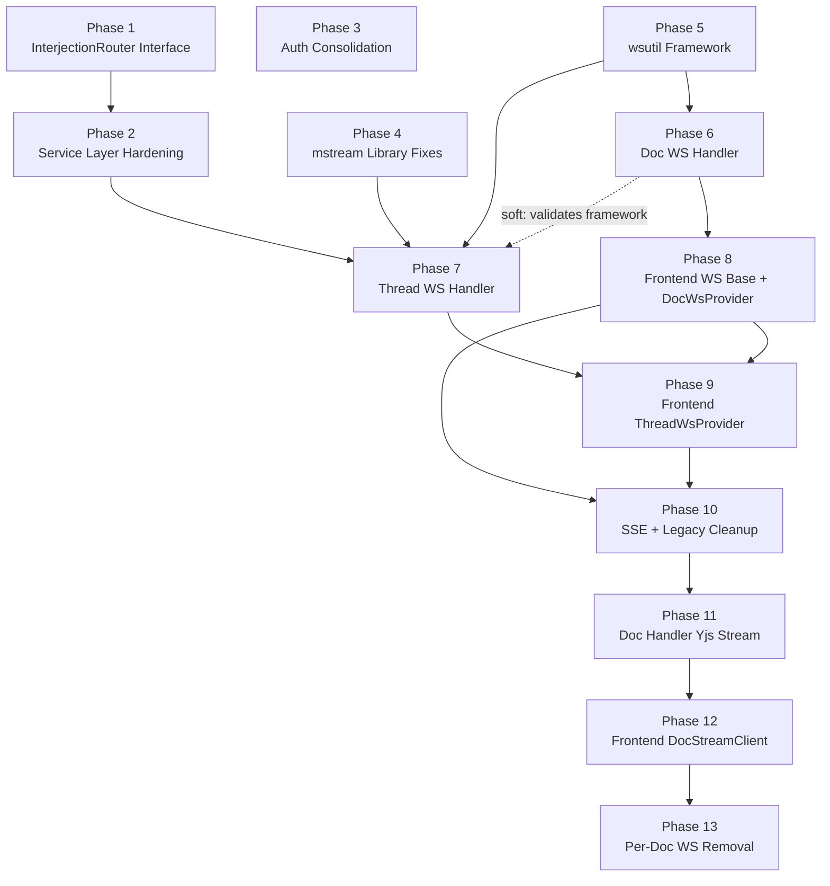

# WebSocket Streaming Migration — Implementation Plan

## Phase Summary

13 phases across 8 execution rounds. Phases 1-10 (WS transport migration) are complete. Phases 11-13 (Yjs CRDT sync multiplexing) are the current work.

Critical path: Phase 1 → Phase 2 → Phase 7 → Phase 9 → Phase 10 → Phase 11 → Phase 12 → Phase 13.

| Phase | Name | Size | Round | Dependencies | Status |
|-------|------|------|-------|-------------|--------|
| 1 | InterjectionRouter Interface | Medium | 1 | None | done |
| 2 | Service Layer Hardening | Large | 2 | Phase 1 | done |
| 3 | Auth Consolidation | Small | 1 | None | done |
| 4 | mstream Library Fixes | Medium | 1 | None | done |
| 5 | wsutil Framework | Large | 1 | None | done |
| 6 | Doc WS Handler | Medium | 2 | Phase 5 | done |
| 7 | Thread WS Handler | Large | 3 | Phases 2, 4, 5, 6 (soft) | done |
| 8 | Frontend WS Base + DocWsProvider | Medium | 3 | Phase 6 | done |
| 9 | Frontend ThreadWsProvider + Streaming | Large | 4 | Phases 7, 8 | done |
| 10 | SSE + Legacy Cleanup | Medium | 5 | Phases 8, 9 | done |
| 11 | Doc Handler Yjs Stream Support | Large | 6 | Phases 1-10 | planned |
| 12 | Frontend DocStreamClient + Provider Rewrite | Large | 7 | Phase 11 | planned |
| 13 | Per-Document Yjs WS Removal | Small | 8 | Phases 11, 12 | planned |

## Dependency Graph



## Execution Rounds

```
Round 1:  Phase 1 ──── Phase 3 ──── Phase 4 ──── Phase 5         ✓ done
          (InterjectionRouter) (Auth)  (mstream)   (wsutil)

Round 2:  Phase 2 ──────────── Phase 6                            ✓ done
          (Service Hardening)  (Doc WS Handler)

Round 3:  Phase 7 ──────────── Phase 8                            ✓ done
          (Thread WS Handler)  (Frontend Doc WS)

Round 4:  Phase 9                                                 ✓ done
          (Frontend Thread WS)

Round 5:  Phase 10                                                ✓ done
          (SSE + Legacy Cleanup)

Round 6:  Phase 11                                                ← current
          (Doc Handler Yjs Stream Support)

Round 7:  Phase 12
          (Frontend DocStreamClient + Provider Rewrite)

Round 8:  Phase 13
          (Per-Document Yjs WS Removal)
```

Rounds 6-8 are strictly sequential — each depends on the previous. No parallelism available because backend handler (11) must exist before frontend client (12), and both must be proven before deletion (13).

## Design Decisions Embedded in This Plan

| Decision | Rationale |
|----------|-----------|
| Merge R4+R10 into Phase 1 | Both touch SwitchStream path in same files. Doing them together avoids rework. |
| Merge R6+R9+R7+InterjectionForwarder into Phase 2 | All are service-layer changes to the same ~6 files. Sequential execution with Phase 1 is unavoidable due to file overlap; merging reduces rounds. |
| Phase 3 (Auth) runs in Round 1 despite being needed later | No hard dependencies block it. Earlier completion means wsutil auth wiring is simpler. |
| Doc WS before Thread WS | Simpler handler validates the wsutil framework before the complex handler builds on it. |
| Frontend shared WS base ships with DocWsProvider | Validates the base client with the simpler consumer before ThreadWsProvider adds streaming complexity. |
| SSE cleanup is the final phase (of Round 1-10) | Keep SSE working as fallback until all WS paths are proven end-to-end. |
| Yjs phases are strictly sequential (11→12→13) | Backend handler must exist before frontend client, both must be proven before per-doc WS removal. No parallelism possible — each phase depends on the previous. |
| Per-doc WS removal is a separate phase | Keep the old per-document WS handler alive during Phase 11-12 as a fallback. Only delete after the new path is proven end-to-end. |

## What's Deferred (Not in This Plan)

Per [backlog.md](../backlog.md): byte-budget backpressure, per-user connection limits, pre-auth DoS protection, Handler/StreamHandler ISP split, notify auth filtering. All have GH issues and known triggers.
