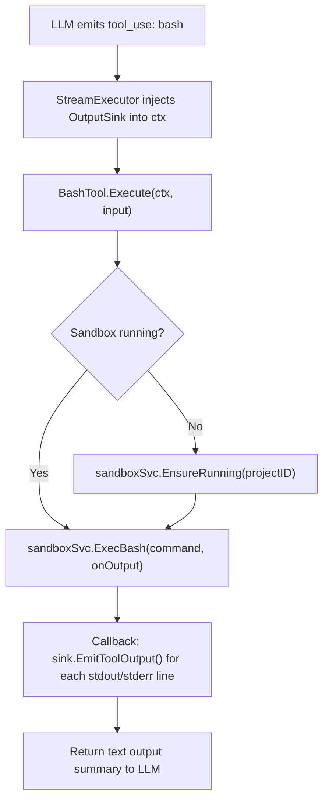

# Bash Tool (Shell Commands)

`ToolExecutor` that runs shell commands in the Daytona sandbox. Companion to the [python tool](python-tool.md). Used for file operations, package installs, and non-Python tasks. See [overview](../overview.md) for system context.

**Not for Python execution** — the AI uses the `python` tool for all Python code. The bash tool handles everything else: writing files, installing packages, listing directories, managing the sandbox filesystem.

## Tool Schema (LLM-facing)

```json
{
  "name": "bash",
  "description": "Run shell commands in the project sandbox. Use for file operations, pip install, and non-Python tasks. For Python code, use the python tool instead.",
  "input_schema": {
    "type": "object",
    "properties": {
      "command": {
        "type": "string",
        "description": "Shell command to execute in the sandbox."
      },
      "timeout_seconds": {
        "type": "integer",
        "description": "Maximum execution time in seconds. Default 120, max 600.",
        "default": 120
      }
    },
    "required": ["command"]
  }
}
```

## Architecture Constraint: Tool-Emitter Boundary

Same pattern as the python tool — `OutputSink` injected into context by `StreamExecutor`. See [display-results.md](display-results.md) for the OutputSink interface.

## Interface

```go
// backend/internal/service/llm/tools/bash_tool.go

type BashTool struct {
    sandboxSvc  sandbox.Service
    datasetSvc  datasets.Service
    projectID   uuid.UUID
    userID      uuid.UUID
}

func (t *BashTool) Execute(ctx context.Context, input map[string]interface{}) (interface{}, error)
```

## Execution Flow



Simple: run the command, stream output, return result. No kernel, no result.json reading, no display result emission.

```go
func (t *BashTool) Execute(ctx context.Context, input map[string]interface{}) (interface{}, error) {
    command, _ := input["command"].(string)
    sink := tools.OutputSinkFromContext(ctx)

    if err := t.ensureSandboxReady(ctx); err != nil {
        return nil, err
    }

    seq := 0
    onOutput := func(stream, text string) {
        if sink != nil {
            sink.EmitToolOutput(stream, text, seq)
            seq++
        }
    }

    result, err := t.sandboxSvc.ExecBash(ctx, t.projectID, command, onOutput)
    if err != nil { return nil, err }

    return &BashResult{
        ExitCode: result.ExitCode,
        Stdout:   result.Stdout,
        Stderr:   result.Stderr,
    }, nil
}
```

## Registration

```go
func (b *ToolRegistryBuilder) WithBashTool(sandboxSvc sandbox.Service, datasetSvc datasets.Service) *ToolRegistryBuilder {
    if sandboxSvc == nil {
        return b
    }
    tool := NewBashTool(b.projectID, b.userID, sandboxSvc, datasetSvc)
    b.registry.RegisterWithMetadata("bash", tool, BashToolMetadata())
    return b
}
```

## Metadata

```go
func BashToolMetadata() *ToolMetadata {
    return &ToolMetadata{
        Name:        "bash",
        Description: "Run shell commands in the project sandbox",
        Guideline:   "For file operations, pip install, system commands. Write Python modules to .py files here, then run them with the python tool. Datasets at /workspace/datasets/{slug}/.",
    }
}
```

## Dataset Hydration

Same pattern as python tool — automatically hydrates datasets on first sandbox startup:

```go
func (t *BashTool) ensureSandboxReady(ctx context.Context) error {
    _, err := t.sandboxSvc.EnsureRunning(ctx, t.projectID)
    if err != nil { return err }

    datasets, err := t.datasetSvc.List(ctx, t.userID, t.projectID)
    if err != nil { return err }

    var datasetIDs []uuid.UUID
    for _, ds := range datasets {
        if ds.Status == datasets.DatasetStatusReady {
            datasetIDs = append(datasetIDs, ds.ID)
        }
    }
    if len(datasetIDs) > 0 {
        return t.sandboxSvc.HydrateDatasets(ctx, t.projectID, datasetIDs)
    }
    return nil
}
```

## File Access

```
/workspace/datasets/{dataset_slug}/    # DICOM files from Supabase Storage (auto-hydrated)
/workspace/outputs/                    # Generated files (figures, meshes, CSVs)
/workspace/.meridian/                  # Helper modules, result.json, meshes/
/workspace/scripts/                    # AI-written Python modules
```

## Error Handling

| Error | Behavior |
|-------|----------|
| Sandbox not running, start fails | Return structured error to LLM: "Sandbox unavailable" |
| Timeout exceeded | Kill process, return timeout error |
| Daytona API unreachable | Return service unavailable error |
| Command fails (non-zero exit) | Return stderr + exit code to LLM |

## Security

Same sandbox isolation as the python tool. See [python-tool.md](python-tool.md) for details.

## Related Docs

- [Python Tool](python-tool.md) — companion tool for Python execution + result capture
- [Daytona Service](daytona-service.md) — sandbox lifecycle
- [Display Result Pipeline](display-results.md) — event transport (used by python tool, not bash)
