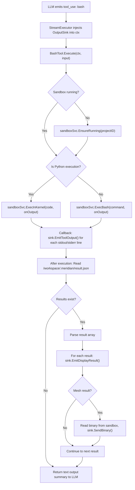

# Bash Tool (Daytona Sandbox)

New `ToolExecutor` that runs commands in a persistent Daytona sandbox. Primary tool for the data-analyst agent. The AI uses this to write Python files, run scripts, install packages, and manage files in the sandbox. See [overview](../overview.md) for system context.

**Replaces**: the previously-designed `execute_python` ToolExecutor. The bash tool is more general — the AI runs any shell command, not just Python code. Python scripts execute through a persistent Jupyter kernel for variable persistence.

## Architecture Constraint: Tool-Emitter Boundary

The existing `ToolExecutor` interface is synchronous:
```go
type ToolExecutor interface {
    Execute(ctx context.Context, input map[string]interface{}) (interface{}, error)
}
```

Tools cannot hold emitter references — the emitter is created at stream-execution time. **Solution**: The `StreamExecutor` injects an `OutputSink` into the execution context before calling `tool.Execute()`. See [display-results.md](display-results.md) for the OutputSink interface.

## Tool Schema (LLM-facing)

```json
{
  "name": "bash",
  "description": "Run commands in the project sandbox. Python scripts execute in a persistent kernel (variables and imports survive between runs). Packages pre-installed: numpy, scipy, pandas, SimpleITK, pydicom, scikit-image, trimesh, plotly, matplotlib. Use show_plotly(), show_matplotlib(), show_dataframe(), show_mesh() in Python to render results inline.",
  "input_schema": {
    "type": "object",
    "properties": {
      "command": {
        "type": "string",
        "description": "Shell command to execute in the sandbox. For Python scripts, use 'python3 script.py'. For multi-line Python, write to a .py file first then run it."
      },
      "timeout_seconds": {
        "type": "integer",
        "description": "Maximum execution time in seconds. Default 120, max 600.",
        "default": 120
      }
    },
    "required": ["command"]
  }
}
```

## Interface

```go
// backend/internal/service/llm/tools/bash_tool.go

type BashTool struct {
    sandboxSvc  sandbox.Service
    datasetSvc  datasets.Service
    projectID   uuid.UUID
    userID      uuid.UUID
}

func (t *BashTool) Execute(ctx context.Context, input map[string]interface{}) (interface{}, error)
```

No emitter field. Streaming happens via `OutputSinkFromContext(ctx)`.

## Execution Flow



### Python Detection

The tool detects Python execution to route through the persistent kernel:

```go
func isPythonExecution(command string) bool {
    // Match: python3 script.py, python script.py, python3 -c "...", python -m module
    // Does NOT match: file operations, pip install, etc.
    cmd := strings.TrimSpace(command)
    return strings.HasPrefix(cmd, "python3 ") ||
           strings.HasPrefix(cmd, "python ") ||
           cmd == "python3" || cmd == "python"
}

func extractPythonArgs(command string) (scriptOrCode string, isFile bool) {
    // "python3 script.py" → ("script.py", true)
    // "python3 -c 'code'" → ("code", false)
    // "python3 -m module" → stays as bash (module execution)
}
```

When a Python file is detected, the tool reads the file content from the sandbox and sends it to `ExecInKernel`. When `-c` is used, the inline code is sent directly. For `-m` or other flags, falls through to regular bash execution.

### Kernel Execution with result_helper

Python code executed through the kernel is wrapped with result_helper imports:

```go
func (t *BashTool) executeInKernel(ctx context.Context, sink OutputSink, code string) (*ExecResult, error) {
    // Read the Python file from sandbox if it's a file path
    // Wrap with result_helper preamble
    wrappedCode := wrapWithResultHelper(code)
    
    seq := 0
    onOutput := func(stream, text string) {
        if sink != nil {
            sink.EmitToolOutput(stream, text, seq)
            seq++
        }
    }
    
    result, err := t.sandboxSvc.ExecInKernel(ctx, t.projectID, wrappedCode, onOutput)
    if err != nil { return nil, err }
    
    // Read and emit display results
    t.emitDisplayResults(ctx, sink)
    
    return result, nil
}
```

### Bash Execution

Non-Python commands run through regular bash:

```go
func (t *BashTool) executeBash(ctx context.Context, sink OutputSink, command string) (*ExecResult, error) {
    seq := 0
    onOutput := func(stream, text string) {
        if sink != nil {
            sink.EmitToolOutput(stream, text, seq)
            seq++
        }
    }
    
    result, err := t.sandboxSvc.ExecBash(ctx, t.projectID, command, onOutput)
    if err != nil { return nil, err }
    
    // Also check for display results (in case a bash script produces them)
    t.emitDisplayResults(ctx, sink)
    
    return result, nil
}
```

### Display Result Emission

After any execution, check for display results and emit them:

```go
func (t *BashTool) emitDisplayResults(ctx context.Context, sink OutputSink) {
    if sink == nil { return }
    
    resultJSON, err := t.sandboxSvc.ReadFile(ctx, t.projectID, "/workspace/.meridian/result.json")
    if err != nil || len(resultJSON) == 0 { return }
    
    var results []map[string]interface{}
    if json.Unmarshal(resultJSON, &results) != nil { return }
    
    for _, r := range results {
        sink.EmitDisplayResult(toDisplayResultPayload(r))
        if r["type"] == "mesh" {
            binPath, _ := r["bin_path"].(string)
            meshData, err := t.sandboxSvc.ReadFile(ctx, t.projectID, binPath)
            if err == nil {
                meshID, _ := r["mesh_id"].(string)
                sink.SendBinary(meshID, meshData)
            }
        }
    }
    
    // Clean up result file for next execution
    t.sandboxSvc.ExecBash(ctx, t.projectID, "rm -f /workspace/.meridian/result.json", nil)
}
```

## Result Protocol (File-Based)

Python code communicates rich results via file, not stdout. The `result_helper.py` module is pre-installed in the sandbox snapshot.

```python
# /workspace/.meridian/result_helper.py (pre-installed in sandbox)
import json, base64, io, os, struct
from pathlib import Path

_RESULT_DIR = Path('/workspace/.meridian')
_MESH_DIR = _RESULT_DIR / 'meshes'
_results = []

def show_plotly(fig):
    """Render a Plotly figure inline in chat."""
    _results.append({"type": "plotly", "data": json.loads(fig.to_json())})

def show_matplotlib(fig=None):
    """Render current matplotlib figure inline in chat."""
    import matplotlib.pyplot as plt
    if fig is None:
        fig = plt.gcf()
    buf = io.BytesIO()
    fig.savefig(buf, format='png', dpi=150, bbox_inches='tight')
    buf.seek(0)
    _results.append({
        "type": "image",
        "format": "png",
        "data": base64.b64encode(buf.read()).decode()
    })
    plt.close(fig)

def show_dataframe(df, title=None):
    """Render a DataFrame as a styled table in chat."""
    _results.append({
        "type": "dataframe",
        "html": df.to_html(classes='meridian-table', escape=True),
        "title": title,
        "row_count": len(df),
        "col_count": len(df.columns)
    })

def show_mesh(vertices, faces, labels=None, label_names=None):
    """Send mesh data to the 3D viewer."""
    import numpy as np
    import uuid as _uuid
    
    mesh_id = f"mesh_{_uuid.uuid4().hex[:12]}"
    _MESH_DIR.mkdir(parents=True, exist_ok=True)
    
    bin_path = _MESH_DIR / f"{mesh_id}.bin"
    with open(bin_path, 'wb') as f:
        verts = vertices.astype(np.float32)
        fcs = faces.astype(np.uint32)
        f.write(struct.pack('<II', len(verts), len(fcs)))
        f.write(verts.tobytes())
        f.write(fcs.tobytes())
        if labels is not None:
            f.write(labels.astype(np.uint8).tobytes())
        else:
            f.write(b'\x00' * len(verts))
    
    _results.append({
        "type": "mesh",
        "mesh_id": mesh_id,
        "bin_path": str(bin_path),
        "vertex_count": len(verts),
        "face_count": len(fcs),
        "label_names": label_names,
    })

def _flush():
    """Write results to file for backend to read."""
    if _results:
        _RESULT_DIR.mkdir(parents=True, exist_ok=True)
        with open(_RESULT_DIR / 'result.json', 'w') as f:
            json.dump(_results, f)
    elif (_RESULT_DIR / 'result.json').exists():
        os.remove(_RESULT_DIR / 'result.json')
```

### Kernel Wrapper

When executing Python through the kernel, the code is wrapped:

```python
# Preamble injected before user code
import sys
sys.path.insert(0, '/workspace/.meridian')
sys.path.insert(0, '/workspace')
sys.path.insert(0, '/workspace/scripts')
from result_helper import show_plotly, show_matplotlib, show_dataframe, show_mesh, _flush, _results
_results.clear()  # Clear from previous execution

# --- User code ---
try:
    {user_code}
finally:
    _flush()
```

The `_results.clear()` + `try/finally _flush()` pattern handles the persistent kernel: previous results are cleared before each new execution, and results are always flushed — even if user code raises an exception (partial results from `show_*` calls before the crash are still emitted). The `atexit` pattern from the previous design doesn't work well with persistent kernels (atexit fires on kernel shutdown, not per-execution). `sys.path` includes `/workspace` and `/workspace/scripts` so AI-written modules are importable.

## Extensibility: Code Fence Execution (Option 2)

The bash tool is the MVP trigger mechanism. The architecture supports replacing it with a code fence interceptor:

```
Trigger Mechanism              Downstream (shared)
─────────────────              ──────────────────
Option 1 (MVP):                sandboxSvc.ExecInKernel()
  LLM calls bash tool    →       → stream stdout
  BashTool.Execute()              → read result.json
                                  → emit DISPLAY_RESULT events
Option 2 (future):               → render in frontend
  LLM writes python:run
  block in response       →    (identical flow)
  Backend intercepts
  on fence close
```

The Daytona service interface, result_helper.py protocol, DISPLAY_RESULT events, and frontend rendering are all decoupled from how code arrives. A code fence interceptor would call `sandboxSvc.ExecInKernel()` directly, bypassing the bash tool, but using the same downstream pipeline.

The only interface the interceptor needs:
1. `sandboxSvc.ExecInKernel(ctx, projectID, code, onOutput)` — same as bash tool uses
2. `OutputSink.EmitDisplayResult()` — same event emission
3. `OutputSink.SendBinary()` — same binary mesh path

## Registration

Follows the builder's fluent method pattern:

```go
// backend/internal/service/llm/tools/builder.go

func (b *ToolRegistryBuilder) WithBashTool(sandboxSvc sandbox.Service, datasetSvc datasets.Service) *ToolRegistryBuilder {
    if sandboxSvc == nil {
        return b  // Graceful degradation when Daytona not configured
    }
    tool := NewBashTool(b.projectID, b.userID, sandboxSvc, datasetSvc)
    b.registry.RegisterWithMetadata("bash", tool, BashToolMetadata())
    return b
}

// Called from ToolRegistryFactory.BuildProductionRegistry():
builder.WithBashTool(inputs.SandboxService, inputs.DatasetService)
```

## Metadata

```go
func BashToolMetadata() *ToolMetadata {
    return &ToolMetadata{
        Name:        "bash",
        Description: "Run commands in a persistent sandbox with scientific Python packages",
        Guideline:   "Python runs in a persistent kernel (variables survive). Use show_plotly(), show_matplotlib(), show_dataframe(), show_mesh() to render results. Datasets at /workspace/datasets/{slug}/. Write reusable modules to .py files, run scripts that import them.",
    }
}
```

## Dataset Hydration

The bash tool automatically hydrates datasets on first sandbox startup. When `EnsureRunning()` is called, the tool also triggers `HydrateDatasets()` for all project datasets that aren't already in the sandbox:

```go
func (t *BashTool) ensureSandboxReady(ctx context.Context) error {
    _, err := t.sandboxSvc.EnsureRunning(ctx, t.projectID)
    if err != nil { return err }
    
    // Hydrate all project datasets (idempotent — skips already-hydrated via manifest)
    datasets, err := t.datasetSvc.List(ctx, t.userID, t.projectID)
    if err != nil { return err }
    
    var datasetIDs []uuid.UUID
    for _, ds := range datasets {
        if ds.Status == datasets.DatasetStatusReady {
            datasetIDs = append(datasetIDs, ds.ID)
        }
    }
    if len(datasetIDs) > 0 {
        return t.sandboxSvc.HydrateDatasets(ctx, t.projectID, datasetIDs)
    }
    return nil
}
```

The `HydrateDatasets` service resolves dataset IDs → slugs → storage paths and writes files to `/workspace/datasets/{slug}/`. The manifest file (`.manifest.json`) prevents redundant re-downloads on subsequent calls.

## File Access

```
/workspace/datasets/{dataset_slug}/    # DICOM files from Supabase Storage (auto-hydrated)
/workspace/outputs/                    # Generated files (figures, meshes, CSVs)
/workspace/.meridian/                  # Helper modules, result.json, meshes/
/workspace/scripts/                    # AI-written Python modules
```

## Error Handling

| Error | Behavior |
|-------|----------|
| Sandbox not running, start fails | Return structured error to LLM: "Sandbox unavailable" |
| Python syntax error | Stream stderr, return error result to LLM |
| Timeout exceeded | Kill process, return timeout error |
| Daytona API unreachable | Return service unavailable error |
| Result file too large (>10MB) | Truncate with warning, suggest file export |
| Result file missing | Return stdout-only output (no display results) |
| Kernel not responding | Restart kernel, retry once, then error |

## Security

- Code runs in isolated Daytona sandbox (namespace isolation)
- No access to Go backend internals
- Network egress allowlist: only Supabase Storage URL
- CPU/RAM/disk limits configured in SandboxConfig
- Auto-stop after idle timeout
- Env vars scrubbed: only `PYTHONUNBUFFERED=1` and `SUPABASE_STORAGE_URL`

## Related Docs

- [Daytona Service](daytona-service.md) — sandbox lifecycle + persistent kernel
- [Display Result Pipeline](display-results.md) — how results stream to frontend
- [Dataset Domain](dataset-domain.md) — files hydrated into sandbox
