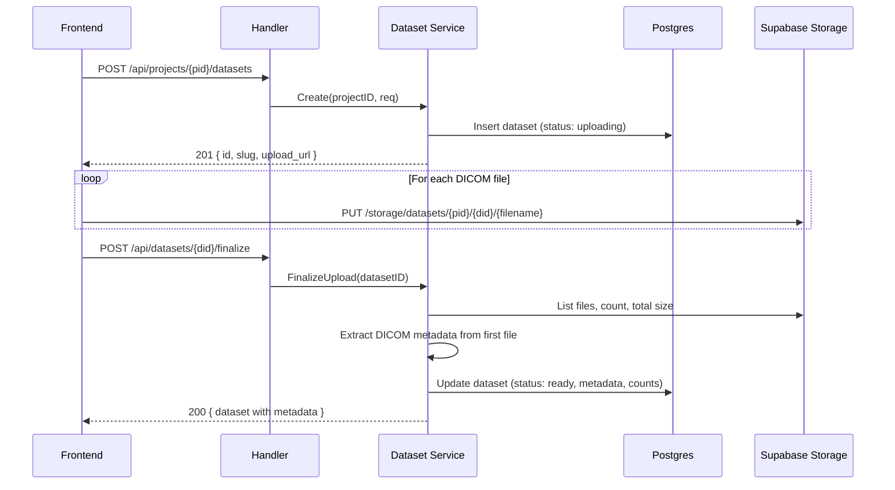

# Dataset Domain

Project-scoped datasets for DICOM image stacks. Follows the existing domain pattern (`docsystem`, `agents`, `billing`). See [overview](../overview.md) for system context.

## Domain Model

```go
// backend/internal/domain/datasets/types.go

type Dataset struct {
    ID          uuid.UUID
    ProjectID   uuid.UUID
    Slug        string         // URL-friendly identifier (e.g., "knee-scan-001")
    Name        string         // Display name (e.g., "Left Knee - Mouse 42")
    Description string         // Optional notes
    Status      DatasetStatus
    Metadata    DatasetMetadata
    FileCount   int
    TotalSizeBytes int64
    CreatedAt   time.Time
    UpdatedAt   time.Time
}

type DatasetStatus string

const (
    DatasetStatusUploading  DatasetStatus = "uploading"
    DatasetStatusProcessing DatasetStatus = "processing"  // Metadata extraction
    DatasetStatusReady      DatasetStatus = "ready"
    DatasetStatusError      DatasetStatus = "error"
)

type DatasetMetadata struct {
    // DICOM metadata extracted on upload
    Modality        string  `json:"modality,omitempty"`        // e.g., "CT"
    Manufacturer    string  `json:"manufacturer,omitempty"`    // e.g., "SCANCO MEDICAL"
    ScannerModel    string  `json:"scanner_model,omitempty"`   // e.g., "vivaCT 40"
    SliceCount      int     `json:"slice_count,omitempty"`
    SliceThickness  float64 `json:"slice_thickness_mm,omitempty"`
    PixelSpacingX   float64 `json:"pixel_spacing_x_mm,omitempty"`
    PixelSpacingY   float64 `json:"pixel_spacing_y_mm,omitempty"`
    Rows            int     `json:"rows,omitempty"`
    Columns         int     `json:"columns,omitempty"`
    BitsAllocated   int     `json:"bits_allocated,omitempty"`
    PatientID       string  `json:"patient_id,omitempty"`      // De-identified
    StudyDate       string  `json:"study_date,omitempty"`
    StudyDescription string `json:"study_description,omitempty"`
}
```

## Storage Layout

DICOM files live in Supabase Storage, organized by project and dataset:

```
supabase-storage/
  datasets/                          # Bucket name
    {project_id}/
      {dataset_id}/
        slice_0001.dcm
        slice_0002.dcm
        ...
        .metadata.json               # Extracted DICOM metadata
```

The metadata table in Postgres holds the index:

```sql
CREATE TABLE ${TABLE_PREFIX}datasets (
    id              UUID PRIMARY KEY DEFAULT gen_random_uuid(),
    project_id      UUID NOT NULL REFERENCES ${TABLE_PREFIX}projects(id) ON DELETE CASCADE,
    slug            TEXT NOT NULL,
    name            TEXT NOT NULL,
    description     TEXT DEFAULT '',
    status          TEXT NOT NULL DEFAULT 'uploading',
    metadata        JSONB DEFAULT '{}',
    file_count      INTEGER DEFAULT 0,
    total_size_bytes BIGINT DEFAULT 0,
    created_at      TIMESTAMPTZ NOT NULL DEFAULT NOW(),
    updated_at      TIMESTAMPTZ NOT NULL DEFAULT NOW(),

    UNIQUE (project_id, slug)
);

CREATE INDEX idx_datasets_project ON ${TABLE_PREFIX}datasets(project_id);
```

## Interface

```go
// backend/internal/domain/datasets/interfaces.go

type Service interface {
    // Create initializes a new dataset record (status: uploading).
    Create(ctx context.Context, projectID, userID uuid.UUID, req CreateDatasetRequest) (*Dataset, error)

    // FinalizeUpload marks upload complete, triggers metadata extraction.
    FinalizeUpload(ctx context.Context, userID, datasetID uuid.UUID) error

    // Get retrieves a dataset by ID. Checks project membership.
    Get(ctx context.Context, userID, datasetID uuid.UUID) (*Dataset, error)

    // List returns all datasets for a project. Checks project membership.
    List(ctx context.Context, userID, projectID uuid.UUID) ([]Dataset, error)

    // GetBySlug returns a dataset by project + slug. Checks project membership.
    GetBySlug(ctx context.Context, userID, projectID uuid.UUID, slug string) (*Dataset, error)

    // Delete removes a dataset and its storage files. Checks project membership.
    Delete(ctx context.Context, userID, datasetID uuid.UUID) error

    // GetUploadURL returns a pre-signed upload URL for a dataset's storage path.
    // Avoids leaking storage implementation details through the domain interface.
    GetUploadURL(ctx context.Context, userID, datasetID uuid.UUID, filename string) (string, error)
}

type Repository interface {
    Create(ctx context.Context, dataset *Dataset) error
    Update(ctx context.Context, dataset *Dataset) error
    Get(ctx context.Context, id uuid.UUID) (*Dataset, error)
    GetBySlug(ctx context.Context, projectID uuid.UUID, slug string) (*Dataset, error)
    List(ctx context.Context, projectID uuid.UUID) ([]Dataset, error)
    Delete(ctx context.Context, id uuid.UUID) error
}

type CreateDatasetRequest struct {
    Name        string
    Slug        string
    Description string
}
```

## Upload Flow



### Metadata Extraction

On finalize, the service reads one representative DICOM file from storage and extracts header fields. This runs server-side (Go) using a lightweight DICOM header parser — not a full DICOM toolkit. We only need tag reads, not pixel data.

Options for Go DICOM parsing:
1. **`github.com/suyashkumar/dicom`** — pure Go, reads tags efficiently
2. **Shell out to Python in Daytona** — more complete but adds latency

Recommendation: Use the Go library for metadata extraction (fast, no sandbox dependency). The heavy lifting (pixel data, segmentation) happens in Python later.

### Partial Upload Handling

DICOM stacks can have hundreds of files. Upload failures are expected. The finalize flow handles this:

1. **Client tracks upload state**: `useDatasetUpload` hook tracks per-file success/failure. Failed files are retried up to 3 times.
2. **Finalize validates completeness**: The client sends expected file count in the finalize request. The service compares against actual files in storage and rejects if mismatch exceeds threshold (>5% missing).
3. **Resumable uploads**: If the browser closes mid-upload, the dataset stays in `uploading` status. Re-opening shows the incomplete dataset with a "Resume Upload" option that diffs expected vs actual files.
4. **Orphan cleanup**: A background worker marks datasets stuck in `uploading` for >24 hours as `error`.

## HTTP Endpoints

```
POST   /api/projects/{pid}/datasets          Create dataset
GET    /api/projects/{pid}/datasets          List datasets
GET    /api/datasets/{did}                   Get dataset
DELETE /api/datasets/{did}                   Delete dataset
POST   /api/datasets/{did}/finalize          Finalize upload
```

All endpoints require authentication and project membership (existing auth middleware).

## Authorization

Follows existing pattern — service layer checks project membership:

```go
func (s *datasetService) Create(ctx context.Context, projectID, userID uuid.UUID, req CreateDatasetRequest) (*Dataset, error) {
    if err := s.authorizer.CanAccessProject(ctx, userID, projectID); err != nil {
        return nil, err
    }
    // ...
}
```

## Related Docs

- [Dataset Upload UI](../frontend/dataset-upload.md) — frontend drag-and-drop interface
- [Daytona Service](daytona-service.md) — dataset hydration into sandbox
- [execute_python Tool](execute-python.md) — accesses datasets at `/workspace/datasets/{slug}/`
