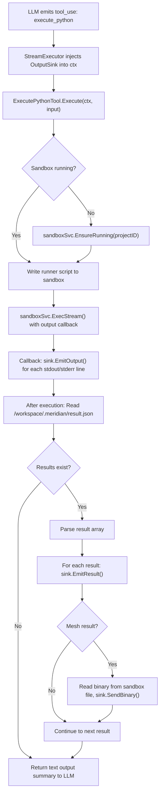

# execute_python Tool

New `ToolExecutor` that runs Python code in a Daytona sandbox. Primary tool for the data-analyst agent. See [overview](../overview.md) for how this fits into the system.

## Architecture Constraint: Tool-Emitter Boundary

The existing `ToolExecutor` interface is synchronous:
```go
type ToolExecutor interface {
    Execute(ctx context.Context, input map[string]interface{}) (interface{}, error)
}
```

Tools cannot hold emitter references — the emitter is created at stream-execution time (in `stream_executor.go`'s `workFunc`), after tools are constructed. No existing tool has emitter access.

**Solution**: The `StreamExecutor` injects an `OutputSink` into the execution context before calling `tool.Execute()`. The tool extracts it from context to stream intermediate output. This preserves the existing interface while enabling streaming for tools that need it.

```go
// backend/internal/service/llm/tools/output_sink.go

// OutputSink allows tools to emit intermediate output during execution.
// Injected into context by StreamExecutor for tools that need streaming.
// Follows ISP — tools that don't need streaming ignore it.
type OutputSink interface {
    // EmitOutput streams a line of stdout/stderr to the frontend.
    EmitOutput(stream string, text string, seq int)
    // EmitResult sends a rich result (chart, table, image, mesh metadata).
    EmitResult(result PythonResultPayload)
    // SendBinary sends raw binary data (mesh vertices/faces) to the frontend.
    SendBinary(meshID string, data []byte)
}

// ContextKey for OutputSink injection
type outputSinkKey struct{}

func OutputSinkFromContext(ctx context.Context) OutputSink {
    sink, _ := ctx.Value(outputSinkKey{}).(OutputSink)
    return sink
}

func ContextWithOutputSink(ctx context.Context, sink OutputSink) context.Context {
    return context.WithValue(ctx, outputSinkKey{}, sink)
}
```

The `StreamExecutor` creates an `OutputSink` implementation that wraps the AG-UI emitter and WS binary sender, then injects it before tool execution:

```go
// In stream_executor.go, before calling registry.Execute():
sink := &aguiOutputSink{
    emitter:     se.aguiEmitter,
    binarySend:  se.binarySendFunc,  // From WS subscription handler
    messageID:   se.lastAssistantMessageID,
    toolCallID:  call.ID,
}
ctx = tools.ContextWithOutputSink(ctx, sink)
```

## Interface

```go
// backend/internal/service/llm/tools/execute_python.go

type ExecutePythonTool struct {
    sandboxSvc  sandbox.Service
    datasetSvc  datasets.Service
    projectID   uuid.UUID
    userID      uuid.UUID
}

func (t *ExecutePythonTool) Execute(ctx context.Context, input map[string]interface{}) (interface{}, error)
```

Note: No emitter field. Streaming happens via `OutputSinkFromContext(ctx)`.

## Tool Schema (LLM-facing)

```json
{
  "name": "execute_python",
  "description": "Execute Python code in a persistent sandbox with scientific computing packages. Use for data processing, analysis, visualization, and file operations. The sandbox has: numpy, scipy, pandas, SimpleITK, pydicom, scikit-image, trimesh, plotly, matplotlib.",
  "input_schema": {
    "type": "object",
    "properties": {
      "code": {
        "type": "string",
        "description": "Python code to execute. Use print() for text output. Use show_plotly(), show_matplotlib(), show_dataframe(), show_mesh() to render results inline."
      },
      "timeout_seconds": {
        "type": "integer",
        "description": "Maximum execution time in seconds. Default 120, max 600.",
        "default": 120
      }
    },
    "required": ["code"]
  }
}
```

## Execution Flow



## Result Protocol (File-Based)

Python code communicates rich results via file, not stdout. This cleanly separates display output (stdout) from structured results.

```python
# /workspace/.meridian/result_helper.py (pre-installed in sandbox)
import json, base64, io, os, struct
from pathlib import Path

_RESULT_DIR = Path('/workspace/.meridian')
_MESH_DIR = _RESULT_DIR / 'meshes'
_results = []

def show_plotly(fig):
    """Render a Plotly figure inline in chat."""
    _results.append({"type": "plotly", "data": json.loads(fig.to_json())})

def show_matplotlib(fig=None):
    """Render current matplotlib figure inline in chat."""
    import matplotlib.pyplot as plt
    if fig is None:
        fig = plt.gcf()
    buf = io.BytesIO()
    fig.savefig(buf, format='png', dpi=150, bbox_inches='tight')
    buf.seek(0)
    _results.append({
        "type": "image",
        "format": "png",
        "data": base64.b64encode(buf.read()).decode()
    })
    plt.close(fig)

def show_dataframe(df, title=None):
    """Render a DataFrame as a styled table in chat."""
    _results.append({
        "type": "dataframe",
        "html": df.to_html(classes='meridian-table', escape=True),
        "title": title,
        "row_count": len(df),
        "col_count": len(df.columns)
    })

def show_mesh(vertices, faces, labels=None, label_names=None):
    """Send mesh data to the 3D viewer.
    
    Writes binary mesh to file (avoids stdout size limits).
    Go tool reads the file and sends via WS binary frame.
    """
    import numpy as np
    import uuid as _uuid
    
    mesh_id = f"mesh_{_uuid.uuid4().hex[:12]}"
    _MESH_DIR.mkdir(parents=True, exist_ok=True)
    
    # Write binary mesh file: header + vertices + faces + labels
    bin_path = _MESH_DIR / f"{mesh_id}.bin"
    with open(bin_path, 'wb') as f:
        verts = vertices.astype(np.float32)
        fcs = faces.astype(np.uint32)
        # Header: vertex_count(u32) + face_count(u32)
        f.write(struct.pack('<II', len(verts), len(fcs)))
        # Vertices: float32 x,y,z per vertex (little-endian, native from numpy)
        f.write(verts.tobytes())
        # Faces: uint32 v0,v1,v2 per face
        f.write(fcs.tobytes())
        # Labels: uint8 per vertex (0 if no labels)
        if labels is not None:
            f.write(labels.astype(np.uint8).tobytes())
        else:
            f.write(b'\x00' * len(verts))
    
    _results.append({
        "type": "mesh",
        "mesh_id": mesh_id,
        "bin_path": str(bin_path),
        "vertex_count": len(verts),
        "face_count": len(fcs),
        "label_names": label_names,
    })

def _flush():
    """Called by runner. Writes results to file for Go tool to read."""
    if _results:
        _RESULT_DIR.mkdir(parents=True, exist_ok=True)
        with open(_RESULT_DIR / 'result.json', 'w') as f:
            json.dump(_results, f)
    elif (_RESULT_DIR / 'result.json').exists():
        os.remove(_RESULT_DIR / 'result.json')
```

Runner template:

```python
import sys, atexit
sys.path.insert(0, '/workspace/.meridian')
from result_helper import show_plotly, show_matplotlib, show_dataframe, show_mesh, _flush
atexit.register(_flush)  # Flush even on exception

# --- User code below ---
{user_code}
# --- User code above ---
```

After execution completes, the Go tool:
1. Reads `/workspace/.meridian/result.json` via `sandboxSvc.ReadFile()`
2. Parses the JSON array of results
3. For each result, calls `sink.EmitResult()` with the typed payload
4. For mesh results, reads the binary file from `bin_path` via `sandboxSvc.ReadFile()`, then calls `sink.SendBinary(meshID, binaryData)`
5. Cleans up the result file

## Streaming Output

During execution, `sandboxSvc.ExecStream()` calls the output callback for each stdout/stderr line. The tool forwards these to the OutputSink:

```go
func (t *ExecutePythonTool) Execute(ctx context.Context, input map[string]interface{}) (interface{}, error) {
    sink := OutputSinkFromContext(ctx) // May be nil if not in streaming context
    
    seq := 0
    onOutput := func(stream, text string) {
        if sink != nil {
            sink.EmitOutput(stream, text, seq)
            seq++
        }
    }
    
    result, err := t.sandboxSvc.ExecStream(ctx, t.projectID, runnerScript, onOutput)
    if err != nil { return nil, err }
    
    // Read results from file
    resultJSON, err := t.sandboxSvc.ReadFile(ctx, t.projectID, "/workspace/.meridian/result.json")
    if err == nil && len(resultJSON) > 0 {
        var results []map[string]interface{}
        json.Unmarshal(resultJSON, &results)
        for _, r := range results {
            if sink != nil {
                sink.EmitResult(toPythonResultPayload(r))
                if r["type"] == "mesh" {
                    meshData, _ := t.sandboxSvc.ReadFile(ctx, t.projectID, r["bin_path"].(string))
                    sink.SendBinary(r["mesh_id"].(string), meshData)
                }
            }
        }
    }
    
    return map[string]interface{}{
        "success": result.ExitCode == 0,
        "output":  result.Stdout,
        "exit_code": result.ExitCode,
    }, nil
}
```

## File Access

```
/workspace/datasets/{dataset_slug}/    # DICOM files from Supabase Storage
/workspace/outputs/                    # Generated files (figures, meshes, CSVs)
/workspace/.meridian/                  # Helper modules, result.json, meshes/
```

## Registration

Follows the builder's fluent method pattern (like `WithWebSearch`, `WithSpawnTool`):

```go
// backend/internal/service/llm/tools/builder.go

func (b *ToolRegistryBuilder) WithExecutePython(sandboxSvc sandbox.Service, datasetSvc datasets.Service) *ToolRegistryBuilder {
    if sandboxSvc == nil {
        return b  // Graceful degradation when Daytona not configured
    }
    tool := NewExecutePythonTool(b.projectID, b.userID, sandboxSvc, datasetSvc)
    b.registry.RegisterWithMetadata("execute_python", tool, ExecutePythonToolMetadata())
    return b
}

// Called from ToolRegistryFactory.BuildProductionRegistry():
builder.WithExecutePython(inputs.SandboxService, inputs.DatasetService)
```

The `ToolRegistryFactoryDeps` struct gains two new fields:
```go
type ToolRegistryFactoryDeps struct {
    // ... existing fields ...
    SandboxService sandbox.Service
    DatasetService datasets.Service
}
```

## Metadata

```go
func ExecutePythonToolMetadata() *ToolMetadata {
    return &ToolMetadata{
        Name:        "execute_python",
        Description: "Execute Python in a persistent sandbox with scientific packages (numpy, scipy, pandas, SimpleITK, pydicom, scikit-image, trimesh, plotly, matplotlib)",
        Guideline:   "Use show_plotly(), show_matplotlib(), show_dataframe(), show_mesh() to render results inline. Use print() for text output. Dataset files are at /workspace/datasets/{slug}/.",
    }
}
```

## Error Handling

| Error | Behavior |
|-------|----------|
| Sandbox not running, start fails | Return structured error to LLM: "Sandbox unavailable" |
| Python syntax error | Stream stderr, return error result to LLM |
| Timeout exceeded | Kill process, return timeout error |
| Daytona API unreachable | Return service unavailable error |
| Result file too large (>10MB) | Truncate with warning, suggest file export |
| Result file missing | Return stdout-only output (no rich results) |

## Security

- Code runs in isolated Daytona sandbox (namespace isolation)
- No access to Go backend internals
- Daytona network egress policy configured at sandbox creation (allowlist Supabase Storage only)
- Sandbox CPU/RAM/disk limits configured in `SandboxConfig`
- Auto-stop after idle timeout prevents cost runaway
- Env vars scrubbed: only `PYTHONUNBUFFERED=1` and Supabase storage URL set in sandbox
