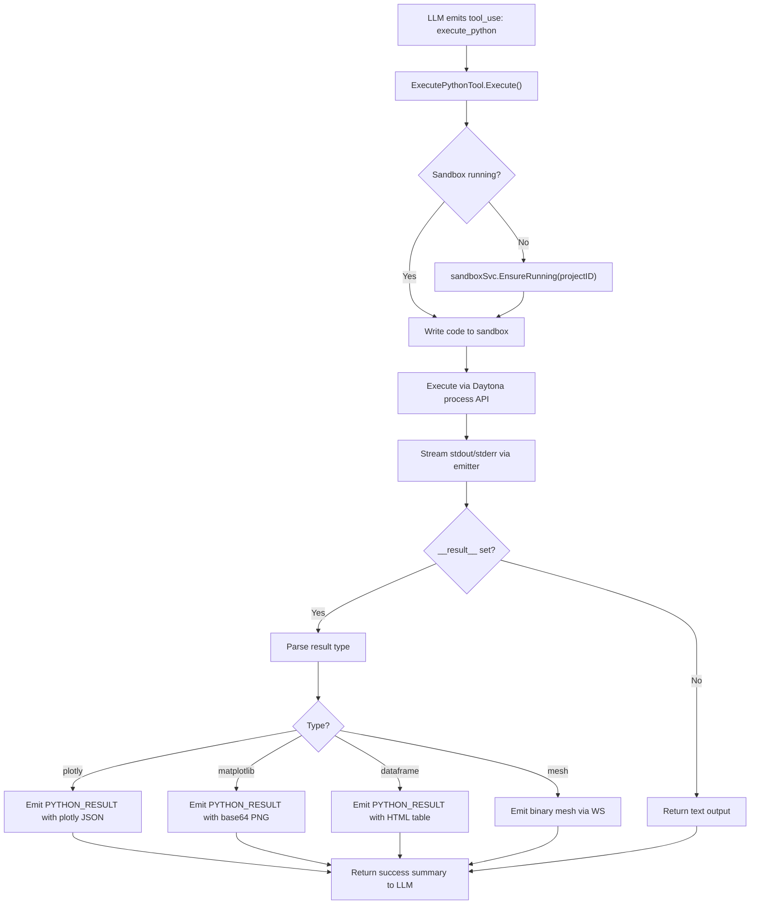

# execute_python Tool

New `ToolExecutor` that runs Python code in a Daytona sandbox. Primary tool for the data-analyst agent. See [overview](../overview.md) for how this fits into the system.

## Interface

The tool follows the existing `ToolExecutor` pattern — same as `text_editor.go`, `web_search.go`, and `search.go`.

```go
// backend/internal/service/llm/tools/execute_python.go

type ExecutePythonTool struct {
    sandboxSvc  sandbox.Service    // Daytona sandbox lifecycle
    datasetSvc  datasets.Service   // Access dataset file paths
    projectID   uuid.UUID
    userID      uuid.UUID
    threadID    uuid.UUID
    emitter     *agui.Emitter      // For streaming stdout/results
}

func (t *ExecutePythonTool) Execute(ctx context.Context, input map[string]interface{}) (interface{}, error)
```

## Tool Schema (LLM-facing)

```json
{
  "name": "execute_python",
  "description": "Execute Python code in a persistent sandbox with scientific computing packages. Use for data processing, analysis, visualization, and file operations. The sandbox has: numpy, scipy, pandas, SimpleITK, pydicom, scikit-image, trimesh, plotly, matplotlib.",
  "input_schema": {
    "type": "object",
    "properties": {
      "code": {
        "type": "string",
        "description": "Python code to execute. Use print() for text output. Return results via __result__ variable for rich rendering."
      },
      "timeout_seconds": {
        "type": "integer",
        "description": "Maximum execution time in seconds. Default 120, max 600.",
        "default": 120
      }
    },
    "required": ["code"]
  }
}
```

## Execution Flow



## Result Protocol

Python code communicates rich results back via a `__result__` convention. A small helper module is pre-installed in the sandbox:

```python
# /workspace/.meridian/result_helper.py (pre-installed in sandbox)
import json, sys, base64, io

_results = []

def show_plotly(fig):
    """Render a Plotly figure inline in chat."""
    _results.append({"type": "plotly", "data": fig.to_json()})

def show_matplotlib(fig=None):
    """Render current matplotlib figure inline in chat."""
    import matplotlib.pyplot as plt
    if fig is None:
        fig = plt.gcf()
    buf = io.BytesIO()
    fig.savefig(buf, format='png', dpi=150, bbox_inches='tight')
    buf.seek(0)
    _results.append({"type": "image", "format": "png", "data": base64.b64encode(buf.read()).decode()})
    plt.close(fig)

def show_dataframe(df, title=None):
    """Render a DataFrame as an interactive table in chat."""
    _results.append({"type": "dataframe", "html": df.to_html(classes='meridian-table'), "title": title})

def show_mesh(vertices, faces, labels=None, label_names=None):
    """Send mesh data to the 3D viewer."""
    import numpy as np
    result = {
        "type": "mesh",
        "vertices": vertices.astype(np.float32).tobytes().hex(),
        "faces": faces.astype(np.uint32).tobytes().hex(),
        "vertex_count": len(vertices),
        "face_count": len(faces),
    }
    if labels is not None:
        result["labels"] = labels.astype(np.uint8).tobytes().hex()
    if label_names is not None:
        result["label_names"] = label_names
    _results.append(result)

def _flush():
    """Called by runner after execution. Returns JSON results."""
    return json.dumps(_results) if _results else ""
```

The Go tool wraps user code in a runner script:

```python
# Runner template (generated by Go tool for each execution)
import sys
sys.path.insert(0, '/workspace/.meridian')
from result_helper import show_plotly, show_matplotlib, show_dataframe, show_mesh, _flush

# --- User code below ---
{user_code}
# --- User code above ---

# Flush results
import json
_result_json = _flush()
if _result_json:
    print(f"\n__MERIDIAN_RESULT__{_result_json}__MERIDIAN_RESULT_END__")
```

## Streaming Output

During execution, the Go tool:

1. **Streams stdout/stderr** line by line via AG-UI `PYTHON_OUTPUT` events (see [stream-extensions.md](stream-extensions.md))
2. **Parses the result sentinel** (`__MERIDIAN_RESULT__...`) from the output
3. **Emits typed results** as `PYTHON_RESULT` events with the appropriate payload
4. **For mesh data**: emits a `PYTHON_RESULT` event with mesh metadata, then sends the binary vertex/face data via WS binary frames

## File Access

The sandbox has access to dataset files via a deterministic path convention:

```
/workspace/datasets/{dataset_slug}/    # DICOM files from Supabase Storage
/workspace/outputs/                    # Generated files (figures, meshes, CSVs)
/workspace/.meridian/                  # Helper modules, config
```

Dataset files are pulled from Supabase Storage into the sandbox on first access. The [Daytona service](daytona-service.md) handles this hydration.

## Registration

Follows the existing builder pattern in `backend/internal/service/llm/tools/builder.go`:

```go
// In ToolRegistryBuilder.Build():
if toolSet["execute_python"] && b.sandboxClient != nil {
    execPythonTool := NewExecutePythonTool(
        projectID, userID, threadID,
        b.sandboxSvc, b.datasetSvc, b.aguiEmitter,
    )
    b.registry.RegisterWithMetadata(
        "execute_python", execPythonTool, ExecutePythonToolMetadata(),
    )
}
```

## Metadata (for system prompt)

```go
func ExecutePythonToolMetadata() *ToolMetadata {
    return &ToolMetadata{
        Name:        "execute_python",
        Description: "Execute Python in a persistent sandbox with scientific packages (numpy, scipy, pandas, SimpleITK, pydicom, scikit-image, trimesh, plotly, matplotlib)",
        Guideline:   "Use show_plotly(), show_matplotlib(), show_dataframe(), show_mesh() to render results inline. Use print() for text output. Dataset files are at /workspace/datasets/{slug}/.",
    }
}
```

## Error Handling

| Error | Behavior |
|-------|----------|
| Sandbox not running, start fails | Return structured error to LLM: "Sandbox unavailable, retrying..." |
| Python syntax error | Stream stderr, return error result to LLM |
| Timeout exceeded | Kill process, return timeout error |
| Daytona API unreachable | Return service unavailable error |
| Result too large (>10MB) | Truncate with warning, suggest file export |

## Security

- Code runs in isolated Daytona sandbox (namespace isolation)
- No access to Go backend internals
- Network egress restricted to Supabase Storage API only
- Sandbox CPU/RAM limits prevent resource exhaustion
- Auto-stop after idle timeout prevents cost runaway
