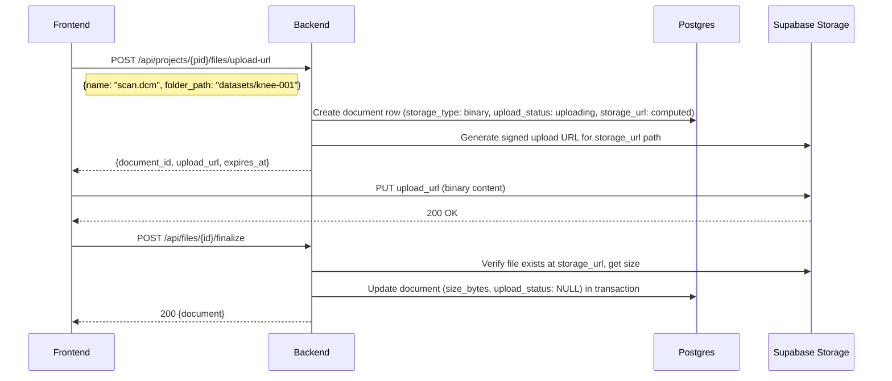
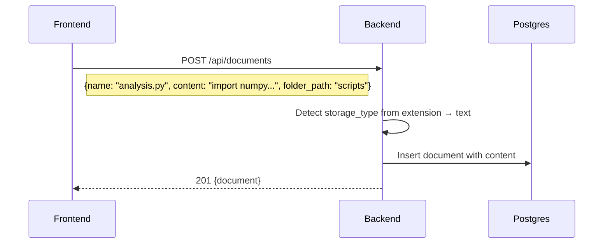
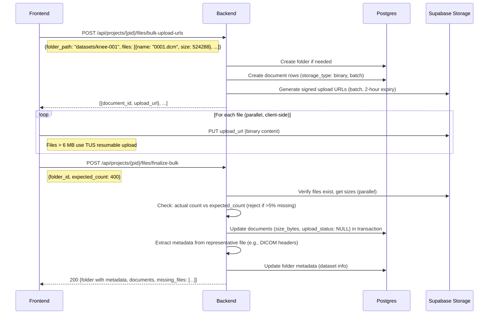

# Filesystem Layer

Unified file storage for the research analysis platform. Text files stay in DB (Yjs collab state already lives there), binary files go to Supabase Storage bucket. A metadata layer in Postgres unifies them into one project tree. Replaces the current fiction-specific `docsystem` domain and eliminates the need for a separate `datasets` domain.

See [overview](../overview.md) for system context. See [docsystem-audit](../research/docsystem-audit.md) for the migration analysis of every existing interface.

## Architecture

```
┌─────────────────────────────────────────────────┐
│  Yjs collab + proposals                         │  ← only for text files
│  (existing collab domain, unchanged)             │
├─────────────────────────────────────────────────┤
│  Metadata DB (documents table)                   │  ← one row per file: path, size,
│  path, mime_type, storage_type, project_id       │     mime type, timestamps, JSONB metadata
│  content (TEXT, for text files only)              │
├─────────────────────────────────────────────────┤
│  Supabase Storage bucket                         │  ← binary file content only
│  organized by project_id/file_id                 │
└─────────────────────────────────────────────────┘
```

### Storage Routing

Every file gets a row in the `documents` table. The `storage_type` field determines where content lives:

| `storage_type` | Content location | Collab eligible | Examples |
|----------------|-----------------|-----------------|----------|
| `text` | `documents.content` column (DB) | Yes | `.md`, `.txt`, `.py`, `.csv`, `.json`, `.mmd`, `.mermaid`, `.excalidraw` |
| `binary` | Supabase Storage bucket | No | `.dcm`, `.stl`, `.obj`, `.xlsx`, `.pdf`, `.png`, `.jpg`, `.zip`, `.nii.gz` |

The routing decision is a single function:

```go
// backend/internal/domain/docsystem/storage_type.go

type StorageType string

const (
    StorageTypeText   StorageType = "text"
    StorageTypeBinary StorageType = "binary"
)

// textExtensions lists extensions stored as text in the DB.
// Everything else is binary (stored in bucket).
// This is an allowlist — unknown extensions default to binary.
var textExtensions = map[string]bool{
    ".md": true, ".markdown": true, ".txt": true,
    ".py": true, ".r": true, ".jl": true,           // scripts
    ".csv": true, ".tsv": true,                       // tabular (small enough for DB)
    ".json": true, ".yaml": true, ".yml": true,       // config/data
    ".toml": true, ".ini": true, ".cfg": true,
    ".excalidraw": true,                               // diagrams
    ".mmd": true, ".mermaid": true,
    ".html": true, ".htm": true, ".xml": true,
    ".sh": true, ".bash": true,
    ".sql": true,
    ".tex": true, ".bib": true,                        // LaTeX
}

func StorageTypeFromExtension(ext string) StorageType {
    ext = strings.ToLower(ext)
    if textExtensions[ext] {
        return StorageTypeText
    }
    return StorageTypeBinary
}
```

**Why an allowlist for text, not a blocklist for binary**: Binary is the safe default. An unknown extension stored as text could mean gigabytes in a TEXT column. An unknown extension stored in a bucket always works. The allowlist grows as we add support for new text-editable formats.

**Text file size guard**: If a text-extension file exceeds **10 MB**, override to `StorageTypeBinary`. This prevents a 500 MB CSV from going into a TEXT column. The guard is in `StorageTypeFromExtensionWithSize(ext string, sizeBytes int64) StorageType`.

**Compound extensions** (`.nii.gz`, `.tar.gz`, `.csv.gz`): Go's `filepath.Ext()` returns the final segment (`.gz`). Since `.gz` isn't in the text allowlist, compound extensions route to binary. This is correct behavior for all known biomedical compound extensions. Document this — don't add special-case handling for MVP.

## Database Schema

### Migration: Transform documents table

```sql
-- Add storage_type and upload_status columns
ALTER TABLE ${TABLE_PREFIX}documents
    ADD COLUMN IF NOT EXISTS storage_type TEXT NOT NULL DEFAULT 'text',
    ADD COLUMN IF NOT EXISTS upload_status TEXT;  -- NULL = complete, 'uploading' = in-progress

-- Backfill: all existing documents are text (fiction platform had no binary files)
UPDATE ${TABLE_PREFIX}documents SET storage_type = 'text';

-- Drop the fiction-specific file_type constraint (blocks binary file creation)
ALTER TABLE ${TABLE_PREFIX}documents
    DROP CONSTRAINT IF EXISTS ${TABLE_PREFIX}documents_file_type_check;

-- Add storage_type constraint
ALTER TABLE ${TABLE_PREFIX}documents
    ADD CONSTRAINT ${TABLE_PREFIX}documents_storage_type_check
        CHECK (storage_type IN ('text', 'binary'));

-- Add upload_status constraint
ALTER TABLE ${TABLE_PREFIX}documents
    ADD CONSTRAINT ${TABLE_PREFIX}documents_upload_status_check
        CHECK (upload_status IS NULL OR upload_status IN ('uploading'));

-- Index for binary file lookups by storage URL
CREATE INDEX IF NOT EXISTS idx_documents_storage_url
    ON ${TABLE_PREFIX}documents(storage_url)
    WHERE storage_url IS NOT NULL;

-- Index for filtering by storage type
CREATE INDEX IF NOT EXISTS idx_documents_storage_type
    ON ${TABLE_PREFIX}documents(storage_type);

-- Index for orphan cleanup queries
CREATE INDEX IF NOT EXISTS idx_documents_upload_status
    ON ${TABLE_PREFIX}documents(upload_status)
    WHERE upload_status IS NOT NULL;
```

The `file_type` column stays temporarily for backwards compatibility during migration but all new code uses `storage_type` + `mime_type`. During transition, `EnsureFileType()` sets `file_type = "binary"` for non-text files (avoids nonsensical "markdown" default for `.dcm` files). The column can be dropped in a later cleanup migration.

### Document model changes

```go
type Document struct {
    // --- Unchanged ---
    ID          string           `json:"id" db:"id"`
    ProjectID   string           `json:"project_id" db:"project_id"`
    FolderID    *string          `json:"folder_id" db:"folder_id"`
    Name        string           `json:"name" db:"name"`
    Extension   string           `json:"extension" db:"extension"`    // Now accepts ANY extension
    Description *string          `json:"description,omitempty" db:"description"`
    Autoapply   *bool            `json:"autoapply,omitempty" db:"autoapply"`
    Path        string           `json:"path,omitempty"`
    Metadata    DocumentMetadata `json:"metadata" db:"metadata"`
    CreatedAt   time.Time        `json:"created_at" db:"created_at"`
    UpdatedAt   time.Time        `json:"updated_at" db:"updated_at"`
    DeletedAt   *time.Time       `json:"deleted_at,omitempty" db:"deleted_at"`
    PendingProposalCount int     `json:"pending_proposal_count,omitempty" db:"pending_proposal_count"`

    // --- Changed ---
    StorageType  StorageType      `json:"storage_type" db:"storage_type"`    // "text" or "binary" (replaces FileType)
    UploadStatus *string          `json:"upload_status,omitempty" db:"upload_status"` // NULL=complete, "uploading"=in-progress
    FileType     string           `json:"file_type" db:"file_type"`          // Kept for backwards compat, derived from extension
    Content      string           `json:"content" db:"content"`              // Populated for text files, empty for binary
    StorageURL   *string          `json:"storage_url,omitempty" db:"storage_url"`    // Bucket path, set at row creation for binary files
    MimeType     *string          `json:"mime_type,omitempty" db:"mime_type"`
    SizeBytes    *int64           `json:"size_bytes,omitempty" db:"size_bytes"`
}

// IsTextBased returns true if this file stores content in the DB.
func (d *Document) IsTextBased() bool {
    return d.StorageType == StorageTypeText
}

// IsBinary returns true if this file stores content in Supabase Storage.
func (d *Document) IsBinary() bool {
    return d.StorageType == StorageTypeBinary
}
```

## Bucket Organization

Binary files in Supabase Storage are organized by project and document ID:

```
supabase-storage/
  project-files/                    # Single bucket for all projects
    {project_id}/
      {document_id}/{filename}      # One file per document
```

**Why per-document-ID subdirectory**: The document ID is the stable reference. Files can be renamed or moved in the tree (updating the DB row) without moving the bucket object. The bucket path is an implementation detail, never exposed to users.

**Why a single bucket**: Supabase buckets map to RLS policies. One bucket with project-scoped paths is simpler than per-project buckets. The backend uses the **service role key** (bypasses RLS) for all bucket operations. Future multi-user access uses signed URLs generated server-side. Per-bucket MIME type restrictions and file size limits are configured via the Supabase dashboard.

**Bucket configuration** (Supabase dashboard):
- Max file size: 500 MB (covers DICOM stacks; Pro plan ceiling is 500 GB)
- Bucket visibility: Private (all access via signed URLs or service key)
- No MIME type restriction at bucket level (we accept arbitrary research files)

## Consistency Model

The DB is the **source of truth** for the project tree. A bucket file without a `upload_status = NULL` (ready) DB row is garbage-collectible. A ready DB row without a bucket file is a bug (finalize verifies existence before marking ready).

### Field timing — what's set when

| Field | Set at row creation | Set at finalize |
|-------|-------------------|-----------------|
| `id`, `project_id`, `folder_id`, `name`, `extension` | ✓ | |
| `storage_type`, `mime_type` | ✓ | |
| `storage_url` | ✓ (computed: `{project_id}/{doc_id}/{filename}`) | |
| `upload_status` | `"uploading"` | → `NULL` (complete) |
| `size_bytes` | | ✓ (from bucket) |
| `content` | empty for binary | |

### Orphan cleanup

Documents stuck in `upload_status = 'uploading'` for >2 hours are considered abandoned. Cleanup strategy:

1. **Tree queries exclude uploading documents**: `WHERE upload_status IS NULL` filter on tree, search, and list queries. Uploading documents are invisible in the project tree.
2. **Lazy cleanup on tree fetch**: When building the project tree, also check for stale uploads (created_at < NOW() - 2 hours, upload_status = 'uploading'). Delete DB rows. Delete bucket files if they exist (best-effort, bucket orphans are harmless storage waste).
3. **Frontend shows upload progress independently**: The upload UI tracks in-progress uploads via client state, not by querying the DB.

### Failure modes

| Failure | State | Recovery |
|---------|-------|----------|
| Client uploads to bucket, never calls finalize | DB row: uploading, bucket: file exists | Orphan cleanup deletes both |
| Finalize DB update fails after bucket verification | DB row: uploading, bucket: file exists | Client retries finalize (idempotent: `UPDATE ... WHERE upload_status = 'uploading'`) |
| Delete succeeds in DB, fails in bucket | DB row: deleted, bucket: file exists | Bucket orphan, harmless storage waste. Periodic sweep can clean. |
| Delete succeeds in bucket, fails in DB | DB row: exists, bucket: file gone | Download returns 404. Tree shows file that can't be opened. Fix: mark as error or delete row. |

The most dangerous case is "DB row exists, bucket file gone." The finalize step prevents this for new uploads (verifies existence). For existing files, this only happens on delete failures. The delete flow should delete from bucket first, then DB — this way, if the DB delete fails, the user still sees the file and can retry delete.

## Upload Flow

### Binary file upload (pre-signed URL)



### Text file creation (existing flow, unchanged)



### Bulk upload (DICOM stack / ZIP)



### Request/Response Types

```go
// --- Single file upload ---

type UploadURLRequest struct {
    Name       string  `json:"name"`                    // Filename with extension: "scan.dcm"
    FolderPath *string `json:"folder_path,omitempty"`   // Resolve/create: "datasets/knee-001"
    FolderID   *string `json:"folder_id,omitempty"`     // Alternative: direct folder ID
    MimeType   *string `json:"mime_type,omitempty"`     // Optional, detected from extension if absent
}

type UploadURLResponse struct {
    DocumentID string    `json:"document_id"`
    UploadURL  string    `json:"upload_url"`   // Signed upload URL (2-hour expiry)
    ExpiresAt  time.Time `json:"expires_at"`
}

// --- Bulk upload ---

type BulkUploadURLsRequest struct {
    FolderPath string         `json:"folder_path"`  // Target folder: "datasets/knee-001"
    Files      []BulkFileSpec `json:"files"`
}

type BulkFileSpec struct {
    Name string `json:"name"`  // Filename: "0001.dcm"
}

type BulkUploadURLsResponse struct {
    FolderID string            `json:"folder_id"`
    Files    []UploadURLResponse `json:"files"`
}

// --- Finalize ---

type FinalizeResponse struct {
    Document Document `json:"document"`
}

type BulkFinalizeRequest struct {
    FolderID      string `json:"folder_id"`
    ExpectedCount int    `json:"expected_count"`  // Client sends how many files were expected
}

type BulkFinalizeResponse struct {
    Folder       Folder     `json:"folder"`        // With dataset metadata populated
    Documents    []Document `json:"documents"`      // Successfully finalized
    MissingFiles []string   `json:"missing_files"`  // Document IDs where bucket file was not found
}

// --- Sandbox file registration ---

type RegisterFileRequest struct {
    Name        string  `json:"name"`                    // Filename: "femur.stl"
    FolderPath  *string `json:"folder_path,omitempty"`   // Target: "results/"
    StoragePath string  `json:"storage_path"`            // Bucket path (set by sandbox helper)
    MimeType    *string `json:"mime_type,omitempty"`
    SizeBytes   int64   `json:"size_bytes"`
}
```

### Sandbox file registration endpoint

When the sandbox uploads a file to the bucket via S3 API, it calls the backend to create the metadata row:

```
POST /api/projects/{pid}/files/register → 201 {document}
```

This creates a document row with `upload_status = NULL` (already complete — the file is in the bucket). The sandbox helper calls this after a successful S3 PUT. Without this endpoint, sandbox-created files would exist in the bucket but never appear in the project tree.

### Upload protocol selection

**MVP: Standard upload for all sizes.** Supabase Storage's standard upload supports up to 500 MB. For the single-user MVP with controlled uploads, standard PUT is sufficient. If a DICOM stack upload is interrupted, the user re-uploads. Orphan rows get cleaned up (see Consistency Model).

**Future: TUS resumable uploads.** For production reliability (unreliable networks, very large files), add TUS resumable uploads:
- Frontend uses `tus-js-client` with 6 MB chunks (Supabase-mandated chunk size)
- TUS uploads go directly to Supabase's TUS endpoint: `https://<project-ref>.storage.supabase.co/storage/v1/upload/resumable`
- 24-hour resume window — interrupted uploads can resume by querying the server for the current offset
- The backend never proxies TUS uploads — they go client → Supabase directly

The backend's signed upload URLs support both standard PUT and TUS. The frontend decides which protocol to use based on file size and network conditions.

## Download Flow

### Binary file download

```
GET /api/files/{id}/download → 302 redirect to signed download URL (5 min expiry)
```

The backend generates a short-lived (5 min) signed download URL from Supabase Storage and redirects. The frontend never knows the bucket path.

### Inline binary content (images, charts)

For binary files displayed inline in the activity stream (matplotlib PNG output, generated figures):

```
GET /api/files/{id}/content → 200 with binary body (proxied through backend)
```

This endpoint proxies the file content through the backend instead of redirecting. Used for `` tags in the activity stream where signed URL expiry would silently break images in long sessions. The backend fetches from the bucket and streams to the client. Max proxied file size: 10 MB (larger files use the redirect endpoint).

### Text file content

Text file content comes through the existing document GET endpoint:

```
GET /api/documents/{id} → {document with content field populated}
```

No change from current behavior.

## Sandbox File Access

The Daytona sandbox needs to read project files for analysis. Three access patterns were evaluated (see [research](../research/supabase-storage-capabilities.md) §9):

1. **Direct S3 API** (boto3 from sandbox code) — recommended default
2. **FUSE mount** (Daytona Volumes) — rejected for MVP due to DICOM seek-latency concerns
3. **Copy-on-start** (backend hydrates sandbox) — used for bulk DICOM processing

### Default: Direct S3 API from sandbox

The sandbox receives S3 credentials as environment variables at startup. Python code accesses files via boto3:

```python
# Pre-installed in sandbox: meridian_files.py
import boto3
from botocore.config import Config

s3 = boto3.client(
    "s3",
    endpoint_url=os.environ["SUPABASE_STORAGE_ENDPOINT"],
    aws_access_key_id=os.environ["SUPABASE_S3_ACCESS_KEY"],
    aws_secret_access_key=os.environ["SUPABASE_S3_SECRET_KEY"],
    region_name="auto",
    config=Config(s3={"addressing_style": "path"}),
)

def download_file(project_path: str, local_path: str = None):
    """Download a project file to sandbox local filesystem."""
    # ...downloads from bucket to /workspace/project-files/...

def upload_file(local_path: str, project_path: str):
    """Upload a sandbox file to the project bucket."""
    # ...uploads to bucket, then calls backend to create DB metadata row
```

**Tradeoff**: Requires injecting S3 credentials into the sandbox. For the single-user MVP, the service role key is acceptable. For multi-user, the backend would generate scoped S3 session tokens per sandbox.

### Bulk DICOM processing: Copy-on-start

When the AI requests processing a DICOM stack (hundreds of files), the backend pre-stages files to the sandbox before execution:

1. Backend fetches file list from project tree
2. Backend generates signed download URLs (batch) 
3. Backend pushes files into sandbox via Daytona file upload API
4. Sandbox processes locally (full local I/O performance — no FUSE overhead)
5. Results uploaded back via S3 API

This avoids the FUSE seek-latency problem documented in the [platform research](../research/platform-storage-patterns.md) §2 (Deepnote warns about this pattern).

### Sandbox file writes → project

When the sandbox produces output files (segmentation results, meshes, figures), they're saved back via S3 API + backend metadata creation:

```python
from meridian_files import upload_file
upload_file("/workspace/output/femur.stl", "results/femur.stl")  # Uploads to project
```

The helper uploads the file to the bucket via S3 API, then calls the backend API to create a document metadata row in Postgres. This two-step ensures the project tree stays in sync.

## Metadata System

The existing `DocumentMetadata` (JSONB `map[string]interface{}`) becomes the universal metadata store. Format-specific metadata lives under namespaced keys:

```json
// Text file (markdown)
{"markdown": {"wordCount": 1500}}

// DICOM file
{"dicom": {"modality": "CT", "manufacturer": "SCANCO", "sliceCount": 400, "pixelSpacing": [0.012, 0.012]}}

// Mesh file
{"mesh": {"format": "STL", "vertices": 50000, "faces": 100000}}

// Python script
{"script": {"language": "python", "imports": ["numpy", "SimpleITK"]}}
```

### Dataset-as-folder metadata

A folder that represents a dataset (e.g., a DICOM stack) stores dataset-level metadata on the Folder's `Metadata` JSONB:

```json
// Folder.Metadata for a DICOM dataset folder
{
    "dataset": {
        "status": "ready",
        "modality": "CT",
        "manufacturer": "SCANCO MEDICAL",
        "scannerModel": "vivaCT 40",
        "sliceCount": 400,
        "totalSizeBytes": 209715200,
        "fileCount": 400,
        "studyDate": "2024-03-15"
    }
}
```

This replaces the separate `datasets` table entirely. The `DatasetService.FinalizeUpload` logic moves into the bulk upload finalization endpoint, which extracts DICOM metadata and writes it to the folder.

## Search Changes

Full-text search adapts to the text/binary split:

- **Name search**: Works for all files (text and binary)
- **Content search**: Only searches text files (binary content isn't in DB)
- **Metadata search**: New capability — search JSONB metadata fields (e.g., find files by MIME type, find datasets by modality)

The `SearchOptions.Fields` enum gains `SearchFieldMetadata`. The repository implementation adds a JSONB containment query for metadata search.

## Interface Changes Summary

### New interfaces

```go
// StorageService manages binary file storage in Supabase bucket.
// Separated from DocumentService (SRP) — this handles bucket operations only.
// Implementation uses storage-go for URL generation, AWS SDK v2 for file operations.
// All methods use the service role key (bypass RLS). No DB access — that's DocumentService's job.
type StorageService interface {
    // GenerateUploadURL creates a signed URL for uploading a binary file.
    // storagePath is the full bucket path: "{project_id}/{document_id}/{filename}"
    GenerateUploadURL(ctx context.Context, storagePath string) (url string, expiresAt time.Time, err error)

    // GenerateUploadURLs creates signed URLs for multiple files (batch).
    // Used by bulk upload endpoints. Generates URLs in parallel internally.
    GenerateUploadURLs(ctx context.Context, storagePaths []string) ([]StorageURLResult, error)

    // GenerateDownloadURL creates a signed URL for downloading a binary file.
    // storagePath is the full bucket path.
    GenerateDownloadURL(ctx context.Context, storagePath string) (url string, expiresAt time.Time, err error)

    // GenerateDownloadURLs creates signed download URLs for multiple files (batch).
    // Used by sandbox copy-on-start.
    GenerateDownloadURLs(ctx context.Context, storagePaths []string) ([]StorageURLResult, error)

    // GetContent streams file content through the backend (for inline display).
    // Max size: 10 MB. Returns ErrFileTooLarge for larger files.
    GetContent(ctx context.Context, storagePath string) (io.ReadCloser, int64, error)

    // DeleteFile removes a file from the bucket.
    DeleteFile(ctx context.Context, storagePath string) error

    // DeleteFiles removes multiple files from the bucket (batch).
    DeleteFiles(ctx context.Context, storagePaths []string) error

    // GetFileInfo returns size and existence check for a bucket file.
    GetFileInfo(ctx context.Context, storagePath string) (sizeBytes int64, exists bool, err error)

    // GetFilesInfo checks existence and size for multiple files (batch).
    GetFilesInfo(ctx context.Context, storagePaths []string) ([]StorageFileInfo, error)
}

type StorageURLResult struct {
    StoragePath string
    URL         string
    ExpiresAt   time.Time
    Err         error  // Per-item error (nil on success)
}

type StorageFileInfo struct {
    StoragePath string
    SizeBytes   int64
    Exists      bool
    Err         error
}

// MetadataExtractor extracts format-specific metadata from file content.
// Strategy pattern: one extractor per file format family.
// DICOM extractor uses github.com/suyashkumar/dicom (pure Go, header-only reads).
// PatientID is stored as-is — caller (the research lab) is responsible for de-identification.
type MetadataExtractor interface {
    Extract(ctx context.Context, content io.Reader, filename string) (DocumentMetadata, error)
    SupportedExtensions() []string
    Name() string
}
```

**Note on StorageService parameter style**: Methods take `storagePath` (the full bucket path) rather than `documentID`. This keeps the service purely about bucket operations — callers construct the path from document metadata. `DocumentService` and the handler layer do the DB lookup and path construction.

### Modified interfaces

See [docsystem-audit](../research/docsystem-audit.md) for the full audit. Key changes:

- **DocumentService**: Gains `GetUploadURL`, `GetDownloadURL` methods. `CreateDocument` routes text vs binary. `DeleteDocument` orchestrates DB + bucket cleanup.
- **DocumentResolver** (collab): Gates on `StorageTypeText` — binary files cannot open collab sessions. The guard goes in **both** `ResolveDocument` and `VerifyOwnership` (defense in depth — prevents any code path from bypassing the check). Extract into a private `ensureCollabEligible(doc)` helper.
- **ImportService**: `ProcessFiles` routes binary files to bucket, text files to DB. Absorbs the dataset upload flow.
- **TreeService**: Tree now includes binary file nodes with `StorageURL`, `MimeType`, `SizeBytes`.
- **ContentAnalyzer**: Unchanged interface, narrowed scope to text files only.

### Unchanged interfaces

FolderStore, FolderService, ProjectStore, ProjectService, FavoriteStore, FavoriteService, NamespaceService, PathNotationResolver, DocumentPathResolver, and all collab-internal interfaces.

## What Dies

| Component | Replacement |
|-----------|-------------|
| `FileType` enum (markdown/skill/agent/tool/excalidraw/mermaid/image/pdf) | `StorageType` (text/binary) + `MimeType` |
| `ExtensionToFileType` map | `textExtensions` allowlist + `mime.TypeByExtension` |
| `IsValidExtension` | Deleted — all extensions are valid |
| `FileTypeFromExtension` | `StorageTypeFromExtension` |
| Entire `datasets` domain (interfaces + types + service + repository + handler + migration) | Folder with metadata + unified file upload |

## HTTP Endpoints

### New endpoints

```
POST   /api/projects/{pid}/files/upload-url       Get signed upload URL for a binary file
POST   /api/projects/{pid}/files/bulk-upload-urls  Get signed URLs for multiple files
POST   /api/files/{id}/finalize                    Finalize single file upload
POST   /api/projects/{pid}/files/finalize-bulk     Finalize bulk upload + extract metadata
POST   /api/projects/{pid}/files/register          Register a sandbox-uploaded file (create metadata row)
GET    /api/files/{id}/download                    Redirect to signed download URL
GET    /api/files/{id}/content                     Proxy binary content (for inline display, max 10MB)
```

### Existing endpoints (unchanged)

```
POST   /api/documents                              Create document (text files)
GET    /api/documents/{id}                          Get document
PATCH  /api/documents/{id}                          Update document
DELETE /api/documents/{id}                          Delete document
GET    /api/projects/{pid}/tree                     Get project tree (now includes binary files)
POST   /api/projects/{pid}/import                   Import files (now routes text/binary)
```

## Directory Map

```
backend/internal/
  domain/docsystem/
    storage_type.go              # NEW: StorageType enum + routing function
    document.go                  # MODIFIED: Add StorageType, IsTextBased(), IsBinary()
    file_type.go                 # DEPRECATED: Kept for migration, new code uses storage_type
    storage_service.go           # NEW: StorageService interface
    metadata_extractor.go        # NEW: MetadataExtractor interface
    # All other files: see audit for SURVIVES/TRANSFORMS status

  service/docsystem/
    document.go                  # MODIFIED: Text/binary routing in Create/Delete
    storage.go                   # NEW: StorageService implementation (Supabase client)
    metadata/
      dicom_extractor.go         # NEW: DICOM header metadata extraction
      mime_detector.go           # NEW: MIME type detection utility

  handler/
    document.go                  # MODIFIED: Minor changes for new fields
    file_upload.go               # NEW: Upload URL + finalize endpoints
```

## Go SDK Strategy

Based on [Supabase Storage research](../research/supabase-storage-capabilities.md) §6.

**MVP: `storage-go` only.** The community Go SDK (v0.7.0) covers all MVP needs: signed URL generation, file upload/download, file listing, deletion. It doesn't support multipart upload, but the Go backend doesn't do large file uploads in the MVP — browsers upload directly to Supabase via signed URLs.

**Future: Add AWS SDK v2 if needed.** If server-side large file upload becomes necessary (e.g., backend-to-bucket migration, batch processing), add the AWS SDK v2 via the S3-compatible endpoint (`forcePathStyle: true`, endpoint: `https://<project-ref>.storage.supabase.co/storage/v1/s3`).

**Authentication**: Service role key (bypasses RLS) for all backend-to-bucket operations.

**Sandbox credentials**: S3 access keys generated from Supabase dashboard, injected as environment variables. For the single-user MVP, these credentials have full bucket access (no project scoping). For multi-user, generate scoped session tokens per sandbox.

## Related Docs

- [Docsystem Audit](../research/docsystem-audit.md) — per-interface migration analysis
- [Dataset Domain](dataset-domain.md) — the design this replaces (datasets collapse into filesystem)
- [Daytona Service](daytona-service.md) — sandbox file access patterns
