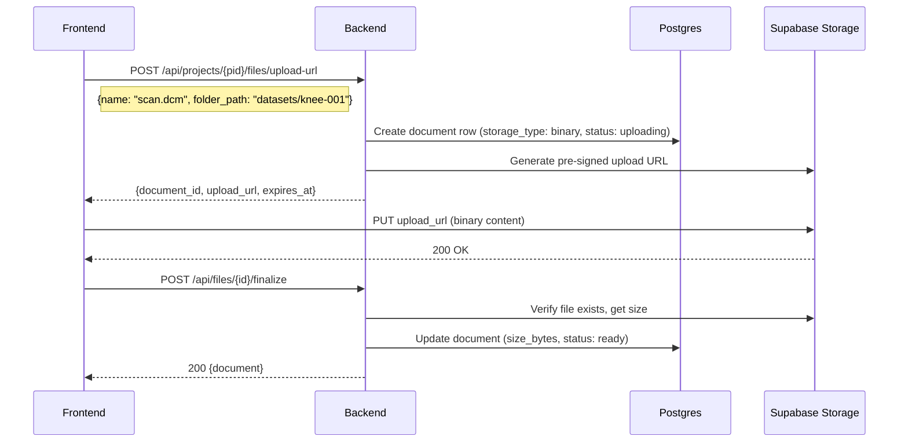
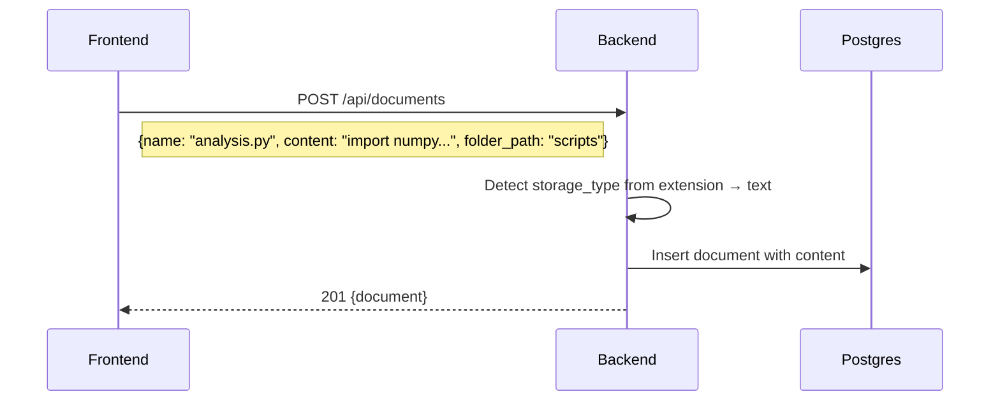
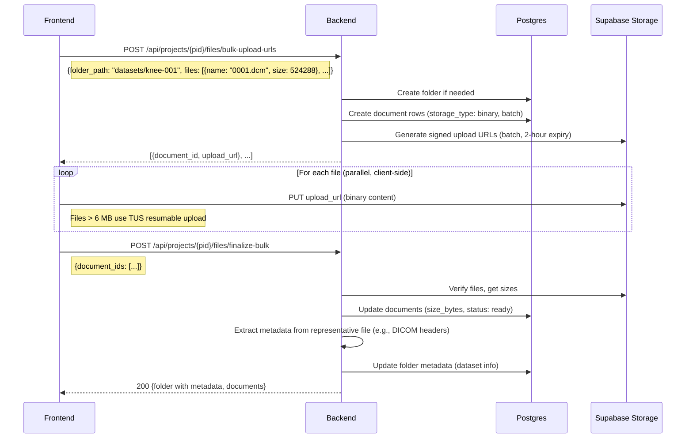

# Filesystem Layer

Unified file storage for the research analysis platform. Text files stay in DB (Yjs collab state already lives there), binary files go to Supabase Storage bucket. A metadata layer in Postgres unifies them into one project tree. Replaces the current fiction-specific `docsystem` domain and eliminates the need for a separate `datasets` domain.

See [overview](../overview.md) for system context. See [docsystem-audit](../research/docsystem-audit.md) for the migration analysis of every existing interface.

## Architecture

```
┌─────────────────────────────────────────────────┐
│  Yjs collab + proposals                         │  ← only for text files
│  (existing collab domain, unchanged)             │
├─────────────────────────────────────────────────┤
│  Metadata DB (documents table)                   │  ← one row per file: path, size,
│  path, mime_type, storage_type, project_id       │     mime type, timestamps, JSONB metadata
│  content (TEXT, for text files only)              │
├─────────────────────────────────────────────────┤
│  Supabase Storage bucket                         │  ← binary file content only
│  organized by project_id/file_id                 │
└─────────────────────────────────────────────────┘
```

### Storage Routing

Every file gets a row in the `documents` table. The `storage_type` field determines where content lives:

| `storage_type` | Content location | Collab eligible | Examples |
|----------------|-----------------|-----------------|----------|
| `text` | `documents.content` column (DB) | Yes | `.md`, `.txt`, `.py`, `.csv`, `.json`, `.mmd`, `.mermaid`, `.excalidraw` |
| `binary` | Supabase Storage bucket | No | `.dcm`, `.stl`, `.obj`, `.xlsx`, `.pdf`, `.png`, `.jpg`, `.zip`, `.nii.gz` |

The routing decision is a single function:

```go
// backend/internal/domain/docsystem/storage_type.go

type StorageType string

const (
    StorageTypeText   StorageType = "text"
    StorageTypeBinary StorageType = "binary"
)

// textExtensions lists extensions stored as text in the DB.
// Everything else is binary (stored in bucket).
// This is an allowlist — unknown extensions default to binary.
var textExtensions = map[string]bool{
    ".md": true, ".markdown": true, ".txt": true,
    ".py": true, ".r": true, ".jl": true,           // scripts
    ".csv": true, ".tsv": true,                       // tabular (small enough for DB)
    ".json": true, ".yaml": true, ".yml": true,       // config/data
    ".toml": true, ".ini": true, ".cfg": true,
    ".excalidraw": true,                               // diagrams
    ".mmd": true, ".mermaid": true,
    ".html": true, ".htm": true, ".xml": true,
    ".sh": true, ".bash": true,
    ".sql": true,
    ".tex": true, ".bib": true,                        // LaTeX
}

func StorageTypeFromExtension(ext string) StorageType {
    ext = strings.ToLower(ext)
    if textExtensions[ext] {
        return StorageTypeText
    }
    return StorageTypeBinary
}
```

**Why an allowlist for text, not a blocklist for binary**: Binary is the safe default. An unknown extension stored as text could mean gigabytes in a TEXT column. An unknown extension stored in a bucket always works. The allowlist grows as we add support for new text-editable formats.

## Database Schema

### Migration: Transform documents table

```sql
-- Replace file_type enum with storage_type
ALTER TABLE ${TABLE_PREFIX}documents
    ADD COLUMN IF NOT EXISTS storage_type TEXT NOT NULL DEFAULT 'text';

-- Backfill: all existing documents are text (fiction platform had no binary files)
UPDATE ${TABLE_PREFIX}documents SET storage_type = 'text';

-- Drop the fiction-specific file_type constraint
ALTER TABLE ${TABLE_PREFIX}documents
    DROP CONSTRAINT IF EXISTS ${TABLE_PREFIX}documents_file_type_check;

-- Add storage_type constraint
ALTER TABLE ${TABLE_PREFIX}documents
    ADD CONSTRAINT ${TABLE_PREFIX}documents_storage_type_check
        CHECK (storage_type IN ('text', 'binary'));

-- Content column stays but is empty for binary files
-- storage_url is populated for binary files, null for text files
-- mime_type becomes required for binary, derived for text

-- Index for binary file lookups by storage URL
CREATE INDEX IF NOT EXISTS idx_documents_storage_url
    ON ${TABLE_PREFIX}documents(storage_url)
    WHERE storage_url IS NOT NULL;

-- Index for filtering by storage type
CREATE INDEX IF NOT EXISTS idx_documents_storage_type
    ON ${TABLE_PREFIX}documents(storage_type);
```

The `file_type` column stays temporarily for backwards compatibility during migration but all new code uses `storage_type` + `mime_type`. The column can be dropped in a later cleanup migration.

### Document model changes

```go
type Document struct {
    // --- Unchanged ---
    ID          string           `json:"id" db:"id"`
    ProjectID   string           `json:"project_id" db:"project_id"`
    FolderID    *string          `json:"folder_id" db:"folder_id"`
    Name        string           `json:"name" db:"name"`
    Extension   string           `json:"extension" db:"extension"`    // Now accepts ANY extension
    Description *string          `json:"description,omitempty" db:"description"`
    Autoapply   *bool            `json:"autoapply,omitempty" db:"autoapply"`
    Path        string           `json:"path,omitempty"`
    Metadata    DocumentMetadata `json:"metadata" db:"metadata"`
    CreatedAt   time.Time        `json:"created_at" db:"created_at"`
    UpdatedAt   time.Time        `json:"updated_at" db:"updated_at"`
    DeletedAt   *time.Time       `json:"deleted_at,omitempty" db:"deleted_at"`
    PendingProposalCount int     `json:"pending_proposal_count,omitempty" db:"pending_proposal_count"`

    // --- Changed ---
    StorageType StorageType      `json:"storage_type" db:"storage_type"`   // "text" or "binary" (replaces FileType)
    FileType    string           `json:"file_type" db:"file_type"`         // Kept for backwards compat, derived from extension
    Content     string           `json:"content" db:"content"`             // Populated for text files, empty for binary
    StorageURL  *string          `json:"storage_url,omitempty" db:"storage_url"`   // Bucket path for binary files
    MimeType    *string          `json:"mime_type,omitempty" db:"mime_type"`
    SizeBytes   *int64           `json:"size_bytes,omitempty" db:"size_bytes"`
}

// IsTextBased returns true if this file stores content in the DB.
func (d *Document) IsTextBased() bool {
    return d.StorageType == StorageTypeText
}

// IsBinary returns true if this file stores content in Supabase Storage.
func (d *Document) IsBinary() bool {
    return d.StorageType == StorageTypeBinary
}
```

## Bucket Organization

Binary files in Supabase Storage are organized by project and document ID:

```
supabase-storage/
  project-files/                    # Single bucket for all projects
    {project_id}/
      {document_id}/{filename}      # One file per document
```

**Why per-document-ID subdirectory**: The document ID is the stable reference. Files can be renamed or moved in the tree (updating the DB row) without moving the bucket object. The bucket path is an implementation detail, never exposed to users.

**Why a single bucket**: Supabase buckets map to RLS policies. One bucket with project-scoped paths is simpler than per-project buckets. The backend uses the **service role key** (bypasses RLS) for all bucket operations. Future multi-user access uses signed URLs generated server-side. Per-bucket MIME type restrictions and file size limits are configured via the Supabase dashboard.

**Bucket configuration** (Supabase dashboard):
- Max file size: 500 MB (covers DICOM stacks; Pro plan ceiling is 500 GB)
- Bucket visibility: Private (all access via signed URLs or service key)
- No MIME type restriction at bucket level (we accept arbitrary research files)

## Upload Flow

### Binary file upload (pre-signed URL)



### Text file creation (existing flow, unchanged)



### Bulk upload (DICOM stack / ZIP)



### Upload protocol selection

The frontend chooses the upload protocol based on file size:

| File size | Protocol | Client library |
|-----------|----------|---------------|
| ≤ 6 MB | Standard PUT to signed URL | `fetch` |
| > 6 MB | TUS resumable upload | `tus-js-client` (6 MB chunks, server-side resumability) |

TUS upload URLs expire after **24 hours**. If a DICOM stack upload is interrupted, the client can resume within that window by querying the server for the current offset. After 24 hours, the upload must restart.

For the Go backend uploading files server-side (e.g., sandbox result upload), use **AWS SDK v2 S3 multipart upload** via the Supabase S3-compatible endpoint (`forcePathStyle: true`). This provides parallel chunk upload with automatic retry.

## Download Flow

### Binary file download

```
GET /api/files/{id}/download → 302 redirect to signed download URL
```

The backend generates a short-lived (5 min) signed download URL from Supabase Storage and redirects. The frontend never knows the bucket path.

**Important**: Signed URLs expire. The frontend must not cache download URLs across navigation events. Each download request generates a fresh URL. The frontend can cache URLs for the duration of a single page view (< 5 min), but must re-request on navigation.

### Text file content

Text file content comes through the existing document GET endpoint:

```
GET /api/documents/{id} → {document with content field populated}
```

No change from current behavior.

## Sandbox File Access

The Daytona sandbox needs to read project files for analysis. Three access patterns were evaluated (see [research](../research/supabase-storage-capabilities.md) §9):

1. **Direct S3 API** (boto3 from sandbox code) — recommended default
2. **FUSE mount** (Daytona Volumes) — rejected for MVP due to DICOM seek-latency concerns
3. **Copy-on-start** (backend hydrates sandbox) — used for bulk DICOM processing

### Default: Direct S3 API from sandbox

The sandbox receives S3 credentials as environment variables at startup. Python code accesses files via boto3:

```python
# Pre-installed in sandbox: meridian_files.py
import boto3
from botocore.config import Config

s3 = boto3.client(
    "s3",
    endpoint_url=os.environ["SUPABASE_STORAGE_ENDPOINT"],
    aws_access_key_id=os.environ["SUPABASE_S3_ACCESS_KEY"],
    aws_secret_access_key=os.environ["SUPABASE_S3_SECRET_KEY"],
    region_name="auto",
    config=Config(s3={"addressing_style": "path"}),
)

def download_file(project_path: str, local_path: str = None):
    """Download a project file to sandbox local filesystem."""
    # ...downloads from bucket to /workspace/project-files/...

def upload_file(local_path: str, project_path: str):
    """Upload a sandbox file to the project bucket."""
    # ...uploads to bucket, then calls backend to create DB metadata row
```

**Tradeoff**: Requires injecting S3 credentials into the sandbox. For the single-user MVP, the service role key is acceptable. For multi-user, the backend would generate scoped S3 session tokens per sandbox.

### Bulk DICOM processing: Copy-on-start

When the AI requests processing a DICOM stack (hundreds of files), the backend pre-stages files to the sandbox before execution:

1. Backend fetches file list from project tree
2. Backend generates signed download URLs (batch) 
3. Backend pushes files into sandbox via Daytona file upload API
4. Sandbox processes locally (full local I/O performance — no FUSE overhead)
5. Results uploaded back via S3 API

This avoids the FUSE seek-latency problem documented in the [platform research](../research/platform-storage-patterns.md) §2 (Deepnote warns about this pattern).

### Sandbox file writes → project

When the sandbox produces output files (segmentation results, meshes, figures), they're saved back via S3 API + backend metadata creation:

```python
from meridian_files import upload_file
upload_file("/workspace/output/femur.stl", "results/femur.stl")  # Uploads to project
```

The helper uploads the file to the bucket via S3 API, then calls the backend API to create a document metadata row in Postgres. This two-step ensures the project tree stays in sync.

## Metadata System

The existing `DocumentMetadata` (JSONB `map[string]interface{}`) becomes the universal metadata store. Format-specific metadata lives under namespaced keys:

```json
// Text file (markdown)
{"markdown": {"wordCount": 1500}}

// DICOM file
{"dicom": {"modality": "CT", "manufacturer": "SCANCO", "sliceCount": 400, "pixelSpacing": [0.012, 0.012]}}

// Mesh file
{"mesh": {"format": "STL", "vertices": 50000, "faces": 100000}}

// Python script
{"script": {"language": "python", "imports": ["numpy", "SimpleITK"]}}
```

### Dataset-as-folder metadata

A folder that represents a dataset (e.g., a DICOM stack) stores dataset-level metadata on the Folder's `Metadata` JSONB:

```json
// Folder.Metadata for a DICOM dataset folder
{
    "dataset": {
        "status": "ready",
        "modality": "CT",
        "manufacturer": "SCANCO MEDICAL",
        "scannerModel": "vivaCT 40",
        "sliceCount": 400,
        "totalSizeBytes": 209715200,
        "fileCount": 400,
        "studyDate": "2024-03-15"
    }
}
```

This replaces the separate `datasets` table entirely. The `DatasetService.FinalizeUpload` logic moves into the bulk upload finalization endpoint, which extracts DICOM metadata and writes it to the folder.

## Search Changes

Full-text search adapts to the text/binary split:

- **Name search**: Works for all files (text and binary)
- **Content search**: Only searches text files (binary content isn't in DB)
- **Metadata search**: New capability — search JSONB metadata fields (e.g., find files by MIME type, find datasets by modality)

The `SearchOptions.Fields` enum gains `SearchFieldMetadata`. The repository implementation adds a JSONB containment query for metadata search.

## Interface Changes Summary

### New interfaces

```go
// StorageService manages binary file storage in Supabase bucket.
// Separated from DocumentService (SRP) — this handles bucket operations only.
type StorageService interface {
    // GenerateUploadURL creates a pre-signed URL for uploading a binary file.
    GenerateUploadURL(ctx context.Context, projectID, documentID, filename string) (url string, expiresAt time.Time, err error)

    // GenerateDownloadURL creates a pre-signed URL for downloading a binary file.
    GenerateDownloadURL(ctx context.Context, projectID, documentID string) (url string, expiresAt time.Time, err error)

    // DeleteFile removes a file from the bucket.
    DeleteFile(ctx context.Context, projectID, documentID string) error

    // DeleteProjectFiles removes all files for a project from the bucket.
    DeleteProjectFiles(ctx context.Context, projectID string) error

    // GetFileInfo returns size and existence check for a bucket file.
    GetFileInfo(ctx context.Context, projectID, documentID string) (sizeBytes int64, exists bool, err error)
}

// MetadataExtractor extracts format-specific metadata from file content.
// Strategy pattern: one extractor per file format family.
type MetadataExtractor interface {
    Extract(ctx context.Context, content io.Reader, filename string) (DocumentMetadata, error)
    SupportedExtensions() []string
    Name() string
}
```

### Modified interfaces

See [docsystem-audit](../research/docsystem-audit.md) for the full audit. Key changes:

- **DocumentService**: Gains `GetUploadURL`, `GetDownloadURL` methods. `CreateDocument` routes text vs binary. `DeleteDocument` orchestrates DB + bucket cleanup.
- **DocumentResolver** (collab): Gates on `StorageTypeText` — binary files cannot open collab sessions.
- **ImportService**: `ProcessFiles` routes binary files to bucket, text files to DB. Absorbs the dataset upload flow.
- **TreeService**: Tree now includes binary file nodes with `StorageURL`, `MimeType`, `SizeBytes`.
- **ContentAnalyzer**: Unchanged interface, narrowed scope to text files only.

### Unchanged interfaces

FolderStore, FolderService, ProjectStore, ProjectService, FavoriteStore, FavoriteService, NamespaceService, PathNotationResolver, DocumentPathResolver, and all collab-internal interfaces.

## What Dies

| Component | Replacement |
|-----------|-------------|
| `FileType` enum (markdown/skill/agent/tool/excalidraw/mermaid/image/pdf) | `StorageType` (text/binary) + `MimeType` |
| `ExtensionToFileType` map | `textExtensions` allowlist + `mime.TypeByExtension` |
| `IsValidExtension` | Deleted — all extensions are valid |
| `FileTypeFromExtension` | `StorageTypeFromExtension` |
| Entire `datasets` domain (interfaces + types + service + repository + handler + migration) | Folder with metadata + unified file upload |

## HTTP Endpoints

### New endpoints

```
POST   /api/projects/{pid}/files/upload-url       Get pre-signed upload URL for a binary file
POST   /api/projects/{pid}/files/bulk-upload-urls  Get pre-signed URLs for multiple files
POST   /api/files/{id}/finalize                    Finalize single file upload
POST   /api/projects/{pid}/files/finalize-bulk     Finalize bulk upload + extract metadata
GET    /api/files/{id}/download                    Redirect to pre-signed download URL
```

### Existing endpoints (unchanged)

```
POST   /api/documents                              Create document (text files)
GET    /api/documents/{id}                          Get document
PATCH  /api/documents/{id}                          Update document
DELETE /api/documents/{id}                          Delete document
GET    /api/projects/{pid}/tree                     Get project tree (now includes binary files)
POST   /api/projects/{pid}/import                   Import files (now routes text/binary)
```

## Directory Map

```
backend/internal/
  domain/docsystem/
    storage_type.go              # NEW: StorageType enum + routing function
    document.go                  # MODIFIED: Add StorageType, IsTextBased(), IsBinary()
    file_type.go                 # DEPRECATED: Kept for migration, new code uses storage_type
    storage_service.go           # NEW: StorageService interface
    metadata_extractor.go        # NEW: MetadataExtractor interface
    # All other files: see audit for SURVIVES/TRANSFORMS status

  service/docsystem/
    document.go                  # MODIFIED: Text/binary routing in Create/Delete
    storage.go                   # NEW: StorageService implementation (Supabase client)
    metadata/
      dicom_extractor.go         # NEW: DICOM header metadata extraction
      mime_detector.go           # NEW: MIME type detection utility

  handler/
    document.go                  # MODIFIED: Minor changes for new fields
    file_upload.go               # NEW: Upload URL + finalize endpoints
```

## Go SDK Strategy

Based on [Supabase Storage research](../research/supabase-storage-capabilities.md) §6:

| Purpose | SDK | Why |
|---------|-----|-----|
| Large file upload (server-side) | **AWS SDK v2** via S3-compatible endpoint | Multipart upload with parallel chunks, automatic retry, battle-tested |
| Signed URL generation | **storage-go** (v0.7.0) | Simple API for `CreateSignedUrl`, `CreateSignedUploadUrl` |
| Bucket management | **storage-go** | Bucket CRUD, file listing, metadata queries |
| File deletion | **AWS SDK v2** `DeleteObject` | Reliable, supports batch `DeleteObjects` for project cleanup |

The S3-compatible endpoint requires `forcePathStyle: true` and the endpoint URL `https://<project-ref>.storage.supabase.co/storage/v1/s3`.

**Authentication**: Service role key (bypasses RLS) for all backend-to-bucket operations. S3 access keys generated from Supabase dashboard.

## Related Docs

- [Docsystem Audit](../research/docsystem-audit.md) — per-interface migration analysis
- [Dataset Domain](dataset-domain.md) — the design this replaces (datasets collapse into filesystem)
- [Daytona Service](daytona-service.md) — sandbox file access patterns
