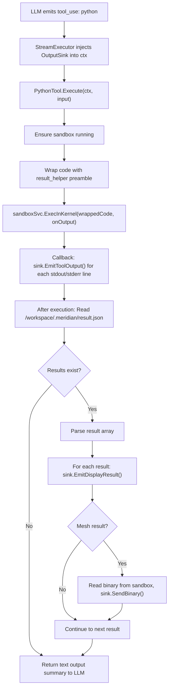

# Python Tool (Jupyter Kernel)

New `ToolExecutor` that executes raw Python code in a persistent Jupyter kernel inside the Daytona sandbox. Primary tool for the data-analyst agent. The AI sends Python code directly — no shell wrapping, no file path indirection. See [overview](../overview.md) for system context.

**Key design property**: The `python` tool is designed to be replaceable by a code fence interceptor (`python:run` blocks). The downstream flow — ExecInKernel → stream stdout → read result.json → emit results → render — is identical regardless of trigger mechanism. Nothing downstream knows or cares whether code came from a tool call or a code fence.

## Tool Schema (LLM-facing)

```json
{
  "name": "python",
  "description": "Execute Python code in a persistent Jupyter kernel. Variables and imports survive between calls. Packages pre-installed: numpy, scipy, pandas, SimpleITK, pydicom, scikit-image, trimesh, plotly, matplotlib. Use show_plotly(), show_matplotlib(), show_dataframe(), show_mesh() to render results inline.",
  "input_schema": {
    "type": "object",
    "properties": {
      "code": {
        "type": "string",
        "description": "Python code to execute. Raw code, not a shell command. Variables persist between calls."
      },
      "timeout_seconds": {
        "type": "integer",
        "description": "Maximum execution time in seconds. Default 120, max 600.",
        "default": 120
      }
    },
    "required": ["code"]
  }
}
```

**Input is raw Python code**, not a command string. The AI writes:
```json
{"code": "import SimpleITK as sitk\nimg = sitk.ReadImage('scan.nii')"}
```
Not: `{"command": "python3 script.py"}`

## Architecture Constraint: Tool-Emitter Boundary

The existing `ToolExecutor` interface is synchronous:
```go
type ToolExecutor interface {
    Execute(ctx context.Context, input map[string]interface{}) (interface{}, error)
}
```

Tools cannot hold emitter references — the emitter is created at stream-execution time. **Solution**: The `StreamExecutor` injects an `OutputSink` into the execution context before calling `tool.Execute()`. See [display-results.md](display-results.md) for the OutputSink interface.

## Interface

```go
// backend/internal/service/llm/tools/python_tool.go

type PythonTool struct {
    sandboxSvc  sandbox.Service
    datasetSvc  datasets.Service
    projectID   uuid.UUID
    userID      uuid.UUID
}

func (t *PythonTool) Execute(ctx context.Context, input map[string]interface{}) (interface{}, error)
```

No emitter field. Streaming happens via `OutputSinkFromContext(ctx)`.

## Execution Flow



### Always Kernel, Always Wrapped

Every execution goes through the persistent Jupyter kernel, always wrapped with result_helper:

```go
func (t *PythonTool) Execute(ctx context.Context, input map[string]interface{}) (interface{}, error) {
    code, _ := input["code"].(string)
    sink := tools.OutputSinkFromContext(ctx)

    if err := t.ensureSandboxReady(ctx); err != nil {
        return nil, err
    }

    wrappedCode := wrapWithResultHelper(code)

    seq := 0
    onOutput := func(stream, text string) {
        if sink != nil {
            sink.EmitToolOutput(stream, text, seq)
            seq++
        }
    }

    result, err := t.sandboxSvc.ExecInKernel(ctx, t.projectID, wrappedCode, onOutput)
    if err != nil { return nil, err }

    // Read and emit display results
    t.emitDisplayResults(ctx, sink)

    return &PythonResult{
        ExitCode: result.ExitCode,
        Stdout:   result.Stdout,
        Stderr:   result.Stderr,
    }, nil
}
```

### Kernel Wrapper

Code is always wrapped with result_helper imports:

```python
# Preamble injected before user code
import sys
sys.path.insert(0, '/workspace/.meridian')
sys.path.insert(0, '/workspace')
sys.path.insert(0, '/workspace/scripts')
from result_helper import show_plotly, show_matplotlib, show_dataframe, show_mesh, _flush, _results
_results.clear()  # Clear from previous execution

# --- User code ---
try:
    {user_code}
finally:
    _flush()
```

The `_results.clear()` + `try/finally _flush()` pattern handles the persistent kernel: previous results are cleared before each new execution, and results are always flushed — even if user code raises an exception (partial results from `show_*` calls before the crash are still emitted). `sys.path` includes `/workspace` and `/workspace/scripts` so AI-written modules are importable.

### Display Result Emission

After execution, check for display results and emit them:

```go
func (t *PythonTool) emitDisplayResults(ctx context.Context, sink OutputSink) {
    if sink == nil { return }

    resultJSON, err := t.sandboxSvc.ReadFile(ctx, t.projectID, "/workspace/.meridian/result.json")
    if err != nil || len(resultJSON) == 0 { return }

    var results []map[string]interface{}
    if json.Unmarshal(resultJSON, &results) != nil { return }

    for _, r := range results {
        sink.EmitDisplayResult(toDisplayResultPayload(r))
        if r["type"] == "mesh" {
            binPath, _ := r["bin_path"].(string)
            meshData, err := t.sandboxSvc.ReadFile(ctx, t.projectID, binPath)
            if err == nil {
                meshID, _ := r["mesh_id"].(string)
                sink.SendBinary(meshID, meshData)
            }
        }
    }

    // Clean up result file for next execution
    t.sandboxSvc.ExecBash(ctx, t.projectID, "rm -f /workspace/.meridian/result.json", nil)
}
```

## Result Protocol (File-Based)

Python code communicates rich results via file, not stdout. The `result_helper.py` module is pre-installed in the sandbox snapshot.

```python
# /workspace/.meridian/result_helper.py (pre-installed in sandbox)
import json, base64, io, os, struct
from pathlib import Path

_RESULT_DIR = Path('/workspace/.meridian')
_MESH_DIR = _RESULT_DIR / 'meshes'
_results = []

def show_plotly(fig):
    """Render a Plotly figure inline in chat."""
    _results.append({"type": "plotly", "data": json.loads(fig.to_json())})

def show_matplotlib(fig=None):
    """Render current matplotlib figure inline in chat."""
    import matplotlib.pyplot as plt
    if fig is None:
        fig = plt.gcf()
    buf = io.BytesIO()
    fig.savefig(buf, format='png', dpi=150, bbox_inches='tight')
    buf.seek(0)
    _results.append({
        "type": "image",
        "format": "png",
        "data": base64.b64encode(buf.read()).decode()
    })
    plt.close(fig)

def show_dataframe(df, title=None):
    """Render a DataFrame as a styled table in chat."""
    _results.append({
        "type": "dataframe",
        "html": df.to_html(classes='meridian-table', escape=True),
        "title": title,
        "row_count": len(df),
        "col_count": len(df.columns)
    })

def show_mesh(vertices, faces, mesh_id, label, color="#888888"):
    """Send a single named mesh to the 3D viewer.

    Each call sends one complete mesh. Same mesh_id replaces an existing mesh;
    new mesh_id adds to the scene. The AI manages the scene through IDs.

    Args:
        vertices: numpy array of shape (N, 3), float32
        faces: numpy array of shape (M, 3), uint32
        mesh_id: unique identifier for this mesh (e.g. "femur", "tibia")
        label: human-readable display name (e.g. "Femur")
        color: hex color string (e.g. "#4488ff")
    """
    import numpy as np

    _MESH_DIR.mkdir(parents=True, exist_ok=True)

    bin_path = _MESH_DIR / f"{mesh_id}.bin"
    with open(bin_path, 'wb') as f:
        verts = vertices.astype(np.float32)
        fcs = faces.astype(np.uint32)
        f.write(struct.pack('<II', len(verts), len(fcs)))
        f.write(verts.tobytes())
        f.write(fcs.tobytes())

    _results.append({
        "type": "mesh",
        "mesh_id": mesh_id,
        "bin_path": str(bin_path),
        "vertex_count": len(verts),
        "face_count": len(fcs),
        "label": label,
        "color": color,
    })

def _flush():
    """Write results to file for backend to read."""
    if _results:
        _RESULT_DIR.mkdir(parents=True, exist_ok=True)
        with open(_RESULT_DIR / 'result.json', 'w') as f:
            json.dump(_results, f)
    elif (_RESULT_DIR / 'result.json').exists():
        os.remove(_RESULT_DIR / 'result.json')
```

**Key change from previous design**: `show_mesh()` takes `mesh_id`, `label`, `color` per call — one complete mesh per call, not a multi-label blob with per-vertex labels. No `labels` or `label_names` parameters. The binary format is simpler: just vertices + faces, no per-vertex label array.

## Binary Mesh Frame

Binary payload layout (all little-endian):
```
[4 bytes] vertex_count (uint32)
[4 bytes] face_count (uint32)
[vertex_count * 12 bytes] vertices (float32 x,y,z)
[face_count * 12 bytes] faces (uint32 v0,v1,v2)
```

No per-vertex labels in the binary. Each mesh is one structure with one color.

## Extensibility: Code Fence Execution (Option 2)

The python tool is the MVP trigger mechanism. The architecture supports replacing it with a code fence interceptor:

```
Trigger Mechanism              Downstream (shared)
-----------------              ------------------
Option 1 (MVP):                sandboxSvc.ExecInKernel()
  LLM calls python tool  ->      -> stream stdout
  PythonTool.Execute()            -> read result.json
                                  -> emit DISPLAY_RESULT events
Option 2 (future):               -> render in frontend
  LLM writes python:run
  block in response       ->   (identical flow)
  Backend intercepts
  on fence close
```

The Daytona service interface, result_helper.py protocol, DISPLAY_RESULT events, and frontend rendering are all decoupled from how code arrives. A code fence interceptor would call `sandboxSvc.ExecInKernel()` directly, bypassing the python tool, using the same downstream pipeline.

## Registration

Follows the builder's fluent method pattern:

```go
// backend/internal/service/llm/tools/builder.go

func (b *ToolRegistryBuilder) WithPythonTool(sandboxSvc sandbox.Service, datasetSvc datasets.Service) *ToolRegistryBuilder {
    if sandboxSvc == nil {
        return b  // Graceful degradation when Daytona not configured
    }
    tool := NewPythonTool(b.projectID, b.userID, sandboxSvc, datasetSvc)
    b.registry.RegisterWithMetadata("python", tool, PythonToolMetadata())
    return b
}

// Called from ToolRegistryFactory.BuildProductionRegistry():
builder.WithPythonTool(inputs.SandboxService, inputs.DatasetService)
```

## Metadata

```go
func PythonToolMetadata() *ToolMetadata {
    return &ToolMetadata{
        Name:        "python",
        Description: "Execute Python in a persistent Jupyter kernel with scientific packages",
        Guideline:   "Variables and imports survive between calls. Use show_plotly(), show_matplotlib(), show_dataframe(), show_mesh() to render results inline. Datasets at /workspace/datasets/{slug}/. Write reusable modules to .py files via the bash tool, then import them here.",
    }
}
```

## Dataset Hydration

The python tool automatically hydrates datasets on first sandbox startup, same pattern as the bash tool:

```go
func (t *PythonTool) ensureSandboxReady(ctx context.Context) error {
    _, err := t.sandboxSvc.EnsureRunning(ctx, t.projectID)
    if err != nil { return err }

    datasets, err := t.datasetSvc.List(ctx, t.userID, t.projectID)
    if err != nil { return err }

    var datasetIDs []uuid.UUID
    for _, ds := range datasets {
        if ds.Status == datasets.DatasetStatusReady {
            datasetIDs = append(datasetIDs, ds.ID)
        }
    }
    if len(datasetIDs) > 0 {
        return t.sandboxSvc.HydrateDatasets(ctx, t.projectID, datasetIDs)
    }
    return nil
}
```

## File Access

```
/workspace/datasets/{dataset_slug}/    # DICOM files from Supabase Storage (auto-hydrated)
/workspace/outputs/                    # Generated files (figures, meshes, CSVs)
/workspace/.meridian/                  # Helper modules, result.json, meshes/
/workspace/scripts/                    # AI-written Python modules (written via bash tool)
```

## Error Handling

| Error | Behavior |
|-------|----------|
| Sandbox not running, start fails | Return structured error to LLM: "Sandbox unavailable" |
| Python syntax error | Stream stderr, return error result to LLM |
| Timeout exceeded | Kill process, return timeout error |
| Daytona API unreachable | Return service unavailable error |
| Result file too large (>10MB) | Truncate with warning, suggest file export |
| Result file missing | Return stdout-only output (no display results) |
| Kernel not responding | Restart kernel, retry once, then error |

## Security

- Code runs in isolated Daytona sandbox (namespace isolation)
- No access to Go backend internals
- Network egress allowlist: only Supabase Storage URL
- CPU/RAM/disk limits configured in SandboxConfig
- Auto-stop after idle timeout
- Env vars scrubbed: only `PYTHONUNBUFFERED=1` and `SUPABASE_STORAGE_URL`

## Related Docs

- [bash Tool](bash-tool.md) — companion tool for shell commands + file ops
- [Daytona Service](daytona-service.md) — sandbox lifecycle + persistent kernel
- [Display Result Pipeline](display-results.md) — how results stream to frontend
- [Dataset Domain](dataset-domain.md) — files hydrated into sandbox
