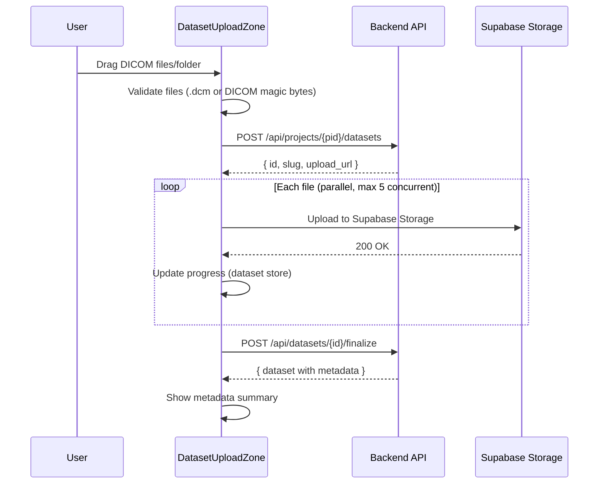

# Dataset Upload UI

Drag-and-drop DICOM stack upload with metadata extraction. Project-scoped, rendered in the right panel's content area. See [overview](overview.md) for frontend architecture context.

## Entry Points

Two ways to access datasets:

1. **Datasets tab in content panel**: Always-visible tab in the `ContentToolbar`. Shows dataset list + upload zone.
2. **Chat-initiated**: User mentions uploading in chat, agent provides instructions, user switches to Datasets tab.

The dataset panel is one of the content types in `ContentPanel`, always available as a tab. See [layout.md](layout.md).

## Component Architecture

```
features/datasets/
├── DatasetPanel.tsx              # Main panel: upload zone + list
├── DatasetPanel.stories.tsx      # Storybook story
├── DatasetUploadZone.tsx         # Drag-and-drop zone
├── DatasetUploadZone.stories.tsx
├── DatasetList.tsx               # List of existing datasets
├── DatasetCard.tsx               # Individual dataset with metadata
├── DatasetCard.stories.tsx
├── DatasetMetadataView.tsx       # Expanded metadata display
├── hooks/
│   ├── useDatasetUpload.ts       # Upload orchestration (calls store + API)
│   └── useDatasets.ts            # TanStack Query hooks (list, create, finalize, delete)
├── types.ts                      # Dataset, DatasetMetadata types
└── examples/
    └── mock-datasets.ts          # Mock data for Storybook
```

## Upload Flow



## TypeScript Types

```typescript
// features/datasets/types.ts

export interface Dataset {
  id: string
  projectId: string
  slug: string
  name: string
  description: string
  status: "uploading" | "processing" | "ready" | "error"
  metadata?: DatasetMetadata
  fileCount: number
  totalSizeBytes: number
  createdAt: string
  updatedAt: string
}

export interface DatasetMetadata {
  modality?: string
  manufacturer?: string
  scannerModel?: string
  sliceCount?: number
  sliceThickness?: number
  pixelSpacingX?: number
  pixelSpacingY?: number
  rows?: number
  columns?: number
  bitsAllocated?: number
  patientId?: string
  studyDate?: string
  studyDescription?: string
}
```

## DatasetPanel

Main panel combining upload zone and dataset list:

```tsx
// features/datasets/DatasetPanel.tsx

function DatasetPanel({ projectId }: { projectId: string }) {
  const { data: datasets, isLoading } = useDatasets(projectId)

  return (
    <div className="flex h-full flex-col">
      <div className="border-b px-4 py-3">
        <h3 className="text-sm font-medium">Datasets</h3>
        <p className="text-xs text-muted-foreground">
          Upload DICOM stacks for analysis
        </p>
      </div>

      <div className="flex-1 overflow-y-auto p-4 space-y-4">
        <DatasetUploadZone projectId={projectId} />

        {isLoading ? (
          <div className="flex items-center gap-2 text-sm text-muted-foreground">
            <Spinner className="h-4 w-4" />
            Loading datasets...
          </div>
        ) : datasets && datasets.length > 0 ? (
          <DatasetList datasets={datasets} />
        ) : (
          <p className="text-sm text-muted-foreground">No datasets yet</p>
        )}
      </div>
    </div>
  )
}
```

## DatasetUploadZone

```tsx
// features/datasets/DatasetUploadZone.tsx

function DatasetUploadZone({ projectId }: { projectId: string }) {
  const { startUpload } = useDatasetUpload(projectId)
  const upload = useDatasetStore((s) => s.upload)
  const [isDragging, setIsDragging] = useState(false)

  const handleDrop = async (e: React.DragEvent) => {
    e.preventDefault()
    setIsDragging(false)
    const files = await extractFiles(e.dataTransfer)
    const validated = validateDicomFiles(files)
    if (validated.valid.length > 0) {
      startUpload(validated.valid)
    }
  }

  return (
    <div
      className={cn(
        "rounded-lg border-2 border-dashed p-8 text-center transition-colors",
        "hover:border-accent-fill hover:bg-accent-fill/5",
        isDragging && "border-accent-fill bg-accent-fill/10"
      )}
      onDrop={handleDrop}
      onDragOver={(e) => { e.preventDefault(); setIsDragging(true) }}
      onDragLeave={() => setIsDragging(false)}
    >
      {upload.status === "idle" && (
        <>
          <UploadSimple className="mx-auto mb-4 h-12 w-12 text-muted-foreground" />
          <p className="text-sm font-medium">Drag DICOM files or folder here</p>
          <p className="mt-1 text-xs text-muted-foreground">
            Supports .dcm files and DICOM directories
          </p>
          <Button variant="outline" size="sm" className="mt-4" onClick={openFilePicker}>
            Or browse files
          </Button>
        </>
      )}

      {upload.status === "uploading" && (
        <UploadProgress
          filesUploaded={upload.filesUploaded}
          totalFiles={upload.totalFiles}
          bytesUploaded={upload.bytesUploaded}
          totalBytes={upload.totalBytes}
        />
      )}

      {upload.status === "processing" && (
        <div className="flex items-center justify-center gap-3">
          <Spinner className="h-4 w-4" />
          <span className="text-sm">Extracting DICOM metadata...</span>
        </div>
      )}

      {upload.status === "complete" && (
        <div className="flex items-center justify-center gap-2 text-sm text-success">
          <CheckCircle className="h-5 w-5" />
          Upload complete
        </div>
      )}

      {upload.status === "error" && (
        <div className="space-y-2">
          <p className="text-sm text-destructive">{upload.message}</p>
          <Button variant="outline" size="sm" onClick={resetUpload}>
            Try again
          </Button>
        </div>
      )}
    </div>
  )
}
```

## File Validation

Client-side validation before upload:

```typescript
// features/datasets/hooks/useDatasetUpload.ts

function validateDicomFiles(files: File[]): { valid: File[]; invalid: string[] } {
  const valid: File[] = []
  const invalid: string[] = []

  for (const file of files) {
    if (file.name.toLowerCase().endsWith(".dcm")) {
      valid.push(file)
    } else {
      invalid.push(file.name)
    }
  }

  return { valid, invalid }
}
```

For the MVP, extension-based validation is sufficient. DICOM magic byte checking (128-byte preamble + "DICM") can be added as a refinement — it requires async file reads that slow down the validation UX.

## Upload Orchestration

The `useDatasetUpload` hook coordinates the dataset store, API calls, and Supabase uploads:

```typescript
// features/datasets/hooks/useDatasetUpload.ts

function useDatasetUpload(projectId: string) {
  const createDataset = useCreateDataset(projectId)
  const finalizeDataset = useFinalizeDataset()
  const store = useDatasetStore()

  async function startUpload(files: File[]) {
    const totalBytes = files.reduce((sum, f) => sum + f.size, 0)

    // 1. Create dataset record
    const name = inferDatasetName(files)
    const slug = slugify(name)
    const { id, upload_url } = await createDataset.mutateAsync({ name, slug })

    // 2. Start tracking in store
    store.startUpload(id, files.length, totalBytes)

    // 3. Upload files with bounded parallelism
    await uploadFiles(files, upload_url, (uploaded, bytes) => {
      store.updateProgress(uploaded, bytes)
    })

    // 4. Finalize
    store.setProcessing()
    await finalizeDataset.mutateAsync(id)
    store.setComplete()

    // 5. Reset after delay
    setTimeout(() => store.resetUpload(), 3000)
  }

  return { startUpload }
}
```

## Parallel Upload

DICOM stacks can have hundreds of files. Upload with bounded parallelism:

```typescript
async function uploadFiles(
  files: File[],
  uploadUrl: string,
  onProgress: (filesUploaded: number, bytesUploaded: number) => void
) {
  const CONCURRENCY = 5
  let uploaded = 0
  let bytes = 0

  const queue = [...files]
  const workers = Array.from({ length: CONCURRENCY }, async () => {
    while (queue.length > 0) {
      const file = queue.shift()!
      await uploadToSupabaseStorage(uploadUrl, file)
      uploaded++
      bytes += file.size
      onProgress(uploaded, bytes)
    }
  })

  await Promise.all(workers)
}
```

## DatasetList and DatasetCard

```tsx
// features/datasets/DatasetList.tsx

function DatasetList({ datasets }: { datasets: Dataset[] }) {
  return (
    <div className="space-y-3">
      {datasets.map((dataset) => (
        <DatasetCard key={dataset.id} dataset={dataset} />
      ))}
    </div>
  )
}
```

```tsx
// features/datasets/DatasetCard.tsx

function DatasetCard({ dataset }: { dataset: Dataset }) {
  return (
    <div className="rounded-lg border p-4">
      <div className="flex items-center justify-between">
        <div>
          <h4 className="text-sm font-medium">{dataset.name}</h4>
          <p className="text-xs text-muted-foreground">
            {dataset.fileCount} files · {formatBytes(dataset.totalSizeBytes)}
          </p>
        </div>
        <Badge variant={dataset.status === "ready" ? "success" : "secondary"}>
          {dataset.status}
        </Badge>
      </div>

      {dataset.metadata && (
        <div className="mt-3 grid grid-cols-2 gap-x-4 gap-y-1 text-xs text-muted-foreground">
          {dataset.metadata.manufacturer && (
            <span>Scanner: {dataset.metadata.manufacturer} {dataset.metadata.scannerModel}</span>
          )}
          {dataset.metadata.sliceCount && (
            <span>Slices: {dataset.metadata.sliceCount}</span>
          )}
          {dataset.metadata.pixelSpacingX && (
            <span>Resolution: {dataset.metadata.pixelSpacingX}mm</span>
          )}
          {dataset.metadata.rows && dataset.metadata.columns && (
            <span>Matrix: {dataset.metadata.rows}x{dataset.metadata.columns}</span>
          )}
        </div>
      )}
    </div>
  )
}
```

## TanStack Query Hooks

See [state.md](state.md) for the full query hook definitions. Key queries:

```typescript
// Dataset list (auto-refetches on WS invalidation)
useQuery({ queryKey: ["projects", projectId, "datasets"], ... })

// Create dataset (returns id + upload URL)
useMutation({ mutationFn: createDataset, ... })

// Finalize (triggers metadata extraction)
useMutation({ mutationFn: finalizeDataset, ... })
```

## Storybook Stories

- **DatasetUploadZone**: Idle state, dragging state, uploading progress, processing, complete, error
- **DatasetCard**: Ready dataset with full metadata, uploading dataset, error dataset
- **DatasetPanel**: Empty state, with datasets, during upload

Stories use mock data from `features/datasets/examples/mock-datasets.ts` with sample DICOM metadata.

## Dependencies

Already in `package.json`:
- `@tanstack/react-query` — data fetching
- `@radix-ui/react-progress` — progress bar
- shadcn/ui atoms (Button, Badge, Checkbox)

## Related Docs

- [Layout](layout.md) — DatasetPanel renders in the content panel
- [State Management](state.md) — dataset store, TanStack Query hooks, API client
- [Dataset Domain (backend)](../backend/dataset-domain.md) — API endpoints and types
- [Data Analyst Agent](../agent/data-analyst-agent.md) — how the agent uses datasets
