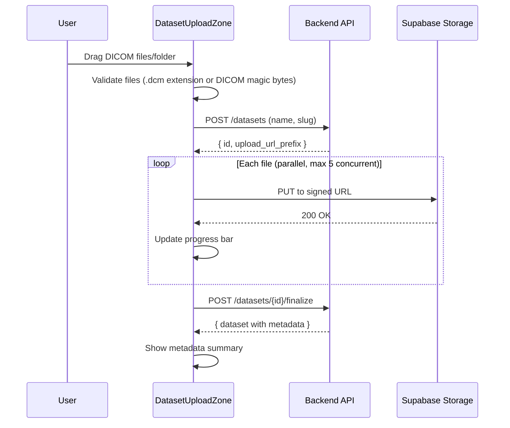

# Dataset Upload UI

Drag-and-drop DICOM stack upload with metadata extraction. Project-scoped, integrated into the existing workspace. See [overview](../overview.md) for system context.

## Entry Points

Two ways to upload datasets:

1. **Dataset panel in right panel**: A dedicated tab/view for managing datasets (list, upload, delete)
2. **Chat-initiated**: User mentions uploading in chat, agent provides instructions, user uses the upload UI

The dataset panel is a new content type in `DocumentPanel`, accessible via the project tree or a toolbar button.

## Component Architecture

```
features/datasets/
├── DatasetPanel.tsx            # Main panel: list + upload area
├── DatasetUploadZone.tsx       # Drag-and-drop zone
├── DatasetList.tsx             # List of existing datasets
├── DatasetCard.tsx             # Individual dataset with metadata
├── DatasetMetadataView.tsx     # Expanded metadata display
└── hooks/
    ├── useDatasetUpload.ts     # Upload state machine
    └── useDatasets.ts          # List/fetch datasets (TanStack Query)
```

## Upload Flow



## DatasetUploadZone

```tsx
function DatasetUploadZone({ projectId }: Props) {
  const { uploadState, startUpload, cancelUpload } = useDatasetUpload(projectId)

  return (
    <div
      className={cn(
        "border-2 border-dashed rounded-lg p-8 text-center transition-colors",
        "hover:border-accent-fill hover:bg-accent-fill/5",
        isDragging && "border-accent-fill bg-accent-fill/10"
      )}
      onDrop={handleDrop}
      onDragOver={handleDragOver}
    >
      {uploadState.status === 'idle' && (
        <>
          <UploadIcon className="w-12 h-12 mx-auto mb-4 text-muted-foreground" />
          <p className="text-sm font-medium">Drag DICOM files or folder here</p>
          <p className="text-xs text-muted-foreground mt-1">
            Supports .dcm files and DICOM directories
          </p>
          <Button variant="outline" size="sm" className="mt-4" onClick={openFilePicker}>
            Or browse files
          </Button>
        </>
      )}

      {uploadState.status === 'uploading' && (
        <UploadProgress
          filesUploaded={uploadState.filesUploaded}
          totalFiles={uploadState.totalFiles}
          bytesUploaded={uploadState.bytesUploaded}
          totalBytes={uploadState.totalBytes}
          onCancel={cancelUpload}
        />
      )}

      {uploadState.status === 'processing' && (
        <div className="flex items-center gap-3">
          <Spinner />
          <span className="text-sm">Extracting DICOM metadata...</span>
        </div>
      )}
    </div>
  )
}
```

## File Validation

Before upload, validate files client-side:

```typescript
function validateDicomFiles(files: File[]): ValidationResult {
  const valid: File[] = []
  const invalid: string[] = []

  for (const file of files) {
    // Check extension
    if (file.name.toLowerCase().endsWith('.dcm')) {
      valid.push(file)
      continue
    }
    // Check DICOM magic bytes (first 132 bytes: 128 preamble + "DICM")
    // This is async — read first 132 bytes of each file
    invalid.push(file.name)
  }

  return { valid, invalid }
}
```

## Upload State Machine

```typescript
type UploadState =
  | { status: 'idle' }
  | { status: 'uploading'; filesUploaded: number; totalFiles: number; bytesUploaded: number; totalBytes: number }
  | { status: 'processing' }  // Metadata extraction
  | { status: 'complete'; dataset: Dataset }
  | { status: 'error'; message: string }
```

## Parallel Upload

DICOM stacks can have hundreds of files. Upload with bounded parallelism:

```typescript
async function uploadFiles(files: File[], urlPrefix: string, onProgress: ProgressCallback) {
  const CONCURRENCY = 5
  let uploaded = 0

  const queue = [...files]
  const workers = Array.from({ length: CONCURRENCY }, async () => {
    while (queue.length > 0) {
      const file = queue.shift()!
      await uploadToStorage(urlPrefix, file)
      uploaded++
      onProgress(uploaded, files.length)
    }
  })

  await Promise.all(workers)
}
```

## Dataset List

```tsx
function DatasetList({ projectId }: Props) {
  const { data: datasets, isLoading } = useDatasets(projectId)

  return (
    <div className="space-y-3">
      {datasets?.map(dataset => (
        <DatasetCard key={dataset.id} dataset={dataset} />
      ))}
    </div>
  )
}

function DatasetCard({ dataset }: { dataset: Dataset }) {
  return (
    <div className="border rounded-lg p-4">
      <div className="flex items-center justify-between">
        <div>
          <h4 className="text-sm font-medium">{dataset.name}</h4>
          <p className="text-xs text-muted-foreground">
            {dataset.fileCount} files · {formatBytes(dataset.totalSizeBytes)}
          </p>
        </div>
        <Badge variant={dataset.status === 'ready' ? 'success' : 'default'}>
          {dataset.status}
        </Badge>
      </div>

      {dataset.metadata && (
        <div className="mt-3 grid grid-cols-2 gap-x-4 gap-y-1 text-xs text-muted-foreground">
          <span>Scanner: {dataset.metadata.manufacturer} {dataset.metadata.scannerModel}</span>
          <span>Slices: {dataset.metadata.sliceCount}</span>
          <span>Resolution: {dataset.metadata.pixelSpacingX}mm</span>
          <span>Matrix: {dataset.metadata.rows}x{dataset.metadata.columns}</span>
        </div>
      )}
    </div>
  )
}
```

## Integration with Chat

The data-analyst agent knows about datasets via the `execute_python` tool. When the user uploads data and asks "segment the knee joint," the agent:

1. Lists available datasets (via `execute_python` reading `/workspace/datasets/`)
2. Loads the DICOM stack using the proven pipeline code
3. Runs segmentation
4. Streams results back

The dataset metadata is also available as context in the agent's system prompt, so it can reference specific datasets by name/slug without listing files.

## Supabase Storage Configuration

New bucket and RLS policies:

```sql
-- Create datasets bucket
INSERT INTO storage.buckets (id, name, public)
VALUES ('datasets', 'datasets', false);

-- RLS: project members can read/write their project's datasets
CREATE POLICY "Project members can manage datasets"
ON storage.objects FOR ALL
USING (
  bucket_id = 'datasets' AND
  (storage.foldername(name))[1] IN (
    SELECT id::text FROM projects
    WHERE id IN (SELECT project_id FROM project_members WHERE user_id = auth.uid())
  )
);
```

## Related Docs

- [Dataset Domain](../backend/dataset-domain.md) — backend service and storage
- [Data Analyst Agent](../agent/data-analyst-agent.md) — how the agent uses datasets
