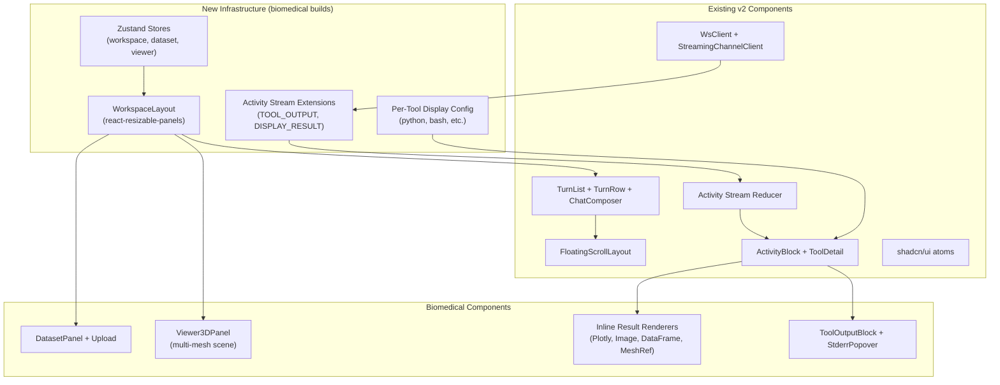

# Frontend Architecture — Biomedical MVP

All frontend work targets `frontend-v2/`. This doc explains how the biomedical components integrate with v2's existing architecture and what new infrastructure is needed. See [design overview](../overview.md) for system context.

## What v2 Has Today

| Layer | Status | Key Files |
|-------|--------|-----------|
| **UI atoms** | Done (Phase 1-2) | `src/components/ui/` — 33 shadcn/ui components |
| **Editor** | Done (Phase 3) | `src/editor/` — CM6 + Yjs collab |
| **Activity stream** | Done (Phase 5 partial) | `src/features/activity-stream/` — reducer, types, renderers |
| **Thread UI** | Done (Phase 5 partial) | `src/features/threads/` — TurnList, TurnRow, ChatComposer |
| **WebSocket** | Done | `src/lib/ws/` — WsClient, protocol, binary frame support |
| **Streaming** | Done | `src/features/threads/streaming/` — StreamingChannelClient, ThreadWsProvider |
| **Chat scroll** | Done | `src/features/chat-scroll/` — FloatingScrollLayout |

| Layer | Not Started | Biomedical MVP Builds It |
|-------|-------------|-------------------------|
| **Layouts** | Phase 6 | [layout.md](layout.md) — workspace shell |
| **Data integration** | Phase 7 | [state.md](state.md) — zustand stores, API client |
| **Routes** | Phase 8 | Minimal routing for project/thread navigation |

## Architecture Diagram



## Integration Points

### 1. Activity Stream Reducer
The existing reducer processes `StreamEvent` into `ActivityBlockData`. We extend it with two new event types:

- `TOOL_OUTPUT` → appends to ToolItem's `toolOutput` field
- `DISPLAY_RESULT` → creates new `DisplayResultItem` in activity items array

See [activity-stream.md](activity-stream.md) for the two-zone model.

### 2. Two-Zone Rendering
The ActivityBlock is revised to render two zones:
- **Collapsed zone**: thinking, tool rows (input/args, stderr badge)
- **Visible zone**: text, inline results (charts, tables, images, mesh cards), tool stdout for categories with `stdout: "visible"` (like python)

Per-tool-category display config determines what goes where. See [activity-stream.md](activity-stream.md).

### 3. ToolDetail Routing
The existing `ToolDetail.tsx` routes to specialized detail renderers by tool category:
- `python` → `PythonDetail` (new) — shows code input, stderr badge
- `bash` → `BashDetail` (extended) — shows command + collapsed stdout + stderr badge

### 4. WebSocket Binary Frames
The existing `WsClient` supports `onBinaryMessage(subId, data)`. Mesh binary frames use this path. `ThreadWsProvider` wires the callback to the viewer store. A `BinaryDispatch` layer routes between Yjs and mesh frames.

### 5. Workspace Layout
v2 has no layout shell yet. The biomedical MVP builds a workspace layout using `react-resizable-panels` with chat left, content right.

### 6. State Management
v2 has no data stores yet. The biomedical MVP introduces zustand stores for workspace panel state, dataset management, and multi-mesh viewer state.

## Component Hierarchy

```
App
+-- WorkspaceLayout (react-resizable-panels)
    +-- ChatPanel (left, resizable)
    |   +-- FloatingScrollLayout (existing)
    |       +-- TurnList (existing)
    |       |   +-- TurnRow (existing)
    |       |       +-- UserBubble (existing)
    |       |       +-- ActivityBlock (revised: two zones)
    |       |           +-- Collapsed Zone (Card, collapsible)
    |       |           |   +-- ThinkingRow (existing)
    |       |           |   +-- ToolRow -> PythonDetail / BashDetail
    |       |           |       +-- StderrBadge -> StderrPopover
    |       |           +-- Visible Zone (always shown)
    |       |               +-- ContentItem text (inline)
    |       |               +-- VisibleToolOutput (python stdout)
    |       |               +-- DisplayResultRow (inline)
    |       |                   +-- PlotlyBlock
    |       |                   +-- ImageBlock
    |       |                   +-- DataFrameBlock
    |       |                   +-- MeshRefBlock
    |       +-- bottomSlot: ChatComposer (existing)
    |
    +-- ContentPanel (right, resizable)
        +-- Viewer3DPanel (multi-mesh scene)
        +-- DatasetPanel (dataset browsing)
        +-- EditorPanel (document editing)
```

## Conventions

All new components follow frontend-v2 conventions:
- **Storybook-first**: Every component has co-located `.stories.tsx`
- **shadcn/ui**: Radix primitives + CVA + tailwind-merge
- **Phosphor Icons**: `@phosphor-icons/react`
- **Tailwind v4**: Design system tokens
- **`cn()` utility**: Class merging
- **Story testing**: Modify the component, not the story

## New Dependencies

```
react-resizable-panels         # Layout
zustand                        # State management
@react-three/fiber             # 3D rendering
@react-three/drei              # Three.js helpers
three                          # Three.js core
react-plotly.js                # Plotly chart rendering
plotly.js-dist-min             # Plotly core (minified)
@tanstack/react-router         # Routing (minimal)
```

## Related Docs

- [Activity Stream](activity-stream.md) — two-zone model and per-tool display config
- [Layout](layout.md) — workspace shell and panel design
- [State Management](state.md) — zustand store designs
- [3D Viewer](viewer-3d.md) — multi-mesh rendering component
- [Inline Results](inline-results.md) — inline display result renderers
- [Dataset Upload](dataset-upload.md) — DICOM upload interface
